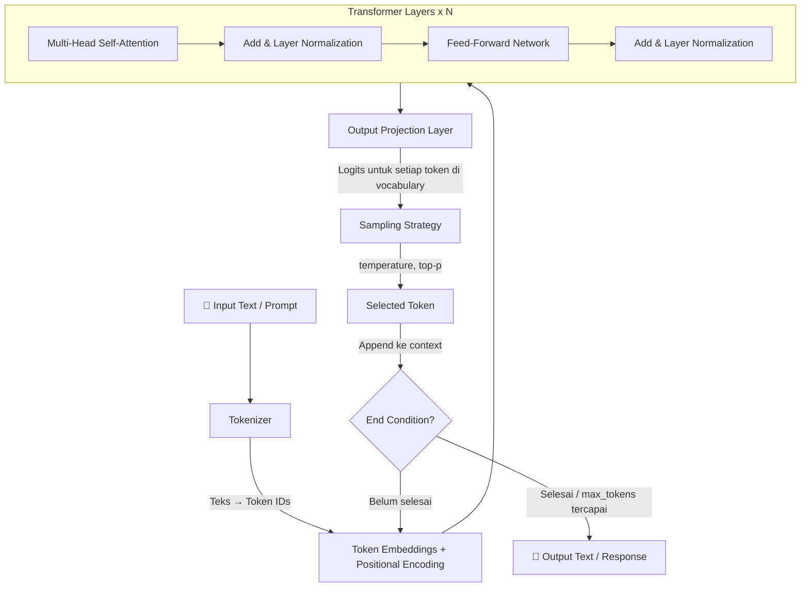

# LLM Fundamentals - Konten Teori

## Penjelasan Konsep

*Large Language Model* (LLM) adalah model kecerdasan buatan berbasis jaringan saraf (*neural network*) yang dilatih pada kumpulan data teks dalam skala sangat besar - mencakup miliaran hingga triliunan kata dari buku, artikel, kode program, dan konten internet. Tujuan utama LLM adalah memahami dan menghasilkan teks dalam bahasa alami dengan tingkat koherensi dan relevansi yang tinggi. Model ini disebut "large" karena jumlah parameter-nya yang sangat besar - mulai dari miliaran hingga ratusan miliar parameter - yang memungkinkan model menangkap pola linguistik, fakta dunia, dan kemampuan reasoning yang kompleks.

Proses pelatihan LLM terdiri dari dua tahap utama. Tahap pertama adalah *pre-training*, di mana model dilatih secara *unsupervised* pada korpus teks yang sangat besar untuk mempelajari struktur bahasa, hubungan antar kata, dan pengetahuan umum dunia. Selama *pre-training*, model belajar memprediksi token berikutnya dalam sebuah urutan teks - proses inilah yang membuat model memahami grammar, konteks, dan semantik. Tahap kedua adalah *fine-tuning*, di mana model yang sudah di-*pre-train* dioptimalkan lebih lanjut pada dataset yang lebih spesifik dan terkurasi, sering kali menggunakan teknik *Reinforcement Learning from Human Feedback* (RLHF) untuk menyelaraskan output model dengan preferensi manusia - menjadikan respons lebih membantu, akurat, dan aman.

Mekanisme inti dari LLM dalam menghasilkan teks adalah *token prediction* (prediksi token). Ketika menerima input teks (disebut *prompt*), model akan memecah teks tersebut menjadi unit-unit kecil yang disebut *token* - bisa berupa kata utuh, sebagian kata, atau karakter tunggal. Model kemudian menghitung probabilitas untuk setiap token yang mungkin muncul selanjutnya berdasarkan seluruh konteks sebelumnya. Token dengan probabilitas tertinggi (atau yang dipilih melalui strategi sampling) menjadi output, dan proses ini berulang secara *autoregressive* - setiap token yang dihasilkan menjadi bagian dari konteks untuk memprediksi token berikutnya - hingga model menghasilkan token penanda akhir atau mencapai batas maksimum token.

## Arsitektur dan Mekanisme Internal

Arsitektur yang mendasari LLM modern adalah *Transformer*, yang diperkenalkan dalam paper "Attention Is All You Need" (Vaswani et al., 2017). Transformer menggantikan arsitektur *recurrent* (RNN/LSTM) dengan mekanisme *self-attention* yang memungkinkan model memproses seluruh input secara paralel dan menangkap hubungan jarak jauh antar token dengan efisien.

### Komponen Utama Transformer

1. **Tokenization**: Input teks dipecah menjadi *token* menggunakan tokenizer (seperti *Byte-Pair Encoding* atau *SentencePiece*). Setiap token dipetakan ke *embedding vector* - representasi numerik berdimensi tinggi yang menangkap makna semantik.

2. **Self-Attention Mechanism**: Setiap token "memperhatikan" semua token lain dalam konteks untuk memahami hubungan dan relevansi antar kata. Mekanisme ini menggunakan tiga vektor - *Query* (Q), *Key* (K), dan *Value* (V) - untuk menghitung *attention scores* yang menentukan seberapa besar pengaruh setiap token terhadap token lainnya.

3. **Multi-Head Attention**: Model menggunakan beberapa *attention heads* secara paralel, memungkinkan model menangkap berbagai jenis hubungan (sintaksis, semantik, referensi) secara bersamaan.

4. **Feed-Forward Network**: Setelah attention, output diproses melalui *feed-forward neural network* yang menambahkan kapasitas transformasi non-linear.

5. **Layer Stacking**: Komponen di atas ditumpuk dalam puluhan hingga ratusan *layers*, dengan setiap layer memperdalam pemahaman model terhadap input.

### Diagram Arsitektur: Dari Input hingga Output



### Inference Pipeline

Proses *inference* (menghasilkan respons) terjadi secara *autoregressive*:

1. **Tokenize** - Input teks diubah menjadi urutan token ID
2. **Encode** - Token IDs diubah menjadi embedding vectors dengan positional encoding
3. **Process** - Embeddings melewati semua Transformer layers (attention → FFN)
4. **Project** - Output layer menghasilkan logits (skor) untuk seluruh vocabulary
5. **Sample** - Strategi sampling memilih token berikutnya berdasarkan parameter (temperature, top-p)
6. **Repeat** - Token terpilih ditambahkan ke konteks, proses diulang dari langkah 2
7. **Terminate** - Proses berhenti ketika token `<EOS>` muncul atau `max_tokens` tercapai

## Kapan dan Mengapa Menggunakan

### Use Cases Konkret

1. **Conversational AI & Customer Support** - LLM dapat memahami pertanyaan dalam bahasa alami dan memberikan respons yang kontekstual. Cocok untuk chatbot, virtual assistant, dan sistem FAQ otomatis yang membutuhkan pemahaman nuansa bahasa.

2. **Content Generation & Summarization** - Menghasilkan teks kreatif (artikel, email, laporan) atau merangkum dokumen panjang menjadi ringkasan yang padat. LLM memahami struktur naratif dan dapat menyesuaikan gaya penulisan sesuai instruksi.

3. **Code Generation & Analysis** - LLM yang dilatih pada kode program dapat menghasilkan, menjelaskan, me-*review*, dan men-*debug* kode dalam berbagai bahasa pemrograman. Berguna untuk *pair programming*, dokumentasi otomatis, dan migrasi kode.

4. **Information Extraction & Classification** - Mengekstrak entitas, mengklasifikasikan sentimen, atau mengkategorikan dokumen tanpa perlu melatih model khusus untuk setiap task - cukup dengan instruksi yang tepat melalui *prompt engineering*.

5. **Translation & Multilingual Tasks** - Menerjemahkan teks antar bahasa, memahami konteks lintas bahasa, dan menghasilkan output dalam bahasa target yang natural.

### Trade-offs dan Limitasi

1. **Biaya vs Kualitas** - Model yang lebih besar (GPT-4, Claude 3.5) menghasilkan output berkualitas lebih tinggi namun membutuhkan biaya komputasi yang lebih besar per token. Model yang lebih kecil (GPT-4o-mini, Phi-3) lebih ekonomis tetapi mungkin kurang akurat untuk task yang kompleks.

2. **Latency vs Completeness** - Menghasilkan respons panjang memerlukan waktu lebih lama karena proses *autoregressive*. Membatasi `max_tokens` mengurangi latency tetapi dapat memotong respons sebelum selesai.

3. **Creativity vs Consistency** - Temperature tinggi menghasilkan output yang lebih kreatif dan bervariasi, namun mengorbankan konsistensi dan prediktabilitas. Temperature rendah lebih konsisten tetapi bisa terasa repetitif.

4. **Context Window vs Token Cost** - Menyertakan konteks yang lebih banyak meningkatkan relevansi respons, tetapi setiap token dalam konteks menambah biaya dan mengurangi ruang untuk respons.

### Perbandingan dengan Pendekatan Alternatif

| Pendekatan | Kekuatan | Kelemahan | Kapan Memilih |
|-----------|----------|-----------|---------------|
| LLM (*general-purpose*) | Fleksibel, tanpa training tambahan | Mahal per-token, bisa hallucinate | Task beragam, prototyping cepat |
| Model ML Tradisional (SVM, RF) | Cepat, murah, deterministik | Butuh labeled data, satu task saja | Klasifikasi sederhana dengan data berlabel |
| Rule-based System | Deterministik, bisa di-audit | Tidak fleksibel, sulit di-maintain | Logika bisnis ketat, compliance |
| Fine-tuned Small Model | Akurat untuk domain spesifik | Butuh data training, biaya fine-tuning | Volume tinggi, domain spesifik |

## Terminologi Kunci

| Istilah | Penjelasan | Konteks Penggunaan |
|---------|-----------|-------------------|
| *Token* | Unit terkecil teks yang diproses oleh LLM. Bisa berupa kata utuh, sebagian kata (*subword*), atau karakter tunggal. Rata-rata 1 token ≈ 4 karakter dalam bahasa Inggris. | Digunakan untuk menghitung biaya API call dan membatasi panjang input/output melalui `max_tokens`. |
| *Prompt* | Input teks yang dikirim ke LLM sebagai instruksi atau pertanyaan yang memicu model menghasilkan respons. | Dalam Microsoft Agent Framework, prompt dikonstruksi dari kombinasi *system message*, *user message*, dan konteks tambahan. |
| *System Message* | Instruksi awal yang mendefinisikan perilaku, persona, dan batasan model dalam sebuah sesi percakapan. Tidak terlihat oleh end-user. | Diset sebagai pesan pertama dalam *chat completion* API. Pada Agent Framework, ini menjadi `instructions` saat membuat agent. |
| *User Message* | Pesan dari pengguna akhir yang berisi pertanyaan, perintah, atau konteks yang ingin direspons oleh model. | Setiap input dalam interactive loop dikirim sebagai *user message* ke model. |
| *Assistant Message* | Respons yang dihasilkan oleh model. Dalam konteks *multi-turn conversation*, pesan ini disimpan dalam history untuk menjaga konteks percakapan. | Digunakan sebagai bagian dari *conversation history* agar model memahami konteks dialog sebelumnya. |
| *Temperature* | Parameter yang mengontrol tingkat randomness dalam pemilihan token. Nilai 0 = deterministik (selalu memilih token paling probable). Nilai mendekati 2 = sangat random dan kreatif. | Gunakan nilai rendah (0.1–0.3) untuk task yang membutuhkan konsistensi (kode, fakta). Gunakan nilai tinggi (0.7–1.0) untuk task kreatif (brainstorming, storytelling). |
| *Top-p* (*Nucleus Sampling*) | Parameter yang membatasi pemilihan token hanya dari kumpulan token teratas yang probabilitas kumulatifnya mencapai nilai *p*. Contoh: top-p = 0.9 berarti hanya mempertimbangkan token yang mencakup 90% probabilitas teratas. | Alternatif atau pelengkap *temperature*. Top-p = 0.1 sangat fokus, top-p = 0.95 lebih bervariasi. Biasanya tidak diubah bersamaan dengan temperature. |
| *Max Tokens* (`max_tokens`) | Batas maksimum jumlah token yang boleh dihasilkan model dalam satu respons. Mencakup output saja, bukan input. | Set sesuai kebutuhan: 100–300 untuk jawaban singkat, 1000–4000 untuk penjelasan panjang. Mempengaruhi biaya dan latency. |
| *Frequency Penalty* | Parameter yang mengurangi probabilitas token yang sudah sering muncul dalam respons. Nilai 0 = tidak ada penalti. Nilai positif (0.1–2.0) = mengurangi repetisi. | Berguna untuk menghindari pengulangan frasa dalam respons panjang. Gunakan 0.3–0.7 untuk teks natural tanpa repetisi berlebihan. |
| *Inference* | Proses di mana model yang sudah dilatih menerima input dan menghasilkan output (prediksi). Berbeda dari *training* yang mengubah parameter model. | Setiap kali aplikasi mengirim prompt ke LLM dan menerima respons, itu adalah proses inference. |
| *Context Window* | Jumlah maksimum token yang dapat diproses model dalam satu kali inference, mencakup input + output. Contoh: GPT-4o memiliki context window 128K tokens. | Penting untuk menentukan berapa banyak history percakapan atau dokumen yang bisa disertakan dalam satu request. |
| *Chat Completion API* | Interface API yang menerima array messages (system, user, assistant) dan menghasilkan respons model. Ini adalah cara standar berinteraksi dengan LLM modern. | Pada Azure OpenAI dan Microsoft Agent Framework, semua interaksi dengan model menggunakan pattern Chat Completion. |
| *Fine-tuning* | Proses melatih ulang model yang sudah di-*pre-train* pada dataset spesifik untuk meningkatkan performa pada domain atau task tertentu. | Dilakukan ketika *prompt engineering* saja tidak cukup untuk mencapai kualitas yang diinginkan pada task spesifik. |
| *Hallucination* | Fenomena di mana LLM menghasilkan informasi yang terdengar meyakinkan namun faktanya tidak benar atau tidak ada dalam data training. | Perlu diwaspadai terutama untuk task yang membutuhkan akurasi faktual. Mitigasi melalui RAG, grounding, atau verification. |

## Fondasi untuk Module Selanjutnya

Module ini merupakan fondasi pertama dalam learning path Microsoft Agent Framework. Konsep-konsep yang dipelajari di sini akan menjadi *building blocks* esensial untuk module-module selanjutnya:

- **Pemahaman tentang LLM dan token prediction** menjadi dasar untuk memahami bagaimana agent memproses instruksi dan menghasilkan respons di Module 2 (*From LLMs to Agents*).
- **Pengetahuan tentang parameter tuning** (temperature, top-p, max_tokens) akan digunakan ketika mengkonfigurasi perilaku agent dan mengoptimalkan output di semua module selanjutnya.
- **Konsep Chat Completion API** (system/user/assistant messages) adalah fondasi langsung untuk memahami bagaimana agent instructions bekerja dan bagaimana conversation context dikelola.
- **Pemahaman context window dan token limit** akan menjadi kritis di Module Advanced (*Context Providers*) ketika mengelola memory dan conversation history.

## Analogi dan Contoh Dunia Nyata

### Analogi 1: LLM sebagai Penulis yang Sangat Banyak Membaca

Bayangkan seorang penulis yang telah membaca seluruh isi perpustakaan terbesar di dunia - jutaan buku, artikel, kode program, dan percakapan. Penulis ini tidak mengingat setiap kalimat secara harfiah, tetapi telah menyerap *pola* bagaimana bahasa bekerja: gaya penulisan, struktur argumen, fakta-fakta umum, dan cara menjawab pertanyaan. Ketika Anda memberikan permintaan (prompt), penulis ini tidak "mencari" jawaban dari buku tertentu, melainkan *mengkomposisi* respons baru berdasarkan pola-pola yang telah dipelajarinya.

**Mapping ke komponen teknis:**
- Perpustakaan = *training data*
- Proses membaca dan menyerap = *pre-training*
- Pola bahasa yang dipelajari = *model parameters/weights*
- Permintaan Anda = *prompt*
- Proses menulis kata demi kata = *autoregressive token prediction*
- Gaya penulisan yang diminta = *system message / instructions*

### Analogi 2: Temperature sebagai Pengatur "Ketegasan" Seorang Guru

Bayangkan Anda bertanya kepada seorang guru: "Apa ibukota Indonesia?" Dengan *temperature* rendah (0.1), guru ini seperti guru formal yang langsung menjawab: "Jakarta." - selalu konsisten, langsung ke inti, tanpa variasi. Dengan *temperature* tinggi (0.9), guru ini seperti guru kreatif yang mungkin menjawab: "Jakarta! Tahukah kamu bahwa dulu namanya Batavia? Dan sekarang ada rencana memindahkan ibukota ke Nusantara di Kalimantan Timur..." - lebih bervariasi, kadang menambahkan informasi tak terduga, tapi sesekali bisa menyimpang dari pertanyaan.

**Mapping ke komponen teknis:**
- Guru formal = *temperature* rendah → deterministik, selalu memilih token paling probable
- Guru kreatif = *temperature* tinggi → random, memilih dari distribusi yang lebih merata
- Jawaban langsung = output pendek dan fokus
- Jawaban yang melebar = output bervariasi dengan informasi tambahan yang mungkin relevan atau tidak

### Analogi 3: Context Window sebagai Meja Kerja

Bayangkan Anda bekerja di meja kerja dengan ukuran terbatas. Semua dokumen yang sedang Anda proses harus ada di atas meja - jika meja penuh, Anda harus memindahkan dokumen lama untuk memberi ruang dokumen baru. Semakin besar meja, semakin banyak konteks yang bisa Anda pertimbangkan sekaligus. Tetapi meja yang lebih besar juga membutuhkan waktu lebih lama untuk memindai semua dokumen yang ada.

**Mapping ke komponen teknis:**
- Ukuran meja = *context window* (misalnya 128K tokens)
- Dokumen di meja = total tokens (input + output)
- Memindahkan dokumen lama = *context truncation*
- Waktu memindai = *inference latency* (semakin banyak token, semakin lama proses)

## Parameter Tuning: Panduan Praktis

### Temperature

| Nilai | Efek | Kapan Menggunakan |
|-------|------|-------------------|
| 0.0–0.2 | Sangat deterministik, hampir selalu sama | Kode program, ekstraksi data, jawaban faktual |
| 0.3–0.5 | Sedikit variasi, tetap fokus | Penulisan teknis, summarization |
| 0.6–0.8 | Cukup kreatif, bervariasi | Brainstorming, draft konten |
| 0.9–1.5 | Sangat kreatif, tak terduga | Storytelling, eksplorasi ide |

### Top-p (Nucleus Sampling)

| Nilai | Efek | Kapan Menggunakan |
|-------|------|-------------------|
| 0.1 | Hanya mempertimbangkan token paling probable | Respons sangat terfokus |
| 0.5 | Pertimbangkan setengah distribusi teratas | Keseimbangan fokus dan variasi |
| 0.9–0.95 | Hampir seluruh distribusi dipertimbangkan | Default yang baik untuk kebanyakan task |
| 1.0 | Seluruh vocabulary dipertimbangkan | Maksimum variasi (jarang digunakan sendiri) |

### Max Tokens

| Skenario | Nilai yang Disarankan | Alasan |
|----------|----------------------|--------|
| Jawaban singkat (ya/tidak, klasifikasi) | 50–100 | Hemat biaya, respons cepat |
| Penjelasan ringkas | 200–500 | Cukup untuk 1–2 paragraf |
| Penjelasan detail / artikel | 1000–4000 | Ruang untuk elaborasi lengkap |
| Code generation | 2000–8000 | Kode membutuhkan banyak token |

### Frequency Penalty

| Nilai | Efek | Kapan Menggunakan |
|-------|------|-------------------|
| 0.0 | Tidak ada penalti, repetisi alami | Default, task pendek |
| 0.3–0.5 | Sedikit mengurangi pengulangan | Teks panjang, percakapan |
| 0.7–1.0 | Aktif menghindari repetisi | Konten kreatif, daftar panjang |
| 1.5–2.0 | Sangat menghindari kata yang sudah dipakai | Brainstorming (hati-hati, bisa jadi tidak koheren) |

## Prompt Engineering Dasar

### Struktur Chat Completion API

Dalam *Chat Completion API*, setiap request terdiri dari array *messages* dengan tiga peran (*roles*):

```
┌─────────────────────────────────────────────────────────────┐
│ System Message                                               │
│ "Kamu adalah asisten yang membantu programmer C#..."         │
│ → Mendefinisikan persona, perilaku, dan batasan model        │
├─────────────────────────────────────────────────────────────┤
│ User Message                                                 │
│ "Jelaskan perbedaan antara struct dan class"                 │
│ → Input/pertanyaan dari pengguna akhir                       │
├─────────────────────────────────────────────────────────────┤
│ Assistant Message                                            │
│ "Struct adalah value type sedangkan class adalah..."         │
│ → Respons model (atau contoh respons untuk few-shot)         │
└─────────────────────────────────────────────────────────────┘
```

### Peran Masing-masing Message

- **System Message**: Diset sekali di awal percakapan. Berisi instruksi tentang siapa model ini, bagaimana harus merespons, batasan apa yang berlaku, dan format output yang diinginkan. Ini adalah mekanisme utama untuk mengontrol perilaku LLM tanpa mengubah model itu sendiri.

- **User Message**: Setiap input dari pengguna. Bisa berupa pertanyaan, perintah, atau data yang perlu diproses. Dalam *multi-turn conversation*, setiap pesan baru dari user ditambahkan ke array messages.

- **Assistant Message**: Respons yang dihasilkan model. Dalam konteks *few-shot prompting*, developer bisa menyertakan contoh assistant message untuk menunjukkan format respons yang diinginkan. Dalam *multi-turn*, respons sebelumnya disimpan sebagai history.

### Tips Prompt Engineering Dasar

1. **Be Specific** - Semakin spesifik instruksi, semakin fokus respons. "Jelaskan X dalam 3 bullet points" lebih baik dari "Jelaskan X".
2. **Provide Context** - Berikan konteks yang relevan agar model memahami situasi. Termasuk contoh input-output yang diinginkan (*few-shot*).
3. **Set Constraints** - Tetapkan batasan eksplisit: panjang respons, format output, bahasa, atau topik yang boleh/tidak boleh dibahas.
4. **Iterate** - Prompt engineering adalah proses iteratif. Evaluasi output, identifikasi kelemahan, dan perbaiki instruksi.

## Model AI di Azure AI Foundry

Azure AI Foundry (sebelumnya Azure AI Studio) menyediakan akses ke berbagai model AI yang dapat digunakan melalui satu platform terpadu. Pemilihan model yang tepat bergantung pada use case, kebutuhan performa, dan anggaran.

### Kategori Model yang Tersedia

| Kategori | Contoh Model | Keunggulan | Use Case |
|----------|-------------|-----------|----------|
| GPT-4o / GPT-4o-mini | OpenAI GPT-4o, GPT-4o-mini | Reasoning kuat, multimodal | Task kompleks, analisis, kode |
| GPT-4.1 / GPT-4.1-mini | OpenAI GPT-4.1 | Coding excellence, instruction following | Development, agentic tasks |
| Phi (Small Language Models) | Phi-3-mini, Phi-3-medium | Ringan, cepat, ekonomis | Edge deployment, task sederhana |
| Mistral | Mistral Large, Mistral Small | Balance performa-biaya | General purpose, multilingual |
| Llama | Meta Llama 3.1 | Open-source, customizable | Fine-tuning, self-hosted |
| Embedding Models | text-embedding-ada-002 | Representasi semantik | Search, RAG, clustering |

### Kriteria Pemilihan Model

1. **Kompleksitas Task** - Task yang membutuhkan reasoning mendalam (analisis kode, problem solving multi-step) memerlukan model yang lebih besar (GPT-4o). Task sederhana (klasifikasi, ekstraksi) bisa menggunakan model kecil (GPT-4o-mini, Phi-3).

2. **Anggaran / Cost** - Model besar lebih mahal per-token. Untuk penggunaan volume tinggi, pertimbangkan model yang lebih kecil atau *fine-tuned model* yang lebih efisien untuk domain spesifik.

3. **Latency Requirements** - Model yang lebih kecil memberikan respons lebih cepat. Untuk real-time applications (chatbot, autocomplete), prioritaskan model dengan latency rendah.

4. **Multimodal Needs** - Jika membutuhkan pemrosesan gambar, audio, atau video bersamaan dengan teks, pilih model multimodal (GPT-4o).

5. **Data Privacy & Compliance** - Beberapa organisasi memerlukan model yang berjalan di infrastruktur sendiri. Pertimbangkan open-source models (Llama, Phi) yang bisa di-*deploy* secara private.

## Bacaan Lanjutan

- [Introduction to Azure OpenAI Service - Microsoft Learn](https://learn.microsoft.com/en-us/azure/ai-services/openai/overview) - Overview lengkap tentang layanan Azure OpenAI, termasuk model yang tersedia, capabilities, dan cara memulai.
- [Prompt Engineering Techniques - Microsoft Learn](https://learn.microsoft.com/en-us/azure/ai-services/openai/concepts/prompt-engineering) - Panduan teknik prompt engineering dari dasar hingga advanced, termasuk best practices untuk berbagai skenario.
- [Azure AI Foundry Documentation - Microsoft Learn](https://learn.microsoft.com/en-us/azure/ai-studio/) - Dokumentasi lengkap Azure AI Foundry (AI Studio) untuk eksplorasi, evaluasi, dan deployment model AI.
- [What are tokens and how to count them - Microsoft Learn](https://learn.microsoft.com/en-us/azure/ai-services/openai/concepts/tokens) - Penjelasan mendalam tentang tokenization, cara menghitung token, dan implikasi terhadap biaya dan context window.
