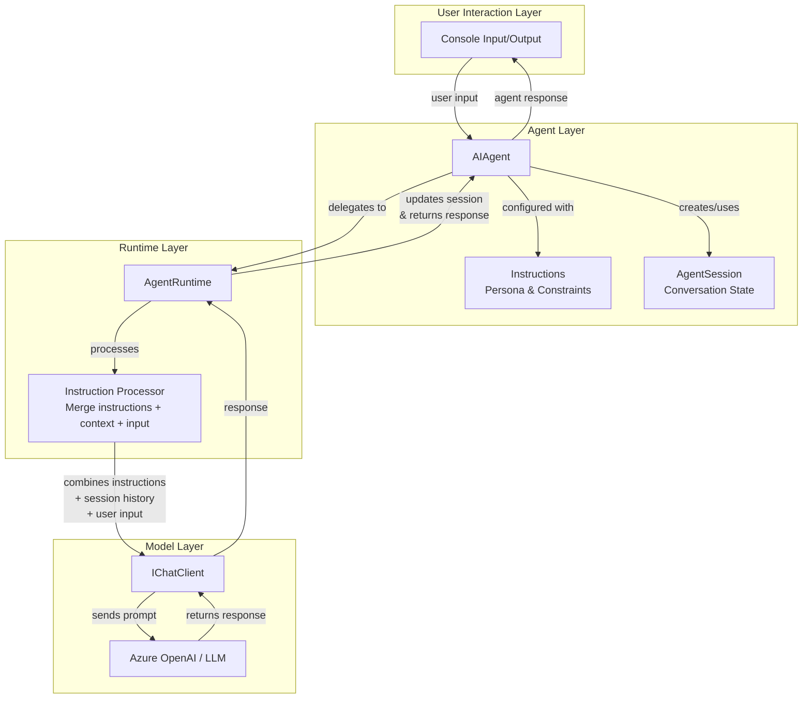
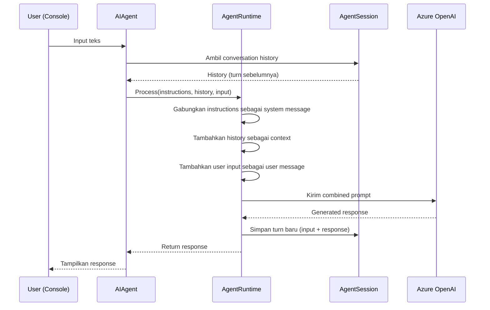

# From LLMs to Agents - Teori Komprehensif

> **Prerequisite Refresher (Module 1: LLM Fundamentals)**
>
> Pada module sebelumnya, Anda telah mempelajari bahwa *Large Language Model* (LLM) adalah sistem prediksi token yang menghasilkan teks berdasarkan probabilitas statistik. Anda menggunakan `IChatClient` sebagai abstraksi universal untuk berkomunikasi dengan model melalui *prompt* dan *response*. Parameter seperti `temperature` mengontrol tingkat kreativitas output - nilai rendah menghasilkan output deterministik, nilai tinggi menghasilkan variasi. Interaksi tersebut bersifat *stateless*: setiap panggilan ke model adalah transaksi independen tanpa memori dari percakapan sebelumnya. Konsep-konsep ini menjadi fondasi untuk memahami mengapa kita membutuhkan *agent* - entitas yang membungkus LLM dengan identity, instructions, dan kemampuan mempertahankan konteks.

---

## Penjelasan Konsep

### Apa Itu Agent dalam Konteks AI?

Dalam konteks kecerdasan buatan, *agent* adalah entitas software yang memiliki **identitas**, **instruksi perilaku**, dan **kemampuan reasoning** di atas sebuah LLM. Berbeda dengan panggilan LLM biasa yang hanya mengirim *prompt* dan menerima *response* secara transaksional, agent memiliki persona yang persisten - ia "tahu" siapa dirinya, apa tugasnya, dan bagaimana seharusnya ia merespons. Agent bukan sekadar wrapper tipis di atas model; ia adalah abstraksi yang mengubah LLM dari "mesin autocomplete" menjadi "asisten dengan peran yang jelas."

### Perbedaan Fundamental: Stateless LLM Call vs Agent

Ketika Anda memanggil LLM secara langsung menggunakan `IChatClient`, setiap *request* berdiri sendiri. Model tidak memiliki memori tentang percakapan sebelumnya - ia menerima prompt, menghasilkan response, dan selesai. Ini seperti berbicara dengan seseorang yang mengalami amnesia setiap kali Anda memulai kalimat baru. Sebaliknya, agent mempertahankan *session context*: ia mengingat apa yang sudah dibicarakan, memahami konteks pertanyaan lanjutan, dan merespons secara koheren sepanjang percakapan. Agent juga memiliki *instructions* yang membentuk perilakunya secara konsisten - bukan hanya untuk satu panggilan, tetapi untuk seluruh sesi interaksi.

### Identity, Instructions, dan Reasoning

Tiga pilar yang membedakan agent dari LLM call biasa adalah: (1) **Identity** - agent memiliki nama dan persona yang mendefinisikan siapa ia, (2) **Instructions** - sekumpulan aturan dan pedoman yang membentuk bagaimana agent berpikir dan merespons, dan (3) **Reasoning** - kemampuan agent untuk memproses input dalam konteks instruksi dan sejarah percakapan sebelum menghasilkan output. Kombinasi ketiga elemen ini menciptakan pengalaman interaksi yang jauh lebih kaya dibandingkan sekadar mengirim prompt ke endpoint API. Agent dapat menolak permintaan yang melanggar batasannya, mempertahankan gaya bahasa yang konsisten, dan memberikan respons yang kontekstual berdasarkan informasi sebelumnya.

---

## Arsitektur dan Mekanisme Internal

Arsitektur agent pada Microsoft Agent Framework terdiri dari beberapa komponen utama yang bekerja bersama untuk mengubah LLM call sederhana menjadi interaksi agent yang kaya fitur.

### Komponen Utama

1. **`AIAgent`** - Kelas utama yang merepresentasikan agent. Dibuat melalui extension method `.AsAIAgent()` pada `IChatClient`. Menyimpan *instructions*, nama, dan konfigurasi agent.

2. **`AgentRuntime`** - Mesin eksekusi yang mengelola lifecycle agent, memproses input, menjalankan *instruction processing*, dan mengkoordinasikan interaksi dengan LLM. Runtime bertanggung jawab untuk menggabungkan instructions dengan user input sebelum dikirim ke model.

3. **Instructions** - Teks yang mendefinisikan persona, batasan, dan perilaku agent. Instructions di-inject sebagai *system message* yang selalu hadir di setiap interaksi, membentuk "kepribadian" agent secara konsisten.

4. **`AgentSession`** - Objek yang menyimpan state percakapan. Session memungkinkan agent mengingat konteks dari turn sebelumnya dan merespons secara koheren dalam percakapan multi-turn.

5. **Agent Loop** - Pola interaktif dimana agent terus-menerus menerima input, memproses dalam konteks session, menghasilkan response, dan menunggu input berikutnya.

### Diagram Arsitektur

### Alur Pemrosesan (Instruction Processing Flow)

Berikut adalah alur lengkap dari input user hingga response agent:

### Mekanisme Instructions

*Instructions* berfungsi sebagai "DNA" dari agent. Secara teknis, instructions diimplementasikan sebagai *system message* yang dikirim bersama setiap request ke LLM. Namun berbeda dengan system message yang Anda tulis manual di Module 1, instructions pada agent dikelola secara otomatis oleh `AgentRuntime` - Anda cukup mendefinisikannya sekali saat membuat agent, dan runtime memastikan instructions selalu hadir di setiap interaksi.

**Best practices penulisan instructions yang efektif:**

- **Clarity** - Gunakan bahasa yang jelas dan tidak ambigu. Hindari instruksi yang bisa diinterpretasikan ganda.
- **Specificity** - Definisikan perilaku spesifik, bukan umum. "Jawab dalam maksimal 3 kalimat" lebih baik daripada "Jawab dengan singkat."
- **Constraints** - Tetapkan batasan eksplisit tentang apa yang boleh dan tidak boleh dilakukan agent. Ini mencegah agent berperilaku di luar domain yang diinginkan.

### Agent Loop dan Session Management

*Agent loop* adalah pola interaksi dimana agent beroperasi dalam siklus berkelanjutan:

1. **Tampilkan prompt indicator** (misalnya `> `)
2. **Terima input** dari user
3. **Proses input** dalam konteks session (instructions + history + input)
4. **Kirim ke LLM** dan terima response
5. **Update session** dengan turn baru
6. **Tampilkan response** ke user
7. **Kembali ke langkah 1**

*Session* (`AgentSession`) mempertahankan state percakapan. Setiap kali agent memproses input baru, session menyediakan history percakapan sebelumnya sebagai konteks. Ini memungkinkan agent "mengingat" - bukan karena model memiliki memori, melainkan karena session menyertakan percakapan sebelumnya dalam setiap prompt.

---

## Kapan dan Mengapa Menggunakan

### Kapan Menggunakan LLM Call Langsung

| Skenario | Alasan |
|----------|--------|
| **One-shot text generation** - misalnya summarization, translation, atau data extraction | Tidak memerlukan persona atau state. Satu prompt, satu response, selesai. |
| **Batch processing** - memproses ratusan dokumen dengan prompt yang sama | Overhead agent (session, instructions processing) tidak memberikan nilai tambah untuk operasi bulk. |
| **Embedding generation** - menghasilkan vector representations dari teks | Ini bukan task konversasi; model hanya melakukan transformasi matematika. |
| **Simple classification** - kategorisasi teks ke label yang sudah ditentukan | Task deterministik yang tidak membutuhkan reasoning atau konteks percakapan. |

### Kapan Menggunakan Agent

| Skenario | Alasan |
|----------|--------|
| **Interactive assistant** - chatbot layanan pelanggan dengan persona dan aturan spesifik | Membutuhkan identity yang konsisten, batasan perilaku, dan context dari percakapan sebelumnya. |
| **Multi-turn reasoning** - membantu user debug kode melalui dialog bertahap | Agent perlu mengingat kode yang sudah dibahas, error sebelumnya, dan solusi yang sudah dicoba. |
| **Task-oriented dialog** - agent pemesanan tiket yang mengumpulkan informasi bertahap | Membutuhkan state management untuk melacak informasi yang sudah dikumpulkan dan yang masih diperlukan. |
| **Persona-driven interaction** - tutor yang mengajar dengan gaya Socratic | Instructions mendefinisikan gaya mengajar; session mempertahankan konteks pelajaran. |

### Trade-offs dan Limitasi

| Aspek | LLM Call Langsung | Agent |
|-------|-------------------|-------|
| **Latency** | Lebih rendah - satu round-trip | Lebih tinggi - overhead instruction processing + session retrieval |
| **Cost** | Lebih murah per request - hanya prompt + response | Lebih mahal - instructions + history menambah token count di setiap request |
| **Complexity** | Minimal - hanya prompt engineering | Lebih tinggi - perlu merancang instructions, mengelola session, handle edge cases |
| **Consistency** | Bergantung sepenuhnya pada prompt | Konsisten berkat instructions yang persisten |
| **Scalability** | Mudah di-scale horizontal | Session state memerlukan strategi penyimpanan |

### Perbandingan dengan Pendekatan Alternatif

- **Prompt Chaining** - Mengirim output satu prompt sebagai input prompt berikutnya secara manual. Lebih sederhana dari agent tetapi tidak memiliki session management otomatis dan identity yang konsisten.
- **RAG (Retrieval-Augmented Generation)** - Menambahkan konteks dari knowledge base ke prompt. RAG dan agent bukan alternatif melainkan komplementer - agent dapat menggunakan RAG sebagai salah satu sumber konteks.
- **Fine-tuned Model** - Melatih model dengan data spesifik. Memberikan perilaku bawaan tanpa instructions, tetapi mahal, tidak fleksibel, dan sulit di-update.

---

## Terminologi Kunci

| Istilah | Penjelasan | Contoh Penggunaan |
|---------|------------|-------------------|
| `AIAgent` | Kelas utama dalam Microsoft Agent Framework yang merepresentasikan sebuah agent. Dibuat dari `IChatClient` menggunakan extension method `.AsAIAgent()`. | `var agent = chatClient.AsAIAgent(instructions: "...", name: "Tutor");` |
| `AgentRuntime` | Mesin eksekusi internal yang mengelola lifecycle agent, menggabungkan instructions dengan input, dan mengkoordinasikan komunikasi dengan LLM. | Runtime bekerja di balik layar saat Anda memanggil `agent.RunAsync()`. |
| *Instructions* | Teks yang mendefinisikan persona, perilaku, dan batasan agent. Diimplementasikan sebagai *system message* yang persisten di setiap interaksi. | `instructions: "Kamu adalah asisten yang menjawab dalam bahasa Indonesia, maksimal 3 kalimat."` |
| *Agent Loop* | Pola interaksi siklus dimana agent terus-menerus menerima input → memproses → merespons → menunggu input berikutnya. Berlangsung sampai user mengirim perintah exit. | Loop `while` dalam `Program.cs` yang membaca input console dan memanggil `agent.RunAsync()`. |
| `AgentSession` | Objek yang menyimpan state percakapan (conversation history). Memungkinkan agent mempertahankan konteks antar turn dalam satu sesi. | `var session = await agent.CreateSessionAsync();` |
| `.AsAIAgent()` | Extension method pada `IChatClient` yang mengubah client LLM biasa menjadi agent dengan identity dan instructions. | `var agent = chatClient.AsAIAgent(instructions: "...");` |
| `RunAsync()` | Method pada `AIAgent` yang menjalankan satu turn interaksi - mengirim input user ke agent dan mengembalikan response. | `var result = await agent.RunAsync(userInput, session);` |
| `CreateSessionAsync()` | Method yang membuat session baru untuk percakapan. Session menyimpan history yang digunakan sebagai konteks di turn berikutnya. | `var session = await agent.CreateSessionAsync();` |
| *Stateless Call* | Panggilan LLM yang berdiri sendiri tanpa konteks dari interaksi sebelumnya. Setiap request independen dari request lainnya. | Memanggil `chatClient.GetResponseAsync(prompt)` tanpa menyertakan history. |
| *Session Context* | Kumpulan informasi dari percakapan sebelumnya (history) yang disertakan dalam setiap request ke LLM agar agent "mengingat" percakapan. | Session otomatis menyertakan 10 turn terakhir sebagai konteks. |

---

## Hubungan dengan Topik Sebelumnya

Module ini membangun langsung di atas **Module 1: LLM Fundamentals** dengan cara berikut:

- **`IChatClient` sebagai fondasi** - Agent pada Microsoft Agent Framework dibuat dari `IChatClient` menggunakan `.AsAIAgent()`. Tanpa pemahaman tentang bagaimana `IChatClient` mengirim prompt dan menerima response, sulit memahami apa yang terjadi "di balik layar" agent.

- **Prompt dan Response** - Konsep *prompt engineering* dari Module 1 berevolusi menjadi *instructions*. Jika di Module 1 Anda menulis system message secara manual untuk setiap panggilan, di Module 2 instructions menggantikan peran tersebut secara otomatis dan persisten.

- **Temperature dan parameter model** - Parameter yang Anda pelajari di Module 1 tetap berlaku. Agent menggunakan model yang sama dengan konfigurasi yang sama - perbedaannya adalah agent menambahkan layer abstraksi (identity, session, instructions) di atas model call tersebut.

- **Stateless nature of LLM** - Pemahaman bahwa LLM secara fundamental *stateless* (dari Module 1) adalah kunci untuk menghargai mengapa session management diperlukan. Agent tidak "secara ajaib" memiliki memori - ia mengirim history percakapan di setiap request.

- **Building Blocks yang digunakan**: `IChatClient` (abstraksi model), konsep prompt/response (menjadi instructions/output), dan `temperature` (tetap mengontrol perilaku generasi di dalam agent).

---

## Analogi dan Contoh Dunia Nyata

### Analogi 1: Resepsionis Hotel vs Mesin Penjawab Otomatis

**Mesin penjawab otomatis** = LLM call langsung. Anda menekan tombol, mendengar informasi, selesai. Mesin tidak tahu siapa Anda, tidak mengingat bahwa Anda menelepon kemarin, dan tidak bisa menyesuaikan gaya bicara berdasarkan konteks.

**Resepsionis hotel** = Agent. Resepsionis memiliki *identity* (nama dan seragam hotel), *instructions* (SOP hotel: selalu sapa dengan nama tamu, tawarkan upgrade, jangan membahas kompetitor), dan *session memory* (mengingat bahwa Anda check-in kemarin dan meminta kamar lantai tinggi). Setiap kali Anda berinteraksi, resepsionis memberikan layanan yang kontekstual dan konsisten.

**Pemetaan ke komponen teknis:**
| Analogi | Komponen Teknis |
|---------|-----------------|
| Identitas resepsionis (nama, seragam) | `AIAgent` dengan `name` |
| SOP hotel | *Instructions* |
| Catatan tamu / guest profile | `AgentSession` (conversation history) |
| Proses berpikir sebelum menjawab | `AgentRuntime` (instruction processing) |
| Kemampuan bicara | `IChatClient` (akses ke LLM) |

### Analogi 2: Aktor Teater vs Pembaca Naskah

**Pembaca naskah** = LLM call langsung. Diberikan selembar teks, ia membacanya dengan baik. Tetapi ia tidak memiliki karakter - ia hanya membaca apa yang ada di depannya tanpa konteks adegan sebelumnya atau motivasi karakter.

**Aktor teater** = Agent. Aktor menerima *script* (instructions) yang mendefinisikan karakternya: "Kamu adalah detektif yang skeptis, selalu bertanya balik, tidak pernah langsung percaya." Sepanjang pertunjukan (session), aktor mengingat dialog sebelumnya dan merespons secara konsisten dengan karakternya. Bahkan ketika penonton (user) memberikan improvisasi, aktor tetap in-character karena ia memiliki fondasi instruksi yang kuat.

**Pemetaan ke komponen teknis:**
| Analogi | Komponen Teknis |
|---------|-----------------|
| Karakter yang diperankan | `AIAgent` dengan instructions |
| Script/naskah | *Instructions* (persona definition) |
| Memori adegan sebelumnya | `AgentSession` |
| Kemampuan berakting (menghasilkan dialog) | LLM via `IChatClient` |
| Sutradara yang mengkoordinasikan | `AgentRuntime` |
| Satu pertunjukan penuh | Satu agent loop session |

---

## Bacaan Lanjutan

1. **[Build your first agent with Microsoft Agent Framework](https://learn.microsoft.com/en-us/microsoft/agents/overview)** - Dokumentasi resmi Microsoft Learn yang membahas konsep dasar agent, arsitektur framework, dan quickstart guide untuk membangun agent pertama.

2. **[AI Agents Concepts and Architecture](https://learn.microsoft.com/en-us/microsoft/agents/concepts/agents)** - Penjelasan mendalam tentang konsep agent, bagaimana agent berbeda dari model call langsung, dan arsitektur internal yang mendasari Microsoft Agent Framework.

3. **[Microsoft Extensions for AI (MEAI) - IChatClient](https://learn.microsoft.com/en-us/dotnet/api/microsoft.extensions.ai.ichatclient)** - Referensi API untuk `IChatClient` yang menjadi fondasi pembuatan agent melalui `.AsAIAgent()` extension method.
