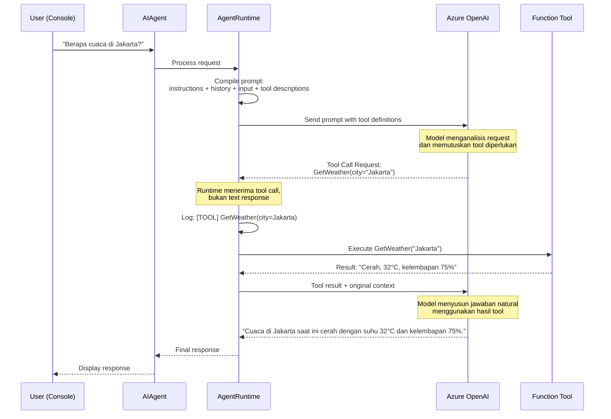
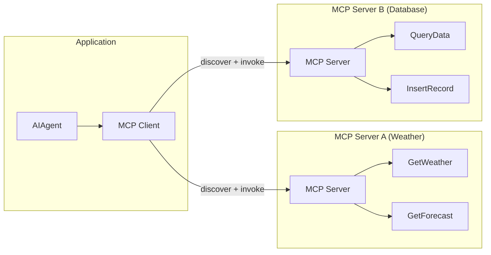

# Adding Tools - Teori Komprehensif

> **Prerequisite Refresher (Module 2: From LLMs to Agents)**
>
> Pada module sebelumnya, Anda membangun agent pertama menggunakan `.AsAIAgent()` yang mengubah `IChatClient` menjadi entitas dengan identity dan instructions. Agent beroperasi dalam *agent loop* - siklus menerima input, memproses dalam konteks session, dan menghasilkan response. `AgentSession` mempertahankan *conversation history* sehingga agent "mengingat" percakapan sebelumnya. Namun, agent tersebut hanya bisa menghasilkan teks - ia tidak dapat melakukan aksi nyata seperti mengecek cuaca, mengakses database, atau memanggil API. Module ini menambahkan kemampuan *tools* sehingga agent dapat berinteraksi dengan dunia luar.

---

## Penjelasan Konsep

### Apa Itu Tool Use dalam AI Agents?

Dalam konteks AI agents, *tool use* adalah kemampuan agent untuk melakukan aksi di luar *text generation*. Tanpa tools, agent hanya bisa menghasilkan teks - ia bisa menjawab pertanyaan berdasarkan pengetahuan yang ada dalam training data, tetapi tidak bisa mengecek cuaca hari ini, menghitung formula kompleks secara presisi, atau mengakses data real-time dari database. Tools memberikan agent "tangan" untuk berinteraksi dengan dunia luar: memanggil API, melakukan kalkulasi, membaca file, atau menjalankan operasi lainnya yang membutuhkan eksekusi kode aktual.

Konsep tool use mengubah paradigma fundamental dari agent. Alih-alih hanya menjadi "orang yang pintar bicara," agent menjadi "orang yang bisa bertindak." Ketika user bertanya "Berapa cuaca di Jakarta sekarang?", agent tanpa tools hanya bisa mengatakan "Maaf, saya tidak memiliki akses ke data cuaca real-time." Tetapi agent dengan tools dapat memanggil fungsi `GetWeather("Jakarta")`, mendapatkan data aktual, dan menyajikan informasi yang akurat dan terkini kepada user.

### Bagaimana LLM Melakukan Function Calling?

*Function calling* (atau *tool calling*) adalah mekanisme dimana LLM tidak hanya menghasilkan teks natural, tetapi juga menghasilkan structured output berupa instruksi pemanggilan fungsi. Secara teknis, model dilatih untuk mengenali kapan sebuah pertanyaan membutuhkan data atau aksi eksternal, lalu menghasilkan JSON terstruktur yang berisi nama fungsi dan parameter yang diperlukan - bukan jawaban dalam bahasa natural. Model tidak benar-benar "menjalankan" fungsi tersebut; ia hanya menyatakan intent: "Saya perlu memanggil fungsi X dengan parameter Y." Eksekusi aktual dilakukan oleh *runtime* di sisi aplikasi.

Proses ini dimungkinkan karena saat prompt dikirim ke LLM, deskripsi semua tools yang tersedia juga disertakan sebagai bagian dari konteks. Model kemudian melakukan reasoning: "Apakah saya bisa menjawab pertanyaan ini dari pengetahuan internal, atau saya perlu memanggil salah satu tools yang tersedia?" Jika model memutuskan bahwa tools diperlukan, ia menghasilkan *tool call request* alih-alih teks jawaban. Keputusan ini dipengaruhi oleh kualitas deskripsi tool, kejelasan parameter schema, dan bagaimana nama tool memetakan ke kebutuhan user.

### Tool Invocation Cycle

*Tool invocation cycle* adalah alur lengkap dari saat user mengajukan pertanyaan hingga agent menyampaikan jawaban yang diperkaya oleh hasil eksekusi tool. Siklus ini terdiri dari lima tahap: (1) **User Request** - user mengirim pertanyaan atau perintah, (2) **LLM Decides Tool** - model menganalisis request dan memutuskan tool mana yang perlu dipanggil beserta parameternya, (3) **Execute Tool** - runtime menjalankan fungsi yang diminta dengan parameter yang diberikan model, (4) **Return Result** - hasil eksekusi dikembalikan ke model sebagai konteks tambahan, dan (5) **LLM Continues** - model menggunakan hasil tool untuk menyusun jawaban natural kepada user.

Yang penting dipahami adalah bahwa siklus ini bisa berulang (*iterative*). Dalam satu turn percakapan, model bisa memutuskan untuk memanggil beberapa tools secara berurutan sebelum akhirnya menghasilkan jawaban final. Misalnya, untuk menjawab "Bandingkan cuaca Jakarta dan Surabaya," model akan memanggil `GetWeather("Jakarta")`, lalu `GetWeather("Surabaya")`, kemudian menggunakan kedua hasil untuk menyusun perbandingan. Runtime orchestration inilah yang membuat agent terasa "cerdas" - padahal ia hanya melakukan loop sederhana: tanya model → eksekusi tool → kembalikan hasil → tanya model lagi.

---

## Arsitektur dan Mekanisme Internal

Arsitektur tool system pada Microsoft Agent Framework dirancang untuk memungkinkan agent menemukan, memilih, dan mengeksekusi tools secara otomatis. Sistem ini terdiri dari beberapa komponen yang saling terhubung.

### Tool Definition Schema

Setiap tool didefinisikan melalui tiga elemen utama:

1. **Nama (Name)** - Identifier unik yang digunakan model untuk merujuk tool. Harus deskriptif dan mengikuti naming convention yang jelas (contoh: `GetWeather`, `CalculateSum`).
2. **Deskripsi (Description)** - Penjelasan dalam bahasa natural tentang apa yang dilakukan tool. Ini adalah elemen paling kritis karena LLM menggunakan deskripsi ini untuk memutuskan kapan tool harus dipanggil.
3. **Parameter Schema** - Definisi input yang dibutuhkan tool: nama parameter, tipe data, apakah required atau optional, dan deskripsi masing-masing parameter.

Dalam Microsoft Agent Framework, tool definition menggunakan `[Description]` attribute pada method dan parameter:

```csharp
[Description("Mendapatkan informasi cuaca terkini untuk kota tertentu")]
public static string GetWeather(
    [Description("Nama kota, contoh: Jakarta, Surabaya")] string city)
{
    // implementasi
}
```

### Tool Registration

*Tool registration* adalah proses mendaftarkan tools ke agent sehingga agent mengetahui tools apa saja yang tersedia. Pada Microsoft Agent Framework, registration dilakukan melalui `AIFunctionFactory.Create()` yang mengkonversi static method menjadi tool yang dapat ditemukan oleh model:

```csharp
var tools = new[]
{
    AIFunctionFactory.Create(WeatherTool.GetWeather),
    AIFunctionFactory.Create(CalculatorTool.Calculate)
};

var agent = chatClient.AsAIAgent(
    instructions: "Kamu adalah asisten yang membantu...",
    tools: tools);
```

### Tool Discovery oleh Agent

Ketika agent menerima request dari user, runtime secara otomatis menyertakan deskripsi semua tools yang terdaftar ke dalam prompt yang dikirim ke LLM. Model "menemukan" tools melalui deskripsi ini - ia membaca nama, deskripsi, dan parameter schema untuk memahami kapabilitas yang tersedia. Proses discovery ini terjadi di setiap turn percakapan, memastikan model selalu memiliki informasi terkini tentang tools yang bisa digunakan.

### Result Handling

Setelah tool dieksekusi, hasilnya dikembalikan ke model sebagai bagian dari percakapan. Model kemudian menggunakan hasil tersebut untuk menyusun jawaban natural. Jika tool menghasilkan error, informasi error juga dikembalikan ke model sehingga model dapat menginformasikan user tentang kegagalan secara natural - bukan sebagai exception teknis yang membuat aplikasi crash.

### Sequence Diagram: Alur Eksekusi Tool



### Diagram Arsitektur Tool System

```mermaid
graph TB
    subgraph "Tool Definition Layer"
        TD1[WeatherTool.cs<br/>- GetWeather&#40;city&#41;<br/>- Description attribute]
        TD2[CalculatorTool.cs<br/>- Calculate&#40;expression&#41;<br/>- Description attribute]
    end

    subgraph "Tool Registration Layer"
        FACTORY[AIFunctionFactory.Create&#40;&#41;]
        REGISTRY[Tool Registry<br/>Registered tools collection]
    end

    subgraph "Agent Layer"
        AGENT[AIAgent]
        OPTIONS[ChatClientAgentOptions<br/>.Tools property]
    end

    subgraph "Runtime Layer"
        RUNTIME[AgentRuntime]
        DISPATCH[Tool Dispatcher<br/>Match tool call → execute]
    end

    subgraph "Model Layer"
        LLM[Azure OpenAI<br/>Function Calling Capability]
    end

    TD1 --> FACTORY
    TD2 --> FACTORY
    FACTORY --> REGISTRY
    REGISTRY --> OPTIONS
    OPTIONS --> AGENT
    AGENT --> RUNTIME
    RUNTIME -->|tool descriptions| LLM
    LLM -->|tool call request| RUNTIME
    RUNTIME --> DISPATCH
    DISPATCH -->|execute| TD1
    DISPATCH -->|execute| TD2
```



---

## Kapan dan Mengapa Menggunakan

### Use Cases Konkret

| # | Use Case | Penjelasan |
|---|----------|------------|
| 1 | **Data Retrieval Real-Time** - Agent perlu mengakses informasi yang berubah-ubah seperti cuaca, harga saham, atau status sistem | LLM hanya memiliki pengetahuan dari training data yang sudah kadaluarsa. Tools memungkinkan agent mengakses data terkini melalui API calls. |
| 2 | **Kalkulasi Presisi** - Agent perlu melakukan perhitungan matematika yang akurat | LLM sering melakukan kesalahan aritmatika karena ia "menebak" jawaban berdasarkan pola, bukan menghitung. Tool kalkulator memberikan hasil yang deterministik dan akurat. |
| 3 | **Operasi CRUD pada Database** - Agent perlu membaca, menulis, atau mengubah data di database atau sistem eksternal | LLM tidak bisa mengakses database secara langsung. Function tools menjadi jembatan antara agent dan data layer. |
| 4 | **File System Operations** - Agent perlu membaca file konfigurasi, menulis laporan, atau memanipulasi dokumen | Akses file system memerlukan eksekusi kode aktual yang tidak bisa dilakukan oleh text generation alone. |
| 5 | **Third-Party Service Integration** - Agent perlu mengirim email, membuat tiket di Jira, atau memposting ke Slack | Setiap integrasi memerlukan API call spesifik yang dapat dienkapsulasi sebagai tool. |

### Trade-offs dan Limitasi

| Aspek | Keuntungan | Trade-off |
|-------|-----------|-----------|
| **Latency** | Agent bisa menjawab pertanyaan yang membutuhkan data real-time | Setiap tool call menambah latency - minimal satu round-trip tambahan ke LLM + waktu eksekusi tool |
| **Accuracy** | Hasil kalkulasi dan data lookup yang deterministik dan akurat | Model bisa salah memilih tool atau mengirim parameter yang salah, terutama jika deskripsi tool ambigu |
| **Complexity** | Agent menjadi lebih capable dan versatile | Kode menjadi lebih kompleks - perlu handle error dari tool, validate parameter, dan manage tool state |
| **Security** | Akses terkontrol ke resource eksternal | Tools membuka attack surface baru - model bisa dimanipulasi untuk memanggil tool dengan parameter berbahaya (prompt injection) |
| **Cost** | Jawaban yang lebih kaya dan actionable | Setiap tool invocation cycle menambah token usage (tool descriptions + tool results), meningkatkan biaya API |

### Perbandingan: Function Tools (Lokal) vs MCP Tools (External)

| Aspek | Function Tools (Lokal) | MCP Tools (External) |
|-------|----------------------|---------------------|
| **Definisi** | Fungsi C# yang didefinisikan langsung di dalam aplikasi | Tools yang disediakan oleh server eksternal melalui *Model Context Protocol* |
| **Lokasi Eksekusi** | Dalam proses aplikasi yang sama (in-process) | Di server terpisah, bisa di mesin yang berbeda |
| **Registrasi** | `AIFunctionFactory.Create()` dari static method | Melalui MCP client yang terhubung ke MCP server |
| **Kontrol** | Penuh - Anda menulis dan mengelola kode tool | Terbatas - tool disediakan oleh pihak ketiga |
| **Latency** | Rendah - eksekusi lokal tanpa network call | Lebih tinggi - memerlukan komunikasi jaringan ke MCP server |
| **Use Case Ideal** | Logika bisnis spesifik, kalkulasi, akses resource lokal | Integrasi dengan layanan pihak ketiga, shared tools antar aplikasi |
| **Maintenance** | Anda bertanggung jawab penuh | Provider MCP server yang mengelola |
| **Scalability** | Terikat pada resource aplikasi | Bisa scale independen dari aplikasi |

### Kapan Menggunakan Masing-Masing

**Gunakan Function Tools (Lokal) ketika:**
- Logic spesifik untuk domain aplikasi Anda
- Membutuhkan akses ke resource in-process (memory, local files)
- Prioritas latency rendah
- Anda ingin kontrol penuh atas implementasi

**Gunakan MCP Tools (External) ketika:**
- Mengintegrasikan layanan pihak ketiga yang sudah menyediakan MCP server
- Tools perlu di-share antar multiple aplikasi atau team
- Tools memerlukan resource yang berbeda dari aplikasi (GPU, database khusus)
- Anda ingin decoupling antara aplikasi dan tool implementation

### Arsitektur Model Context Protocol (MCP) Secara Konseptual

*Model Context Protocol* (MCP) adalah standar terbuka yang memungkinkan aplikasi AI terhubung ke tools dan data sources eksternal melalui protocol yang seragam. Arsitektur MCP mengikuti model client-server:



**Komponen utama MCP:**
- **MCP Client** - Komponen dalam aplikasi yang berkomunikasi dengan MCP servers. Menangani discovery, invocation, dan result handling.
- **MCP Server** - Proses terpisah yang meng-expose tools melalui protocol standar. Satu server bisa menyediakan multiple tools.
- **Tool Manifest** - Deskripsi tools yang disediakan server (nama, deskripsi, parameter schema), dikirim saat discovery phase.
- **Transport Layer** - Komunikasi antara client dan server (biasanya via stdio atau HTTP/SSE).

---

## Best Practices dalam Mendesain Tools

### Naming Conventions

Nama tool adalah hal pertama yang dilihat LLM ketika memutuskan tool mana yang akan dipanggil. Nama yang baik bersifat:

- **Deskriptif** - `GetCurrentWeather` lebih baik dari `Weather` atau `Fetch`
- **Action-oriented** - Gunakan verb di awal: `Calculate`, `Search`, `Create`, `Get`
- **Spesifik** - `SearchProductByName` lebih baik dari `Search` (terlalu generik)
- **Konsisten** - Ikuti pola yang sama: `Get{Entity}`, `Create{Entity}`, `Update{Entity}`

### Deskripsi yang Jelas untuk LLM

Deskripsi tool adalah faktor paling berpengaruh dalam keputusan LLM untuk memilih tool. Best practices:

- **Jelaskan apa yang dilakukan, bukan bagaimana** - "Mendapatkan informasi cuaca terkini untuk kota tertentu" bukan "Memanggil OpenWeatherMap API endpoint /current"
- **Sertakan kapan tool harus digunakan** - "Gunakan tool ini ketika user menanyakan cuaca, suhu, atau kondisi atmosfer"
- **Sertakan kapan tool TIDAK boleh digunakan** - "Jangan gunakan untuk prediksi cuaca jangka panjang (>7 hari)"
- **Berikan contoh input yang valid** - Dalam deskripsi parameter: "Nama kota, contoh: Jakarta, Surabaya, Bandung"

### Parameter Schema Design

Parameter schema yang baik membantu LLM menghasilkan argumen yang tepat:

- **Gunakan tipe data yang tepat** - `int` untuk angka, `string` untuk teks, hindari generic `object`
- **Berikan deskripsi untuk setiap parameter** - `[Description("Nama kota target, contoh: Jakarta")]`
- **Gunakan nama parameter yang self-explanatory** - `city` lebih baik dari `input` atau `param1`
- **Minimalisasi jumlah parameter** - Tool dengan 2-3 parameter lebih reliable daripada tool dengan 10 parameter
- **Gunakan default values untuk parameter optional** - Kurangi beban decision-making model

### Error Handling Patterns

Tools harus handle error secara graceful dan mengembalikan informasi yang berguna ke model:

```csharp
[Description("Mendapatkan cuaca untuk kota tertentu")]
public static string GetWeather(
    [Description("Nama kota")] string city)
{
    try
    {
        // Implementasi aktual
        var result = weatherService.GetCurrent(city);
        return $"Kota: {city}, Suhu: {result.Temperature}°C, Kondisi: {result.Condition}";
    }
    catch (CityNotFoundException)
    {
        return $"Error: Kota '{city}' tidak ditemukan. Pastikan nama kota valid.";
    }
    catch (Exception ex)
    {
        return $"Error: Gagal mengambil data cuaca untuk '{city}'. Alasan: {ex.Message}";
    }
}
```

**Prinsip utama:**
- Jangan throw exception dari tool - return error message sebagai string agar model bisa merespons secara natural
- Sertakan nama tool dan parameter dalam pesan error untuk debugging
- Berikan informasi yang cukup agar model bisa menginformasikan user tentang apa yang salah

---

## Tool Selection oleh LLM

### Bagaimana Deskripsi Mempengaruhi Keputusan LLM

Ketika model menerima request dari user beserta daftar tools yang tersedia, model melakukan proses reasoning internal:

1. **Parsing intent** - Model memahami apa yang diinginkan user
2. **Matching intent ke tools** - Model membandingkan intent dengan deskripsi setiap tool
3. **Confidence assessment** - Model menilai seberapa yakin ia bahwa tool tertentu akan memenuhi intent
4. **Parameter extraction** - Jika tool dipilih, model mengekstrak parameter yang diperlukan dari konteks percakapan
5. **Decision** - Model menghasilkan tool call (jika confident) atau text response (jika bisa dijawab tanpa tool)

Deskripsi tool yang buruk menyebabkan model gagal di langkah 2 atau 3 - tool yang seharusnya dipanggil tidak terpilih, atau tool yang salah terpilih karena deskripsi yang ambigu.

### Strategi Menghindari Tool Confusion

*Tool confusion* terjadi ketika model tidak bisa membedakan kapan harus menggunakan tool A versus tool B, atau ketika model memilih tool yang salah. Strategi pencegahan:

| Strategi | Penjelasan | Contoh |
|----------|------------|--------|
| **Diferensiasi nama** | Beri nama yang jelas berbeda antar tools | `GetCurrentWeather` vs `GetWeatherForecast` (bukan `Weather1` vs `Weather2`) |
| **Scope yang jelas dalam deskripsi** | Definisikan batasan apa yang dilakukan dan tidak dilakukan setiap tool | "Hanya untuk cuaca saat ini, bukan prediksi" |
| **Non-overlapping responsibilities** | Pastikan tidak ada dua tools yang melakukan hal serupa | Jangan buat `SearchGoogle` dan `WebSearch` yang overlap |
| **Parameter hints** | Gunakan deskripsi parameter untuk memberikan konteks tambahan | "Kota di Indonesia saja, format nama lengkap" |
| **Negative examples** | Jelaskan kapan tool TIDAK boleh digunakan | "Jangan gunakan untuk pertanyaan yang bisa dijawab dari pengetahuan umum" |

### Contoh Tool Confusion dan Solusinya

**Masalah:** Agent memiliki `GetWeather(city)` dan `GetTemperature(city)`. Ketika user bertanya "Berapa suhu di Jakarta?", model bingung memilih.

**Solusi:** Gabungkan menjadi satu tool `GetWeather(city)` yang mengembalikan semua informasi cuaca termasuk suhu. Atau, diferensiasi dengan jelas: `GetWeather` → "Informasi cuaca lengkap (kondisi, kelembapan, angin)" dan `GetTemperature` → "Hanya suhu dalam Celsius, untuk keperluan perhitungan."

---

## Terminologi Kunci

| Istilah | Penjelasan | Contoh Penggunaan |
|---------|------------|-------------------|
| `AIFunctionFactory` | Kelas factory yang mengkonversi static method C# menjadi *tool* yang dapat ditemukan dan dipanggil oleh LLM. | `AIFunctionFactory.Create(WeatherTool.GetWeather)` |
| *Function Tool* | Tool yang didefinisikan sebagai fungsi lokal dalam aplikasi, dieksekusi in-process. Berbeda dari MCP tool yang berjalan di server terpisah. | Static method dengan `[Description]` attribute yang didaftarkan via `AIFunctionFactory` |
| *MCP (Model Context Protocol)* | Standar terbuka untuk menghubungkan aplikasi AI dengan tools dan data sources eksternal melalui arsitektur client-server yang seragam. | `Microsoft.Agents.MCP.Client` package untuk koneksi ke MCP server |
| *Tool Registration* | Proses mendaftarkan tools ke agent sehingga agent mengetahui kapabilitas yang tersedia. Terjadi saat inisialisasi agent. | `chatClient.AsAIAgent(tools: [tool1, tool2])` |
| *Tool Discovery* | Mekanisme dimana LLM "menemukan" tools yang tersedia melalui deskripsi yang disertakan dalam prompt. Terjadi di setiap turn percakapan. | Runtime otomatis menyertakan tool descriptions ke LLM |
| `[Description]` *attribute* | Attribute .NET yang menyediakan metadata deskriptif pada method atau parameter. Digunakan oleh framework untuk menghasilkan tool schema yang dibaca oleh LLM. | `[Description("Menghitung hasil operasi matematika")]` |
| *Tool Invocation Cycle* | Siklus lengkap eksekusi tool: user request → LLM decides → execute tool → return result → LLM continues. Bisa berulang dalam satu turn. | Agent memanggil 2 tools berurutan sebelum menjawab |
| *Tool Call Request* | Output terstruktur dari LLM yang berisi nama tool dan parameter yang ingin dipanggil. Bukan text response, melainkan JSON terstruktur. | `{"tool": "GetWeather", "parameters": {"city": "Jakarta"}}` |
| *Tool Result* | Nilai kembalian dari eksekusi tool yang dikirim kembali ke LLM sebagai konteks untuk menyusun jawaban natural. | `"Cerah, 32°C, kelembapan 75%"` |
| *Tool Confusion* | Kondisi dimana LLM tidak bisa membedakan atau salah memilih antara tools yang tersedia, biasanya akibat deskripsi yang ambigu atau overlapping. | Model memanggil `GetTemperature` padahal `GetWeather` lebih sesuai |
| *MCP Server* | Proses terpisah yang meng-expose tools melalui Model Context Protocol. Bisa berjalan di mesin yang berbeda dari aplikasi utama. | Weather MCP server yang menyediakan `GetWeather` dan `GetForecast` |
| *MCP Client* | Komponen dalam aplikasi yang terhubung ke MCP server untuk melakukan discovery dan invocation tools eksternal. | `Microsoft.Agents.MCP.Client` |
| *Parameter Schema* | Definisi formal dari input yang dibutuhkan tool: tipe data, nama, required/optional, dan deskripsi setiap parameter. | `string city`, `int maxResults = 10` |

---

## Hubungan dengan Topik Sebelumnya

Module ini membangun langsung di atas **Module 2: From LLMs to Agents** dengan cara berikut:

- **Agent sebagai fondasi** - Tools hanya bermakna ketika ditambahkan ke agent. Tanpa pemahaman tentang `AIAgent`, instructions, dan agent loop dari Module 2, sulit memahami bagaimana tools terintegrasi ke dalam workflow agent.

- **Agent Loop yang diperkaya** - Di Module 2, agent loop hanya melibatkan: input → kirim ke LLM → tampilkan response. Dengan tools, loop menjadi lebih kompleks: input → kirim ke LLM → (mungkin) eksekusi tool → kirim hasil ke LLM → tampilkan response. Ini adalah evolusi natural dari loop sederhana.

- **Instructions mempengaruhi tool selection** - Instructions yang Anda pelajari di Module 2 juga mempengaruhi bagaimana agent menggunakan tools. Agent dengan instruksi "Selalu berikan data faktual" akan lebih agresif memanggil tools dibandingkan agent dengan instruksi "Jawab berdasarkan pengetahuan umum."

- **`IChatClient` mendukung function calling** - Di Module 1 dan 2, Anda menggunakan `IChatClient` untuk text generation. Interface yang sama mendukung *function calling* - kemampuan model untuk menghasilkan structured tool calls. Tidak perlu client baru; cukup tambahkan tool definitions.

- **Session tetap berlaku** - `AgentSession` dari Module 2 tetap bekerja. Tools menambahkan kapabilitas tanpa menggantikan session management. History percakapan yang menyertakan tool calls dan results menjadi bagian dari konteks.

- **Building Blocks yang digunakan**: `AIAgent` (host untuk tools), `.AsAIAgent()` (sekarang dengan parameter `tools`), `AgentSession` (session yang menyimpan history termasuk tool interactions), `IChatClient` (foundation yang mendukung function calling), dan *instructions* (mempengaruhi perilaku tool selection).

---

## Analogi dan Contoh Dunia Nyata

### Analogi 1: Dokter dan Peralatan Medis

**Dokter tanpa peralatan** = Agent tanpa tools. Ketika pasien datang dengan keluhan sakit perut, dokter hanya bisa bertanya dan memberikan assessment berdasarkan pengalaman dan pengetahuan (training data). Ia bisa menduga diagnosis, tetapi tidak bisa memastikan tanpa data objektif.

**Dokter dengan peralatan medis** = Agent dengan tools. Dokter yang sama kini memiliki akses ke stetoskop (tool sederhana), alat USG (tool kompleks), dan laboratorium eksternal (MCP server). Ketika pasien datang, dokter memutuskan alat mana yang perlu digunakan berdasarkan gejala (tool selection). Ia mengoperasikan alat (tool execution), membaca hasilnya (tool result), dan menggunakan informasi tersebut bersama pengetahuannya untuk memberikan diagnosis yang akurat (final response).

**Pemetaan ke komponen teknis:**

| Analogi | Komponen Teknis |
|---------|-----------------|
| Dokter | `AIAgent` dengan instructions |
| Pengetahuan medis dari pendidikan | Training data LLM |
| Keputusan alat mana yang digunakan | *Tool selection* oleh LLM |
| Stetoskop, tensimeter (alat di ruangan) | *Function tools* (lokal, in-process) |
| Laboratorium di gedung lain | *MCP tools* (external server) |
| Hasil lab / hasil USG | *Tool result* yang dikembalikan ke agent |
| Diagnosis final ke pasien | Response natural agent ke user |
| Resep dan instruksi yang diikuti dokter | *Instructions* agent |

### Analogi 2: Asisten Eksekutif dan Departemen Perusahaan

**Asisten eksekutif tanpa akses** = Agent tanpa tools. Ketika bos bertanya "Berapa revenue bulan ini?", asisten hanya bisa menjawab berdasarkan ingatan terakhir kali ia melihat laporan. Jawabannya mungkin outdated atau tidak akurat.

**Asisten eksekutif dengan akses ke departemen** = Agent dengan tools. Asisten yang sama kini memiliki nomor telepon langsung ke departemen Finance (tool: `GetRevenue`), HR (tool: `GetHeadcount`), dan Marketing (tool: `GetCampaignMetrics`). Ketika bos bertanya tentang revenue, asisten memutuskan: "Saya perlu menghubungi Finance" (tool selection). Ia menelepon (tool execution), mendapatkan angka terkini (tool result), dan melaporkan kembali ke bos dalam format yang mudah dipahami (natural language response).

Asisten juga bisa menghubungi konsultan eksternal (MCP tools) - pihak ketiga yang tidak bekerja di perusahaan tetapi menyediakan layanan tertentu. Bedanya, menghubungi konsultan eksternal memerlukan waktu lebih lama (higher latency) dan prosedur formal (protocol), dibandingkan menelepon departemen internal yang bisa langsung dijawab.

**Pemetaan ke komponen teknis:**

| Analogi | Komponen Teknis |
|---------|-----------------|
| Asisten eksekutif | `AIAgent` |
| Nomor telepon departemen yang tersimpan | *Tool registration* (tools yang terdaftar) |
| Daftar departemen dan fungsinya | *Tool descriptions* untuk discovery |
| Keputusan "siapa yang harus dihubungi" | *Tool selection* oleh LLM |
| Menelepon departemen internal | Eksekusi *function tool* (lokal) |
| Menghubungi konsultan eksternal | Invokasi *MCP tool* (external) |
| Jawaban dari departemen/konsultan | *Tool result* |
| Laporan ke bos dalam bahasa yang jelas | Response natural agent ke user |
| SOP dan preferensi bos | *Instructions* agent |

---

## Bacaan Lanjutan

1. **[Tools and Function Calling in Microsoft Agent Framework](https://learn.microsoft.com/en-us/microsoft/agents/concepts/tools)** - Dokumentasi resmi tentang cara mendefinisikan, mendaftarkan, dan menggunakan tools dalam agent, termasuk function tools dan MCP integration.

2. **[Model Context Protocol (MCP) Overview](https://learn.microsoft.com/en-us/microsoft/agents/concepts/mcp)** - Penjelasan arsitektur MCP, cara kerja client-server communication, dan panduan integrasi MCP server ke dalam aplikasi agent.

3. **[AIFunctionFactory API Reference](https://learn.microsoft.com/en-us/dotnet/api/microsoft.extensions.ai.aifunctionfactory)** - Referensi API untuk `AIFunctionFactory` yang digunakan untuk mengkonversi method menjadi tools yang callable oleh LLM, termasuk overload yang tersedia dan parameter konfigurasi.
