# Adding Skills - Teori Komprehensif

> **Prerequisite Refresher (Module 3: Adding Tools)**
>
> Pada module sebelumnya, Anda mempelajari cara menambahkan *tools* ke agent menggunakan `AIFunctionFactory.Create()` yang mengkonversi static method menjadi callable tools. Agent menggunakan *tool descriptions* untuk melakukan *tool selection*, dan *tool invocation cycle* memungkinkan agent berinteraksi dengan dunia luar. Tools didaftarkan melalui `ChatClientAgentOptions.Tools` dan dieksekusi secara otomatis oleh runtime ketika LLM memutuskan tool diperlukan. Module ini membangun di atas fondasi tersebut dengan memperkenalkan *skills* - mekanisme untuk mengelompokkan dan mengemas tools menjadi unit yang reusable dan modular.

---

## Penjelasan Konsep

### Skill sebagai Abstraksi di Atas Tools

Dalam pengembangan agent, seiring bertambahnya kompleksitas, jumlah tools yang didaftarkan ke agent cenderung meningkat secara signifikan. Agent untuk customer service mungkin memiliki 5-10 tools, agent untuk data analysis bisa memiliki 15-20 tools, dan enterprise agent bisa mencapai puluhan tools. Ketika semua tools didaftarkan secara "datar" (*flat registration*), pengelolaan menjadi sulit - sulit mengetahui tools mana yang saling terkait, sulit melakukan refactoring, dan sulit me-reuse kumpulan tools yang sama di agent berbeda. *Skill* hadir sebagai solusi: sebuah abstraksi yang mengelompokkan tools terkait menjadi satu unit yang kohesif dan bermakna secara domain.

Secara konseptual, *skill* adalah kumpulan tools yang diikat oleh satu domain fungsional. Jika *tool* adalah sebuah fungsi individual (misalnya `SearchWeb`, `SummarizeText`, `ExtractKeywords`), maka *skill* adalah paket yang menggabungkan beberapa tools tersebut menjadi kapabilitas utuh yang bisa diidentifikasi dengan satu nama (misalnya `ResearchSkill`). Skill memberikan semantic grouping - bukan hanya pengelompokan teknis, tetapi pengelompokan yang mencerminkan bagaimana tools tersebut bekerja sama untuk menyelesaikan satu kategori tugas.

### Perbedaan antara Individual Tools dan Packaged Skills

Perbedaan utama antara individual tools dan packaged skills terletak pada level abstraksi dan unit pengelolaannya. Individual tools adalah *atomic operations* - setiap tool melakukan satu hal spesifik dan berdiri sendiri. Anda mendaftarkan `GetWeather`, `SearchWeb`, `SendEmail` sebagai entitas terpisah tanpa hubungan eksplisit antar satu sama lain. Sebaliknya, packaged skills adalah *composite capabilities* - kumpulan tools yang secara eksplisit dinyatakan sebagai satu kesatuan. `ResearchSkill` yang berisi `SearchWeb` + `SummarizeText` + `ExtractKeywords` menyatakan bahwa ketiga tools ini membentuk kapabilitas "penelitian" yang koheren. Ini memudahkan developer memahami arsitektur agent, memindahkan kapabilitas antar agent, dan mengelola dependency dengan lebih terstruktur.

### Manfaat Modularitas dalam Agent Development

Modularitas yang diberikan oleh skills membawa beberapa keuntungan fundamental dalam pengembangan agent. Pertama, *reusability* - skill yang sudah dibuat dan diuji dapat langsung didaftarkan ke agent lain tanpa perlu menduplikasi definisi tools satu per satu. Kedua, *maintainability* - ketika ada perubahan pada satu domain (misalnya API weather berubah), cukup update skill yang bersangkutan tanpa menyentuh komponen lain. Ketiga, *discoverability* - developer baru yang membaca kode langsung melihat "agent ini memiliki ResearchSkill dan WritingSkill" alih-alih daftar 15 tools individual yang sulit dipetakan ke kapabilitas bisnis. Keempat, *testability* - skill dapat diuji sebagai unit yang kohesif, memastikan semua tools dalam satu domain bekerja harmonis sebelum didaftarkan ke agent.

---

## Arsitektur dan Mekanisme Internal

Arsitektur skill system pada Microsoft Agent Framework dirancang untuk memungkinkan developer mengemas, mendaftarkan, dan berbagi kumpulan tools sebagai unit yang kohesif. Sistem ini beroperasi di atas *tool registration layer* yang sudah ada dari Module 3, menambahkan lapisan organisasi tanpa mengubah mekanisme fundamental tool invocation.

### Skill Definition

*Skill definition* adalah deklarasi formal dari sebuah skill yang mencakup tiga elemen:

1. **Nama Skill** - Identifier yang merepresentasikan kapabilitas domain (contoh: `ResearchSkill`, `DataAnalysisSkill`, `CommunicationSkill`). Nama harus mencerminkan domain fungsional, bukan implementasi teknis.
2. **Deskripsi Skill** - Penjelasan singkat tentang kapabilitas yang disediakan skill ini, membantu developer (bukan LLM) memahami tujuan pengelompokan.
3. **Tool Collection** - Kumpulan tools yang termasuk dalam skill ini, masing-masing dengan definisi lengkap (nama, deskripsi, parameter schema) seperti yang dipelajari di Module 3.

Dalam Microsoft Agent Framework, skill didefinisikan sebagai static class yang mengemas beberapa tools terkait:

```csharp
/// <summary>
/// ResearchSkill - skill untuk kapabilitas penelitian dan pengumpulan informasi.
/// Mengemas tools: WebSearch, Summarize, ExtractKeywords
/// </summary>
public static class ResearchSkill
{
    [Description("Mencari informasi di web berdasarkan query")]
    public static string WebSearch(
        [Description("Query pencarian")] string query) => ...;

    [Description("Merangkum teks panjang menjadi poin-poin kunci")]
    public static string Summarize(
        [Description("Teks yang akan dirangkum")] string text) => ...;

    [Description("Mengekstrak kata kunci dari teks")]
    public static string ExtractKeywords(
        [Description("Teks sumber")] string text) => ...;
}
```

### Tool Grouping Mechanism

*Tool grouping* adalah mekanisme yang menghubungkan multiple tools ke satu skill identifier. Berbeda dengan flat registration dimana setiap tool berdiri sendiri, tool grouping menciptakan hierarki dua level: Skill → Tools. Mekanisme ini bekerja melalui:

1. **Static Class sebagai Container** - Semua method dalam satu static class dianggap sebagai bagian dari skill yang sama. Class name menjadi skill identifier.
2. **Batch Registration** - Semua tools dalam satu skill didaftarkan secara bersamaan melalui satu operasi, memastikan konsistensi dan atomicity.
3. **Namespace Convention** - Skills diorganisir dalam folder/namespace `Skills/` untuk memisahkan skill definitions dari kode aplikasi utama.

```csharp
// Batch registration - semua tools dari ResearchSkill didaftarkan sekaligus
var researchTools = new[]
{
    AIFunctionFactory.Create(ResearchSkill.WebSearch),
    AIFunctionFactory.Create(ResearchSkill.Summarize),
    AIFunctionFactory.Create(ResearchSkill.ExtractKeywords)
};

Console.WriteLine($"[SKILL] ResearchSkill terdaftar dengan {researchTools.Length} tools");
```

### Skill Registration Lifecycle

*Skill registration lifecycle* mencakup tiga fase:

1. **Definition Phase** - Developer mendefinisikan skill sebagai static class dengan tools yang memiliki `[Description]` attributes. Ini terjadi pada compile-time.
2. **Registration Phase** - Saat aplikasi startup, skills diregistrasi ke agent melalui `AIFunctionFactory.Create()` untuk setiap tool dalam skill. Runtime memvalidasi bahwa tidak ada nama tool yang duplikat.
3. **Discovery Phase** - Setelah registrasi, tools dari skill tersedia untuk LLM discovery. Model menerima deskripsi semua tools (dari semua skills) di setiap turn percakapan.

```
[Compile-time]     [Startup]           [Runtime - setiap turn]
     │                  │                        │
     ▼                  ▼                        ▼
 Skill Class  →  Register to Agent  →  LLM discovers tools
 (definition)    (validation)          (via descriptions)
```

### Skill Sharing Between Agents

Salah satu keunggulan utama skill architecture adalah kemampuan *skill sharing* - satu skill yang sama dapat didaftarkan ke multiple agents tanpa duplikasi kode. Karena skill didefinisikan sebagai static class, instance-nya tidak terikat ke agent tertentu. Ini memungkinkan pola berikut:

```csharp
// Satu skill, digunakan oleh dua agent berbeda
var researchTools = new[]
{
    AIFunctionFactory.Create(ResearchSkill.WebSearch),
    AIFunctionFactory.Create(ResearchSkill.Summarize)
};

var analystAgent = chatClient.AsAIAgent(
    instructions: "Kamu adalah analis data...",
    tools: researchTools);

var writerAgent = chatClient.AsAIAgent(
    instructions: "Kamu adalah penulis konten...",
    tools: researchTools);

// Kedua agent memiliki kapabilitas research yang identik
// tetapi menggunakan tools secara berbeda berdasarkan instructions
```

Skill sharing memungkinkan *separation of concerns* yang jelas: skill mendefinisikan "apa yang bisa dilakukan" (kapabilitas), sementara agent instructions mendefinisikan "bagaimana menggunakannya" (perilaku). Dua agent dengan skill yang sama bisa berperilaku sangat berbeda.

### Component Diagram: Skill System Architecture

```mermaid
graph TB
    subgraph "Skill Definition Layer"
        S1[ResearchSkill<br/>━━━━━━━━━━━━━━━<br/>• WebSearch<br/>• Summarize<br/>• ExtractKeywords]
        S2[CommunicationSkill<br/>━━━━━━━━━━━━━━━<br/>• SendEmail<br/>• SendSlackMessage<br/>• CreateNotification]
        S3[DataSkill<br/>━━━━━━━━━━━━━━━<br/>• QueryDatabase<br/>• TransformData<br/>• ExportCSV]
    end

    subgraph "Registration Layer"
        REG[Skill Registration<br/>━━━━━━━━━━━━━━━<br/>• AIFunctionFactory.Create&#40;&#41;<br/>• Batch registration<br/>• Duplicate validation]
    end

    subgraph "Agent Layer"
        A1[Agent A<br/>&#40;Research Assistant&#41;<br/>━━━━━━━━━━━━━━━<br/>Skills: Research, Data]
        A2[Agent B<br/>&#40;Content Writer&#41;<br/>━━━━━━━━━━━━━━━<br/>Skills: Research, Communication]
        A3[Agent C<br/>&#40;Data Analyst&#41;<br/>━━━━━━━━━━━━━━━<br/>Skills: Data, Communication]
    end

    subgraph "Runtime Layer"
        RT[AgentRuntime<br/>━━━━━━━━━━━━━━━<br/>• Tool discovery<br/>• Tool dispatch<br/>• Result handling]
    end

    subgraph "LLM Layer"
        LLM[Azure OpenAI<br/>━━━━━━━━━━━━━━━<br/>Tool selection based on<br/>descriptions from all<br/>registered skills]
    end

    S1 --> REG
    S2 --> REG
    S3 --> REG
    REG --> A1
    REG --> A2
    REG --> A3
    A1 --> RT
    A2 --> RT
    A3 --> RT
    RT --> LLM
    LLM -->|tool call| RT
```



---

## Kapan dan Mengapa Menggunakan

### Use Cases Konkret

| # | Use Case | Penjelasan |
|---|----------|------------|
| 1 | **Enterprise Agent dengan Multiple Domains** - Agent yang melayani berbagai kebutuhan bisnis (HR, finance, IT) memerlukan puluhan tools yang harus diorganisir secara logis | Skill memungkinkan pengelompokan: `HRSkill` (GetEmployee, SubmitLeave, CheckPayroll), `FinanceSkill` (GetBudget, SubmitExpense, GetInvoice), `ITSkill` (CreateTicket, CheckStatus, ResetPassword). Tanpa skills, 15+ tools dalam flat list sangat sulit dikelola. |
| 2 | **Multi-Agent System dengan Shared Capabilities** - Beberapa agent dalam satu sistem memerlukan kapabilitas yang sama, misalnya semua agent perlu bisa melakukan research atau mengirim notifikasi | Skill sebagai unit reusable memungkinkan `ResearchSkill` didaftarkan ke Research Agent, Analysis Agent, dan Writer Agent tanpa menduplikasi kode - perubahan di satu tempat berlaku untuk semua. |
| 3 | **Team-Based Agent Development** - Tim besar membangun agent secara paralel, dengan setiap sub-tim bertanggung jawab atas domain tertentu | Setiap sub-tim membangun skill independen (`PaymentSkill`, `ShippingSkill`, `InventorySkill`), lalu skill-skill tersebut digabungkan ke agent utama. Boundaries yang jelas mencegah konflik dan memudahkan code review. |
| 4 | **Gradual Capability Enhancement** - Agent yang sudah production perlu ditambah kapabilitas baru tanpa mengganggu tools yang sudah berjalan | Skill baru ditambahkan sebagai unit terpisah (misalnya menambah `AnalyticsSkill`), terisolasi dari skills yang sudah ada. Jika skill baru bermasalah, cukup roll back satu skill tanpa mempengaruhi yang lain. |
| 5 | **Plugin-Style Architecture** - Membangun agent yang kapabilitasnya bisa di-extend oleh pihak ketiga atau berbeda per deployment | Skills berfungsi seperti plugins - setiap deployment bisa memilih skills mana yang diaktifkan. Customer A mendapat `BasicSkill` + `PremiumSkill`, Customer B hanya `BasicSkill`. |

### Trade-offs dan Limitasi

| Aspek | Keuntungan | Trade-off |
|-------|-----------|-----------|
| **Organization** | Kode lebih terstruktur, mudah dinavigasi, jelas hubungan antar tools | Overhead tambahan dalam mendesain skill boundaries - perlu pertimbangan matang tentang pengelompokan yang tepat |
| **Reusability** | Skill yang sama digunakan di banyak agent, single source of truth | Coupling antar tools dalam satu skill - jika satu tool berubah signature, skill perlu diuji ulang secara keseluruhan |
| **Abstraction Cost** | Developer berpikir di level "kapabilitas" bukan "fungsi individual" | Layer abstraksi tambahan yang harus dipahami - overhead kognitif bagi developer yang baru bergabung |
| **Naming Complexity** | Skill memberikan konteks bisnis yang jelas | Namespace collision mungkin terjadi jika skill dan tool naming tidak dikelola dengan baik |
| **Testing** | Skills dapat diuji sebagai unit kohesif | Test setup lebih kompleks - perlu mock semua tools dalam skill, bukan hanya satu function |

### Perbandingan: Flat-Tools vs Skill-Based Architecture

| Aspek | Flat-Tools Architecture | Skill-Based Architecture |
|-------|------------------------|--------------------------|
| **Struktur** | Semua tools terdaftar di level yang sama, tanpa hierarki | Tools dikelompokkan dalam skills berdasarkan domain fungsional |
| **Registrasi** | `tools: [tool1, tool2, tool3, ..., tool15]` - daftar panjang tanpa konteks | `skills: [ResearchSkill(3 tools), DataSkill(3 tools)]` - terorganisir per kapabilitas |
| **Reusability** | Copy-paste tools individual ke agent lain | Daftarkan skill sebagai satu unit ke agent manapun |
| **Maintenance** | Perubahan satu tool memerlukan review di konteks semua tools lainnya | Perubahan terisolasi dalam boundary skill yang bersangkutan |
| **Onboarding** | Developer baru melihat 15 tools tanpa konteks hubungan | Developer baru melihat 3-4 skills dengan nama yang self-explanatory |
| **Scalability** | Sulit dikelola >10 tools - flat list menjadi overwhelming | Scales naturally - setiap skill 2-5 tools, jumlah skills bisa banyak tanpa chaos |
| **Cocok Untuk** | Agent sederhana dengan 2-5 tools yang tidak terkait satu sama lain | Agent kompleks dengan 6+ tools, terutama yang memiliki domain fungsional yang jelas |
| **LLM Impact** | Tidak ada - LLM tetap melihat semua tool descriptions secara flat | Tidak ada - LLM tetap melihat semua tools secara flat (skills adalah organisasi developer-side) |

**Kapan tetap menggunakan Flat-Tools?**
- Agent memiliki ≤5 tools yang tidak saling terkait secara domain
- Agent adalah prototype atau proof-of-concept yang tidak akan di-scale
- Tools berasal dari berbagai sumber yang tidak bisa dikelompokkan secara logis

**Kapan beralih ke Skill-Based?**
- Agent memiliki >5 tools yang bisa dikelompokkan berdasarkan fungsi
- Skills perlu di-share ke agent lain dalam sistem yang sama
- Tim membangun agent secara kolaboratif dan memerlukan boundaries yang jelas
- Agent akan berkembang (tools ditambah seiring waktu)

---

## Design Patterns untuk Skill Composition

### Kapan Mengelompokkan Tools Menjadi Skill

Keputusan untuk mengelompokkan tools menjadi skill harus didasarkan pada *functional cohesion* - seberapa erat keterkaitan tools dalam menyelesaikan satu domain tugas:

**Kelompokkan tools menjadi skill ketika:**
- Tools sering dipanggil bersama dalam satu sesi kerja (contoh: `Search` → `Summarize` → `ExtractKeywords` dalam alur research)
- Tools mengoperasikan data dari domain yang sama (contoh: semua tools akses data customer)
- Perubahan di satu tool kemungkinan besar mempengaruhi tool lain (contoh: `QueryDB` dan `TransformData` bergantung pada schema yang sama)
- Tools memiliki dependency infrastruktur yang sama (contoh: semua tools perlu koneksi ke database yang sama)

**Jangan kelompokkan tools menjadi skill ketika:**
- Tools tidak terkait secara domain (contoh: `GetWeather` dan `SendEmail` tidak perlu dalam satu skill)
- Pengelompokan hanya berdasarkan implementasi teknis, bukan domain bisnis
- Tools akan di-reuse secara terpisah di context yang berbeda

### Single Responsibility pada Skill Level

Sama seperti *Single Responsibility Principle* (SRP) pada class, setiap skill harus memiliki satu alasan untuk berubah - satu domain fungsional yang menjadi tanggung jawabnya:

| ✅ Skill dengan Single Responsibility | ❌ Skill dengan Mixed Responsibilities |
|---------------------------------------|----------------------------------------|
| `ResearchSkill`: WebSearch, Summarize, ExtractKeywords | `UtilitySkill`: GetWeather, SendEmail, CalculateSum |
| `PaymentSkill`: ProcessPayment, RefundPayment, CheckBalance | `MixedSkill`: ProcessPayment, SendNotification, GenerateReport |
| `FileSkill`: ReadFile, WriteFile, ListDirectory | `EverythingSkill`: ReadFile, QueryDB, SendEmail, GetWeather |

**Prinsip panduan:**
- Jika Anda tidak bisa menjelaskan skill dalam satu kalimat domain-focused, skill terlalu luas
- Jika perubahan di satu tool tidak relevan dengan tools lainnya, skill harus dipecah
- Target: 2-5 tools per skill. Lebih dari 5 kemungkinan skill perlu dipecah menjadi sub-skills

### Strategi Penamaan Skill yang Efektif

Nama skill adalah komunikasi utama ke developer lain tentang kapabilitas yang disediakan:

| Pattern | Contoh | Kapan Digunakan |
|---------|--------|-----------------|
| `{Domain}Skill` | `ResearchSkill`, `PaymentSkill`, `NotificationSkill` | Pattern default - jelas, konsisten, dan self-explanatory |
| `{Action}Skill` | `AnalysisSkill`, `TransformationSkill` | Ketika skill focused pada satu tipe aksi di berbagai domain |
| `{Entity}Skill` | `CustomerSkill`, `OrderSkill`, `ProductSkill` | Ketika skills di-design seputar entity bisnis (CRUD operations per entity) |

**Best Practices:**
- Selalu gunakan suffix `Skill` untuk konsistensi dan discoverability
- Gunakan PascalCase sesuai konvensi C# (bukan `research_skill` atau `research-skill`)
- Nama harus deskriptif tanpa konteks tambahan - developer harus langsung paham dari nama
- Hindari nama generik: `HelperSkill`, `UtilitySkill`, `MiscSkill` - ini adalah anti-pattern

---

## Terminologi Kunci

| Istilah | Penjelasan | Contoh Penggunaan |
|---------|------------|-------------------|
| *Skill* | Kumpulan tools yang dikelompokkan berdasarkan domain fungsional, membentuk satu unit kapabilitas yang kohesif dan reusable. Abstraksi di atas individual tools. | `ResearchSkill` yang mengemas `WebSearch`, `Summarize`, dan `ExtractKeywords` |
| *Tool Grouping* | Mekanisme pengelompokan multiple tools ke dalam satu skill identifier. Dilakukan melalui static class yang berisi method-method tool. | Static class `ResearchSkill` yang berisi semua research-related tools |
| *Skill Registration* | Proses mendaftarkan semua tools dari sebuah skill ke agent secara batch. Terjadi saat startup dan mencakup validasi (nama duplikat, schema valid). | `AIFunctionFactory.Create(ResearchSkill.WebSearch)` untuk setiap tool dalam skill |
| *Skill Sharing* | Kemampuan untuk mendaftarkan skill yang sama ke multiple agents tanpa duplikasi kode. Dimungkinkan oleh static class definition yang tidak terikat ke instance agent tertentu. | Satu `ResearchSkill` digunakan oleh `AnalystAgent` dan `WriterAgent` |
| *Flat-Tools Architecture* | Arsitektur dimana semua tools didaftarkan di level yang sama tanpa hierarki atau pengelompokan domain. Cocok untuk agent dengan sedikit tools. | `tools: [GetWeather, SendEmail, Calculate, SearchWeb, ...]` |
| *Skill-Based Architecture* | Arsitektur dimana tools diorganisir dalam skills berdasarkan domain fungsional, membentuk hierarki dua level: Skill → Tools. Cocok untuk agent kompleks. | `skills: [ResearchSkill(3), CommunicationSkill(2), DataSkill(4)]` |
| *Functional Cohesion* | Ukuran seberapa erat keterkaitan tools dalam satu skill - tools yang sering digunakan bersama dan mengoperasikan domain yang sama memiliki cohesion tinggi. | Tools `SearchWeb` + `Summarize` + `ExtractKeywords` memiliki cohesion tinggi (semua untuk research) |
| *Batch Registration* | Pola registrasi dimana semua tools dari satu skill didaftarkan sekaligus dalam satu operasi, memastikan atomicity dan konsistensi. | Mendaftarkan 3 tools `ResearchSkill` dalam satu array initialization |
| *Single Responsibility (Skill Level)* | Prinsip bahwa setiap skill harus memiliki satu domain fungsional - satu alasan untuk berubah. Mencegah "god skills" yang terlalu luas. | `PaymentSkill` hanya handle payment-related operations, bukan notification |
| *Skill Boundary* | Batas yang memisahkan satu skill dari skill lainnya. Ditentukan oleh domain fungsional dan diimplementasikan melalui static class separation. | `ResearchSkill` dan `CommunicationSkill` sebagai entitas terpisah |
| *Skill Composition* | Proses merancang dan menggabungkan skills untuk membentuk kapabilitas lengkap sebuah agent. Melibatkan keputusan tentang grouping dan boundaries. | Agent dengan `ResearchSkill` + `WritingSkill` + `ReviewSkill` untuk content creation |

---

## Hubungan dengan Topik Sebelumnya

Module ini membangun langsung di atas **Module 3: Adding Tools** dengan cara berikut:

- **Tools sebagai building block** - Skills tidak menggantikan tools; skills *mengorganisir* tools. Semua konsep dari Module 3 tetap berlaku: `AIFunctionFactory.Create()` untuk membuat tools, `[Description]` attribute untuk metadata, *tool invocation cycle* untuk eksekusi. Skills menambahkan layer organisasi di atasnya.

- **Dari individual registration ke batch registration** - Di Module 3, Anda mendaftarkan setiap tool secara individual: `AIFunctionFactory.Create(WeatherTool.GetWeather)`. Dengan skills, Anda mendaftarkan semua tools dari satu skill sekaligus. Mekanisme underlying-nya sama (`AIFunctionFactory`), tetapi pola organisasinya berbeda.

- **Tool descriptions tetap kritis** - Di Module 3, Anda mempelajari bahwa `[Description]` attribute sangat mempengaruhi *tool selection* oleh LLM. Prinsip ini tidak berubah dengan skills - LLM tetap menerima tool descriptions secara flat. Skills adalah abstraksi developer-side yang tidak terlihat oleh model.

- **Evolusi dari tool definition ke skill packaging** - Module 3 mengajarkan cara *mendefinisikan* satu tool yang baik. Module ini mengajarkan cara *mengemas* beberapa tools yang sudah baik menjadi unit yang kohesif. Ini adalah evolusi natural: dari "bagaimana membuat satu tool" ke "bagaimana mengelola banyak tools."

- **MCP tools dan skills** - Tools yang berasal dari MCP server (Module 3) juga bisa menjadi bagian dari logical skill grouping, meskipun registrasinya berbeda secara teknis. Skill boundaries bisa mencakup campuran local function tools dan MCP tools.

- **Building Blocks yang digunakan**: `AIFunctionFactory.Create()` (fondasi registrasi tools dalam skill), `[Description]` attribute (metadata yang tetap diperlukan setiap tool dalam skill), *tool invocation cycle* (tetap berlaku - skill tidak mengubah mekanisme eksekusi), `ChatClientAgentOptions.Tools` (menerima array tools dari skill), dan *tool selection* (LLM tetap memilih tools individual, bukan skills).

---

## Analogi dan Contoh Dunia Nyata

### Analogi 1: Toolbox vs Loose Tools di Bengkel

**Tools tersebar tanpa organisasi** = Flat-tools architecture. Bayangkan bengkel mekanik dimana semua perkakas tersebar di meja kerja: kunci pas 10mm, obeng plus, tang, kunci ring 12mm, solder, multimeter, dll. Ketika mekanik perlu memperbaiki kelistrikan, ia harus memindai seluruh meja untuk menemukan tools yang relevan (multimeter, solder, wire stripper). Tidak ada pengelompokan yang membantu navigasi.

**Tools terorganisir dalam toolbox berlabel** = Skill-based architecture. Bengkel yang sama kini memiliki toolbox berlabel: "Electrical Tools" (multimeter, solder, wire stripper), "Mechanical Tools" (kunci pas, kunci ring, torque wrench), "Diagnostic Tools" (OBD scanner, oscilloscope). Mekanik langsung tahu harus mengambil toolbox mana berdasarkan jenis pekerjaan. Ketika mekanik baru bergabung, ia langsung memahami organisasi workshop. Dan jika bengkel membuka cabang baru, cukup duplikasi toolbox yang sama - tidak perlu mengumpulkan tools satu per satu.

**Pemetaan ke komponen teknis:**

| Analogi | Komponen Teknis |
|---------|-----------------|
| Bengkel mekanik | Agent application |
| Mekanik | `AIAgent` yang memilih dan menggunakan tools |
| Tools individual (obeng, tang, multimeter) | Individual tools (`WebSearch`, `Summarize`, `SendEmail`) |
| Toolbox berlabel ("Electrical Tools") | *Skill* (`ResearchSkill`, `CommunicationSkill`) |
| Label pada toolbox | Nama dan deskripsi skill |
| Mekanik baru yang mudah memahami organisasi | Developer baru yang onboarding ke codebase |
| Duplikasi toolbox ke cabang baru | *Skill sharing* ke agent lain |
| Memutuskan toolbox mana yang diambil | Developer memilih skills mana yang didaftarkan ke agent |
| Mekanik memilih specific tool dari toolbox | LLM melakukan *tool selection* dari tools dalam skill |

### Analogi 2: Modul Mata Kuliah vs Mata Kuliah Lepas

**Mata kuliah lepas tanpa modul** = Flat-tools architecture. Bayangkan universitas yang menawarkan 50 mata kuliah tanpa pengelompokan: Kalkulus, Menulis Akademik, Algoritma, Biologi Sel, Statistik, Fisika Dasar, dll. - semuanya dalam satu daftar panjang. Mahasiswa kesulitan memahami hubungan antar mata kuliah, dan ketika departemen ingin menawarkan program ke universitas partner, mereka harus mengirim daftar 50 item tanpa konteks.

**Mata kuliah terorganisir dalam modul/program** = Skill-based architecture. Universitas yang sama kini mengorganisir mata kuliah ke dalam program: "Modul Data Science" (Statistik, Machine Learning, Data Visualization), "Modul Software Engineering" (Algoritma, Software Design, Testing), "Modul Communication" (Menulis Akademik, Presentasi, Public Speaking). Setiap modul memiliki nama, deskripsi, dan daftar mata kuliah yang kohesif. Mahasiswa langsung tahu apa yang akan dipelajari dari nama modul. Dan ketika universitas partner ingin mengadopsi program, mereka cukup mengambil modul yang relevan - tidak perlu memilah 50 mata kuliah satu per satu.

**Pemetaan ke komponen teknis:**

| Analogi | Komponen Teknis |
|---------|-----------------|
| Universitas | Agent system |
| Mata kuliah individual | Individual tools |
| Modul/program studi | *Skill* |
| Nama modul ("Data Science Module") | Nama skill (`DataAnalysisSkill`) |
| Kurikulum modul (daftar mata kuliah) | Tool collection dalam skill |
| Mahasiswa mendaftar modul | Agent mendaftarkan skill |
| Universitas partner mengadopsi modul | *Skill sharing* antar agents |
| Departemen yang mengelola modul | Tim developer yang maintain skill |
| Evaluasi modul sebagai unit | Testing skill sebagai unit kohesif |
| Single responsibility per modul | *Single responsibility* per skill |

---

## Bacaan Lanjutan

1. **[Building AI Agent Skills - Microsoft Agent Framework](https://learn.microsoft.com/en-us/microsoft/agents/concepts/skills)** - Dokumentasi resmi tentang konsep skills dalam Microsoft Agent Framework, mencakup cara mendefinisikan, mendaftarkan, dan berbagi skills antar agents.

2. **[AIFunctionFactory and Tool Organization](https://learn.microsoft.com/en-us/dotnet/api/microsoft.extensions.ai.aifunctionfactory)** - Referensi API untuk `AIFunctionFactory` yang menjadi fondasi registrasi tools dalam skill, termasuk pattern batch registration dan validasi tool definitions.

3. **[Designing Modular AI Agents](https://learn.microsoft.com/en-us/microsoft/agents/how-to/design-agents)** - Panduan arsitektural untuk mendesain agent yang modular, mencakup best practices pengelompokan kapabilitas, skill composition patterns, dan strategi scaling agent capabilities.
