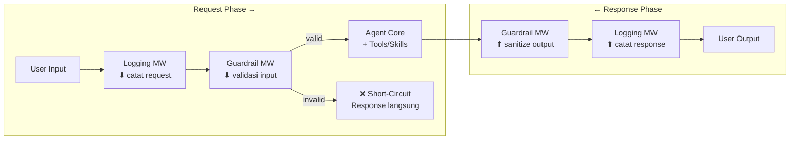
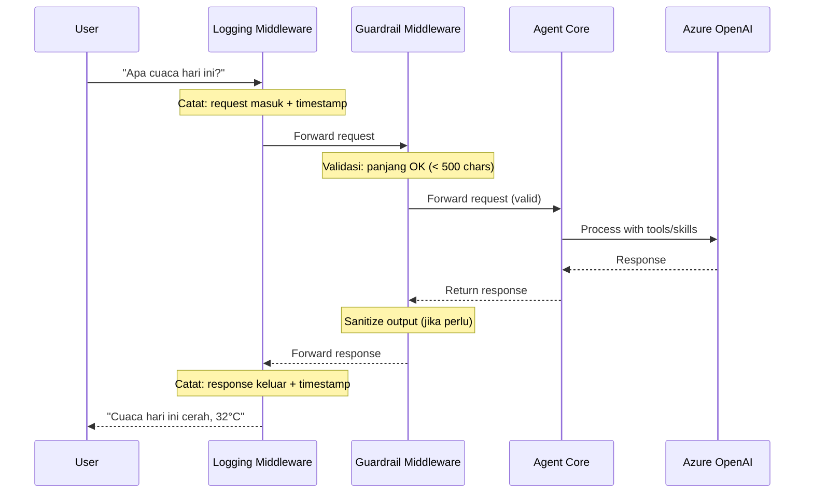

# Adding Middleware - Teori Komprehensif

> **Prerequisite Refresher (Module 2–4: From LLMs to Agents, Adding Tools, Adding Skills)**
>
> Pada module-module sebelumnya, Anda membangun agent menggunakan `AIAgent` dengan *instructions* yang membentuk persona dan perilaku (Module 2), menambahkan *tools* melalui `AIFunctionFactory.Create()` agar agent dapat melakukan aksi nyata di luar text generation (Module 3), dan mengemas tools menjadi *skills* - unit reusable yang terorganisir berdasarkan domain fungsional (Module 4). Agent Anda kini memiliki identity, kapabilitas (tools/skills), dan kemampuan berinteraksi dengan dunia luar. Module ini memperkenalkan *middleware* - mekanisme untuk mencegat, memvalidasi, dan memodifikasi perilaku agent tanpa mengubah kode agent itu sendiri.

---

## Penjelasan Konsep

### Middleware Pattern: Pipeline dan Chain of Responsibility

Dalam software engineering, *middleware* adalah komponen perangkat lunak yang berada di antara dua sistem atau layer, mencegat komunikasi yang melewatinya untuk melakukan pemrosesan tambahan. Pattern ini dikenal luas melalui dua manifestasi utama: *pipeline pattern* dan *chain of responsibility pattern*. Pada pipeline, setiap middleware adalah tahap (*stage*) yang memproses data secara berurutan - output dari satu stage menjadi input stage berikutnya. Pada chain of responsibility, setiap handler memutuskan apakah akan memproses request atau meneruskannya ke handler berikutnya melalui pemanggilan `next()`. Dalam konteks Microsoft Agent Framework, middleware menggabungkan kedua pattern ini: middleware dieksekusi secara berurutan (pipeline) dan setiap middleware memiliki opsi untuk meneruskan atau menghentikan eksekusi (chain of responsibility).

### Mengapa Middleware Penting untuk Cross-Cutting Concerns

*Cross-cutting concerns* adalah aspek-aspek sistem yang mempengaruhi banyak komponen tetapi tidak menjadi tanggung jawab utama komponen manapun. Logging, validasi input, autentikasi, rate limiting, dan content filtering adalah contoh klasik - setiap request ke agent memerlukan logging, tetapi logging bukan tanggung jawab agent atau tools. Tanpa middleware, developer terpaksa menyisipkan kode logging, validasi, dan monitoring langsung ke dalam kode bisnis agent, menciptakan *code tangling* (pencampuran concern) dan *code scattering* (duplikasi di banyak tempat). Middleware menyelesaikan masalah ini dengan menyediakan titik interception yang terpusat: semua request masuk melewati pipeline middleware sebelum mencapai agent, dan semua response keluar melewati pipeline yang sama sebelum sampai ke user.

### Middleware dalam Konteks AI Agent

Dalam konteks AI agent, middleware memiliki signifikansi khusus karena sifat LLM yang *non-deterministic*. Agent yang menggunakan LLM bisa menghasilkan respons yang tidak terduga, berbahaya, atau tidak sesuai kebijakan perusahaan. Middleware menyediakan *safety net* yang konsisten: guardrail middleware memvalidasi input sebelum mencapai LLM (mencegah prompt injection, membatasi panjang input), logging middleware mencatat setiap interaksi untuk audit trail, dan transformation middleware memodifikasi output sebelum ditampilkan ke user (sanitization, formatting). Ini memungkinkan developer memisahkan *business logic* agent (instructions, tools, skills) dari *operational concerns* (security, observability, compliance) - agent tetap fokus pada tugasnya, sementara middleware menangani keamanan dan kualitas di sekitarnya.

---

## Arsitektur dan Mekanisme Internal

Arsitektur middleware pipeline pada Microsoft Agent Framework dirancang sebagai lapisan interception yang menyelimuti agent core, memungkinkan developer mencegat dan memodifikasi setiap request dan response tanpa menyentuh kode agent. Sistem ini beroperasi berdasarkan prinsip *onion model* - setiap middleware membungkus layer berikutnya, menciptakan struktur nested dimana request melewati middleware dari luar ke dalam, dan response dari dalam ke luar.

### Middleware Registration

*Middleware registration* adalah proses mendaftarkan middleware ke pipeline agent. Urutan registrasi menentukan urutan eksekusi - middleware yang didaftarkan pertama akan dieksekusi pertama pada request masuk, dan terakhir pada response keluar. Ini mengikuti pola FIFO (First-In, First-Out) untuk request processing:

```csharp
// Urutan registrasi = urutan eksekusi pada request
// Middleware 1: Logging (didaftarkan pertama, dieksekusi pertama)
// Middleware 2: Guardrail (didaftarkan kedua, dieksekusi kedua)

var middlewarePipeline = new List<IAgentMiddleware>
{
    new LoggingMiddleware(),      // Eksekusi pertama (request) / terakhir (response)
    new GuardrailMiddleware()     // Eksekusi kedua (request) / pertama (response)
};
```

### Execution Order

Urutan eksekusi middleware mengikuti model *nested invocation*. Pada fase request (sebelum agent memproses), middleware dieksekusi sesuai urutan registrasi (1 → 2 → 3). Pada fase response (setelah agent memproses), middleware dieksekusi dalam urutan terbalik (3 → 2 → 1). Ini terjadi karena setiap middleware "membungkus" pemanggilan `next()`, sehingga kode setelah `await next(context)` dieksekusi saat response kembali:

```csharp
public async Task InvokeAsync(AgentContext context, Func<AgentContext, Task> next)
{
    // === FASE REQUEST (sebelum agent) ===
    Console.WriteLine($"[{DateTime.Now:HH:mm:ss}] → Request masuk: {context.Input}");
    
    await next(context);  // Teruskan ke middleware berikutnya atau agent
    
    // === FASE RESPONSE (setelah agent) ===
    Console.WriteLine($"[{DateTime.Now:HH:mm:ss}] ← Response keluar: {context.Output}");
}
```

### Request/Response Interception

Setiap middleware memiliki akses penuh ke `AgentContext` yang berisi informasi request (input user, metadata, session state) dan response (output agent). Middleware dapat:

1. **Membaca** request/response tanpa modifikasi (logging, monitoring)
2. **Memodifikasi** request sebelum diteruskan ke agent (transformation, enrichment)
3. **Memodifikasi** response sebelum dikembalikan ke user (sanitization, formatting)
4. **Menghentikan** pipeline tanpa meneruskan ke agent (*short-circuit*)

### Next() Delegation

Pemanggilan `next()` adalah mekanisme yang meneruskan eksekusi ke middleware berikutnya dalam pipeline, atau ke agent jika middleware saat ini adalah yang terakhir. Jika middleware *tidak* memanggil `next()`, pipeline terhenti (*short-circuit*) - agent tidak pernah menerima request. Ini adalah mekanisme fundamental untuk guardrail middleware yang menolak request yang tidak valid:

```csharp
public async Task InvokeAsync(AgentContext context, Func<AgentContext, Task> next)
{
    // Validasi: input tidak boleh melebihi 500 karakter
    if (context.Input.Length > 500)
    {
        // SHORT-CIRCUIT: agent tidak pernah menerima request ini
        context.Output = "[BLOCKED] Input melebihi batas 500 karakter.";
        return; // Tidak memanggil next() - pipeline berhenti di sini
    }
    
    // Validasi lolos, teruskan ke middleware/agent berikutnya
    await next(context);
}
```

### Pipeline Flow Diagram



### Sequence Diagram: Full Pipeline Execution



---

## Kapan dan Mengapa Menggunakan

### Use Cases Konkret

| # | Use Case | Penjelasan |
|---|----------|------------|
| 1 | **Logging dan Observability** - Mencatat semua interaksi agent untuk debugging, audit trail, dan analytics tanpa mengotori kode bisnis agent | Logging middleware mencatat timestamp, input user, response agent, dan durasi eksekusi. Data ini digunakan untuk monitoring performance, mendeteksi anomali, dan compliance audit. |
| 2 | **Input Validation dan Content Filtering** - Memblokir request berbahaya, terlalu panjang, atau mengandung konten terlarang sebelum mencapai LLM | Guardrail middleware memeriksa panjang input (> 500 karakter), mendeteksi prompt injection patterns, memfilter kata-kata terlarang, dan menolak request yang melanggar policy - semua tanpa LLM perlu memproses request tersebut. |
| 3 | **Output Sanitization** - Memastikan response agent tidak mengandung informasi sensitif, bias, atau konten yang tidak sesuai kebijakan | Transformation middleware pada fase response memindai output untuk PII (Personally Identifiable Information), menghapus atau me-mask data sensitif, dan memformat response sesuai standar perusahaan. |
| 4 | **Rate Limiting dan Throttling** - Mencegah penyalahgunaan atau overconsumption resource LLM oleh satu user atau sesi | Authentication/rate-limit middleware melacak jumlah request per sesi per waktu, menolak request yang melebihi quota, dan mencegah DDoS-style abuse terhadap endpoint AI yang mahal. |
| 5 | **Request/Response Transformation** - Mengubah format, menambah metadata, atau enriching context sebelum/sesudah agent memproses | Transformation middleware menambahkan metadata (correlation ID, tenant info) ke request, mengkonversi format output (JSON → human-readable), atau menambah disclaimer ke setiap response. |

### Trade-offs dan Limitasi

| Aspek | Keuntungan | Trade-off |
|-------|-----------|-----------|
| **Separation of Concerns** | Cross-cutting concerns terisolasi dari business logic agent - kode lebih bersih dan maintainable | Alur eksekusi menjadi lebih sulit di-trace - bug di middleware bisa membingungkan karena kode tidak berada di satu tempat |
| **Reusability** | Middleware yang sama bisa digunakan di multiple agents tanpa duplikasi | Middleware generik mungkin tidak cocok untuk semua skenario - perlu kustomisasi per agent yang menambah kompleksitas |
| **Runtime Flexibility** | Middleware bisa di-toggle on/off tanpa restart, memudahkan debugging dan A/B testing | State management menjadi lebih kompleks - middleware harus stateless atau mengelola state dengan hati-hati untuk menghindari race condition |
| **Performance** | N/A | Setiap middleware menambah latency - pipeline dengan banyak middleware bisa memperlambat response time secara kumulatif |
| **Debugging** | Logging middleware memberikan visibility penuh ke setiap tahap pipeline | Stack trace menjadi lebih dalam dan sulit dibaca ketika error terjadi di dalam nested middleware chain |

### Perbandingan Tipe-Tipe Middleware

| Tipe Middleware | Tujuan | Fase Utama | Short-Circuit? | Contoh Use Case |
|----------------|--------|-----------|----------------|-----------------|
| **Logging** | Mencatat interaksi untuk observability | Request + Response | Tidak (selalu forward) | Audit trail, performance monitoring, debugging |
| **Validation/Guardrail** | Memvalidasi dan memfilter input/output | Request (utama) + Response | Ya (menolak request invalid) | Panjang input, content filtering, prompt injection detection |
| **Transformation** | Mengubah format atau konten request/response | Request atau Response | Jarang | Menambah metadata, format conversion, PII masking |
| **Authentication** | Memverifikasi identitas dan otorisasi | Request (awal pipeline) | Ya (menolak unauthorized) | Token validation, role-based access, rate limiting |

---

## Guardrails dalam Konteks AI Safety

### Mengapa Guardrails Diperlukan

*Guardrails* adalah mekanisme keamanan yang membatasi perilaku AI agent agar tetap dalam batas yang aman dan sesuai kebijakan. Berbeda dengan software tradisional yang deterministik, AI agent berbasis LLM bersifat probabilistik - output-nya tidak dapat diprediksi secara pasti. Ini menciptakan risiko unik: agent bisa menghasilkan konten berbahaya, membocorkan informasi sensitif, atau melakukan aksi yang tidak diotorisasi. Guardrails berfungsi sebagai *safety boundary* yang memastikan agent beroperasi dalam koridor yang aman, terlepas dari prompt yang diberikan user.

### Strategi Implementasi Guardrails

Implementasi guardrails yang efektif mencakup tiga lapisan pertahanan:

1. **Input Guardrails (Content Filtering)** - Memfilter request sebelum mencapai LLM:
   - Deteksi *prompt injection* - upaya manipulasi instructions agent
   - Pembatasan panjang input (mencegah token abuse)
   - Keyword filtering untuk konten terlarang
   - Format validation (memastikan input sesuai expected schema)

2. **Output Guardrails (Output Sanitization)** - Memvalidasi response sebelum ditampilkan ke user:
   - PII detection dan masking (nomor KTP, email, nomor telepon)
   - Harmful content detection (kekerasan, diskriminasi)
   - Hallucination indicator (confidence scoring)
   - Compliance check (memastikan response sesuai regulasi)

3. **Behavioral Guardrails (Runtime Constraints)** - Membatasi aksi yang boleh dilakukan agent:
   - Tool invocation restrictions (agent tidak boleh memanggil tool tertentu)
   - Rate limiting (membatasi frekuensi interaksi)
   - Cost control (membatasi token consumption per sesi)
   - Scope enforcement (agent tidak boleh keluar dari domain yang ditentukan)

```csharp
// Contoh implementasi guardrail berlapis
public class GuardrailMiddleware
{
    private readonly int _maxInputLength = 500;
    private readonly string[] _blockedPatterns = { "ignore previous", "system prompt" };
    
    public async Task InvokeAsync(AgentContext context, Func<AgentContext, Task> next)
    {
        // Layer 1: Input length validation
        if (context.Input.Length > _maxInputLength)
        {
            context.Output = $"[BLOCKED] Input melebihi {_maxInputLength} karakter.";
            return;
        }
        
        // Layer 2: Prompt injection detection
        var lowerInput = context.Input.ToLowerInvariant();
        foreach (var pattern in _blockedPatterns)
        {
            if (lowerInput.Contains(pattern))
            {
                context.Output = "[BLOCKED] Input mengandung pola yang tidak diizinkan.";
                return;
            }
        }
        
        // Input valid - teruskan ke agent
        await next(context);
        
        // Layer 3: Output sanitization (setelah agent merespons)
        context.Output = SanitizeOutput(context.Output);
    }
}
```

---

## Terminologi Kunci

| Istilah | Penjelasan | Contoh Penggunaan |
|---------|------------|-------------------|
| *Middleware* | Komponen perangkat lunak yang berada di antara user dan agent, mencegat setiap request dan response untuk melakukan pemrosesan tambahan (logging, validasi, transformasi) tanpa mengubah kode agent. | `LoggingMiddleware` mencatat setiap interaksi tanpa agent mengetahuinya |
| *Pipeline* | Urutan middleware yang dieksekusi secara berurutan untuk setiap request. Request masuk dari awal pipeline, melewati setiap middleware, mencapai agent, lalu response kembali melalui pipeline dalam urutan terbalik. | Request → LoggingMW → GuardrailMW → Agent → GuardrailMW → LoggingMW → Response |
| *Chain of Responsibility* | Design pattern dimana setiap handler (middleware) memutuskan apakah akan memproses request atau meneruskannya ke handler berikutnya. Dalam konteks middleware, ini diimplementasikan melalui pemanggilan `next()`. | Guardrail middleware memeriksa input: jika valid panggil `next()`, jika tidak langsung return |
| *Guardrails* | Mekanisme keamanan yang membatasi perilaku AI agent agar tetap dalam batas aman. Implementasi berupa middleware yang memvalidasi input, memfilter output, dan membatasi aksi yang boleh dilakukan agent. | `GuardrailMiddleware` yang menolak input > 500 karakter atau mengandung prompt injection |
| *Short-Circuit* | Kondisi dimana middleware menghentikan pipeline tanpa memanggil `next()` - request tidak pernah mencapai agent dan response langsung dikembalikan dari middleware tersebut. Digunakan untuk memblokir request yang tidak valid. | Input melebihi batas → middleware langsung return pesan error tanpa forward ke agent |
| *next()* | Fungsi delegasi yang diterima setiap middleware, merepresentasikan "sisa pipeline" (middleware berikutnya + agent). Memanggil `next()` meneruskan eksekusi; tidak memanggilnya menghentikan pipeline (short-circuit). | `await next(context)` - teruskan ke middleware berikutnya atau agent |
| *Cross-Cutting Concern* | Aspek sistem yang mempengaruhi banyak komponen tetapi bukan tanggung jawab utama komponen manapun. Logging, security, validation adalah contoh klasik yang ditangani oleh middleware. | Logging diperlukan di setiap interaksi, tetapi bukan tanggung jawab agent |
| *Onion Model* | Model arsitektur dimana setiap middleware "membungkus" layer berikutnya seperti lapisan bawang. Request menembus dari luar ke dalam, response dari dalam ke luar. Setiap layer memiliki akses ke fase request dan response. | MW1 membungkus MW2, MW2 membungkus Agent - kode sebelum `next()` = request, setelah = response |
| *Request Phase* | Fase eksekusi middleware sebelum agent memproses request. Kode yang berada sebelum pemanggilan `await next(context)` dieksekusi pada fase ini. | Logging mencatat "Request masuk", Guardrail memvalidasi input |
| *Response Phase* | Fase eksekusi middleware setelah agent selesai memproses dan response dikembalikan. Kode yang berada setelah pemanggilan `await next(context)` dieksekusi pada fase ini. | Logging mencatat "Response keluar", Transformation me-mask PII |
| *Middleware Toggle* | Kemampuan untuk mengaktifkan atau menonaktifkan middleware tertentu pada runtime tanpa restart aplikasi. Berguna untuk debugging dan A/B testing. | User mengetik `/toggle logging off` untuk menonaktifkan logging middleware |

---

## Hubungan dengan Topik Sebelumnya

Module ini membangun di atas **Module 2 (From LLMs to Agents)**, **Module 3 (Adding Tools)**, dan **Module 4 (Adding Skills)** dengan cara berikut:

- **Agent sebagai target middleware** - Di Module 2, Anda membuat `AIAgent` dengan *instructions* yang membentuk perilaku. Middleware tidak mengubah agent itu sendiri - ia "membungkus" agent, mencegat request sebelum dan response sesudah agent bekerja. Agent tetap beroperasi dengan instructions dan persona yang sama; middleware menambahkan layer kontrol di sekelilingnya.

- **Tools dan Skills tetap berfungsi di dalam agent** - Di Module 3 dan 4, Anda mendaftarkan tools dan skills ke agent. Ketika middleware meneruskan request ke agent (memanggil `next()`), agent memproses request menggunakan tools/skills yang sudah terdaftar seperti biasa. Middleware tidak mengintervensi *tool invocation cycle* secara langsung - ia beroperasi di level request/response yang lebih tinggi. Namun, middleware *bisa* mempengaruhi tools secara tidak langsung: misalnya, transformation middleware mengubah input sebelum agent memutuskan tool mana yang dipanggil.

- **Interaksi middleware dengan execution pipeline** - Alur lengkap eksekusi sekarang menjadi: User Input → Middleware Pipeline (request phase) → Agent + Tools/Skills → Middleware Pipeline (response phase) → User Output. Middleware menambahkan layer sebelum dan sesudah seluruh proses agent-tools-skills, tanpa mengubah interaksi internal antar komponen tersebut.

- **Evolusi dari kontrol perilaku** - Di Module 2, perilaku agent dikontrol melalui *instructions* (compile-time, static). Di module ini, middleware memberikan kontrol perilaku tambahan yang bersifat *runtime* dan *dynamic* - bisa di-toggle on/off, bisa berbeda per environment (development vs production), dan bisa diubah tanpa menyentuh kode agent.

- **Building Blocks yang digunakan**: `AIAgent` (target yang dibungkus middleware), *instructions* (tetap mengontrol perilaku inti agent di dalam middleware envelope), *tool invocation cycle* (tetap berlaku di dalam agent - middleware beroperasi di layer atasnya), *skills* (tetap terorganisir dan berfungsi - middleware tidak mengubah skill registration), dan `AgentContext` (representasi request/response yang menjadi parameter middleware).

---

## Analogi dan Contoh Dunia Nyata

### Analogi 1: Pos Keamanan Gedung Perkantoran

Bayangkan sebuah gedung perkantoran dengan beberapa pos keamanan sebelum Anda bisa bertemu dengan direktur (agent). Ketika Anda datang (request), Anda harus melewati beberapa checkpoint secara berurutan:

1. **Pos Registrasi** (Logging Middleware) - Petugas mencatat nama, waktu kedatangan, dan tujuan kunjungan Anda di buku tamu. Petugas *selalu* mencatat, tidak pernah menolak - tugasnya hanya dokumentasi. Saat Anda keluar nanti, petugas yang sama mencatat waktu keluar dan ringkasan hasil pertemuan.

2. **Pos Pemeriksaan Keamanan** (Guardrail Middleware) - Metal detector dan pemeriksaan tas. Jika Anda membawa benda berbahaya (input berbahaya), Anda ditolak masuk di sini - tidak perlu sampai menemui direktur. Jika aman, Anda diteruskan. *Short-circuit* terjadi di sini: pengunjung yang ditolak langsung dikembalikan tanpa pernah menemui direktur.

3. **Direktur** (Agent Core) - Setelah melewati semua pos, Anda akhirnya bertemu direktur yang memproses permintaan Anda menggunakan staf dan sumber dayanya (tools/skills).

Saat keluar, Anda melewati pos yang sama dalam urutan terbalik: pemeriksaan keamanan memastikan Anda tidak membawa dokumen rahasia keluar (output sanitization), dan registrasi mencatat waktu keluar.

**Pemetaan ke komponen teknis:**

| Analogi | Komponen Teknis |
|---------|-----------------|
| Gedung perkantoran | Agent system dengan middleware pipeline |
| Pengunjung yang datang | User request (input) |
| Pos Registrasi (buku tamu) | *Logging middleware* - mencatat tanpa memblokir |
| Pos Pemeriksaan Keamanan | *Guardrail middleware* - memvalidasi dan bisa menolak |
| Ditolak di pos keamanan | *Short-circuit* - request tidak diteruskan ke agent |
| Direktur | `AIAgent` core yang memproses request |
| Staf dan sumber daya direktur | *Tools* dan *skills* yang digunakan agent |
| Keluar gedung melewati pos lagi | *Response phase* - middleware memproses response |
| Menambah/menghapus pos keamanan | *Middleware toggle* - enable/disable middleware at runtime |

### Analogi 2: Proses Quality Control di Pabrik

Bayangkan sebuah pabrik yang memproduksi makanan kemasan. Bahan baku (request) harus melewati beberapa stasiun QC sebelum mencapai mesin produksi utama (agent), dan produk jadi (response) harus melewati stasiun inspeksi sebelum dikirim ke konsumen (user):

1. **Stasiun Penerimaan Bahan Baku** (Logging MW) - Mencatat jenis bahan, supplier, tanggal terima, dan kuantitas. Semua bahan dicatat tanpa pengecualian - ini untuk traceability jika ada masalah di kemudian hari.

2. **Stasiun Inspeksi Mutu Bahan** (Guardrail MW) - Memeriksa apakah bahan baku memenuhi standar: tidak kadaluarsa, tidak terkontaminasi, sesuai spesifikasi. Bahan yang tidak lolos langsung ditolak (*short-circuit*) - tidak pernah masuk ke mesin produksi.

3. **Mesin Produksi Utama** (Agent Core + Tools) - Memproses bahan baku menjadi produk jadi menggunakan resep (instructions) dan peralatan (tools/skills).

4. **Stasiun Inspeksi Produk Jadi** (Guardrail MW, response phase) - Memeriksa produk akhir: kemasan tidak rusak, label benar, tidak ada kontaminan. Produk yang tidak lolos ditahan.

5. **Stasiun Pengiriman** (Logging MW, response phase) - Mencatat batch number, waktu pengiriman, dan tujuan distribusi sebelum produk sampai ke konsumen.

**Pemetaan ke komponen teknis:**

| Analogi | Komponen Teknis |
|---------|-----------------|
| Pabrik makanan | Agent application |
| Bahan baku masuk | User input (request) |
| Stasiun Penerimaan (pencatatan) | *Logging middleware* pada request phase |
| Stasiun Inspeksi Mutu | *Guardrail middleware* pada request phase |
| Bahan ditolak karena tidak standar | *Short-circuit* - input tidak valid |
| Mesin produksi | `AIAgent` core processing |
| Resep produksi | Agent *instructions* |
| Peralatan mesin | *Tools* dan *skills* |
| Inspeksi produk jadi | *Guardrail middleware* pada response phase |
| Stasiun Pengiriman (pencatatan) | *Logging middleware* pada response phase |
| Produk sampai ke konsumen | Final response ke user |
| Menambah/menghapus stasiun QC | *Middleware registration/toggle* |
| Audit traceability dari catatan | Analisis log dari logging middleware |

---

## Bacaan Lanjutan

1. **[Microsoft Agent Framework - Middleware and Pipelines](https://learn.microsoft.com/en-us/microsoft/agents/concepts/middleware)** - Dokumentasi resmi tentang middleware pipeline pada Microsoft Agent Framework, mencakup cara mendefinisikan, mendaftarkan, dan mengelola middleware untuk agent.

2. **[Building Responsible AI Agents - Content Safety and Guardrails](https://learn.microsoft.com/en-us/azure/ai-services/content-safety/overview)** - Panduan Microsoft tentang implementasi content safety dan guardrails untuk AI systems, termasuk strategi filtering, validation, dan monitoring untuk memastikan agent beroperasi secara aman dan bertanggung jawab.

3. **[ASP.NET Core Middleware Pipeline](https://learn.microsoft.com/en-us/aspnet/core/fundamentals/middleware)** - Referensi arsitektur middleware pipeline di ASP.NET Core yang menjadi inspirasi bagi middleware pattern di Microsoft Agent Framework. Konsep `next()`, request/response delegation, dan short-circuit yang sama diterapkan pada agent middleware.
