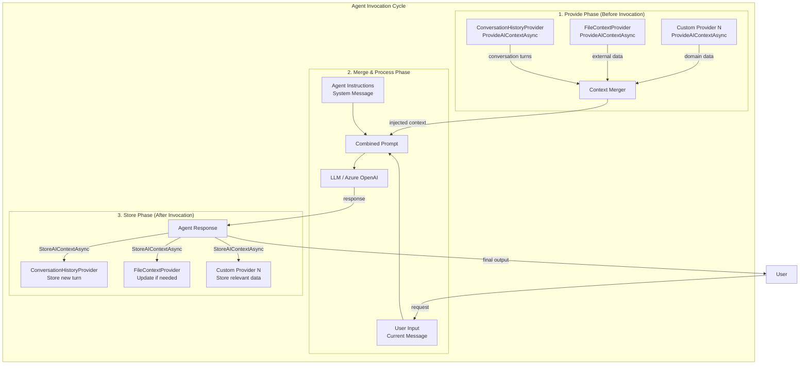
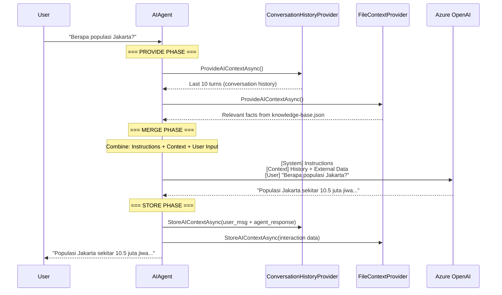

# Context Providers - Teori Komprehensif

> **Prerequisite Refresher (Module 5: Adding Middleware)**
>
> Pada module sebelumnya, Anda mempelajari *middleware pattern* - mekanisme untuk mencegat dan memodifikasi perilaku agent melalui pipeline tanpa mengubah kode agent itu sendiri. Middleware beroperasi pada level request/response menggunakan pola `next()` delegation, memungkinkan logging, guardrails (validasi input dan output), serta runtime toggle. Anda memahami bahwa middleware membungkus agent dari luar - mencegat *sebelum* dan *sesudah* agent memproses request. Module ini memperkenalkan *context providers* - komponen yang beroperasi dari *dalam*, menyuntikkan informasi tambahan ke agent sebelum dan sesudah setiap invokasi untuk memberikan "memori" dan pengetahuan kontekstual.

---

## Penjelasan Konsep

### Memory dan Context dalam AI Agents

Dalam dunia AI agents, *memory* dan *context* adalah dua konsep yang saling berkaitan namun berbeda secara fundamental. *Memory* mengacu pada kemampuan agent untuk mengingat informasi dari interaksi sebelumnya - baik dalam satu sesi percakapan maupun lintas sesi. *Context* adalah kumpulan informasi yang tersedia bagi agent pada saat memproses sebuah request, termasuk conversation history, data eksternal, instruksi sistem, dan metadata lainnya. Tanpa mekanisme memory dan context, setiap interaksi dengan agent dimulai dari nol - agent tidak memiliki pengetahuan tentang apa yang sudah dibicarakan, siapa user-nya, atau informasi relevan yang dibutuhkan untuk memberikan respons berkualitas. Dalam Microsoft Agent Framework, *context providers* adalah abstraksi yang menjembatani gap ini - menyediakan mekanisme terstruktur untuk menyimpan dan menyuntikkan informasi kontekstual ke dalam proses agent.

### Short-Term Memory vs Long-Term Memory

*Short-term memory* (memori jangka pendek) dalam konteks AI agent merujuk pada *conversation history* - rangkaian pesan (user input dan agent response) dari sesi percakapan yang sedang berlangsung. Short-term memory bersifat ephemeral: ia ada selama sesi aktif dan hilang ketika sesi berakhir. Ini memungkinkan agent menjawab pertanyaan follow-up ("Apa yang tadi kamu bilang tentang X?") dengan mereferensikan turn-turn sebelumnya. Sebaliknya, *long-term memory* (memori jangka panjang) merujuk pada informasi yang bertahan lintas sesi - preferensi user, fakta yang dipelajari, atau data dari sumber eksternal (database, file, API). Long-term memory memungkinkan agent "mengenal" user dari waktu ke waktu dan mengakses pengetahuan yang tidak tersedia dalam conversation history. Dalam Microsoft Agent Framework, kedua jenis memory ini dikelola melalui *context providers* yang berbeda: satu provider bisa mengelola sliding window dari conversation history (short-term), sementara provider lain membaca data dari file atau database (long-term).

### Mengapa Context Management Krusial

Context management adalah aspek krusial dalam pembangunan agent yang efektif karena tiga alasan fundamental. **Pertama**, kualitas respons agent berbanding lurus dengan kualitas context yang tersedia - agent yang memiliki akses ke conversation history dan informasi relevan akan menghasilkan respons yang lebih akurat, koheren, dan personal dibanding agent yang memproses setiap request secara terisolasi. **Kedua**, LLM memiliki batasan *token limit* (jendela konteks terbatas) yang memaksa developer membuat keputusan strategis tentang informasi apa yang disertakan dan apa yang dibuang - terlalu sedikit context menghasilkan respons yang dangkal, terlalu banyak context membuang token (dan biaya) untuk informasi yang tidak relevan. **Ketiga**, context management yang baik memungkinkan *separation of concerns* - agent tidak perlu tahu bagaimana memory disimpan atau di-retrieve; ia hanya menerima context yang sudah dipersiapkan oleh context providers, memungkinkan developer mengganti strategi penyimpanan tanpa mengubah logic agent. Ini menjadikan context providers sebagai komponen arsitektural yang esensial dalam agent system yang production-ready.

---

## Arsitektur dan Mekanisme Internal

Arsitektur *context provider system* pada Microsoft Agent Framework dirancang sebagai mekanisme injeksi konteks yang terintegrasi dengan lifecycle agent invocation. Berbeda dengan middleware yang beroperasi di level request/response pipeline, context providers beroperasi di level yang lebih dalam - mereka menyediakan informasi tambahan yang digabungkan dengan prompt sebelum dikirim ke LLM, dan menyimpan informasi dari respons setelah agent selesai memproses.

### Context Provider Interface

Setiap context provider mengimplementasikan interface `AIContextProvider` yang mendefinisikan dua operasi utama:

1. **`ProvideAIContextAsync()`** - Dipanggil *sebelum* agent mengirim prompt ke LLM. Method ini mengembalikan `AIContext` yang berisi informasi tambahan (conversation history, data dari file, hasil RAG query, dll.) yang akan digabungkan dengan prompt utama.

2. **`StoreAIContextAsync()`** - Dipanggil *setelah* agent menerima response dari LLM. Method ini menerima informasi tentang interaksi yang baru terjadi (user input dan agent response) untuk disimpan - memungkinkan context provider memperbarui state-nya untuk invokasi berikutnya.

```csharp
public abstract class AIContextProvider
{
    // Dipanggil SEBELUM agent invocation - menyediakan context
    protected abstract ValueTask<AIContext> ProvideAIContextAsync(
        ProviderSessionState sessionState,
        CancellationToken cancellationToken);

    // Dipanggil SETELAH agent invocation - menyimpan context baru
    protected abstract ValueTask StoreAIContextAsync(
        ProviderSessionState sessionState,
        AIContext newContext,
        CancellationToken cancellationToken);
}
```

### Context Injection Mechanism

Mekanisme injeksi context bekerja dalam siklus yang terintegrasi dengan agent invocation loop. Ketika agent menerima request dari user, framework secara otomatis memanggil semua registered context providers untuk mengumpulkan context tambahan. Context dari setiap provider digabungkan (*merged*) menjadi satu combined context yang kemudian disertakan bersama prompt user dan agent instructions saat dikirim ke LLM.

### Context Lifecycle

Lifecycle context provider mengikuti pola *provide-process-store* yang berulang pada setiap turn percakapan:

1. **Provide Phase** - Semua context providers dipanggil via `ProvideAIContextAsync()` untuk mengumpulkan context yang relevan
2. **Merge Phase** - Context dari berbagai providers digabungkan dengan prompt user dan agent instructions
3. **Process Phase** - Combined context dikirim ke LLM sebagai bagian dari prompt
4. **Store Phase** - Setelah LLM merespons, `StoreAIContextAsync()` dipanggil pada semua providers untuk menyimpan interaksi baru

### How Context is Combined with Prompt

Sebelum dikirim ke LLM, informasi disusun dalam urutan prioritas:

1. **System message** - Agent instructions (persona, batasan, format)
2. **Context injection** - Informasi dari context providers (conversation history, external data)
3. **User message** - Input terbaru dari user

Struktur ini memastikan LLM memiliki gambaran lengkap: siapa dirinya (instructions), apa yang sudah terjadi (context), dan apa yang diminta user sekarang (current input).

### Architecture Diagram



### Sequence Diagram: Full Context Injection Flow



---

## Kapan dan Mengapa Menggunakan

### Use Cases Konkret

| # | Use Case | Penjelasan |
|---|----------|------------|
| 1 | **Conversational Memory** - Agent mengingat konteks percakapan sebelumnya untuk menjawab pertanyaan follow-up secara koheren | Context provider menyimpan sliding window dari N turn terakhir. Ketika user bertanya "Jelaskan lebih detail", agent memiliki context tentang topik apa yang sedang dibahas. |
| 2 | **Knowledge-Augmented Agent** - Agent mengakses knowledge base eksternal untuk menjawab pertanyaan domain-specific | File-based atau RAG context provider membaca data dari file JSON, database, atau vector store, menyuntikkan fakta relevan agar agent menjawab dengan informasi akurat, bukan hallucination. |
| 3 | **Personalized Agent** - Agent mengingat preferensi dan profil user lintas sesi untuk memberikan respons yang dipersonalisasi | Long-term context provider membaca profil user dari persistent storage, menyediakan informasi seperti nama, preferensi bahasa, dan histori interaksi sebelumnya. |
| 4 | **Multi-Source Context Aggregation** - Agent menggabungkan informasi dari berbagai sumber (API, database, file) menjadi context yang koheren | Multiple context providers bekerja secara paralel - satu membaca dari CRM, satu dari knowledge base, satu dari calendar - semua dimerge sebelum dikirim ke LLM. |
| 5 | **Dynamic Context Based on User Intent** - Context yang disuntikkan berubah berdasarkan topik atau intent user saat ini | Smart context provider menganalisis user input untuk menentukan informasi apa yang relevan, menghindari menyuntikkan context yang tidak diperlukan (menghemat token). |

### Trade-offs dan Limitasi

| Aspek | Keuntungan | Trade-off |
|-------|-----------|-----------|
| **Response Quality** | Context yang kaya menghasilkan respons lebih akurat, koheren, dan relevan - agent "tahu" apa yang sudah dibicarakan | Terlalu banyak context bisa membingungkan LLM (*context pollution*) - informasi yang tidak relevan menurunkan kualitas respons |
| **Token Cost** | Context provider memungkinkan kontrol granular terhadap informasi apa yang disertakan, mengoptimalkan penggunaan token | Setiap context yang disuntikkan mengkonsumsi token dari context window - semakin banyak context, semakin tinggi biaya per request |
| **Latency** | Context dari file lokal sangat cepat; pre-computed context menghindari real-time computation | Context dari sumber eksternal (database, API, vector search) menambah latency - setiap provider yang melakukan I/O memperlambat response time |
| **Maintainability** | Separation of concerns - logic penyimpanan context terpisah dari logic agent, memudahkan perubahan strategi | Multiple context providers menambah kompleksitas arsitektural - debugging menjadi lebih sulit ketika context salah atau konflik antar providers |
| **Accuracy** | RAG-based context provider menyediakan informasi faktual dari sumber terpercaya, mengurangi hallucination | Context yang stale (kadaluarsa) atau salah bisa menyebabkan agent memberikan informasi yang tidak akurat - perlu mekanisme refresh |

### Perbandingan Strategi Context Management

| Strategi | Cara Kerja | Keuntungan | Kekurangan | Cocok Untuk |
|----------|-----------|-----------|------------|-------------|
| **Sliding Window** | Menyimpan N turn terakhir, membuang turn terlama ketika melebihi batas | Sederhana, predictable token usage, menjaga recency | Kehilangan context lama yang mungkin penting, tidak ada prioritisasi berdasarkan relevansi | Chatbot sederhana, customer support dengan sesi pendek |
| **Summarization** | Merangkum turn-turn lama menjadi ringkasan singkat, menjaga turn terbaru secara utuh | Mempertahankan esensi seluruh percakapan, lebih efisien dibanding menyimpan semua turn | Memerlukan LLM call tambahan untuk summarize (biaya + latency), ringkasan bisa kehilangan detail penting | Percakapan panjang, meeting notes agent, agent yang perlu overview keseluruhan sesi |
| **RAG (Retrieval-Augmented Generation)** | Mengambil informasi relevan dari vector store atau knowledge base berdasarkan query user saat ini | Hanya menyertakan informasi yang relevan (precision tinggi), bisa mengakses knowledge base besar | Memerlukan infrastruktur vector store, retrieval bisa gagal menemukan informasi relevan, latency tambahan | Knowledge-intensive agents, FAQ bots, agent dengan large knowledge base |
| **Hybrid** | Menggabungkan beberapa strategi: sliding window untuk recent history + summarization untuk history lama + RAG untuk external knowledge | Paling komprehensif - menjaga recency, esensi history, dan external knowledge | Paling kompleks untuk diimplementasikan, highest latency, memerlukan tuning yang cermat | Production-grade agents, enterprise assistants, agent yang memerlukan long-running memory |

---

## Terminologi Kunci

| Istilah | Penjelasan | Contoh Penggunaan |
|---------|------------|-------------------|
| `AIContextProvider` | Base class abstrak yang harus diimplementasikan untuk membuat context provider. Mendefinisikan kontrak dua method utama: `ProvideAIContextAsync()` dan `StoreAIContextAsync()`. | `class ConversationHistoryProvider : AIContextProvider` - membuat provider yang mengelola conversation history |
| `ProvideAIContextAsync()` | Method yang dipanggil sebelum agent mengirim prompt ke LLM. Mengembalikan `AIContext` berisi informasi tambahan yang akan digabungkan dengan prompt. | Provider membaca 10 turn terakhir dari memory dan mengembalikannya sebagai `AIContext` |
| `StoreAIContextAsync()` | Method yang dipanggil setelah agent menerima response dari LLM. Menerima data interaksi terbaru untuk disimpan agar tersedia pada invokasi berikutnya. | Provider menyimpan user input dan agent response sebagai turn baru dalam conversation history |
| *Sliding Window* | Strategi context management yang menyimpan N item terakhir (biasanya conversation turns) dan membuang item terlama ketika melebihi batas. Menjamin penggunaan token yang predictable. | `MaxTurns = 10` - selalu simpan 10 turn terakhir, buang turn ke-11 terlama |
| *Token Limit* | Batas maksimum jumlah token yang bisa diproses LLM dalam satu request (context window). Untuk GPT-4o-mini, biasanya 128K tokens. Semua input (system message + context + user input) harus muat dalam batas ini. | Total context melebihi 4000 token → perlu truncation atau summarization |
| *Context Truncation* | Proses memotong atau menghapus bagian context ketika total token melebihi batas yang ditetapkan. Biasanya turn terlama dihapus terlebih dahulu (*recency-first* strategy). | Conversation history 5000 tokens → hapus turn terlama hingga total ≤ 4000 tokens |
| *Context Window* | Rentang informasi yang "terlihat" oleh LLM pada satu waktu - mencakup semua token dari system message, context injection, dan user input. Informasi di luar window tidak diproses LLM. | Context window 128K tokens berarti total prompt + context + response harus ≤ 128K tokens |
| *Token Estimation* | Proses memperkirakan jumlah token yang akan dikonsumsi oleh sebuah string teks. Rule of thumb: ~4 karakter per token untuk bahasa Inggris, ~2-3 karakter per token untuk bahasa non-Latin. | `"Hello world"` ≈ 2 tokens; digunakan untuk memutuskan apakah context perlu di-truncate |
| *RAG (Retrieval-Augmented Generation)* | Teknik yang menggabungkan retrieval (pencarian informasi relevan dari knowledge base) dengan generation (LLM menghasilkan respons berdasarkan informasi yang di-retrieve). | Vector search menemukan 3 dokumen relevan → disuntikkan sebagai context → LLM menjawab berdasarkan dokumen tersebut |
| *Context Pollution* | Kondisi dimana terlalu banyak context yang tidak relevan disuntikkan ke LLM, menyebabkan penurunan kualitas respons karena LLM "bingung" memilah informasi yang penting. | Menyuntikkan seluruh database 50 fakta padahal hanya 2 yang relevan → LLM memberikan jawaban yang tidak fokus |
| `ProviderSessionState<T>` | Typed state object yang memungkinkan context provider menyimpan state antar invokasi dalam satu sesi. Menyediakan mekanisme penyimpanan tanpa perlu external storage. | `ProviderSessionState<List<ChatMessage>>` - menyimpan list pesan dalam memory selama sesi aktif |
| *Context Merge* | Proses penggabungan context dari multiple providers menjadi satu combined context yang dikirim ke LLM bersama prompt. Urutan dan prioritas merge ditentukan oleh framework. | ConversationHistoryProvider + FileContextProvider → merged context → combined dengan user input |

---

## Hubungan dengan Topik Sebelumnya

Module ini membangun di atas **Module 5 (Adding Middleware)** dan secara tidak langsung di atas seluruh module sebelumnya, dengan cara berikut:

- **Dari middleware pipeline ke context injection** - Di Module 5, Anda mempelajari bahwa middleware beroperasi di level request/response, mencegat interaksi *dari luar* agent. Context providers beroperasi di level yang lebih dalam - mereka *menyuntikkan informasi ke dalam* proses agent sebelum prompt dikirim ke LLM. Jika middleware adalah "satpam di pintu gedung", maka context provider adalah "asisten yang menyiapkan berkas-berkas di meja direktur sebelum rapat dimulai". Keduanya bekerja secara komplementer: middleware memfilter request yang masuk, context providers memperkaya prompt dengan informasi relevan.

- **Evolusi dari static instructions ke dynamic context** - Di Module 2 (From LLMs to Agents), perilaku agent dibentuk melalui *instructions* yang bersifat statis - ditulis sekali saat agent dibuat. Context providers membawa dimensi baru: *dynamic context* yang berubah setiap turn. Instructions tetap membentuk persona agent (siapa dia, bagaimana berperilaku), sementara context providers menyediakan informasi yang berubah-ubah (apa yang sudah dibicarakan, data apa yang relevan saat ini). Keduanya digabungkan sebelum dikirim ke LLM - instructions sebagai system message, context sebagai additional information.

- **Building blocks yang digunakan**: `AIAgent` (target yang menerima context injection), *instructions* (tetap berlaku sebagai system message - context providers menambahkan layer informasi di atasnya), *middleware pipeline* (masih aktif - request melewati middleware dulu sebelum context providers bekerja), *tools/skills* (agent masih menggunakan tools setelah menerima enriched context - context bisa mempengaruhi tool selection), dan `AgentSession` (session state yang menjadi tempat context providers beroperasi).

- **Interaksi dengan middleware** - Dalam execution flow lengkap, urutan pemrosesan menjadi: User Input → Middleware Pipeline (request phase) → Context Providers (provide phase) → Agent + Context + Instructions → LLM → Context Providers (store phase) → Middleware Pipeline (response phase) → User Output. Middleware dan context providers beroperasi pada layer yang berbeda namun saling melengkapi.

---

## Analogi dan Contoh Dunia Nyata

### Analogi 1: Asisten Pribadi Eksekutif

Bayangkan seorang direktur perusahaan (agent) yang memiliki asisten pribadi (context provider). Setiap kali direktur akan bertemu dengan seseorang (menerima request), asistennya menyiapkan *briefing folder* yang berisi informasi relevan:

- **Sebelum rapat** (`ProvideAIContextAsync`) - Asisten menyiapkan folder di meja direktur: ringkasan rapat sebelumnya dengan orang ini (*conversation history*), profil dan preferensi mereka (*long-term memory*), serta data relevan dari departemen terkait (*external context*). Direktur tidak perlu tahu dari mana informasi ini berasal - ia hanya membaca folder dan siap rapat.

- **Sesudah rapat** (`StoreAIContextAsync`) - Asisten mencatat hasil rapat: apa yang dibahas, keputusan yang diambil, follow-up yang diperlukan. Catatan ini disimpan untuk digunakan pada rapat berikutnya.

- **Batas kapasitas folder** (*token limit*) - Meja direktur hanya bisa menampung folder setebal tertentu. Jika informasi terlalu banyak, asisten harus memilih: buang catatan rapat terlama (*sliding window*), rangkum catatan lama menjadi 1 halaman ringkasan (*summarization*), atau ambil hanya catatan yang relevan dengan topik rapat hari ini (*RAG*).

**Pemetaan ke komponen teknis:**

| Analogi | Komponen Teknis |
|---------|-----------------|
| Direktur | `AIAgent` yang memproses request |
| Asisten pribadi | `AIContextProvider` yang mengelola context |
| Briefing folder sebelum rapat | `ProvideAIContextAsync()` - context yang disuntikkan |
| Mencatat hasil rapat | `StoreAIContextAsync()` - menyimpan interaksi baru |
| Catatan rapat sebelumnya | *Short-term memory* (conversation history) |
| Profil dan preferensi dari file | *Long-term memory* (persistent storage) |
| Batas tebal folder | *Token limit* - context window terbatas |
| Buang catatan terlama | *Sliding window* strategy |
| Rangkum catatan lama | *Summarization* strategy |
| Ambil catatan relevan saja | *RAG* strategy |
| Informasi dari berbagai departemen | Multiple context providers (multi-source) |

### Analogi 2: Dokter dengan Rekam Medis

Bayangkan seorang dokter (agent) yang memeriksa pasien (user). Sebelum dokter bertemu pasien, perawat dan sistem rumah sakit (context providers) menyiapkan informasi yang dibutuhkan:

- **Perawat menyiapkan file pasien** - Rekam medis berisi riwayat kunjungan sebelumnya (*conversation history*): keluhan terakhir, obat yang diresepkan, hasil lab. Ini memungkinkan dokter langsung bertanya "Bagaimana setelah minum obat kemarin?" tanpa pasien harus mengulang seluruh riwayat.

- **Sistem menarik data relevan** - Berdasarkan keluhan hari ini ("sakit perut"), sistem secara otomatis menarik protokol penanganan dan riwayat alergi pasien dari database (*RAG*). Dokter tidak perlu mencari sendiri - informasi yang relevan sudah tersedia di depan matanya.

- **Keterbatasan waktu konsultasi** - Seperti token limit, waktu konsultasi terbatas. Dokter tidak bisa membaca seluruh riwayat 10 tahun. Maka data disajikan secara prioritas: kunjungan terakhir secara detail, kunjungan lebih lama hanya ringkasannya, dan hanya data yang relevan dengan keluhan saat ini.

- **Setelah konsultasi** - Perawat mencatat diagnosis dan resep hari ini ke rekam medis (`StoreAIContextAsync`), sehingga tersedia untuk kunjungan berikutnya.

**Pemetaan ke komponen teknis:**

| Analogi | Komponen Teknis |
|---------|-----------------|
| Dokter | `AIAgent` |
| Pasien | User yang berinteraksi dengan agent |
| Perawat yang menyiapkan file | `AIContextProvider` - `ProvideAIContextAsync()` |
| Rekam medis kunjungan sebelumnya | *Conversation history* (short-term memory) |
| Database riwayat pasien 10 tahun | *Long-term memory* (persistent storage) |
| Sistem menarik protokol berdasarkan keluhan | *RAG* - retrieval berdasarkan query |
| Waktu konsultasi terbatas | *Token limit* - context window terbatas |
| Hanya tampilkan 5 kunjungan terakhir | *Sliding window* (MaxTurns = 5) |
| Rangkum kunjungan lama jadi 1 paragraf | *Summarization* strategy |
| Mencatat diagnosis setelah konsultasi | `StoreAIContextAsync()` - menyimpan interaksi baru |
| Multiple sistem menyediakan data | Multiple `AIContextProvider` instances |

---

## Bacaan Lanjutan

1. **[Microsoft Agent Framework - Context and Memory Management](https://learn.microsoft.com/en-us/microsoft/agents/concepts/context-providers)** - Dokumentasi resmi tentang context provider system pada Microsoft Agent Framework, mencakup cara mengimplementasikan `AIContextProvider`, menggunakan `ProviderSessionState`, dan strategi pengelolaan context untuk agent yang efektif.

2. **[Retrieval-Augmented Generation (RAG) with Azure AI](https://learn.microsoft.com/en-us/azure/ai-studio/concepts/retrieval-augmented-generation)** - Panduan konseptual tentang RAG pattern di Azure AI, menjelaskan bagaimana menggabungkan retrieval dari knowledge base dengan generasi LLM untuk menghasilkan respons yang lebih akurat dan grounded dalam fakta.

3. **[Managing Token Limits and Context Windows](https://learn.microsoft.com/en-us/azure/ai-services/openai/how-to/manage-token-limits)** - Referensi praktis tentang pengelolaan token limits di Azure OpenAI, mencakup strategi estimasi token, context truncation, dan optimasi penggunaan context window untuk berbagai model.
