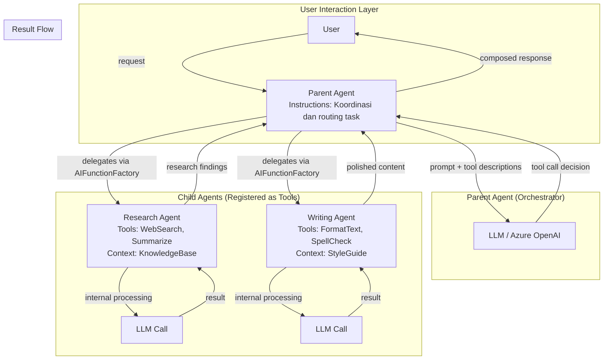
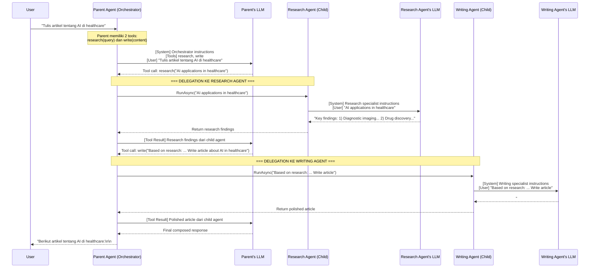

# Agents as Tools - Teori Komprehensif

> **Prerequisite Refresher (Module 6: Context Providers)**
>
> Pada module sebelumnya, Anda mempelajari *context providers* - mekanisme untuk menyuntikkan memory dan informasi kontekstual ke dalam agent sebelum dan sesudah setiap invokasi. Anda memahami bagaimana `AIContextProvider` menyediakan *conversation history* (short-term memory) dan data eksternal (long-term memory) melalui `ProvideAIContextAsync()` dan `StoreAIContextAsync()`. Anda juga mempelajari strategi pengelolaan context window: *sliding window*, *summarization*, dan *RAG*. Module ini membangun di atas pemahaman tersebut - sebuah agent yang sudah memiliki tools, skills, middleware, dan context providers kini bisa digunakan sebagai *tool* oleh agent lain, membentuk arsitektur *composed agents* yang modular dan powerful.

---

## Penjelasan Konsep

### Agent Composition dan Delegation

Dalam pengembangan AI agent yang kompleks, seringkali satu agent tidak cukup untuk menangani semua tugas secara efektif. Bayangkan sebuah skenario dimana agent harus melakukan riset mendalam, menulis konten berkualitas tinggi, dan sekaligus memvalidasi akurasi fakta - tiga kemampuan yang membutuhkan *expertise* berbeda. Di sinilah konsep *agent composition* menjadi relevan: kemampuan untuk menyusun beberapa agent spesialis menjadi satu sistem yang terkoordinasi. *Delegation* adalah mekanisme inti dari composition - satu agent (disebut *parent agent* atau *orchestrator*) mendelegasikan sub-tugas ke agent lain (disebut *child agent*) berdasarkan konteks dan kebutuhan saat itu. Child agent memproses tugas secara independen dan mengembalikan hasilnya ke parent agent untuk diintegrasikan menjadi respons akhir.

### Bagaimana Agent Dapat Bertindak sebagai Tool

Pada Module 3 (Adding Tools), Anda mempelajari bahwa *tool* adalah fungsi yang bisa dipanggil oleh agent melalui mekanisme *function calling* - agent mengirim deskripsi tools ke LLM, LLM memutuskan tool mana yang diperlukan, dan agent mengeksekusi tool tersebut. Konsep *agent-as-tool* adalah perluasan natural dari mekanisme ini: alih-alih mendaftarkan *fungsi sederhana* sebagai tool, kita mendaftarkan *seluruh agent* sebagai tool. Dari perspektif parent agent, child agent tidak berbeda dengan tool biasa - ia memiliki nama, deskripsi, parameter input, dan mengembalikan output. Namun di balik layar, "tool" ini bukan sekadar fungsi - ia adalah agent lengkap dengan instructions, reasoning capability, bahkan tools-nya sendiri. Dalam Microsoft Agent Framework, ini dicapai melalui `AIFunctionFactory.Create()` yang membungkus invokasi agent menjadi sebuah *AI function* yang bisa didaftarkan sebagai tool.

### Monolithic Agent vs Composed Agent Architecture

Arsitektur *monolithic agent* berarti satu agent menangani semua tugas: memiliki semua tools, memproses semua jenis request, dan bertanggung jawab atas seluruh pipeline dari input hingga output. Pendekatan ini sederhana untuk kasus penggunaan yang kecil, namun memiliki keterbatasan seiring kompleksitas bertambah - agent dengan terlalu banyak tools cenderung *confused* (memilih tool yang salah), instructions menjadi sangat panjang dan kompleks, serta sulit untuk di-debug ketika terjadi masalah. Sebaliknya, *composed agent architecture* memecah tanggung jawab menjadi beberapa agent spesialis yang masing-masing fokus pada satu domain. Parent agent bertindak sebagai *orchestrator* yang memahami gambaran besar dan mendelegasikan tugas spesifik ke child agent yang paling sesuai. Pendekatan ini mengikuti prinsip *single responsibility* - setiap agent melakukan satu hal dengan baik - dan menghasilkan sistem yang lebih mudah di-maintain, di-test, dan di-scale secara independen.

---

## Arsitektur dan Mekanisme Internal

Arsitektur *agent-as-tool* pada Microsoft Agent Framework dibangun di atas mekanisme *function calling* yang sudah ada, namun dengan lapisan abstraksi tambahan yang memungkinkan seluruh agent dibungkus sebagai sebuah callable function. Ini menciptakan pola *parent-child* yang elegant - parent agent melihat child agent sebagai tool biasa, sementara child agent beroperasi sebagai agent penuh dengan capabilities-nya sendiri.

### Parent-Child Relationship

Dalam arsitektur ini, hubungan antar agent bersifat hierarkis:

- **Parent Agent (Orchestrator)** - Agent utama yang berinteraksi langsung dengan user. Ia memiliki *high-level instructions* untuk memahami intent user dan memutuskan child agent mana yang harus menangani sub-tugas tertentu. Parent agent tidak perlu memiliki expertise mendalam di setiap domain - tanggung jawabnya adalah *routing* dan *coordination*.

- **Child Agent (Specialist)** - Agent yang didaftarkan sebagai tool pada parent agent. Setiap child agent memiliki instructions spesifik yang membatasi domain expertise-nya. Child agent tidak mengetahui keberadaan parent agent atau child agent lain - ia hanya menerima input, memproses, dan mengembalikan output.

### Delegation Mechanism

Proses delegasi mengikuti alur yang sama dengan tool invocation biasa:

1. User mengirim request ke parent agent
2. Parent agent mengirim prompt + tool descriptions (termasuk child agents) ke LLM
3. LLM memutuskan child agent mana yang perlu dipanggil berdasarkan deskripsi dan konteks
4. Parent agent menjalankan child agent dengan input yang ditentukan LLM
5. Child agent memproses request secara independen (termasuk menggunakan tools-nya sendiri)
6. Hasil dari child agent dikembalikan ke parent agent
7. Parent agent meneruskan hasil ke LLM untuk di-compose menjadi respons akhir

### Input/Output Contract

Kontrak antara parent dan child agent didefinisikan melalui parameter `AIFunctionFactory.Create()`:

```csharp
// Child agent dibungkus sebagai AI Function (tool)
var researchTool = AIFunctionFactory.Create(
    async (string query) => await researchAgent.RunAsync(query),
    name: "research",
    description: "Perform deep research on a topic and return findings");

var writingTool = AIFunctionFactory.Create(
    async (string content) => await writingAgent.RunAsync(content),
    name: "write",
    description: "Write polished content based on provided material");
```

- **Input**: Parameter yang diterima function (string, objek, dll.) - ini adalah "instruksi" dari parent ke child
- **Output**: Return value dari function - ini adalah "laporan" dari child ke parent
- **Description**: Deskripsi yang dibaca LLM untuk memutuskan kapan child agent dipanggil

### Result Propagation

Hasil dari child agent mengalir kembali ke parent agent melalui mekanisme yang sama dengan tool result biasa:

1. Child agent mengembalikan string/objek sebagai output
2. Framework meneruskan output ini ke parent agent sebagai *tool result*
3. Parent agent mengirim tool result ke LLM bersama konteks percakapan
4. LLM di parent agent mengintegrasikan hasil ke dalam respons akhir untuk user

Ini berarti parent agent bisa memanggil *multiple* child agents secara berurutan, mengumpulkan hasil dari masing-masing, dan meminta LLM menyusun respons koheren yang menggabungkan semua hasil.

### Architecture Diagram: Agent-as-Tool System



### Interaction Diagram: Parent-Child Agent Communication



---

## Kapan dan Mengapa Menggunakan

### Use Cases Konkret

| # | Use Case | Penjelasan |
|---|----------|------------|
| 1 | **Multi-Domain Task Orchestration** - User meminta tugas yang membutuhkan keahlian di beberapa domain berbeda secara bersamaan | Contoh: "Riset tren pasar crypto dan tulis laporan investor." Parent agent mendelegasikan riset ke Research Agent (yang memiliki tools untuk web search dan data analysis) dan penulisan ke Writing Agent (yang memiliki tools untuk formatting dan grammar check). Masing-masing agent memiliki instructions yang sangat fokus pada domain-nya. |
| 2 | **Quality Assurance Pipeline** - Output dari satu agent perlu divalidasi atau disempurnakan oleh agent lain sebelum diberikan ke user | Contoh: Draft Agent menghasilkan konten, kemudian parent mendelegasikan ke Review Agent untuk fact-checking dan grammar validation. Parent menggabungkan feedback dan memutuskan apakah perlu revisi (delegasi ulang ke Draft Agent) atau langsung kirim ke user. |
| 3 | **Specialized Language/Format Processing** - Tugas yang membutuhkan pemrosesan dalam format atau bahasa berbeda | Contoh: Translation Agent menerjemahkan input user, Code Agent menghasilkan kode, dan Documentation Agent menghasilkan docs. Parent agent sebagai router memilih agent berdasarkan jenis output yang diminta user. |
| 4 | **Escalation dan Fallback** - Ketika satu agent gagal menangani tugas, parent agent mendelegasikan ke agent alternatif | Contoh: Primary Research Agent gagal karena timeout, parent agent otomatis mendelegasikan ke Fallback Research Agent yang menggunakan sumber data berbeda. Ini meningkatkan reliability sistem secara keseluruhan. |
| 5 | **Parallel Expertise Gathering** - Mengumpulkan perspektif dari beberapa specialist agents untuk menghasilkan jawaban komprehensif | Contoh: Medical Query Agent, Legal Query Agent, dan Financial Query Agent masing-masing memberikan perspektif atas pertanyaan user tentang "asuransi kesehatan". Parent menggabungkan ketiga perspektif menjadi jawaban holistik. |

### Trade-offs dan Limitasi

| Aspek | Keuntungan Composed Agents | Trade-off |
|-------|---------------------------|-----------|
| **Complexity** | Setiap agent lebih sederhana dan fokus - instructions pendek, tools sedikit, mudah di-debug secara individual | Arsitektur keseluruhan lebih kompleks - perlu mendesain kontrak antar agents, mengelola error propagation, dan memahami alur multi-step delegation |
| **Latency** | Child agent bisa dioptimasi independen; parallelization dimungkinkan di masa depan | Setiap delegation menambah minimal satu LLM call tambahan - request yang sebelumnya 1 LLM call bisa menjadi 3-5 calls, meningkatkan total response time secara signifikan |
| **Cost** | Masing-masing child agent bisa menggunakan model yang berbeda (model murah untuk tugas sederhana, model mahal untuk tugas kompleks) | Lebih banyak LLM calls berarti lebih banyak token yang dikonsumsi secara total - meskipun per-call lebih efisien, aggregate cost bisa lebih tinggi |
| **Maintainability** | Agent bisa di-update, di-test, dan di-deploy secara independen - mengubah Research Agent tidak mempengaruhi Writing Agent | Perlu menjaga kompatibilitas I/O contract antar agents - perubahan output format dari child agent bisa merusak parent agent jika tidak dikoordinasi |
| **Reliability** | Kegagalan satu child agent tidak crash seluruh sistem - parent bisa fallback ke agent lain atau memberikan partial response | Debugging end-to-end menjadi lebih sulit - masalah bisa terjadi di parent agent, di child agent, di kontrak antar keduanya, atau di LLM interpretation |

### Perbandingan: Single Agent (Many Tools) vs Composed Agents

| Kriteria | Single Agent + Many Tools | Composed Agents (Agent-as-Tool) |
|----------|--------------------------|--------------------------------|
| **Setup complexity** | Rendah - satu agent, semua tools didaftarkan langsung | Tinggi - perlu mendesain parent dan multiple child agents, kontrak I/O, error handling |
| **Tool confusion** | Tinggi jika tools > 10 - LLM kesulitan memilih tool yang tepat dari daftar panjang | Rendah - setiap child agent hanya punya tools yang relevan dengan domain-nya (2-4 tools per agent) |
| **Instructions clarity** | Semakin banyak tanggung jawab, instructions semakin panjang dan bisa ambigu | Setiap agent punya instructions singkat dan fokus - lebih mudah ditulis dan di-maintain |
| **Latency** | Rendah - biasanya 1-2 LLM calls per request | Lebih tinggi - setiap delegation = 1 LLM call tambahan (parent + child) |
| **Cost per request** | Lebih rendah secara absolut - lebih sedikit LLM calls | Lebih tinggi - multiple LLM calls, masing-masing mengkonsumsi token |
| **Testability** | Sulit - harus test semua skenario dalam satu agent | Mudah - setiap child agent bisa di-unit-test secara independen |
| **Scalability** | Terbatas - menambah tools baru meningkatkan confusion risk | Baik - menambah child agent baru tidak mempengaruhi existing agents |
| **Best for** | Tugas sederhana, tools < 5, domain tunggal | Tugas kompleks, multi-domain, tim besar yang bekerja paralel pada agents berbeda |

---

## Terminologi Kunci

| Istilah | Penjelasan | Contoh Penggunaan |
|---------|------------|-------------------|
| *Parent Agent* (Orchestrator) | Agent utama yang berinteraksi langsung dengan user dan mendelegasikan sub-tugas ke child agents. Bertanggung jawab atas routing, koordinasi, dan penyusunan respons akhir. | Parent agent menerima "tulis laporan riset" dan mendelegasikan riset ke Research Agent, penulisan ke Writing Agent |
| *Child Agent* (Specialist) | Agent yang didaftarkan sebagai tool pada parent agent. Memiliki expertise spesifik di satu domain dan tidak menyadari keberadaan parent atau child agent lain. | Research Agent hanya fokus mencari dan menyusun informasi - tidak tahu ada Writing Agent di sistem yang sama |
| *Delegation* | Mekanisme dimana parent agent menyerahkan sub-tugas ke child agent melalui tool invocation. Parent menentukan input, child memproses, dan mengembalikan output ke parent. | Parent agent memanggil `research("AI trends 2024")` yang secara internal menjalankan Research Agent |
| *Agent Composition* | Pola arsitektural dimana beberapa agent disusun menjadi satu sistem terkoordinasi, dengan setiap agent memiliki peran spesifik. Mengikuti prinsip *composition over inheritance*. | Sistem content creation terdiri dari Research Agent + Writing Agent + Review Agent yang diorchestrasi oleh parent |
| *Specialization Pattern* | Design pattern dimana setiap child agent memiliki expertise yang sangat spesifik dan terfokus - satu agent untuk satu kemampuan. Analognya adalah tim spesialis di rumah sakit. | `ResearchAgent` hanya riset, `WritingAgent` hanya menulis, `TranslationAgent` hanya menerjemahkan |
| *Routing Pattern* | Design pattern dimana parent agent bertindak sebagai *dispatcher/router* - menganalisis request user dan mengarahkan ke child agent yang paling sesuai tanpa memproses task sendiri. | User bertanya tentang code → route ke CodeAgent; user bertanya tentang design → route ke DesignAgent |
| *Hierarchical Pattern* | Design pattern dengan multi-level delegation - parent mendelegasikan ke child, yang bisa mendelegasikan lagi ke grandchild agent. Menciptakan tree structure dari responsibilities. | CEO Agent → Manager Agent → Worker Agent: setiap level memecah task menjadi sub-task yang lebih kecil |
| `AIFunctionFactory.Create()` | API dari Microsoft Agent Framework yang membungkus sebuah fungsi (termasuk agent invocation) menjadi *AI function* yang bisa didaftarkan sebagai tool. Ini adalah mekanisme teknis untuk menjadikan agent sebagai tool. | `AIFunctionFactory.Create(async (string q) => await agent.RunAsync(q), "research", "Riset topik")` |
| *I/O Contract* | Kontrak yang mendefinisikan format input yang diterima dan output yang dikembalikan oleh child agent. Didefinisikan melalui parameter dan return type pada `AIFunctionFactory.Create()`. | Input: `string query` (topik riset), Output: `string` (hasil riset) - parent dan child sepakat tentang format ini |
| *Result Propagation* | Proses dimana output dari child agent mengalir kembali ke parent agent sebagai tool result, lalu diinterpretasi oleh LLM parent untuk disusun menjadi respons akhir ke user. | Research Agent mengembalikan "3 key findings: ..." → parent LLM menggunakan findings ini untuk menyusun artikel |
| *Tool Confusion* | Kondisi dimana LLM kesulitan memilih tool yang tepat karena terlalu banyak tools terdaftar dengan deskripsi yang mirip atau overlapping. Composed agents mengurangi risiko ini. | Agent dengan 15 tools - LLM memilih `search_web` padahal seharusnya `search_database` karena deskripsinya mirip |
| *Fallback Strategy* | Mekanisme dimana parent agent mendelegasikan ke child agent alternatif ketika child agent utama gagal (error, timeout, atau respons tidak memadai). | Research Agent timeout → parent otomatis mencoba Backup Research Agent yang menggunakan sumber data berbeda |

---

## Hubungan dengan Topik Sebelumnya

Module ini membangun di atas **Module 6 (Context Providers)** dan secara fundamental di atas seluruh module sebelumnya dalam learning path, dengan cara berikut:

- **Dari tools ke agent-as-tool** - Di Module 3 (Adding Tools), Anda mempelajari bahwa agent bisa memanggil fungsi eksternal melalui mekanisme *function calling*. Di Module 4 (Adding Skills), Anda melihat tools dikelompokkan menjadi unit reusable. Kini konsep tersebut diambil ke level berikutnya: alih-alih mendaftarkan *fungsi sederhana* sebagai tool, kita mendaftarkan *seluruh agent* - lengkap dengan instructions, reasoning, dan tools-nya sendiri - sebagai tool. Evolusi ini natural: jika tool adalah "tangan" agent, maka agent-as-tool adalah "kolega ahli" yang bisa dimintai bantuan. Transisi dari `AIFunctionFactory.Create(() => GetWeather("Jakarta"))` ke `AIFunctionFactory.Create(async (query) => await researchAgent.RunAsync(query))` secara sintaks nyaris identik - yang berbeda adalah kapabilitas di balik function tersebut.

- **Context providers memungkinkan child agents yang intelligent** - Module 6 mengajarkan cara menyuntikkan memory dan context ke agent. Tanpa context providers, child agent akan *stateless* - memproses setiap request tanpa pengetahuan kontekstual. Dengan context providers, child agent bisa memiliki "memory" sendiri: Research Agent bisa mengingat riset sebelumnya, Writing Agent bisa mempertahankan gaya penulisan konsisten sepanjang sesi. Parent agent tidak perlu menyertakan seluruh konteks dalam setiap delegasi - child agent mengelola context-nya sendiri.

- **Middleware masih berperan** - Middleware dari Module 5 tetap aktif pada setiap agent secara independen. Parent agent bisa memiliki logging middleware yang mencatat semua delegasi, sementara child agent bisa memiliki guardrail middleware yang memvalidasi input sebelum diproses. Ini menciptakan arsitektur *defense in depth* - validasi terjadi di multiple level.

- **Skills mempengaruhi desain child agents** - Konsep *skill* dari Module 4 secara langsung mempengaruhi bagaimana child agents didesain. Sebuah skill (kumpulan tools terkait) sering menjadi basis bagi satu child agent. Contoh: `ResearchSkill` (berisi `WebSearch`, `Summarize`, `FactCheck`) menjadi foundation bagi `ResearchAgent`. Evolusi dari tools → skills → agent-as-tool menunjukkan progresivitas abstraksi: fungsi individual → kumpulan fungsi → entitas autonomous.

- **Building blocks yang digunakan**: `AIAgent` (baik sebagai parent maupun child), `AIFunctionFactory.Create()` (mekanisme pembungkusan agent menjadi tool), *instructions* (setiap agent tetap membutuhkan instructions yang membentuk persona dan batasan perilaku), *tools/skills* (child agent masih menggunakan tools internal), *context providers* (child agent bisa memiliki context providers sendiri untuk memory), *middleware* (setiap agent dalam hierarki bisa memiliki middleware pipeline sendiri), dan `AgentSession` (parent dan child bisa berbagi atau memiliki session terpisah).

---

## Analogi dan Contoh Dunia Nyata

### Analogi 1: Manajer Proyek dan Tim Spesialis

Bayangkan seorang manajer proyek (parent agent) di sebuah perusahaan konsultan yang menerima permintaan klien: "Buatkan proposal lengkap untuk implementasi sistem ERP." Manajer proyek ini bukan ahli di semua bidang - namun ia tahu *siapa* yang ahli di bidang apa dan bagaimana *mengoordinasi* pekerjaan mereka.

- **Manajer proyek menerima permintaan** - Sama seperti parent agent menerima request dari user. Manajer menganalisis scope permintaan dan memecahnya menjadi sub-tugas.

- **Mendelegasikan ke spesialis** - Manajer menugaskan riset pasar ke Tim Analis (Research Agent), penulisan teknis ke Tim Technical Writer (Writing Agent), dan estimasi biaya ke Tim Finance (Finance Agent). Setiap tim bekerja secara independen dengan keahliannya masing-masing.

- **Tim bekerja independen** - Setiap tim tidak perlu tahu detail pekerjaan tim lain. Tim Analis hanya perlu tahu "riset implementasi ERP di industri manufacturing" - mereka memiliki tools dan metodologi riset mereka sendiri. Ini seperti child agent yang memiliki tools dan instructions-nya sendiri.

- **Manajer menyusun hasil akhir** - Setelah semua tim mengembalikan output, manajer menggabungkan hasil riset, dokumen teknis, dan estimasi biaya menjadi satu proposal koheren. Ini seperti parent agent yang menerima tool results dan meminta LLM menyusun respons akhir.

- **Fallback ketika tim gagal** - Jika Tim Analis tidak berhasil menemukan data pasar (timeout/error), manajer bisa mendelegasikan ke Tim Riset Alternatif yang menggunakan sumber data berbeda. Ini seperti fallback strategy pada parent agent.

**Pemetaan ke komponen teknis:**

| Analogi | Komponen Teknis |
|---------|-----------------|
| Manajer proyek | *Parent Agent* (Orchestrator) |
| Tim Analis, Tim Writer, Tim Finance | *Child Agents* (Specialists) |
| Menugaskan sub-tugas ke tim | *Delegation* via `AIFunctionFactory.Create()` |
| Scope yang diberikan ke setiap tim | *Input* parameter pada tool function |
| Laporan yang dikembalikan setiap tim | *Output* (result propagation) |
| Setiap tim punya metodologi sendiri | Child agent punya *tools* dan *instructions* sendiri |
| Manajer menyusun proposal akhir | Parent LLM meng-compose respons final |
| Delegasi ke tim alternatif saat gagal | *Fallback strategy* |
| Job description setiap tim | *Description* pada `AIFunctionFactory.Create()` |

### Analogi 2: Dokter Umum dan Dokter Spesialis di Rumah Sakit

Bayangkan sebuah rumah sakit dimana pasien (user) pertama kali bertemu dengan dokter umum (parent agent). Dokter umum ini memiliki pengetahuan luas namun tidak mendalam di setiap bidang - perannya adalah mendiagnosis masalah secara umum dan *merujuk* pasien ke spesialis yang tepat.

- **Dokter umum sebagai router** - Pasien datang dengan keluhan "saya sering pusing dan penglihatan kabur." Dokter umum tidak langsung memberikan treatment - ia menganalisis gejala dan memutuskan spesialis mana yang perlu dikonsultasi. Ini seperti parent agent yang menganalisis user request dan memutuskan child agent mana yang diperlukan.

- **Merujuk ke dokter spesialis** - Dokter umum merujuk ke dokter saraf (Neuro Agent) untuk evaluasi pusing dan ke dokter mata (Ophthalmology Agent) untuk pemeriksaan penglihatan. Setiap spesialis memiliki peralatan dan keahlian tersendiri. Ini seperti parent agent yang memanggil child agents dengan input spesifik.

- **Spesialis bekerja dalam domain-nya** - Dokter saraf melakukan serangkaian tes (tools miliknya) tanpa perlu tahu apa yang dilakukan dokter mata. Setiap spesialis punya prosedur dan instrumen sendiri. Ini seperti child agent yang memiliki tools internal dan instructions spesifik domain.

- **Hasil kembali ke dokter umum** - Setiap spesialis mengirim laporan ke dokter umum. Dokter umum membaca semua laporan (tool results), mengintegrasikan temuan, dan memberikan diagnosis serta rekomendasi final ke pasien. Ini seperti result propagation - parent menerima semua hasil dan menyusun respons akhir.

- **Prinsip minimal knowledge** - Pasien tidak perlu tahu mekanisme internal rujukan - ia hanya berinteraksi dengan dokter umum. Demikian pula spesialis tidak perlu tahu bahwa hasilnya akan digabungkan dengan laporan spesialis lain. Ini mencerminkan *encapsulation* dalam agent composition.

**Pemetaan ke komponen teknis:**

| Analogi | Komponen Teknis |
|---------|-----------------|
| Dokter umum | *Parent Agent* - routing pattern |
| Dokter spesialis (saraf, mata, dll.) | *Child Agents* - specialization pattern |
| Rujukan ke spesialis | *Delegation* - tool call ke child agent |
| Keluhan awal pasien | *User request* yang diterima parent agent |
| Peralatan medis spesialis | *Tools* yang dimiliki child agent |
| Prosedur pemeriksaan | *Instructions* spesifik child agent |
| Laporan spesialis | *Tool result* dari child agent ke parent |
| Diagnosis final dokter umum | *Composed response* dari parent ke user |
| Pasien hanya bicara ke dokter umum | User hanya berinteraksi dengan parent agent |
| Spesialis lain sebagai alternatif | *Fallback strategy* jika spesialis utama gagal |

---

## Bacaan Lanjutan

1. **[Microsoft Agent Framework - Multi-Agent Architecture](https://learn.microsoft.com/en-us/microsoft/agents/concepts/multi-agent)** - Dokumentasi resmi tentang pola arsitektur multi-agent pada Microsoft Agent Framework, mencakup cara mengimplementasikan agent composition, delegation patterns, dan best practices untuk membangun sistem composed agents yang scalable dan maintainable.

2. **[Building AI Agents with Tools and Functions](https://learn.microsoft.com/en-us/azure/ai-services/openai/how-to/function-calling)** - Panduan praktis tentang function calling di Azure OpenAI, menjelaskan mekanisme yang mendasari agent-as-tool pattern - bagaimana LLM memutuskan kapan memanggil tool, format tool description yang efektif, dan handling tool results. Fondasi teknis yang sama digunakan untuk mendaftarkan agent sebagai tool.

3. **[Agent Design Patterns - Orchestrator and Specialist Agents](https://learn.microsoft.com/en-us/microsoft/agents/concepts/agent-patterns)** - Referensi tentang design patterns dalam multi-agent systems, mencakup orchestrator pattern, specialist pattern, hierarchical delegation, dan panduan kapan menggunakan masing-masing pattern berdasarkan kompleksitas use case.
