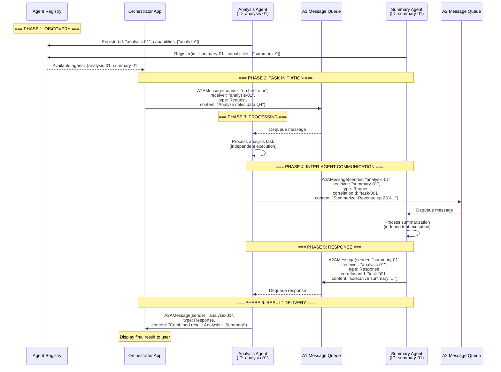

# Agent-to-Agent Communication - Teori Komprehensif

> **Prerequisite Refresher (Module 7: Agents as Tools)**
>
> Pada module sebelumnya, Anda mempelajari *agent composition* - teknik untuk menggunakan satu agent sebagai tool bagi agent lain melalui `AIFunctionFactory.Create()`. Anda memahami hubungan *parent-child agent*, dimana parent agent (orchestrator) mendelegasikan sub-tugas ke child agents (specialists) secara *in-process*. Anda juga mempelajari *delegation mechanism*, *I/O contract*, dan *result propagation* - bagaimana input mengalir dari parent ke child dan output dikembalikan untuk di-compose menjadi respons akhir. Module ini mengambil langkah lebih jauh: dari komposisi agent dalam satu proses (*in-process*, tight coupling) ke komunikasi antar agent yang berdiri sendiri (*inter-process*, loose coupling) menggunakan *Agent-to-Agent (A2A) protocol*.

---

## Penjelasan Konsep

### Apa Itu Agent-to-Agent (A2A) Protocol

*Agent-to-Agent (A2A) protocol* adalah protokol komunikasi yang memungkinkan agent-agent yang berdiri secara independen untuk saling bertukar pesan, berkolaborasi menyelesaikan tugas, dan berkoordinasi tanpa harus berjalan dalam satu proses atau satu codebase yang sama. Berbeda dengan *agent-as-tool* pada Module 7 dimana child agent secara langsung dipanggil sebagai fungsi dalam proses yang sama, A2A protocol memfasilitasi komunikasi antar agent yang mungkin berjalan di mesin berbeda, dikembangkan oleh tim berbeda, atau bahkan menggunakan framework berbeda. Protokol ini mendefinisikan format pesan standar, mekanisme penemuan agent (*discovery*), dan pola komunikasi yang memungkinkan interoperabilitas tanpa tight coupling.

### Mengapa Komunikasi Inter-Agent Diperlukan

Ketika sistem AI agent tumbuh melampaui batasan satu tim atau satu deployment, kebutuhan akan komunikasi *distributed* menjadi tak terhindarkan. Bayangkan sebuah perusahaan besar dimana tim Customer Service memiliki agent untuk menangani keluhan, tim Engineering memiliki agent untuk troubleshooting teknis, dan tim Billing memiliki agent untuk pertanyaan pembayaran - ketiga agent ini dikembangkan secara independen namun harus berkolaborasi ketika customer memiliki masalah yang melintasi domain. Dalam skenario seperti ini, *in-process composition* (Module 7) tidak memungkinkan karena setiap agent berjalan dalam infrastruktur terpisah dengan lifecycle deployment yang berbeda. A2A protocol hadir untuk menjembatani gap ini - memberikan kontrak komunikasi yang jelas sehingga agent-agent independen dapat bertukar informasi, mendelegasikan tugas, dan menggabungkan hasil tanpa memerlukan pengetahuan tentang implementasi internal satu sama lain.

### Perbedaan In-Process Composition dan Distributed A2A Communication

Pada Module 7, komposisi agent terjadi secara *in-process*: parent dan child agent hidup dalam satu aplikasi, berbagi memory space yang sama, dan komunikasi terjadi melalui *function call* langsung - cepat, synchronous, dan tanpa overhead jaringan. Ini ideal untuk skenario dimana semua agent dikembangkan oleh tim yang sama dan di-deploy bersama. Namun pendekatan ini memiliki batasan fundamental: semua agent harus menggunakan framework yang sama, di-deploy sebagai satu unit, dan tidak bisa di-scale secara independen. *Distributed A2A communication* menghilangkan batasan ini - setiap agent adalah *autonomous unit* dengan identity unik, bisa berjalan di proses terpisah (bahkan di mesin atau cloud region berbeda), dan berkomunikasi melalui *message passing* yang asynchronous. Trade-off-nya jelas: A2A memberikan fleksibilitas, scalability, dan independence yang jauh lebih besar, namun dengan tambahan kompleksitas berupa network latency, kebutuhan serialisasi pesan, penanganan kegagalan komunikasi, dan eventual consistency.

---

## Arsitektur dan Mekanisme Internal

Arsitektur A2A protocol dibangun di atas prinsip-prinsip *distributed systems* yang telah terbukti - *message passing*, *identity management*, dan *discovery mechanism* - diadaptasi untuk kebutuhan spesifik sistem multi-agent. Tidak seperti agent-as-tool yang menggunakan *direct function invocation*, A2A menggunakan *message-based communication* dimana setiap interaksi dikemas dalam format pesan yang terstandarisasi.

### Message Format

Setiap pesan dalam A2A protocol memiliki struktur yang jelas dan self-describing:

```csharp
public record A2AMessage(
    string MessageId,       // Unique identifier untuk tracking
    string SenderId,        // Identity agent pengirim
    string ReceiverId,      // Identity agent penerima
    DateTime Timestamp,     // Waktu pengiriman
    MessageType Type,       // Request, Response, atau Error
    string Content,         // Payload pesan (maks 500 karakter display)
    string? CorrelationId   // Untuk menghubungkan request-response pair
);
```

`MessageId` memastikan setiap pesan dapat di-track secara unik. `CorrelationId` menghubungkan response dengan request asalnya - penting untuk komunikasi asynchronous dimana multiple request bisa berjalan bersamaan. `Timestamp` memberikan ordering temporal yang diperlukan untuk logging dan debugging.

### Agent Discovery

Sebelum agent dapat berkomunikasi, mereka harus saling "menemukan" satu sama lain. *Agent discovery* adalah mekanisme dimana agent mengumumkan keberadaannya dan kemampuannya ke dalam registry, sehingga agent lain dapat menemukan partner kolaborasi yang tepat berdasarkan kapabilitas yang dibutuhkan. Dalam implementasi sederhana, registry bisa berupa *in-memory dictionary* yang memetakan agent ID ke endpoint atau message queue-nya. Dalam implementasi production, ini bisa menggunakan service registry seperti DNS, Consul, atau Azure Service Bus.

### Message Routing

*Message routing* menentukan bagaimana pesan dari agent pengirim sampai ke agent penerima yang dituju. Dalam arsitektur A2A, routing dapat dilakukan secara:

- **Direct routing** - Pengirim mengetahui alamat penerima dan mengirim langsung. Sederhana namun memerlukan pengetahuan tentang lokasi penerima.
- **Broker-based routing** - Pesan dikirim ke broker/mediator yang bertanggung jawab meneruskan ke penerima yang tepat. Memberikan decoupling namun menambah latency.
- **Topic-based routing** - Pesan dipublikasikan ke topic/channel, dan agent yang berlangganan pada topic tersebut akan menerima pesan. Ideal untuk *broadcast* dan *pub-sub* patterns.

### Identity Management

Setiap agent dalam sistem A2A memiliki *identity* unik yang berfungsi sebagai "alamat" komunikasi. Identity ini mencakup:

- **Agent ID** - Identifier unik (misalnya UUID atau nama yang meaningful seperti `"analysis-agent-01"`)
- **Capabilities** - Daftar kemampuan yang agent miliki, digunakan untuk discovery
- **Status** - Apakah agent aktif, sibuk, atau tidak tersedia
- **Message Queue** - Antrian pesan yang menunggu diproses oleh agent

### Communication Patterns

A2A protocol mendukung beberapa pola komunikasi yang berbeda, masing-masing sesuai untuk skenario yang berbeda:

**1. Request-Response Pattern**

Pola paling umum dimana satu agent mengirim request dan menunggu response dari agent penerima. Cocok untuk delegasi tugas dimana pengirim membutuhkan hasil sebelum melanjutkan. Ini adalah versi *distributed* dari agent-as-tool call di Module 7.

**2. Publish-Subscribe (Pub-Sub) Pattern**

Agent mempublikasikan pesan ke topic/channel tanpa mengetahui siapa yang akan menerima. Agent lain yang berlangganan pada topic tersebut akan menerima pesan. Cocok untuk notifikasi, event broadcasting, dan skenario dimana satu event harus ditangani oleh multiple agents.

**3. Broadcast Pattern**

Pengirim mengirim pesan ke semua agent yang terdaftar dalam sistem. Cocok untuk pengumuman sistem, health checks, atau skenario dimana semua agent perlu mengetahui perubahan state.

### Sequence Diagram: A2A Communication Flow



### Perbandingan In-Process vs Inter-Process Communication

| Aspek | In-Process (Module 7) | Inter-Process / A2A (Module 8) |
|-------|----------------------|-------------------------------|
| **Mekanisme** | Direct function call via `AIFunctionFactory` | Message passing via A2A protocol |
| **Coupling** | Tight - agents share memory space | Loose - agents hanya terhubung via pesan |
| **Latency** | Sangat rendah (microseconds) | Lebih tinggi (milliseconds - seconds) |
| **Failure mode** | Crash satu agent = crash seluruh app | Agent lain tetap berjalan meski satu gagal |
| **Scalability** | Terbatas oleh satu proses | Setiap agent bisa di-scale independen |
| **Deployment** | Satu unit deployment | Deploy independen per agent |
| **Discovery** | Implicit - parent tahu child saat compile time | Explicit - perlu registry/discovery mechanism |
| **Framework** | Harus framework yang sama | Bisa framework berbeda (interoperable) |
| **State sharing** | Mudah - shared memory/session | Sulit - harus melalui pesan eksplisit |
| **Debugging** | Mudah - single process debugger | Lebih sulit - distributed tracing diperlukan |

---

## Kapan dan Mengapa Menggunakan

### Use Cases Konkret

| # | Use Case | Penjelasan |
|---|----------|------------|
| 1 | **Cross-Team Agent Collaboration** - Agent yang dikembangkan oleh tim berbeda dalam satu organisasi perlu berkolaborasi | Contoh: Tim Customer Support memiliki agent yang menangani keluhan, Tim Engineering memiliki agent untuk diagnosa teknis. Ketika customer melaporkan bug, CS Agent mengirim pesan A2A ke Engineering Agent untuk analisis teknis, menerima diagnosa, dan menyampaikan solusi ke customer - tanpa kedua tim perlu berbagi codebase. |
| 2 | **Microservices-Style Agent Architecture** - Setiap agent di-deploy sebagai service independen yang bisa di-scale, di-update, dan di-monitor secara terpisah | Contoh: E-commerce platform dengan Recommendation Agent, Inventory Agent, dan Pricing Agent. Masing-masing di-deploy terpisah sehingga Pricing Agent bisa di-update tanpa mempengaruhi Recommendation Agent. Ketika user bertanya "produk terbaik di bawah 500rb", Recommendation Agent berkomunikasi via A2A ke Pricing Agent dan Inventory Agent untuk mendapatkan harga terkini dan stok tersedia. |
| 3 | **Multi-Tenant Agent Systems** - Agent yang melayani tenant/customer berbeda perlu berkolaborasi tanpa mengekspos data antar tenant | Contoh: SaaS platform dimana setiap tenant memiliki agent khusus yang terpisah secara infrastruktur. Shared Analytics Agent dapat menerima request dari tenant agents mana pun via A2A, memproses data secara aman, dan mengembalikan hasil yang ter-scoped ke tenant tersebut - tanpa data leakage antar tenant. |
| 4 | **Gradual Migration dan Hybrid Systems** - Migrasi bertahap dari agent legacy ke agent baru tanpa downtime | Contoh: Organisasi yang memigrasikan agent dari Semantic Kernel ke Microsoft Agent Framework secara bertahap. Agent lama dan baru berkomunikasi via A2A protocol selama periode transisi - memungkinkan migrasi satu agent pada satu waktu tanpa harus rewrite seluruh sistem sekaligus. |
| 5 | **Geographic Distribution** - Agent yang perlu berjalan di region berbeda untuk compliance atau latency | Contoh: Agent pemrosesan data personal yang harus berjalan di region EU (GDPR compliance) berkomunikasi via A2A dengan Agent analitik yang berjalan di US. Data sensitif tetap di EU, hanya hasil analisis aggregat yang dikirim via A2A message - memenuhi requirement data residency. |

### Trade-offs dan Limitasi

| Aspek | Keuntungan A2A | Trade-off |
|-------|---------------|-----------|
| **Independence** | Setiap agent bisa dikembangkan, di-deploy, dan di-scale secara terpisah - tim yang berbeda bisa bekerja pada agent yang berbeda tanpa koordinasi ketat | Memerlukan definisi kontrak pesan (*message schema*) yang harus dijaga kompatibilitasnya - perubahan format pesan bisa memecah komunikasi antar agent jika tidak dikelola dengan baik (versioning diperlukan) |
| **Fault Isolation** | Kegagalan satu agent tidak meng-crash agent lain - sistem secara keseluruhan lebih resilient karena setiap agent berjalan dalam proses terpisah | Memerlukan mekanisme tambahan untuk menangani kegagalan komunikasi: retry logic, timeout handling, circuit breaker, dan dead letter queue - kompleksitas operasional meningkat signifikan |
| **Scalability** | Setiap agent bisa di-scale independen berdasarkan load - agent yang sibuk bisa di-scale up tanpa mempengaruhi agent lain | Komunikasi lintas jaringan menambah latency yang tidak bisa dihilangkan - round-trip message passing selalu lebih lambat dari in-process function call. Untuk tugas yang memerlukan banyak interaksi, latency bisa terakumulasi |
| **Flexibility** | Agent bisa menggunakan teknologi, bahasa, atau framework berbeda - interoperabilitas melalui standar pesan | Debugging dan monitoring menjadi jauh lebih kompleks - perlu distributed tracing, centralized logging, dan observability tools untuk memahami alur pesan dalam sistem. Tidak bisa sekadar "step through" dengan debugger lokal |

### Kapan Memilih A2A vs In-Process Composition

| Skenario | Rekomendasi | Alasan |
|----------|-------------|--------|
| Semua agent dikembangkan oleh satu tim kecil | In-Process (Module 7) | Overhead A2A tidak sebanding dengan benefit untuk tim kecil |
| Agent harus di-deploy independen | A2A | Hanya A2A yang memungkinkan independent deployment |
| Latency sangat kritis (< 100ms response time) | In-Process | A2A menambah latency jaringan yang tidak trivial |
| Agent menggunakan framework berbeda | A2A | In-process composition mengharuskan framework yang sama |
| Skalabilitas per-agent diperlukan | A2A | Scaling independen hanya dimungkinkan dengan proses terpisah |
| Compliance mengharuskan data residency di region tertentu | A2A | Agent bisa berjalan di region berbeda |
| Sistem sederhana dengan 2-3 agents | In-Process | Kesederhanaan lebih berharga dari fleksibilitas |

---

## Terminologi Kunci

| Istilah | Penjelasan | Contoh Penggunaan |
|---------|------------|-------------------|
| *A2A Protocol* | Protokol komunikasi yang mendefinisikan format pesan, mekanisme discovery, dan pola interaksi antar agent independen. Memungkinkan agent yang berjalan di proses/mesin berbeda untuk berkolaborasi melalui pesan terstandarisasi. | Analysis Agent mengirim hasil analisis ke Summary Agent menggunakan format `A2AMessage` yang standar - keduanya tidak perlu tahu implementasi internal masing-masing. |
| *Message Passing* | Paradigma komunikasi dimana agent bertukar informasi melalui pengiriman pesan eksplisit, bukan melalui shared memory atau direct function call. Setiap pesan berisi sender, receiver, content, dan metadata. | `SendMessageAsync(new A2AMessage("agent-01", "agent-02", "Analyze this data"))` - komunikasi terjadi via pesan, bukan method call langsung. |
| *Agent Discovery* | Mekanisme dimana agent mengumumkan keberadaan dan kapabilitasnya ke registry, sehingga agent lain dapat menemukan partner kolaborasi berdasarkan kemampuan yang dibutuhkan. | Agent baru mendaftarkan diri: `registry.Register("summary-agent", capabilities: ["summarize", "translate"])` - agent lain bisa menemukan agent yang mampu summarize. |
| *Identity* | Identifier unik yang dimiliki setiap agent dalam sistem A2A, berfungsi sebagai alamat untuk menerima pesan dan sebagai kredensial pengirim yang terverifikasi. | Setiap agent memiliki ID seperti `"analysis-agent-01"` yang digunakan dalam field `SenderId` dan `ReceiverId` pada pesan. |
| *Request-Response* | Pola komunikasi sinkron dimana satu agent mengirim request dan menunggu response dari agent penerima. Cocok untuk delegasi tugas yang memerlukan hasil sebelum melanjutkan. | Analysis Agent mengirim request ke Summary Agent dan menunggu ringkasan dikembalikan sebelum menyusun laporan akhir. |
| *Publish-Subscribe (Pub-Sub)* | Pola komunikasi dimana agent mempublikasikan pesan ke topic tanpa mengetahui penerima spesifik, dan agent yang berlangganan topic tersebut menerima pesan secara otomatis. | Monitoring Agent mempublikasikan alert ke topic "system-health" - semua agent yang subscribe akan menerima notifikasi tanpa Monitoring Agent perlu tahu siapa saja subscriber-nya. |
| *Broadcast* | Pola komunikasi dimana pesan dikirim ke semua agent yang terdaftar dalam sistem secara simultan, tanpa filtering berdasarkan topic atau capability. | System Admin Agent mengirim pesan "configuration updated" ke semua agent untuk trigger reload konfigurasi. |
| *Exponential Backoff* | Strategi retry dimana interval antar percobaan meningkat secara eksponensial (1s, 2s, 4s, 8s, ...) untuk menghindari overwhelming sistem yang sedang dalam tekanan atau recovery. | Percobaan pertama gagal → tunggu 1 detik → coba lagi → gagal → tunggu 2 detik → coba lagi → gagal → tunggu 4 detik → abort dan report error. |
| *Message Queue* | Antrian FIFO (First-In-First-Out) yang menyimpan pesan yang belum diproses oleh agent penerima. Memberikan buffering sehingga pengirim tidak perlu menunggu penerima siap memproses. | Agent menerima 5 pesan dalam 1 detik - queue menyimpan kelimanya dan agent memproses satu per satu sesuai urutan kedatangan. |
| *Correlation ID* | Identifier yang menghubungkan response dengan request asalnya dalam komunikasi asynchronous. Diperlukan ketika agent menangani multiple concurrent request dan perlu mencocokkan response yang kembali. | Request dikirim dengan `correlationId: "task-42"`, response kembali dengan `correlationId: "task-42"` - pengirim tahu ini adalah jawaban untuk task-42. |
| *Fault Tolerance* | Kemampuan sistem untuk terus beroperasi (mungkin dengan degraded functionality) meskipun beberapa komponen mengalami kegagalan. Dalam A2A, ini berarti agent lain tetap berfungsi meski satu agent down. | Summary Agent sedang down - Analysis Agent tetap bisa menerima dan memproses request, hanya fitur summarization yang tidak tersedia sementara. |
| *Eventual Consistency* | Model konsistensi dimana semua node dalam sistem distributed akan *eventually* mencapai state yang sama, namun pada titik waktu tertentu state antar node mungkin berbeda sementara. | Agent A mengirim update state, Agent B belum menerima - untuk beberapa saat kedua agent memiliki pandangan state yang berbeda, namun setelah pesan terdelivery, keduanya sinkron. |
| *Dead Letter Queue* | Antrian khusus untuk pesan yang gagal diproses setelah semua retry habis. Memungkinkan investigasi manual terhadap pesan yang bermasalah tanpa kehilangan data. | Pesan ke agent yang tidak tersedia setelah 3 retry dipindahkan ke dead letter queue untuk investigasi administrator. |

---

## Hubungan dengan Topik Sebelumnya

Module ini membangun di atas **Module 7 (Agents as Tools)** sebagai evolusi langsung dari konsep *agent composition*, dan secara luas memanfaatkan konsep dari seluruh learning path sebelumnya:

- **Dari tight coupling ke loose coupling** - Module 7 mengajarkan agent composition melalui `AIFunctionFactory.Create()` - sebuah pattern yang sangat efektif namun *tightly coupled*: parent dan child agent harus berada dalam satu proses, menggunakan framework yang sama, dan di-deploy bersama. A2A protocol adalah evolusi natural berikutnya - mempertahankan *konsep* delegation dan specialization dari Module 7, namun mengubah *mekanisme* dari direct function call menjadi message passing. Jika di Module 7 Anda menulis `await researchAgent.RunAsync(query)` secara langsung, di Module 8 Anda mengirim `A2AMessage` ke message queue yang akan di-consume oleh Research Agent secara asynchronous.

- **Identity: dari implicit ke explicit** - Di Module 7, child agent "dikenali" oleh parent melalui referensi variabel dalam kode (`researchAgent`, `writingAgent`). Dalam A2A, setiap agent memiliki *identity* formal yang didaftarkan ke registry - bukan sekadar variabel, melainkan entitas yang dapat ditemukan (*discoverable*) oleh agent lain yang bahkan tidak ada saat agent tersebut dibuat. Ini analog dengan evolusi dari calling someone directly (phone call) ke sending them email (discoverable via directory).

- **Error handling: dari exception ke retry mechanism** - Di Module 7, error handling menggunakan standard try-catch: jika child agent gagal, parent menangkap exception dan melakukan fallback secara sinkron. Dalam A2A, kegagalan komunikasi bersifat berbeda - agent penerima mungkin down, jaringan mungkin timeout, atau pesan mungkin hilang. Ini memerlukan pendekatan yang lebih robust: *exponential backoff* (dari 1s → 2s → 4s), *retry limit* (maksimal 3 percobaan), dan *dead letter queue* untuk pesan yang gagal setelah semua retry habis. Pattern ini membangun di atas error handling dasar dari Module 2 (agent error recovery) dan Module 5 (middleware untuk error interception).

- **Context management lintas boundary** - Module 6 mengajarkan context providers untuk menyuntikkan memory ke agent. Dalam A2A, context tidak bisa di-share melalui shared memory - setiap informasi kontekstual harus disertakan secara eksplisit dalam pesan. Ini memaksa desain yang lebih *intentional* tentang informasi apa yang perlu di-communicate antar agent, menghasilkan boundary yang lebih bersih dan coupling yang lebih rendah.

- **Building blocks yang tetap berlaku**: Setiap agent dalam sistem A2A tetap merupakan `AIAgent` dengan *instructions*, *tools/skills* (Module 3-4), *middleware* (Module 5), dan *context providers* (Module 6). A2A tidak menggantikan konsep-konsep ini - ia menambahkan layer komunikasi *di atas* agent yang sudah lengkap. Satu agent dalam sistem A2A bisa saja secara internal juga menggunakan agent-as-tool (Module 7) untuk sub-task yang tidak perlu dikomunikasikan ke luar.

---

## Analogi dan Contoh Dunia Nyata

### Analogi 1: Kantor Cabang dan Kantor Pusat Perusahaan Multinasional

Bayangkan sebuah perusahaan multinasional dengan kantor di Jakarta, Singapura, dan Tokyo. Setiap kantor (agent) beroperasi secara independen - memiliki staf sendiri, prosedur internal, dan jam kerja yang berbeda. Mereka tidak berbagi ruangan fisik (proses) yang sama, namun perlu berkolaborasi untuk proyek lintas negara.

- **Setiap kantor memiliki identity** - Kantor Jakarta dikenal sebagai "ID-JKT-01" dalam sistem perusahaan. Ketika kantor Singapura ingin mengirim permintaan, mereka tidak perlu tahu detail internal kantor Jakarta - cukup kirim memo resmi ke identity tersebut. Ini seperti *agent identity* dan *agent discovery* dalam A2A.

- **Komunikasi melalui memo/email formal** - Kantor tidak bisa "teriak" ke sebelah (in-process call). Mereka menulis memo dengan format standar: dari siapa, untuk siapa, tanggal, subject, dan isi. Format standar ini memastikan semua kantor bisa memahami pesan meskipun menggunakan sistem internal yang berbeda. Ini adalah *message format* dalam A2A.

- **Setiap kantor punya mailbox** - Memo yang datang masuk ke mailbox kantor (message queue) dan diproses sesuai kapasitas staf. Jika kantor sedang sibuk, memo mengantre - pengirim tidak perlu menunggu. Ini adalah *asynchronous message passing*.

- **Retry ketika memo gagal terkirim** - Jika kantor tujuan sedang tutup (agent down), kurir mencoba lagi keesokan harinya, lalu dua hari kemudian, lalu empat hari kemudian. Setelah tiga kali gagal, memo dikembalikan ke pengirim dengan catatan "tidak terkirim." Ini adalah *exponential backoff* dengan *max retry*.

- **Direktori perusahaan** - Ada direktori yang mencantumkan semua kantor, lokasinya, dan spesialisasinya (IT, Finance, Legal). Kantor baru cukup mendaftarkan diri ke direktori dan langsung bisa ditemukan oleh kantor lain. Ini adalah *agent registry/discovery*.

**Pemetaan ke komponen teknis:**

| Analogi | Komponen Teknis |
|---------|-----------------|
| Kantor cabang | Agent dengan *identity* unik |
| Memo dengan format standar | `A2AMessage` dengan field terstandarisasi |
| Mailbox kantor | *Message queue* |
| Direktori perusahaan | *Agent registry / discovery mechanism* |
| Kurir yang mengantar memo | *Message routing* |
| Retry pengiriman memo | *Exponential backoff* retry mechanism |
| Kantor beroperasi independen | *Autonomous agent* dengan tools dan context sendiri |
| Staf internal kantor | Agent's internal *tools*, *skills*, *middleware* |
| Format memo standar | *Message schema / protocol contract* |
| Memo dikembalikan setelah gagal 3x | *Dead letter queue* |

### Analogi 2: Sistem Pos Internasional

Bayangkan sistem pos internasional dimana setiap negara memiliki layanan pos nasional (agent) yang masing-masing beroperasi secara independen dengan sistem, bahasa, dan regulasi berbeda - namun mereka semua bisa saling berkirim surat karena ada standar internasional (A2A protocol).

- **Alamat sebagai identity** - Setiap orang (agent) memiliki alamat unik. Pengirim tidak perlu tahu detail infrastruktur pos negara tujuan - cukup tulis alamat dengan format yang benar. Ini adalah *agent identity* yang memungkinkan komunikasi tanpa pengetahuan internal.

- **Format amplop standar** - Meskipun setiap negara punya bahasa berbeda, format amplop standar (nama pengirim, nama penerima, alamat, kode pos) dipahami secara universal. Ini adalah *message format* yang interoperable.

- **Berbagai jenis layanan** - Surat biasa (fire-and-forget), surat tercatat dengan resi (request-response dengan acknowledgment), broadcast melalui brosur (pub-sub), dan surat kilat dengan tracking (priority message dengan correlation ID). Ini adalah *communication patterns* yang berbeda.

- **Kantor pos sebagai router** - Pengirim tidak mengantar langsung ke penerima. Surat masuk ke kantor pos lokal yang men-route ke kantor pos tujuan berdasarkan alamat. Ini adalah *broker-based routing*.

- **Kotak surat penerima** - Surat yang sampai masuk ke kotak surat dan menunggu diambil penerima. Pengirim tidak perlu menunggu penerima ada di rumah. Ini adalah *message queue* dan *asynchronous processing*.

- **Surat yang dikembalikan** - Jika alamat salah atau penerima pindah, surat dikembalikan ke pengirim setelah beberapa kali percobaan pengiriman. Pengirim mendapat notifikasi kegagalan. Ini adalah *error handling* dan *dead letter mechanism*.

**Pemetaan ke komponen teknis:**

| Analogi | Komponen Teknis |
|---------|-----------------|
| Layanan pos nasional | Agent yang beroperasi independen |
| Alamat unik | *Agent identity* (ID) |
| Format amplop standar | *A2A message format* |
| Kantor pos lokal/pusat | *Message broker/router* |
| Kotak surat penerima | *Message queue* |
| Surat tercatat + resi | *Request-response* dengan *correlation ID* |
| Brosur massal | *Broadcast/pub-sub pattern* |
| Surat dikembalikan | *Error response* / *dead letter queue* |
| Nomor resi untuk tracking | *Message ID* dan *correlation ID* |
| Percobaan kirim ulang | *Retry mechanism* dengan *exponential backoff* |
| Standar pos internasional (UPU) | *A2A protocol specification* |
| Setiap negara punya sistem sendiri | Agent bisa menggunakan *framework berbeda* |

---

## Bacaan Lanjutan

1. **[Microsoft Agent Framework - Agent-to-Agent Communication](https://learn.microsoft.com/en-us/microsoft/agents/concepts/agent-to-agent)** - Dokumentasi resmi tentang protokol komunikasi antar agent pada Microsoft Agent Framework, mencakup arsitektur A2A, message format, discovery mechanism, dan best practices untuk membangun sistem distributed agents yang reliable dan scalable.

2. **[Building Multi-Agent Systems with Microsoft Agents SDK](https://learn.microsoft.com/en-us/microsoft/agents/how-to/multi-agent-systems)** - Panduan praktis untuk mengimplementasikan sistem multi-agent yang berkomunikasi secara asynchronous, mencakup pattern message passing, retry strategies, dan observability untuk distributed agent architectures.

3. **[Azure Service Bus - Messaging Patterns](https://learn.microsoft.com/en-us/azure/service-bus-messaging/service-bus-messaging-overview)** - Referensi tentang messaging patterns (queues, topics, subscriptions) yang menjadi fondasi infrastruktur komunikasi A2A dalam production. Memahami Service Bus membantu meng-implement A2A protocol pada skala enterprise dengan guaranteed delivery dan dead letter handling.
