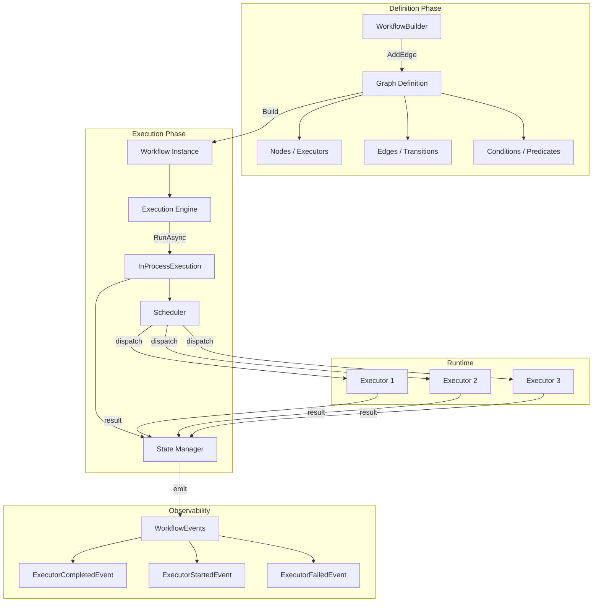
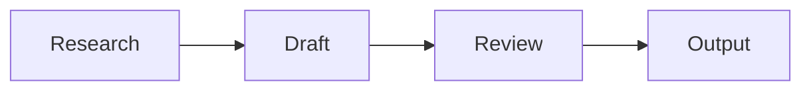
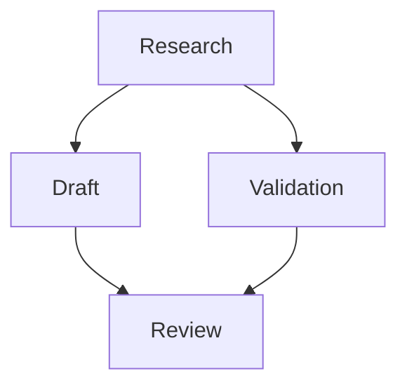
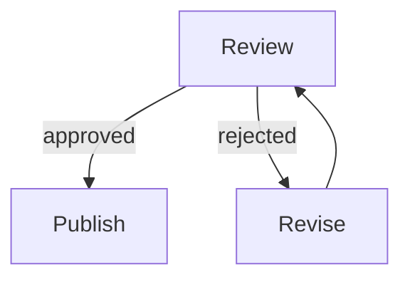
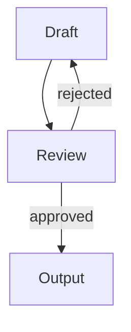

# Workflows (Multi-Agent Orchestration) - Teori Komprehensif

> **Prerequisite Refresher (Module 8: Agent-to-Agent Communication)**
>
> Pada module sebelumnya, Anda mempelajari *Agent-to-Agent (A2A) protocol* - mekanisme komunikasi antar agent yang berdiri secara independen melalui *message passing*. Anda memahami bagaimana agent dengan *identity* unik saling menemukan melalui *discovery mechanism*, bertukar pesan terstandarisasi (`A2AMessage`), dan menangani kegagalan komunikasi dengan *exponential backoff retry*. Anda juga mempelajari berbagai *communication patterns* (request-response, pub-sub, broadcast) yang memungkinkan agent berkolaborasi tanpa tight coupling. Module ini mengambil langkah berikutnya: dari komunikasi peer-to-peer antar agent ke **orkestrasi terstruktur** - dimana multiple agents dikoordinasikan melalui *graph-based workflow* yang mendefinisikan urutan eksekusi, percabangan kondisional, dan paralelisme secara deklaratif menggunakan `WorkflowBuilder`.

---

## Penjelasan Konsep

### Apa Itu Workflow Orchestration dalam Multi-Agent Systems

*Workflow orchestration* adalah pola arsitektur dimana sebuah *central coordinator* (workflow engine) mengendalikan urutan eksekusi, alur data, dan logika percabangan dari multiple agents yang berpartisipasi dalam proses multi-step.
 Berbeda dengan komunikasi A2A pada Module 8 dimana agent saling bertukar pesan secara *peer-to-peer* tanpa coordinator pusat, workflow orchestration menempatkan satu entitas (workflow engine) yang "tahu" keseluruhan proses - dari step pertama hingga terakhir, termasuk kondisi percabangan dan penanganan kegagalan. Dalam konteks Microsoft Agent Framework, workflow didefinisikan sebagai *directed graph* menggunakan `WorkflowBuilder`, dimana setiap *node* adalah agent (executor) yang menjalankan tugas tertentu, dan setiap *edge* adalah transisi yang menghubungkan output satu agent ke input agent berikutnya.

### Orchestration vs Choreography

Dalam sistem distributed, ada dua pendekatan fundamental untuk mengoordinasikan multiple services/agents: *orchestration* dan *choreography*. **Orchestration** menggunakan *central controller* yang mengetahui seluruh flow dan secara aktif mengarahkan setiap partisipan - mirip seorang *conductor* orkestra yang memberitahu setiap musisi kapan harus bermain. Sebaliknya, **choreography** tidak memiliki controller pusat - setiap partisipan mengetahui kapan harus bereaksi berdasarkan event yang diterima, mirip penari balet yang bergerak sesuai musik tanpa seorang pun yang mengarahkan secara eksplisit. Pada Module 8, komunikasi A2A lebih condong ke *choreography*: setiap agent secara mandiri memutuskan kapan mengirim pesan dan bagaimana merespons pesan yang diterima. Pada Module 9 ini, `WorkflowBuilder` mengimplementasikan pattern *orchestration*: workflow engine secara eksplisit mendefinisikan urutan eksekusi, memantau progress, dan menangani error - memberikan visibilitas dan kontrol penuh atas proses multi-agent yang kompleks.

### Workflow Engine dalam Konteks Multi-Agent

Workflow engine pada Microsoft Agent Framework bukan sekadar task scheduler - ia adalah *runtime* yang memahami graph dependencies, mengelola state antar step, dan menyediakan observability melalui event system. Engine ini menerima *graph definition* (dibuat via `WorkflowBuilder`), menentukan step mana yang dapat dieksekusi berdasarkan dependency (edges), menjalankan step tersebut melalui *executors*, dan meneruskan output sebagai input ke step berikutnya. Yang membuat pendekatan ini powerful adalah kemampuannya menangani execution patterns yang kompleks - sequential, parallel (fan-out/fan-in), conditional branching, dan looping - semua didefinisikan secara *deklaratif* dalam graph sebelum eksekusi dimulai. Ini memisahkan "apa yang harus dilakukan dan dalam urutan apa" (graph definition) dari "bagaimana melakukannya" (executor implementation), menghasilkan sistem yang jauh lebih maintainable dan observable dibanding ad-hoc agent coordination.

---

## Arsitektur dan Mekanisme Internal

Arsitektur workflow pada Microsoft Agent Framework dibangun di atas tiga pilar utama: **graph definition** (mendefinisikan struktur workflow secara deklaratif), **execution engine** (menjalankan graph sesuai dependency dan kondisi), dan **event system** (memberikan observability real-time atas progress eksekusi). Seluruh mekanisme ini bekerja bersama untuk mengubah definisi graph statis menjadi eksekusi dinamis yang dapat dipantau dan di-debug.

### Workflow Engine Architecture



### Graph Definition: Nodes dan Edges

*Graph definition* adalah jantung dari workflow system. Sebuah workflow didefinisikan sebagai *directed graph* dimana:

- **Nodes** (vertices) = *Executors* - unit eksekusi yang membungkus agent atau logic tertentu. Setiap executor memiliki input, processing logic, dan output.
- **Edges** (arcs) = *Transitions* - koneksi yang mendefinisikan alur data dan control flow dari satu executor ke executor berikutnya.
- **Conditions** = *Predicates* pada edges yang menentukan apakah transisi boleh terjadi berdasarkan output dari node sebelumnya.

```csharp
// Graph definition menggunakan WorkflowBuilder
WorkflowBuilder builder = new(researchExecutor);  // Start node

builder
    .AddEdge(researchExecutor, draftExecutor)          // Sequential: research → draft
    .AddEdge(researchExecutor, validationExecutor)     // Parallel: research → validation
    .AddEdge(draftExecutor, reviewExecutor)            // Fan-in: draft → review
    .AddEdge(validationExecutor, reviewExecutor)       // Fan-in: validation → review
    .AddEdge(reviewExecutor, draftExecutor,
        condition: result => !result.IsApproved)       // Conditional loop
    .WithOutputFrom(reviewExecutor,
        condition: result => result.IsApproved);       // Terminal condition

var workflow = builder.Build();
```

Perhatikan bahwa `WorkflowBuilder` menerima *start node* sebagai parameter konstruktor - ini menentukan entry point dari graph. Method `AddEdge()` mendefinisikan transisi antar executor, dan `WithOutputFrom()` menentukan dari node mana output final diambil (terminal node).

### Execution Patterns

Workflow engine mendukung empat execution pattern fundamental yang dapat dikombinasikan untuk membangun proses sekompleks apapun:

#### 1. Sequential Execution

Pattern paling sederhana dimana step dieksekusi satu per satu secara berurutan. Output dari step N menjadi input untuk step N+1.



```csharp
// Sequential: A → B → C
builder
    .AddEdge(researchExecutor, draftExecutor)
    .AddEdge(draftExecutor, reviewExecutor)
    .WithOutputFrom(reviewExecutor);
```

#### 2. Parallel Execution (Fan-Out / Fan-In)

*Fan-out* terjadi ketika satu node memiliki multiple outgoing edges tanpa kondisi - semua target nodes dieksekusi secara bersamaan. *Fan-in* terjadi ketika multiple edges mengarah ke satu node - node tersebut menunggu semua predecessor selesai sebelum mulai eksekusi.



```csharp
// Fan-out: Research → Draft AND Validation (parallel)
// Fan-in: Draft + Validation → Review (waits for both)
builder
    .AddEdge(researchExecutor, draftExecutor)
    .AddEdge(researchExecutor, validationExecutor)
    .AddEdge(draftExecutor, reviewExecutor)
    .AddEdge(validationExecutor, reviewExecutor)
    .WithOutputFrom(reviewExecutor);
```

#### 3. Conditional Branching

Edges dengan *condition* predicate memungkinkan routing dinamis berdasarkan output dari node sebelumnya. Hanya edge yang kondisinya terpenuhi yang akan di-traverse.



```csharp
// Conditional: Review → Publish (if approved) OR Revise (if rejected)
builder
    .AddEdge(reviewExecutor, publishExecutor,
        condition: result => result.IsApproved)
    .AddEdge(reviewExecutor, reviseExecutor,
        condition: result => !result.IsApproved)
    .WithOutputFrom(publishExecutor);
```

#### 4. Looping (Iterative Execution)

Loop terbentuk ketika conditional edge mengarah kembali ke node yang sudah dilewati. Ini memungkinkan iterasi berulang sampai kondisi terminasi terpenuhi.



```csharp
// Loop: Review → Draft (if rejected), exit loop when approved
builder
    .AddEdge(draftExecutor, reviewExecutor)
    .AddEdge(reviewExecutor, draftExecutor,
        condition: result => !result.IsApproved)  // Loop back
    .WithOutputFrom(reviewExecutor,
        condition: result => result.IsApproved);  // Exit condition
```

### Workflow Execution dan Event Monitoring

Setelah graph didefinisikan dan di-build, eksekusi dilakukan melalui `InProcessExecution.RunAsync()`. Selama eksekusi, workflow engine meng-emit events yang memberikan visibilitas real-time:

```csharp
// Menjalankan workflow dan memantau events
await using Run run = await InProcessExecution.RunAsync(workflow, input);

// Memantau progress secara real-time
foreach (WorkflowEvent evt in run.NewEvents)
{
    switch (evt)
    {
        case ExecutorCompletedEvent completed:
            Console.WriteLine($"[✓] {completed.ExecutorId}: completed");
            break;
        case ExecutorFailedEvent failed:
            Console.WriteLine($"[✗] {failed.ExecutorId}: failed - {failed.Reason}");
            break;
    }
}
```

`ExecutorCompletedEvent` adalah event kunci yang dikirim setiap kali sebuah executor menyelesaikan tugasnya. Event ini membawa informasi tentang executor mana yang selesai, berapa lama eksekusi berlangsung, dan output yang dihasilkan. Dengan memantau event stream ini, developer dapat membangun *real-time visualization* dari workflow progress - mengetahui step mana yang sedang berjalan, mana yang sudah selesai, dan mana yang gagal.

### State Management Antar Steps

Setiap workflow memiliki state yang mengalir antar steps. Ketika satu executor selesai, output-nya secara otomatis tersedia sebagai input untuk executor berikutnya (sesuai edges yang didefinisikan). State ini bersifat *immutable* - setiap step menerima snapshot state dan menghasilkan state baru, memastikan reproducibility dan memudahkan debugging.

```csharp
public record WorkflowState
{
    public string CurrentStep { get; init; } = string.Empty;
    public StepStatus Status { get; init; } = StepStatus.Pending;
    public Dictionary<string, object> Data { get; init; } = new();
    public int RetryCount { get; init; } = 0;
}

public enum StepStatus
{
    Pending,
    Running,
    Completed,
    Failed,
    Skipped
}
```

### Step Retry Mechanism

Ketika sebuah executor gagal (melempar exception atau mengembalikan error), workflow engine tidak langsung membatalkan seluruh workflow. Sebaliknya, engine menerapkan *retry mechanism* - mengeksekusi ulang step yang gagal dengan batas maksimum percobaan (default: 3 kali). Setiap retry dicatat dan dilaporkan melalui event system, memberikan transparansi penuh atas upaya recovery.

```csharp
// Retry logic internal workflow engine (simplified)
for (int attempt = 1; attempt <= maxRetries; attempt++)
{
    try
    {
        var result = await executor.ExecuteAsync(input, cancellationToken);
        return result; // Success
    }
    catch (Exception ex)
    {
        Console.WriteLine($"[RETRY] {executor.Id}: attempt {attempt}/{maxRetries} - {ex.Message}");
        if (attempt == maxRetries)
            throw new WorkflowStepFailedException(executor.Id, ex);
        
        var delay = TimeSpan.FromSeconds(Math.Pow(2, attempt - 1)); // 1s, 2s, 4s
        await Task.Delay(delay, cancellationToken);
    }
}
```

---

## Kapan dan Mengapa Menggunakan

### Use Cases Konkret

| # | Use Case | Penjelasan |
|---|----------|------------|
| 1 | **Content Creation Pipeline** - Proses pembuatan konten yang melibatkan riset, penulisan, review, dan publikasi secara berurutan dengan quality gates | Contoh: Marketing team menggunakan workflow dimana Research Agent mengumpulkan data pasar, Draft Agent menulis artikel berdasarkan riset, Review Agent mengevaluasi kualitas (dan me-loop kembali ke Draft jika ditolak), dan akhirnya Publish Agent memformat dan mempublikasikan konten yang telah disetujui. Setiap step memiliki output yang observable dan flow bersifat deterministic. |
| 2 | **Data Processing Pipeline** - ETL (Extract-Transform-Load) pipeline dimana data melewati beberapa tahap transformasi dengan validasi di setiap step | Contoh: Data Agent mengekstrak data mentah dari multiple sources secara *parallel* (fan-out), Cleaning Agent membersihkan dan menormalisasi data, Validation Agent memeriksa data quality (loop kembali ke Cleaning jika ada anomali), dan Storage Agent menyimpan hasil akhir. Parallel extraction mempercepat proses, dan conditional loop memastikan data quality. |
| 3 | **Customer Support Escalation** - Workflow yang me-route ticket berdasarkan kompleksitas dan domain, dengan escalation path yang terdefinisi | Contoh: Triage Agent mengklasifikasikan ticket (simple vs complex, billing vs technical). Berdasarkan klasifikasi, workflow me-route ke Billing Agent atau Technical Agent secara *conditional*. Jika agent tidak dapat menyelesaikan, ticket di-escalate ke Human Review node. Setiap transisi dicatat untuk audit trail. |
| 4 | **Document Approval Workflow** - Proses persetujuan multi-level dimana dokumen harus melewati beberapa approver dengan kemungkinan revisi | Contoh: Author Agent menyiapkan dokumen, lalu secara parallel dikirim ke Legal Review Agent dan Compliance Review Agent (fan-out). Kedua review harus selesai (fan-in) sebelum Final Approver Agent memberikan keputusan. Jika ditolak, dokumen kembali ke Author Agent dengan feedback spesifik (conditional loop). |
| 5 | **Software Deployment Pipeline** - Automated deployment yang melibatkan build, test, staging, dan production deployment dengan rollback capability | Contoh: Build Agent mengkompilasi kode, Test Agent menjalankan automated tests secara parallel (unit, integration, e2e). Jika semua tests pass, Deploy Agent melakukan staging deployment. Validation Agent memverifikasi staging - jika gagal, Rollback Agent membalikkan perubahan (conditional branching). Jika berhasil, Production Deploy Agent menyelesaikan proses. |

### Trade-offs dan Limitasi

| Aspek | Keuntungan Workflow Orchestration | Trade-off |
|-------|----------------------------------|-----------|
| **Visibility** | Seluruh proses terdefinisi secara eksplisit dalam graph - setiap step, kondisi, dan transisi terlihat jelas. Event system memberikan observability real-time tanpa perlu menambahkan logging manual di setiap agent. | Graph definition menambah overhead setup - untuk proses sederhana (2-3 step sequential), overhead ini mungkin tidak sebanding. Ad-hoc agent coordination bisa lebih cepat untuk prototyping. |
| **Reliability** | Built-in retry mechanism, state management, dan error handling terpusat. Jika satu step gagal, engine menangani recovery tanpa developer perlu menulis error handling di setiap agent. | Centralized orchestrator menjadi *single point of failure* - jika workflow engine crash, seluruh proses terhenti. Memerlukan strategi high-availability untuk engine itu sendiri di production. |
| **Maintainability** | Perubahan flow cukup dilakukan di graph definition tanpa mengubah implementasi executor. Menambah step baru = menambah node dan edges, bukan rewrite seluruh logic. | Graph yang terlalu kompleks (banyak conditional loops, deep nesting) bisa menjadi sulit dipahami. Perlu disiplin untuk memecah workflow besar menjadi sub-workflows yang manageable. |
| **Testability** | Setiap executor dapat di-test secara independen. Graph definition dapat divalidasi secara statis (cycle detection, unreachable nodes). Event stream memudahkan assertion dalam integration tests. | Testing workflow end-to-end memerlukan semua executors tersedia, yang bisa sulit jika executor bergantung pada external services. Mock executors diperlukan untuk isolated testing. |

### Perbandingan Execution Patterns

| Pattern | Kapan Menggunakan | Kapan Tidak Menggunakan | Contoh |
|---------|------------------|------------------------|--------|
| **Sequential** | Steps memiliki dependency ketat - output step N dibutuhkan sebagai input step N+1. Urutan tidak boleh diubah. | Steps independen yang bisa berjalan bersamaan - sequential menambah latency tanpa benefit. | Research → Draft → Review |
| **Parallel (Fan-out/Fan-in)** | Multiple tasks independen yang hasilnya perlu digabungkan. Mempercepat total execution time. | Tasks yang memiliki dependency antar satu sama lain. Parallel tidak mungkin jika task B membutuhkan output task A. | Research ke Draft + Validation secara bersamaan |
| **Conditional** | Flow berbeda berdasarkan hasil runtime - approval/rejection, classification, threshold checks. | Flow yang selalu sama terlepas dari input/output - conditional menambah complexity tanpa value. | Review → Publish (if approved) OR Revise (if rejected) |
| **Looping** | Iterative refinement - proses yang perlu diulang sampai quality threshold terpenuhi. | Proses yang pasti selesai dalam satu pass - loop menambah risk infinite execution jika exit condition tidak tepat. | Draft → Review → (rejected) → Draft → Review → (approved) → Output |

---

## Terminologi Kunci

| Istilah | Penjelasan | Contoh Penggunaan |
|---------|------------|-------------------|
| *WorkflowBuilder* | Class yang menyediakan API fluent untuk mendefinisikan workflow graph secara deklaratif. Menerima *start node* sebagai constructor parameter dan menyediakan methods seperti `AddEdge()` dan `WithOutputFrom()` untuk membangun graph. | `WorkflowBuilder builder = new(researchExecutor);` - membuat builder dengan Research Executor sebagai entry point workflow. |
| *Executor* | Unit eksekusi dalam workflow graph yang membungkus logic pemrosesan untuk satu step. Setiap executor memiliki ID unik, menerima input dari predecessor, menjalankan processing, dan menghasilkan output untuk successors. Dalam konteks multi-agent, executor biasanya membungkus satu agent. | `ResearchExecutor` melakukan riset, menghasilkan data yang menjadi input untuk `DraftExecutor`. |
| *Node* | Vertex dalam directed graph yang merepresentasikan satu step dalam workflow. Setiap node berisi executor yang bertanggung jawab atas pemrosesan aktual. Node memiliki status (pending, running, completed, failed) yang berubah seiring eksekusi. | Workflow dengan 3 nodes: Research → Draft → Review, dimana setiap node adalah titik pemrosesan yang distinct. |
| *Edge* | Arc/transisi dalam directed graph yang menghubungkan dua nodes, mendefinisikan alur control dan data dari source node ke target node. Edge dapat memiliki condition yang menentukan apakah transisi boleh terjadi. | `builder.AddEdge(reviewExecutor, draftExecutor, condition: r => !r.IsApproved)` - edge dari Review ke Draft yang hanya aktif jika review ditolak. |
| *Conditional Routing* | Mekanisme dimana workflow engine memilih edge mana yang akan di-traverse berdasarkan evaluation terhadap predicate/condition yang di-attach pada edge. Memungkinkan dynamic flow yang berbeda berdasarkan runtime output. | Review executor menghasilkan `IsApproved = false`, sehingga engine me-route ke Revise node (bukan Publish node). |
| *Fan-out / Fan-in* | Pattern eksekusi dimana satu node memiliki multiple outgoing edges (fan-out = split ke parallel paths) dan multiple edges menuju satu node (fan-in = merge/join dari parallel paths). Fan-in node menunggu semua predecessors selesai sebelum mulai. | Research node fan-out ke Draft + Validation (parallel). Review node fan-in dari Draft + Validation (waits for both). |
| *Sequential Execution* | Pattern eksekusi dimana steps dijalankan satu per satu secara berurutan - step berikutnya baru dimulai setelah step sebelumnya selesai. Output step N otomatis menjadi input step N+1. Pattern paling sederhana dan mudah di-reason. | `A → B → C` - B baru mulai setelah A selesai, C baru mulai setelah B selesai. |
| *Parallel Execution* | Pattern eksekusi dimana multiple steps dijalankan secara bersamaan (concurrent). Steps yang tidak memiliki dependency antar satu sama lain dapat berjalan parallel untuk mempercepat total execution time. | Research memicu Draft dan Validation secara bersamaan - total waktu = max(draft_time, validation_time), bukan draft_time + validation_time. |
| *Event Monitoring* | Mekanisme observability dimana workflow engine meng-emit events selama eksekusi - memungkinkan monitoring real-time tanpa polling. Consumer dapat subscribe ke event stream untuk mendapatkan notifikasi status changes. | `foreach (WorkflowEvent evt in run.NewEvents)` - iterasi atas events yang di-emit untuk menampilkan progress di console. |
| *Step Retry* | Mekanisme recovery otomatis dimana workflow engine mengeksekusi ulang step yang gagal (melempar exception) sampai batas maksimum percobaan. Interval antar retry menggunakan exponential backoff (1s, 2s, 4s) untuk memberikan waktu recovery pada downstream services. | Step gagal → retry setelah 1s → gagal lagi → retry setelah 2s → gagal lagi → retry setelah 4s → abort dan report error. Maksimal 3 retry attempts. |
| *ExecutorCompletedEvent* | Event yang di-emit oleh workflow engine setiap kali sebuah executor berhasil menyelesaikan tugasnya. Membawa metadata seperti executor ID, timestamp completion, dan output yang dihasilkan. Digunakan untuk real-time progress visualization. | `if (evt is ExecutorCompletedEvent completed) Console.WriteLine($"[✓] {completed.ExecutorId}")` |
| *InProcessExecution* | Class yang menyediakan method `RunAsync()` untuk menjalankan workflow yang telah di-build dalam satu proses. Mengembalikan `Run` object yang menyediakan akses ke event stream dan final result. | `await using Run run = await InProcessExecution.RunAsync(workflow, input);` - memulai eksekusi workflow dan mendapatkan handle untuk monitoring. |
| *Directed Graph* | Struktur data matematis yang terdiri dari vertices (nodes) dan arcs (edges) yang memiliki arah - edge dari A ke B tidak berarti ada edge dari B ke A. Workflow menggunakan directed graph karena control flow memiliki arah yang jelas (dari input ke output). | Workflow graph dimana edges menunjukkan arah alur eksekusi: Research → Draft → Review (bukan sebaliknya). |

---

## Hubungan dengan Topik Sebelumnya

Module ini merupakan **kulminasi** dari seluruh learning path - workflow orchestration mengintegrasikan dan membangun di atas **setiap** konsep yang telah dipelajari dari Module 1 hingga Module 8:

- **Module 1 (LLM Fundamentals)** - Setiap *executor* dalam workflow pada akhirnya mengandalkan LLM untuk processing. Pemahaman tentang *temperature*, *token limits*, dan *prompt engineering* dari Module 1 tetap esensial - workflow yang memiliki banyak steps berarti banyak LLM calls, sehingga parameter tuning (token budget, temperature per step) menjadi krusial untuk cost management dan output quality. Executor yang melakukan riset mungkin menggunakan temperature rendah (faktual), sementara executor yang menulis draft menggunakan temperature lebih tinggi (kreatif).

- **Module 2 (From LLMs to Agents)** - Setiap node/executor dalam workflow pada dasarnya adalah *agent* yang diciptakan menggunakan `.AsAIAgent()` dengan *instructions* spesifik. Konsep agent identity, instructions sebagai behavior shaping, dan session management dari Module 2 diterapkan di setiap node - Research Executor memiliki instructions "Anda adalah research specialist", Draft Executor memiliki instructions "Anda adalah content writer". Workflow mengkomposisi agents yang masing-masing merupakan agent lengkap dengan persona dan behavior yang distinct.

- **Module 3 (Adding Tools)** - Executors dalam workflow seringkali memiliki *tools* - Research Executor mungkin memiliki web search tool, Draft Executor mungkin memiliki text formatting tool. Konsep *tool registration* dan *function calling* dari Module 3 diterapkan per-executor. Workflow mengoordinasikan agents yang masing-masing dilengkapi tools sesuai tugasnya.

- **Module 4 (Adding Skills)** - *Skills* (packages of related tools) dari Module 4 memberikan modularity pada executor design. Daripada mendaftarkan tools satu per satu ke executor, skills memungkinkan bundling tools yang terkait secara domain - Research Executor mendapat "ResearchSkill" (web search + summarize + cite), Draft Executor mendapat "WritingSkill" (outline + draft + format).

- **Module 5 (Adding Middleware)** - *Middleware pipeline* dari Module 5 dapat diterapkan pada workflow level maupun executor level. Logging middleware memberikan observability tambahan di setiap step, guardrail middleware memvalidasi output setiap executor sebelum diteruskan ke step berikutnya. Workflow engine sendiri bisa dilihat sebagai "ultimate middleware" yang mengontrol alur eksekusi seluruh pipeline.

- **Module 6 (Context Providers)** - *Context providers* dari Module 6 memungkinkan setiap executor memiliki context yang relevan. Dalam workflow, state yang mengalir antar steps berfungsi sebagai *context* - output Research Executor menjadi context untuk Draft Executor. Conversation history provider dapat diterapkan per-executor untuk mempertahankan context dalam iterative loops (review → revise → review).

- **Module 7 (Agents as Tools)** - *Agent composition* dari Module 7 merupakan precursor langsung dari workflow. Perbedaannya: Module 7 menggunakan komposisi *ad-hoc* (parent agent secara imperatif memanggil child agents), sementara Module 9 menggunakan *deklaratif orchestration* (graph mendefinisikan relasi antar agents sebelum eksekusi). Workflow adalah versi terstruktur dan scalable dari pattern agent-as-tool.

- **Module 8 (A2A Communication)** - *A2A protocol* dari Module 8 menyediakan mekanisme komunikasi yang digunakan ketika executors berjalan di proses atau mesin terpisah. Dalam *distributed workflow*, edges antar nodes bisa di-implement menggunakan A2A messages - node mengirim output via A2A message ke node berikutnya. *Retry mechanism* dan *exponential backoff* dari Module 8 juga diterapkan dalam workflow step retry. Jika pada Module 8 komunikasi bersifat *peer-to-peer* (choreography), pada Module 9 komunikasi diorkestrasi oleh workflow engine (orchestration).

**Evolusi pattern dari module ke module:**

| Module | Pattern | Koordinasi | Visibility |
|--------|---------|-----------|------------|
| 7 - Agents as Tools | Imperative composition | Parent agent memutuskan ad-hoc | Logging manual per-call |
| 8 - A2A Communication | Peer-to-peer messaging | Setiap agent mandiri (choreography) | Distributed tracing |
| 9 - Workflows | Declarative orchestration | Engine mengontrol graph (orchestration) | Built-in event system |

---

## Analogi dan Contoh Dunia Nyata

### Analogi 1: Pabrik Manufaktur dengan Assembly Line

Bayangkan sebuah pabrik mobil modern dengan *assembly line* yang terstruktur. Setiap *station* (executor) memiliki spesialisasi: station perakitan rangka, station pemasangan mesin, station pengecatan, station quality control, dan station pengemasan akhir. Seorang *production manager* (workflow engine) mengatur keseluruhan alur - menentukan urutan, mengelola dependensi antar station, dan menangani masalah yang terjadi.

- **Assembly line sebagai graph** - Blueprint pabrik mendefinisikan urutan station dan jalur conveyor belt antar station. Ini adalah *graph definition* - ditentukan sebelum produksi dimulai, bersifat deklaratif, dan bisa divisualisasikan sebagai diagram alur. Mengubah urutan cukup ubah blueprint, bukan rebuild pabrik.

- **Stations sebagai executors/nodes** - Setiap station adalah unit kerja independen dengan keahlian spesifik. Station pengecatan tidak perlu tahu cara merakit mesin - ia hanya menerima input (mobil yang sudah dirakit), melakukan tugasnya (cat), dan menghasilkan output (mobil yang sudah dicat). Ini adalah prinsip *single responsibility* per executor.

- **Conveyor belt sebagai edges** - Jalur conveyor yang menghubungkan station A ke station B adalah *edge*. Conveyor membawa "state" (mobil setengah jadi) dari satu station ke station berikutnya. Beberapa conveyor punya "switch" yang mengarahkan produk ke jalur berbeda berdasarkan inspeksi - ini adalah *conditional routing*.

- **Parallel stations** - Pemasangan pintu kiri dan pintu kanan bisa dilakukan bersamaan oleh dua station berbeda (fan-out). Keduanya harus selesai sebelum mobil bisa masuk ke station quality control (fan-in). Parallelisme mempercepat total waktu produksi.

- **Quality control loop** - Jika QC menemukan cacat, mobil dikirim kembali ke station yang relevan untuk perbaikan (looping). Setelah diperbaiki, mobil kembali ke QC. Jika setelah 3 kali perbaikan masih cacat, mobil ditarik dari lini produksi (max retry exceeded).

- **Production dashboard** - Manager memiliki dashboard real-time yang menunjukkan status setiap station: idle, processing, atau error. Ini adalah *event monitoring* - workflow engine meng-emit events yang bisa divisualisasikan.

**Pemetaan ke komponen teknis:**

| Analogi Pabrik | Komponen Teknis |
|----------------|-----------------|
| Blueprint assembly line | *Graph definition* via `WorkflowBuilder` |
| Station kerja | *Executor* (node dalam graph) |
| Conveyor belt | *Edge* (transisi antar nodes) |
| Switch/pengalih jalur | *Conditional routing* (edge with condition) |
| Parallel stations | *Fan-out / fan-in* pattern |
| QC → return ke station | *Looping* (conditional edge back) |
| Max 3x perbaikan | *Step retry* (max attempts) |
| Production manager | *Workflow engine* (central coordinator) |
| Dashboard real-time | *Event monitoring* (`ExecutorCompletedEvent`) |
| Produk setengah jadi di conveyor | *State* yang mengalir antar steps |

### Analogi 2: Proses Editorial Penerbitan Buku

Bayangkan proses editorial di sebuah penerbit buku - dari naskah mentah hingga buku terbit. Setiap tahap ditangani oleh editor/spesialis berbeda, dan seorang *managing editor* (workflow engine) mengkoordinasikan keseluruhan proses.

- **Managing editor sebagai orchestrator** - Managing editor tidak menulis sendiri, tidak mendesain sendiri - ia *mengoordinasikan*. Ia tahu urutan proses, siapa yang bertanggung jawab di setiap tahap, dan apa yang harus terjadi jika ada masalah. Ia memiliki "peta proses" (graph) yang mendefinisikan seluruh flow dari naskah masuk hingga buku terbit.

- **Tahap-tahap editorial** - Naskah melewati proofreader (grammar check), content editor (structure/story), designer (cover + layout), dan printer. Masing-masing adalah executor yang menerima input (naskah dalam kondisi tertentu) dan menghasilkan output (naskah yang telah diproses). Sequential flow ini jelas dan terdefinisi.

- **Review loop** - Content editor mungkin menolak naskah dan mengirim kembali ke penulis untuk revisi. Setelah direvisi, naskah kembali ke content editor. Ini bisa terjadi beberapa kali sampai editor puas (atau batas revisi tercapai). Ini adalah *conditional looping* dalam workflow.

- **Parallel review** - Sementara designer mengerjakan cover, proofreader bisa mengerjakan isi secara bersamaan (fan-out). Keduanya harus selesai sebelum masuk tahap final review (fan-in). Paralelisme ini mempercepat timeline penerbitan.

- **Tracking board** - Di kantor editorial ada whiteboard yang menunjukkan status setiap buku: "di proofreader", "menunggu revisi penulis", "di designer", "siap cetak". Setiap kali naskah berpindah tahap, papan di-update. Ini adalah *event monitoring* yang memberikan real-time visibility.

- **Retry mekanisme** - Jika printer mengalami error (kehabisan tinta, mesin macet), percobaan cetak diulang. Setelah 3 kali gagal, managing editor diberi notifikasi untuk mengambil keputusan (gunakan printer lain, tunda jadwal). Ini adalah *step retry* dengan *escalation* setelah max attempts.

**Pemetaan ke komponen teknis:**

| Analogi Editorial | Komponen Teknis |
|-------------------|-----------------|
| Managing editor | *Workflow engine* (orchestrator) |
| Peta proses editorial | *Graph definition* (`WorkflowBuilder`) |
| Proofreader, content editor, designer | *Executors* (specialized nodes) |
| Naskah berpindah antar editor | *State flow* melalui edges |
| Content editor menolak → kembali ke penulis | *Conditional looping* |
| Cover design + proofreading bersamaan | *Parallel execution* (fan-out/fan-in) |
| Whiteboard tracking | *Event monitoring* |
| Max 3x cetak ulang | *Step retry mechanism* |
| Keputusan managing editor setelah 3x gagal | *Error handling / escalation* |

---

## Bacaan Lanjutan

1. **[Microsoft Agent Framework - Workflow Orchestration](https://learn.microsoft.com/en-us/microsoft/agents/concepts/workflows)** - Dokumentasi resmi tentang `WorkflowBuilder`, graph definition, execution patterns, dan event system. Mencakup API reference lengkap untuk membangun workflow multi-agent termasuk conditional routing, fan-out/fan-in, dan step retry configuration.

2. **[Building Multi-Agent Workflows with Microsoft Agents SDK](https://learn.microsoft.com/en-us/microsoft/agents/how-to/build-workflows)** - Panduan praktis step-by-step untuk membangun workflow graph dari scratch, termasuk best practices untuk decomposition strategy, state management antar nodes, dan real-time monitoring menggunakan event stream.

3. **[Azure Durable Functions - Orchestration Patterns](https://learn.microsoft.com/en-us/azure/azure-functions/durable/durable-functions-orchestrations)** - Referensi tentang orchestration patterns (chaining, fan-out/fan-in, human interaction, monitoring) yang secara konseptual identik dengan workflow patterns pada Agent Framework. Memahami Durable Functions membantu mengenali pattern yang sama dalam konteks multi-agent orchestration dan menyediakan mental model untuk distributed workflow execution.
