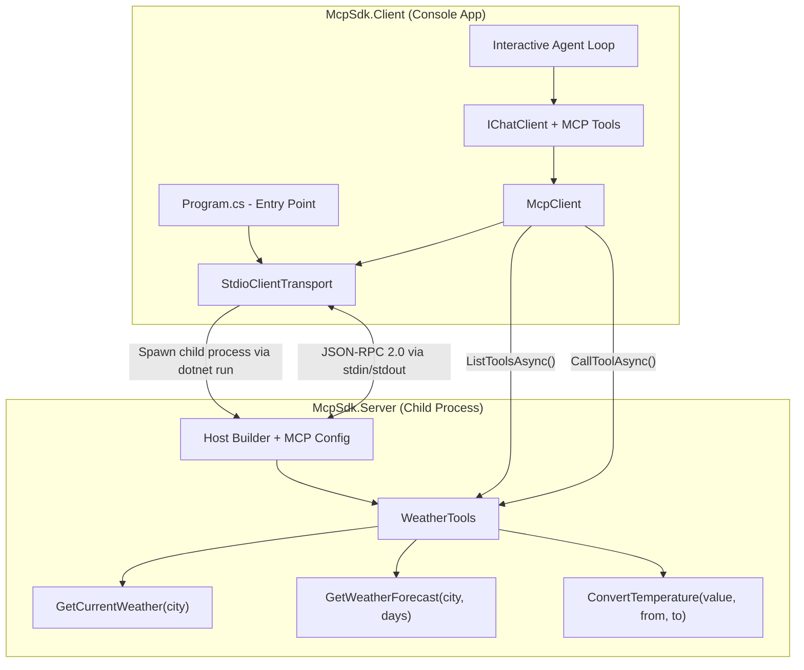
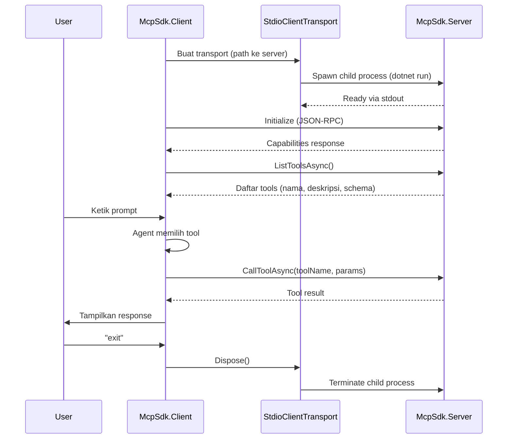

# Module 10: MCP SDK - Model Context Protocol

## Overview

Module ini mengajarkan cara membangun **MCP Server** kustom menggunakan official .NET MCP SDK, menghubungkan **MCP Client** untuk melakukan tool discovery dan invocation, serta mengintegrasikan MCP tools ke dalam **agent** melalui `IChatClient`.

Yang didemonstrasikan dalam module ini:

- **MCP Server** - Mengekspos weather tools melalui stdio transport menggunakan `ModelContextProtocol` NuGet package
- **MCP Client** - Koneksi ke server, tool discovery via `ListToolsAsync()`, dan direct tool invocation via `CallToolAsync()`
- **Agent Integration** - MCP tools diteruskan ke `IChatClient` sebagai `AIFunction` (karena `McpClientTool` mewarisi dari `AIFunction`)
- **Interactive Loop** - Agent menjawab pertanyaan user secara dinamis dengan memilih MCP tools yang sesuai
- **Multi-Tool Scenario** - Agent memanggil lebih dari satu MCP tool dalam satu conversation turn

Setelah menyelesaikan module ini, Anda akan memahami bagaimana membangun ekosistem tools yang terstandarisasi dan dapat diakses oleh berbagai agent secara dinamis melalui protokol MCP.

---

## Prerequisites

### Module Prerequisites

| Module | Topik | Keterangan |
|--------|-------|------------|
| Module 3 (Adding Tools) | Function tools lokal | Konsep dasar tool calling yang menjadi baseline untuk MCP |
| Module 8 (A2A Communication) | Komunikasi inter-process | Pola komunikasi antar agent sebagai referensi arsitektur |

### Minimum SDK & Tools

| Tool | Versi Minimum | Keterangan |
|------|---------------|------------|
| .NET SDK | **9.0** | Download di [dotnet.microsoft.com](https://dotnet.microsoft.com/download/dotnet/9.0) |
| Azure CLI | 2.60+ | Untuk autentikasi via `az login` |
| Azure OpenAI Resource | - | Resource dengan model yang sudah di-deploy (contoh: `gpt-4o-mini`) |

### NuGet Packages

**McpSdk.Server:**

| Package | Versi |
|---------|-------|
| `ModelContextProtocol` | 2.1.0 |
| `Microsoft.Extensions.Hosting` | 9.0.0 |

**McpSdk.Client:**

| Package | Versi |
|---------|-------|
| `ModelContextProtocol` | 2.1.0 |
| `Azure.AI.OpenAI` | 2.3.0-beta.1 |
| `Azure.Identity` | 1.13.2 |
| `Microsoft.Extensions.AI` | 9.6.0 |
| `Microsoft.Extensions.AI.OpenAI` | 10.4.0 |

---

## Arsitektur Module

Diagram berikut menunjukkan alur komunikasi MCP antara Client dan Server:



### Alur Komunikasi



---

## Langkah Implementasi

Berikut urutan implementasi dari awal hingga akhir:

1. **Buat project structure** - Buat folder `04-Expert/03-McpSdk/` dengan dua sub-project: `McpSdk.Server/` dan `McpSdk.Client/`

2. **Setup Server dependencies** - Tambahkan NuGet packages `ModelContextProtocol` dan `Microsoft.Extensions.Hosting` ke `McpSdk.Server.csproj`

3. **Setup Client dependencies** - Tambahkan NuGet packages `ModelContextProtocol`, `Azure.AI.OpenAI`, `Azure.Identity`, `Microsoft.Extensions.AI`, dan `Microsoft.Extensions.AI.OpenAI` ke `McpSdk.Client.csproj`

4. **Buat data models** - Definisikan record types: `WeatherData`, `ForecastDay`, `TemperatureConversion` di server project

5. **Konfigurasi MCP Server** - Implementasi `Program.cs` server dengan `Host.CreateApplicationBuilder`, `AddMcpServer()`, `WithStdioServerTransport()`, dan `WithToolsFromAssembly()`

6. **Redirect logging ke stderr** - Konfigurasi `builder.Logging` agar output logging tidak mengganggu stdio protocol communication

7. **Implementasi weather tools** - Buat class `WeatherTools` dengan atribut `[McpServerToolType]` yang berisi tools: `GetCurrentWeather`, `GetWeatherForecast`, dan `ConvertTemperature`

8. **Tambahkan parameter validation** - Implementasi validasi input pada setiap tool (null/empty city, days range 1-7, valid temperature units) dengan error messages yang deskriptif

9. **Konfigurasi Client transport** - Buat `StdioClientTransport` yang mengarah ke server project (`dotnet run --project ../McpSdk.Server/McpSdk.Server.csproj`)

10. **Implementasi tool discovery** - Buat `McpClient` via `McpClient.CreateAsync(transport)` dan panggil `ListToolsAsync()` untuk menemukan tools yang tersedia

11. **Implementasi direct tool invocation** - Panggil setiap tool menggunakan `CallToolAsync()` dengan parameter contoh dan tampilkan hasilnya

12. **Konfigurasi IChatClient** - Buat `IChatClient` dengan `AzureOpenAIClient` dan `UseFunctionInvocation()`, teruskan MCP tools sebagai `ChatOptions.Tools`

13. **Implementasi agent demo** - Kirim test prompts ke agent dan tampilkan alur lengkap: prompt → tool selection → invocation → result → response

14. **Implementasi interactive loop** - Buat loop yang menerima input user, deteksi "exit"/"quit" untuk mengakhiri sesi, dan handle errors gracefully

15. **Tambahkan execution summary** - Tampilkan ringkasan di akhir eksekusi: total tools discovered dan total tool calls made

---

## Cara Menjalankan

### Penting: Server Auto-Start

> 💡 Anda **tidak perlu** menjalankan MCP Server secara manual. Client menggunakan `StdioClientTransport` yang secara otomatis menjalankan server sebagai child process saat client di-start. Cukup jalankan client project saja.

### 1. Konfigurasi Environment Variables

Salin file `.env.example` dan isi dengan konfigurasi Azure OpenAI Anda:

```bash
# Dari folder McpSdk.Client/
cp .env.example .env
```

File `.env.example` berisi:

```
AZURE_OPENAI_ENDPOINT=https://your-resource.openai.azure.com/
AZURE_OPENAI_DEPLOYMENT_NAME=gpt-4o-mini
```

Atau set environment variables secara langsung:

```bash
# PowerShell
$env:AZURE_OPENAI_ENDPOINT = "https://your-resource.openai.azure.com/"
$env:AZURE_OPENAI_DEPLOYMENT_NAME = "gpt-4o-mini"

# Bash
export AZURE_OPENAI_ENDPOINT="https://your-resource.openai.azure.com/"
export AZURE_OPENAI_DEPLOYMENT_NAME="gpt-4o-mini"
```

### 2. Login ke Azure

```bash
az login
```

### 3. Restore Dependencies

```bash
dotnet restore McpSdk.Server/McpSdk.Server.csproj
dotnet restore McpSdk.Client/McpSdk.Client.csproj
```

### 4. Jalankan Aplikasi

```bash
dotnet run --project McpSdk.Client/McpSdk.Client.csproj
```

Atau dari root directory project:

```bash
dotnet run --project 04-Expert/03-McpSdk/McpSdk.Client/McpSdk.Client.csproj
```

Saat dijalankan, client akan:
1. Spawn server sebagai child process via `StdioClientTransport`
2. Membuat koneksi MCP melalui stdin/stdout
3. Melakukan tool discovery
4. Mendemonstrasikan direct tool invocation
5. Menjalankan agent integration demo (jika environment variables dikonfigurasi)
6. Memulai interactive loop

---

## Expected Output

Ketika aplikasi berjalan dengan sukses, Anda akan melihat output seperti berikut di console:

```
═══════════════════════════════════════════════════════════════
  MCP Client - Weather Tools Demo
═══════════════════════════════════════════════════════════════

[INFO] Koneksi ke MCP Server berhasil!

───────────────────────────────────────────────────────────────
  Tool Discovery - Daftar Tools yang Tersedia
───────────────────────────────────────────────────────────────

  Ditemukan 3 tool(s) pada server:

  [1] GetCurrentWeather
      Deskripsi: Mendapatkan cuaca saat ini untuk kota tertentu

  [2] GetWeatherForecast
      Deskripsi: Mendapatkan prakiraan cuaca 3 hari ke depan

  [3] ConvertTemperature
      Deskripsi: Mengkonversi suhu antar unit (Celsius, Fahrenheit, Kelvin)

───────────────────────────────────────────────────────────────

───────────────────────────────────────────────────────────────
  Direct Tool Invocation - Pemanggilan Tool Secara Langsung
───────────────────────────────────────────────────────────────

  [14:30:15.123] Memanggil tool: GetCurrentWeather
      Parameter: city = "Jakarta"
      Response: {"City":"Jakarta","TemperatureCelsius":32.5,"Condition":"Cerah Berawan",...}

  [14:30:15.456] Memanggil tool: GetWeatherForecast
      Parameter: city = "Surabaya", days = 3
      Response: [{"Date":"2025-01-15","HighCelsius":33.0,"LowCelsius":25.0,...},...]

  [14:30:15.789] Memanggil tool: ConvertTemperature
      Parameter: value = 100, fromUnit = "celsius", toUnit = "fahrenheit"
      Response: {"OriginalValue":100,"FromUnit":"celsius","ConvertedValue":212,...}

───────────────────────────────────────────────────────────────
  Ringkasan: 3 tool(s) ditemukan, 3 tool call(s) berhasil
───────────────────────────────────────────────────────────────

───────────────────────────────────────────────────────────────
  Agent Integration - MCP Tools ke IChatClient
───────────────────────────────────────────────────────────────

  [INFO] Azure OpenAI Endpoint: https://your-resource.openai.azure.com/
  [INFO] Deployment: gpt-4o-mini

  [INFO] IChatClient berhasil dibuat dengan UseFunctionInvocation()
  [INFO] 3 MCP tool(s) diteruskan sebagai ChatOptions.Tools

  ┌─ Demo 1: Single-Tool Interaction ─────────────────────────
  │ [PROMPT] User: "Bagaimana cuaca di Jakarta saat ini?"
  │
  │ [INFO] Mengirim prompt ke agent...
  │        Agent akan memilih tool yang sesuai secara otomatis.
  │
  │ [14:30:16.012] [TOOL] GetCurrentWeather(city=Jakarta)
  │
  │ [RESPONSE] Agent: Cuaca di Jakarta saat ini cerah berawan dengan suhu 32.5°C...
  └─────────────────────────────────────────────────────────────

  ┌─ Demo 2: Multi-Tool Scenario ─────────────────────────────
  │ [PROMPT] User: "Bandingkan cuaca Jakarta dan Surabaya..."
  │
  │ [14:30:17.345] [TOOL 1] GetCurrentWeather(city=Jakarta)
  │ [14:30:17.567] [TOOL 2] GetCurrentWeather(city=Surabaya)
  │ [14:30:17.890] [TOOL 3] ConvertTemperature(value=32.5, fromUnit=celsius, toUnit=fahrenheit)
  │
  │ [INFO] Agent memanggil 3 tool(s) dalam satu turn.
  │
  │ [RESPONSE] Agent: Jakarta: 32.5°C (90.5°F), cerah berawan...
  └─────────────────────────────────────────────────────────────

───────────────────────────────────────────────────────────────
  Interactive Agent Loop - Tanya Jawab dengan Agent
───────────────────────────────────────────────────────────────

  Ketik pertanyaan Anda, atau ketik "exit"/"quit" untuk keluar.

  [YOU] > Prakiraan cuaca Bandung 5 hari ke depan?
  [14:30:25.100] [INFO] Mengirim ke agent...
  [14:30:25.500] [TOOL] GetWeatherForecast(city=Bandung, days=5)
  [AGENT] Prakiraan cuaca Bandung untuk 5 hari ke depan: ...

  [YOU] > exit

───────────────────────────────────────────────────────────────
  Ringkasan Sesi Interaktif:
    Total prompt: 1
    Total tool calls: 1
───────────────────────────────────────────────────────────────

═══════════════════════════════════════════════════════════════
  EXECUTION SUMMARY
═══════════════════════════════════════════════════════════════

  • Total tools discovered    : 3
  • Total tool calls made     : 7
  • Dynamic discovery         : Ya (tidak ada hardcoded knowledge)
  • Multi-tool scenario       : Ya (agent memanggil >1 tool per turn)

═══════════════════════════════════════════════════════════════
  Sesi MCP Client selesai. Resources dibersihkan.
═══════════════════════════════════════════════════════════════
```

> ⚠️ Output agent response akan berbeda setiap kali dijalankan karena sifat non-deterministik LLM. Timestamp juga akan bervariasi sesuai waktu eksekusi.

---

## Troubleshooting

### ❌ Error: Server executable not found

```
[ERROR] Server tidak ditemukan: ../McpSdk.Server/McpSdk.Server.csproj
[HINT] Pastikan path ke McpSdk.Server.csproj benar.
```

**Penyebab**: Path ke project server tidak sesuai, atau file `.csproj` tidak ada di lokasi yang diharapkan. `StdioClientTransport` mencoba menjalankan `dotnet run --project ../McpSdk.Server/McpSdk.Server.csproj` tetapi path relatif tidak valid dari working directory saat ini.

**Solusi**:
- Pastikan Anda menjalankan `dotnet run` dari folder `04-Expert/03-McpSdk/McpSdk.Client/`
- Verifikasi bahwa folder `McpSdk.Server/` dan file `McpSdk.Server.csproj` ada:
  ```bash
  ls ../McpSdk.Server/McpSdk.Server.csproj
  ```
- Jika menjalankan dari root project, gunakan:
  ```bash
  dotnet run --project 04-Expert/03-McpSdk/McpSdk.Client/McpSdk.Client.csproj
  ```
- Build server terlebih dahulu untuk memastikan tidak ada compile errors:
  ```bash
  dotnet build McpSdk.Server/McpSdk.Server.csproj
  ```

---

### ❌ Error: Transport connection timeout

```
[ERROR] Timeout menunggu response dari server.
[HINT] Periksa apakah server berjalan dengan benar.
```

**Penyebab**: Server process gagal start dalam waktu yang diharapkan. Ini bisa terjadi karena: server project belum pernah di-build (first-time build lambat), ada compile error pada server, atau resource system tidak cukup.

**Solusi**:
- Build server project secara terpisah terlebih dahulu:
  ```bash
  dotnet build McpSdk.Server/McpSdk.Server.csproj
  ```
- Periksa apakah ada compile errors pada server:
  ```bash
  dotnet build McpSdk.Server/McpSdk.Server.csproj --verbosity detailed
  ```
- Pastikan tidak ada proses `dotnet` lain yang meng-lock file server
- Restart terminal dan coba lagi - kadang process orphan dari run sebelumnya masih berjalan
- Pada first run, NuGet restore membutuhkan waktu - jalankan `dotnet restore` pada kedua project terlebih dahulu

---

### ❌ Error: Tool parameter mismatch

```
[WARNING] Tool 'ConvertTemperature' error: Parameter 'fromUnit' tidak valid...
```

**Penyebab**: Parameter yang dikirim ke tool tidak sesuai dengan yang diharapkan oleh server. Contoh: unit yang tidak dikenal, tipe data salah, atau parameter yang required tidak disertakan.

**Solusi**:
- Gunakan `ListToolsAsync()` untuk melihat schema parameter setiap tool
- Untuk `ConvertTemperature`, unit yang valid adalah: `"celsius"`, `"fahrenheit"`, `"kelvin"` (case-insensitive)
- Untuk `GetWeatherForecast`, parameter `days` harus antara 1-7
- Untuk `GetCurrentWeather`, parameter `city` tidak boleh kosong
- Periksa console output pada bagian Tool Discovery untuk melihat deskripsi parameter

---

### ❌ Error: Azure OpenAI authentication failed

```
[WARNING] Environment variables belum dikonfigurasi:
  - AZURE_OPENAI_ENDPOINT
  - AZURE_OPENAI_DEPLOYMENT_NAME
```

**Penyebab**: Environment variables untuk Azure OpenAI belum di-set, atau `DefaultAzureCredential` gagal mendapatkan token.

**Solusi**:
- Set environment variables sesuai file `.env.example`
- Login ke Azure CLI: `az login`
- Pastikan Azure OpenAI resource Anda accessible dan model sudah di-deploy
- Section tool discovery dan direct invocation tetap berjalan tanpa Azure credentials - hanya agent integration yang membutuhkannya

---

### ❌ Error: "HTTP 429 - Too Many Requests"

**Penyebab**: Rate limit Azure OpenAI tercapai, terutama pada interactive loop dengan banyak tool calls.

**Solusi**:
- Tunggu beberapa menit sebelum mencoba lagi
- Gunakan deployment dengan TPM (Tokens Per Minute) yang lebih tinggi
- Kurangi frekuensi prompt pada interactive loop

---

## Referensi

- [.NET MCP SDK Documentation](https://csharp.sdk.modelcontextprotocol.io/v2/)
- [Model Context Protocol Specification](https://modelcontextprotocol.io)
- [Microsoft.Extensions.AI - IChatClient](https://learn.microsoft.com/en-us/dotnet/ai/microsoft-extensions-ai)
- [Azure OpenAI Service Documentation](https://learn.microsoft.com/en-us/azure/ai-services/openai/)
