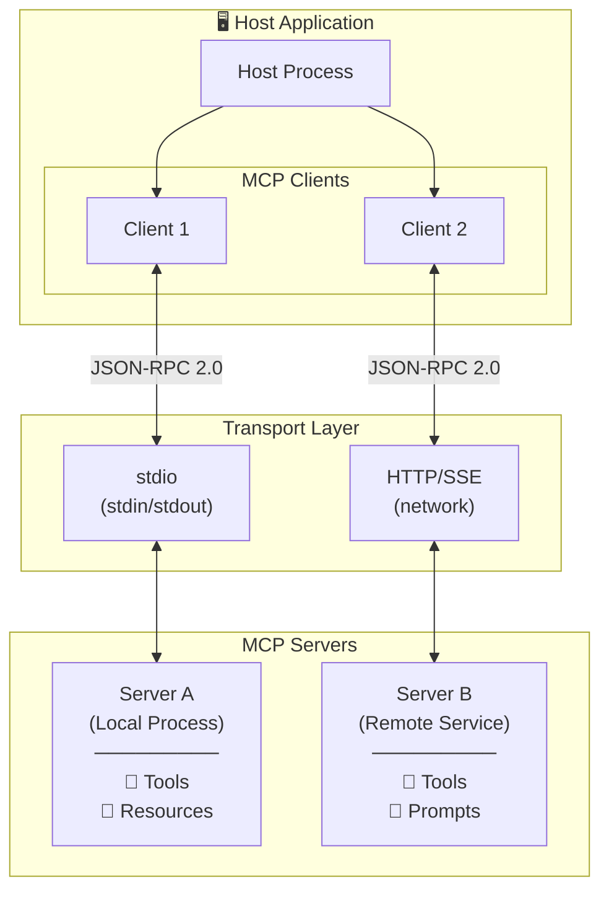
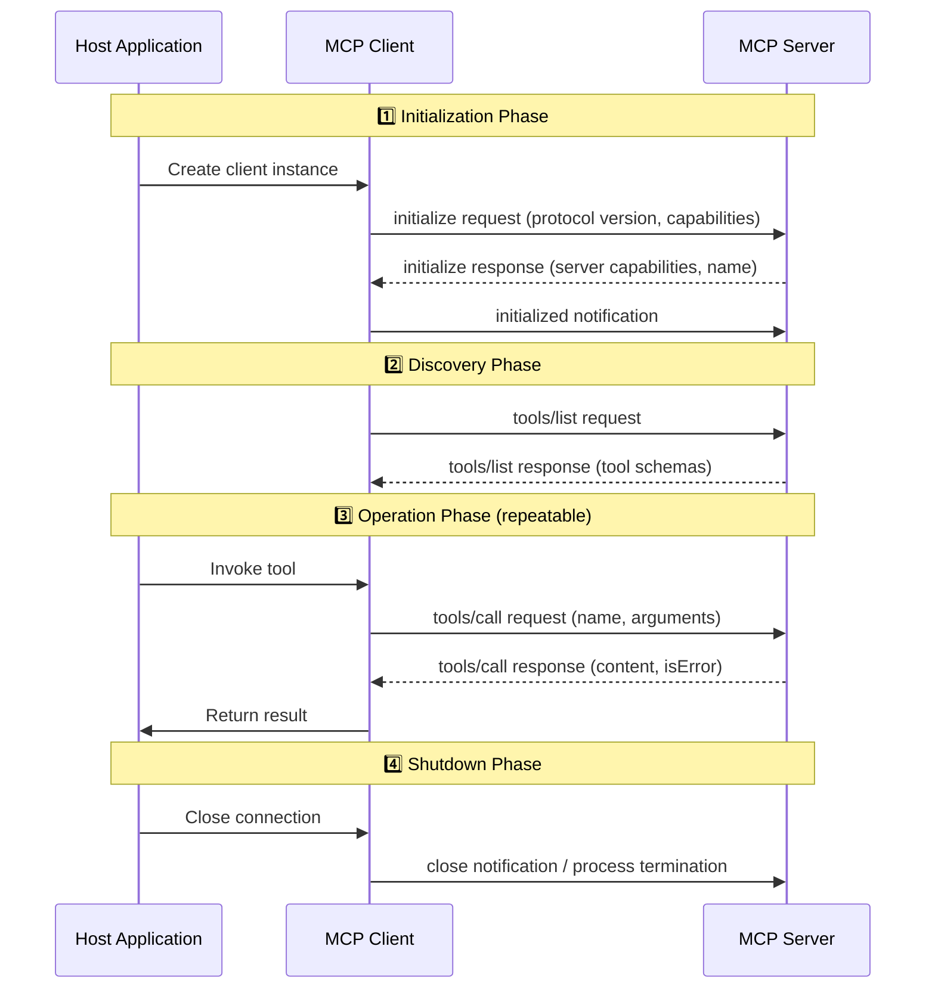
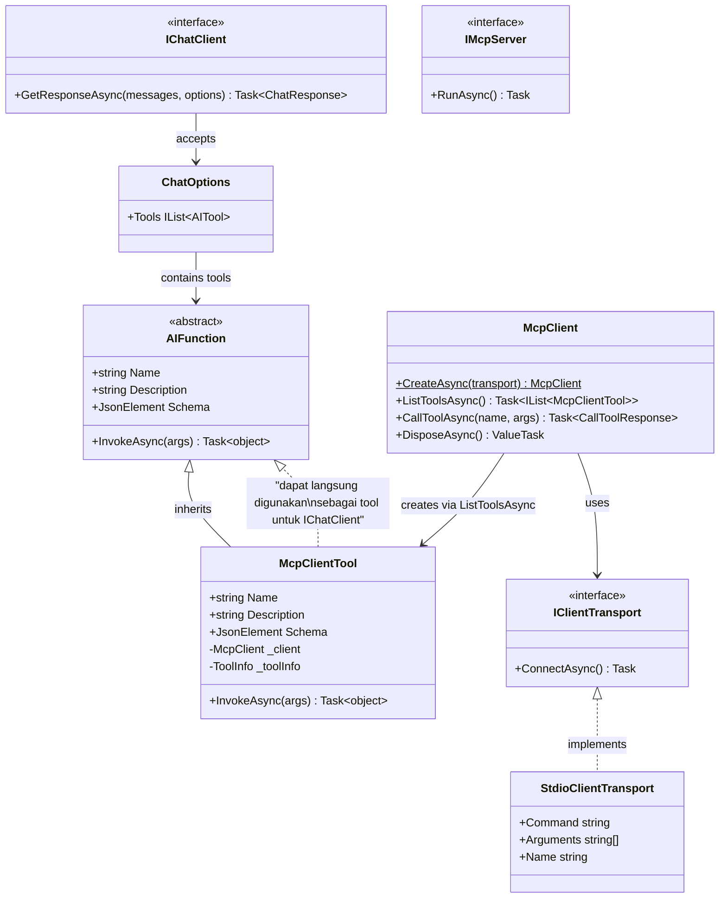
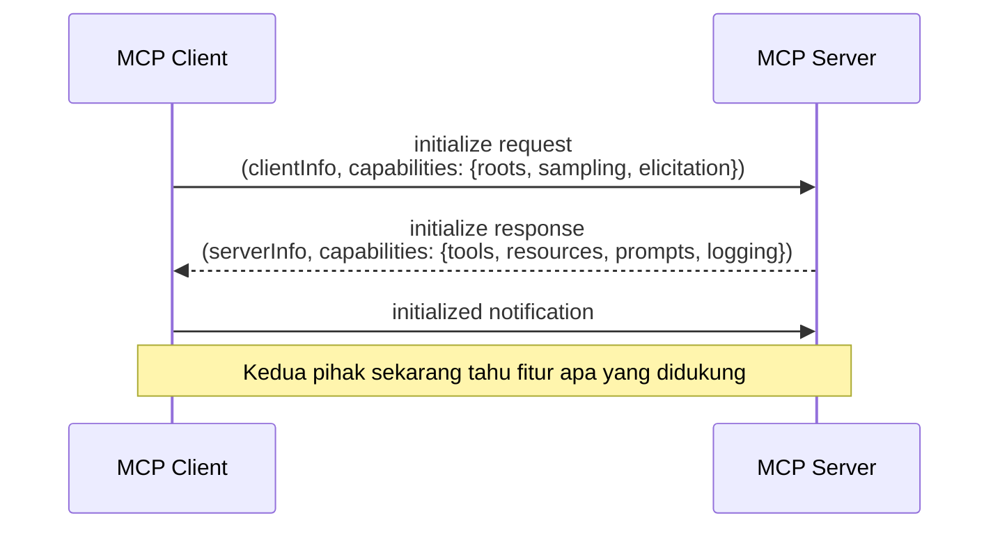
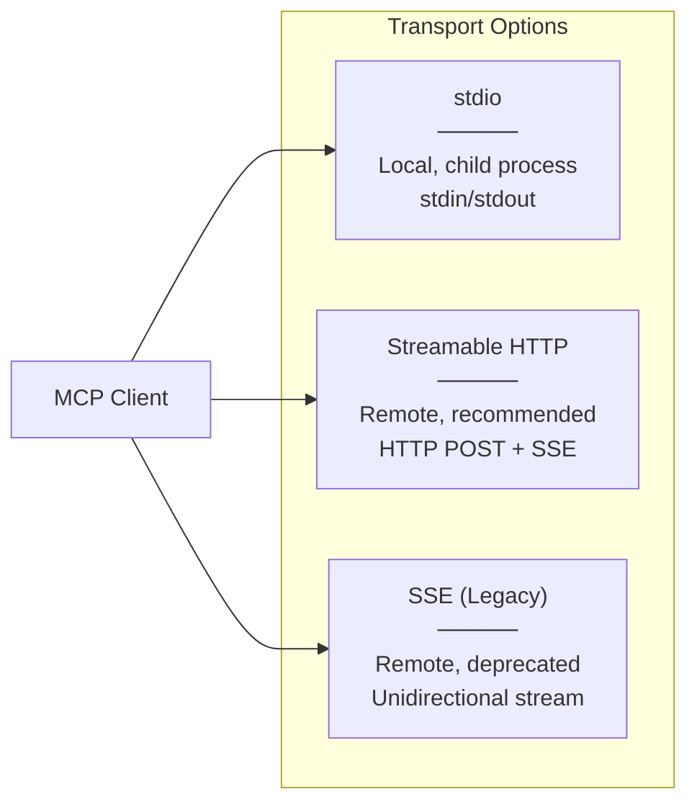
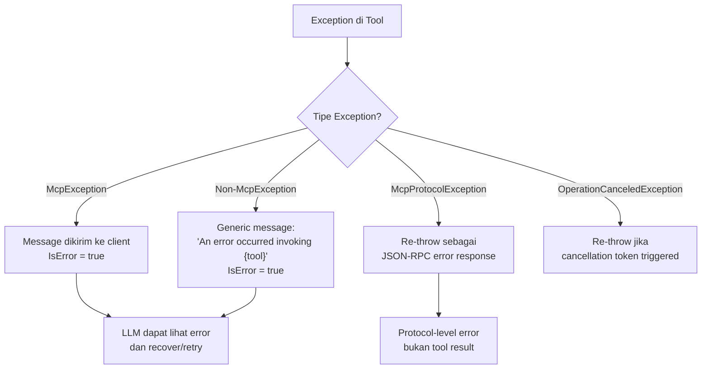

# Model Context Protocol (MCP) SDK - Konten Teori

## Apa itu Model Context Protocol (MCP)?

*Model Context Protocol* (MCP) adalah standar terbuka yang mendefinisikan bagaimana aplikasi AI berkomunikasi dengan external tools, data sources, dan services melalui protokol yang terstandarisasi. MCP diciptakan dan di-open-source-kan oleh **Anthropic** pada November 2024 sebagai solusi terhadap fragmentasi dalam ekosistem AI tooling - di mana setiap AI application sebelumnya harus membangun integrasi custom untuk setiap tool atau data source yang ingin diakses.

### Sejarah dan Motivasi

Sebelum MCP, setiap AI framework memiliki mekanisme proprietary untuk menghubungkan model dengan external capabilities:

- OpenAI menggunakan *Function Calling* dengan JSON schema
- LangChain memiliki *Tool* abstraction sendiri
- Semantic Kernel menggunakan *Plugin* system
- Microsoft Agent Framework menggunakan `AIFunction` dan `IChatClient`

Fragmentasi ini menciptakan masalah **N×M integration** - jika ada N AI applications dan M tool providers, dibutuhkan N×M custom integrations. MCP memecahkan masalah ini dengan menjadi *lingua franca* antara AI applications dan tools, mengurangi kompleksitas menjadi N+M (setiap application cukup implement MCP Client, setiap tool provider cukup implement MCP Server).

Anthropic merilis MCP dengan filosofi bahwa ekosistem AI memerlukan standar komunikasi yang mirip dengan apa yang HTTP lakukan untuk web - sebuah protokol universal yang memungkinkan interoperabilitas tanpa vendor lock-in.

### Posisi MCP dalam Ekosistem AI

MCP menempati lapisan *tool communication protocol* dalam arsitektur AI modern:

| Layer | Komponen | Contoh |
|-------|----------|--------|
| **Application Layer** | AI Agents, Chatbots, IDE Assistants | Claude Desktop, VS Code Copilot, Custom Agents |
| **Framework Layer** | Agent Frameworks, Orchestrators | Microsoft Agent Framework, LangChain, Semantic Kernel |
| **Protocol Layer** | Standar Komunikasi | **MCP**, A2A (Agent-to-Agent), OpenAPI |
| **Tool Layer** | External Services, Databases, APIs | File systems, GitHub, Databases, Web APIs |

MCP berada di *Protocol Layer* - menjembatani framework-level abstractions dengan actual tool implementations, memungkinkan tools dibangun sekali dan diakses oleh berbagai AI applications tanpa modifikasi.

---

## Arsitektur MCP

Model Context Protocol menggunakan arsitektur **client-server** dengan communication pattern berbasis **JSON-RPC 2.0**. Arsitektur ini dirancang untuk fleksibel, aman, dan mendukung berbagai transport mechanism.

### Komponen Utama

1. **Host** - Aplikasi utama yang mengontrol keseluruhan MCP lifecycle. Host mengelola satu atau lebih MCP Client instances dan bertanggung jawab atas security, consent, dan resource management. Contoh host: Claude Desktop, IDE extension, atau custom agent application.

2. **Client** - Komponen di dalam Host yang mempertahankan koneksi 1:1 dengan MCP Server. Client melakukan protocol negotiation, tool discovery, dan tool invocation atas nama Host. Setiap Client terhubung ke tepat satu Server.

3. **Server** - Proses terpisah yang mengekspos capabilities (tools, resources, prompts) melalui MCP protocol. Server bisa berupa lightweight process yang menjalankan tools sederhana atau complex service yang membungkus enterprise APIs.

4. **Transport** - Mekanisme komunikasi fisik antara Client dan Server. MCP mendukung dua transport utama:
   - **Stdio Transport**: Client menjalankan Server sebagai child process, komunikasi via stdin/stdout. Sederhana, tidak perlu network configuration.
   - **HTTP/SSE Transport**: Client berkomunikasi dengan Server melalui HTTP requests dan Server-Sent Events. Mendukung remote servers dan multiple concurrent clients.

5. **JSON-RPC 2.0** - Format pesan standar yang digunakan untuk semua komunikasi MCP. Mendukung request-response pattern dan notifications (one-way messages tanpa response).

### Architecture Diagram



### Lifecycle Komunikasi MCP

Komunikasi MCP mengikuti lifecycle yang terstruktur:



### JSON-RPC 2.0 Message Format

Semua komunikasi MCP menggunakan JSON-RPC 2.0. Ada tiga jenis pesan:

**Request** (memerlukan response):
```json
{
  "jsonrpc": "2.0",
  "id": 1,
  "method": "tools/call",
  "params": {
    "name": "GetCurrentWeather",
    "arguments": { "city": "Jakarta" }
  }
}
```

**Response** (jawaban atas request):
```json
{
  "jsonrpc": "2.0",
  "id": 1,
  "result": {
    "content": [{ "type": "text", "text": "{\"city\":\"Jakarta\",\"temperature\":32}" }],
    "isError": false
  }
}
```

**Notification** (one-way, tanpa response):
```json
{
  "jsonrpc": "2.0",
  "method": "notifications/initialized"
}
```

---

## Perbedaan Function Tools Lokal vs MCP Tools

Module 3 (Adding Tools) memperkenalkan konsep *function tools lokal* - di mana tools didefinisikan sebagai fungsi C# langsung di dalam aplikasi agent dan dipanggil secara in-process. MCP tools mengambil pendekatan berbeda - tools berjalan di *proses terpisah* dan diakses melalui protokol standar.

### Perbandingan Komprehensif

| Aspek | Function Tools Lokal (Module 3) | MCP Tools (Module 10) |
|-------|--------------------------------|----------------------|
| **Lokasi Eksekusi** | In-process, di dalam aplikasi agent | Out-of-process, di server terpisah |
| **Komunikasi** | Direct method call (zero overhead) | JSON-RPC 2.0 via transport (serialization overhead) |
| **Discovery** | Compile-time (hardcoded dalam kode) | Runtime (dynamic via `ListToolsAsync()`) |
| **Coupling** | Tight - tools terikat pada codebase agent | Loose - tools independen dari agent |
| **Deployment** | Monolithic (tools = bagian dari app) | Distributed (tools = service terpisah) |
| **Reusability** | Per-application (copy-paste antar project) | Cross-application (satu server, banyak client) |
| **Language** | Harus bahasa yang sama (.NET) | Language-agnostic (server bisa bahasa apapun) |
| **Versioning** | Coupled dengan app version | Independent versioning |
| **Testing** | Unit test langsung | Integration test + unit test |
| **Security** | Full trust (same process) | Trust boundary (inter-process) |

### Trade-offs Detail

#### Latency

- **Lokal**: ~0ms overhead. Function call langsung, tidak ada serialization.
- **MCP (stdio)**: ~1-10ms overhead per call. Memerlukan serialization → write ke stdin → process → read dari stdout → deserialization.
- **MCP (HTTP)**: ~5-100ms overhead per call. Tambahan network latency.

**Implikasi**: Untuk tools yang dipanggil sangat sering dalam tight loop (ratusan kali per request), function tools lokal lebih appropriate. Untuk tools yang dipanggil beberapa kali per conversation turn, latency MCP negligible dibanding latency LLM inference (~500-3000ms).

#### Reliability

- **Lokal**: Failure mode sederhana - exception langsung propagate. Tidak ada partial failure.
- **MCP**: Multiple failure modes - server crash, transport timeout, serialization error, protocol mismatch. Memerlukan error handling yang lebih robust.

**Implikasi**: MCP memerlukan defensive programming patterns (timeout, retry, graceful degradation). Tools mission-critical dengan SLA ketat mungkin lebih cocok sebagai lokal tools.

#### Maintainability

- **Lokal**: Mudah untuk small teams, sulit scale. Perubahan tool memerlukan redeploy seluruh agent.
- **MCP**: Lebih complex setup awal, tetapi sangat maintainable at scale. Tool teams dapat develop, test, dan deploy secara independen.

**Implikasi**: Pilih lokal untuk prototype dan small projects. Pilih MCP untuk production systems dengan multiple agents dan dedicated tool teams.

### Kapan Menggunakan Masing-masing

| Skenario | Rekomendasi | Alasan |
|----------|-------------|--------|
| Prototype/MVP | Function Tools Lokal | Cepat, sederhana, zero overhead |
| Single agent, single developer | Function Tools Lokal | Kompleksitas MCP tidak dibutuhkan |
| Multiple agents sharing tools | MCP | Build once, use everywhere |
| Tools dikembangkan tim berbeda | MCP | Independent development & deployment |
| Cross-language tool ecosystem | MCP | Language-agnostic protocol |
| Ultra-low latency requirement | Function Tools Lokal | Zero serialization overhead |
| Tool marketplace/ecosystem | MCP | Standardized discovery & invocation |

---

## .NET MCP SDK APIs

Official .NET MCP SDK (`ModelContextProtocol` NuGet package v2.x) menyediakan comprehensive APIs untuk membangun MCP Server maupun MCP Client. SDK ini dibangun di atas .NET Generic Host pattern dan terintegrasi seamless dengan Microsoft.Extensions.AI ecosystem.

### Server-Side APIs

#### Host Builder Configuration

```csharp
// Konfigurasi MCP Server menggunakan standard .NET Host Builder pattern
var builder = Host.CreateApplicationBuilder(args);

// Mendaftarkan MCP Server ke DI container
builder.Services
    .AddMcpServer()                    // Register MCP server services
    .WithStdioServerTransport()        // Gunakan stdio sebagai transport
    .WithToolsFromAssembly();          // Auto-discover tools dari assembly

await builder.Build().RunAsync();       // Start server dan tunggu koneksi
```

| API | Tujuan | Catatan |
|-----|--------|---------|
| `AddMcpServer()` | Mendaftarkan MCP server services ke DI container | Extension method pada `IServiceCollection` |
| `WithStdioServerTransport()` | Mengkonfigurasi stdio sebagai transport layer | Server menerima input dari stdin, output ke stdout |
| `WithToolsFromAssembly()` | Auto-register semua tools yang ditandai `[McpServerToolType]` | Scan assembly menggunakan reflection |
| `[McpServerToolType]` | Attribute untuk menandai class sebagai container tool | Diterapkan pada static class |
| `[McpServerTool]` | Attribute untuk menandai method sebagai MCP tool | Diterapkan pada public static method |
| `[Description]` | Menyediakan deskripsi untuk tool atau parameter | Dikirim ke client saat tool discovery |

#### Tool Definition Pattern

```csharp
[McpServerToolType]
public static class WeatherTools
{
    [McpServerTool, Description("Mendapatkan cuaca saat ini")]
    public static string GetCurrentWeather(
        [Description("Nama kota")] string city)
    {
        // Validasi input
        if (string.IsNullOrWhiteSpace(city))
            return "Error: Parameter 'city' tidak boleh kosong";
        
        // Logic dan return result
        return JsonSerializer.Serialize(new { city, temp = 30 });
    }
}
```

### Client-Side APIs

#### Connection dan Tool Discovery

```csharp
// Membuat transport - menjalankan server sebagai child process
var transport = new StdioClientTransport(new()
{
    Command = "dotnet",
    Arguments = ["run", "--project", "../McpSdk.Server/McpSdk.Server.csproj"],
    Name = "Weather MCP Server"
});

// Membuat MCP Client - melakukan initialization handshake
await using McpClient client = await McpClient.CreateAsync(transport);

// Tool Discovery - mendapatkan daftar tools dari server
IList<McpClientTool> tools = await client.ListToolsAsync();

// Direct Tool Invocation
var result = await client.CallToolAsync("GetCurrentWeather", 
    new Dictionary<string, object?> { ["city"] = "Jakarta" });
```

| API | Tujuan | Return Type |
|-----|--------|-------------|
| `StdioClientTransport` | Transport yang menjalankan server sebagai child process | `IClientTransport` |
| `McpClient.CreateAsync(transport)` | Membuat client dan melakukan initialization | `McpClient` |
| `client.ListToolsAsync()` | Menemukan semua tools yang tersedia di server | `IList<McpClientTool>` |
| `client.CallToolAsync(name, args)` | Memanggil tool tertentu dengan arguments | `CallToolResponse` |
| `McpClientTool` | Representasi tool di sisi client, inherits `AIFunction` | Class |

### Class Relationship Diagram



---

## Capabilities Negotiation

MCP menggunakan mekanisme *capability negotiation* saat connection setup. Proses ini memastikan bahwa client dan server saling memahami fitur apa saja yang masing-masing dukung, sehingga behavior dapat disesuaikan secara dinamis.

### Mekanisme Negotiation

Saat initialization handshake terjadi (`McpClient.CreateAsync()`), client dan server bertukar informasi capabilities yang didukung. Hal ini memungkinkan masing-masing pihak menyesuaikan behavior — misalnya client tidak akan mencoba subscribe ke resources jika server tidak mengiklankan capability tersebut.



### Client Capabilities

| Capability | Deskripsi |
|-----------|-----------|
| **Roots** | Menyediakan filesystem root URIs ke server, memungkinkan server memahami workspace structure |
| **Sampling** | Client dapat menangani LLM sampling requests dari server (server meminta client melakukan inference) |
| **Elicitation** | Client dapat menampilkan forms atau URLs ke user atas permintaan server |

### Server Capabilities

| Capability | Deskripsi |
|-----------|-----------|
| **Tools** | Server menyediakan tools yang bisa dipanggil oleh client |
| **Prompts** | Server menyediakan reusable prompt templates |
| **Resources** | Server mengekspos read-only data (dengan opsi Subscribe untuk real-time updates) |
| **Logging** | Server mendukung structured logging yang dikirim ke client |
| **Completions** | Server mendukung argument auto-completion |

### Automatic Capability Inference

Server capabilities otomatis di-infer dari configured features. Misalnya, ketika developer memanggil `.WithTools<T>()` pada server builder, SDK secara otomatis mendeklarasikan tools capability saat initialization. Developer tidak perlu secara manual mengkonfigurasi capabilities — cukup daftarkan fitur yang diinginkan, dan SDK mengurus sisanya.

### Protocol Version Negotiation

Protocol version negotiation terjadi secara otomatis selama initialization. Jika client dan server tidak kompatibel dalam hal versi protokol, initialization akan gagal dengan error yang jelas. Hal ini mencegah situasi di mana kedua pihak berkomunikasi dengan asumsi berbeda tentang format pesan atau behavior.

### Mengecek Server Capabilities dari Client

Setelah connection established, client dapat memeriksa capabilities apa yang server dukung dan bertindak sesuai:

```csharp
// Cek apakah server mendukung tools sebelum memanggil ListToolsAsync
if (client.ServerCapabilities.Tools is not null)
{
    var tools = await client.ListToolsAsync();
}

// Cek apakah server mendukung resource subscriptions
if (client.ServerCapabilities.Resources is { Subscribe: true })
{
    await client.SubscribeToResourceAsync("config://app/settings");
}
```

Pattern ini penting untuk membangun client yang robust — client dapat gracefully handle server dengan capabilities berbeda tanpa crash atau unexpected behavior.

---

## Transport Layer Detail

Transport layer menentukan bagaimana JSON-RPC messages secara fisik dikirim antara client dan server. .NET MCP SDK v2 mendukung tiga transport utama, masing-masing dengan karakteristik dan use case yang berbeda.

### Tiga Transport yang Didukung



### Stdio Transport

Komunikasi via stdin/stdout di mana server dijalankan sebagai child process oleh client. Ini adalah transport paling sederhana dan paling umum untuk tools lokal.

**StdioClientTransportOptions:**

| Option | Tipe | Deskripsi |
|--------|------|-----------|
| `Command` | `string` | Executable yang dijalankan (misal: `"dotnet"`) |
| `Arguments` | `string[]` | Arguments untuk command |
| `WorkingDirectory` | `string?` | Working directory untuk child process |
| `ShutdownTimeout` | `TimeSpan` | Waktu tunggu sebelum force-kill saat shutdown |
| `EnvironmentVariables` | `Dictionary<string, string>?` | Environment variables untuk child process |
| `InheritEnvironmentVariables` | `bool` | Apakah inherit env vars dari parent process (default: true) |

**⚠️ Security: Environment Variable Inheritance Risk**

Secara default, semua environment variables dari parent process (host application) mengalir otomatis ke child process (MCP server). Ini berarti credentials seperti `AWS_SECRET_ACCESS_KEY`, `GITHUB_TOKEN`, `DATABASE_CONNECTION_STRING`, dan lainnya bisa tersedia untuk server yang mungkin bukan trusted code.

```csharp
// ❌ Risiko: Semua env vars termasuk secrets mengalir ke server
var transport = new StdioClientTransport(new()
{
    Command = "dotnet",
    Arguments = ["run", "--project", "../ThirdPartyServer/"],
    InheritEnvironmentVariables = true  // default!
});

// ✅ Aman: Hanya env vars yang diperlukan saja yang diteruskan
var transport = new StdioClientTransport(new()
{
    Command = "dotnet",
    Arguments = ["run", "--project", "../ThirdPartyServer/"],
    InheritEnvironmentVariables = false,
    EnvironmentVariables = StdioClientTransport.GetDefaultEnvironmentVariables()
});
```

Gunakan `GetDefaultEnvironmentVariables()` untuk mendapatkan curated safe set yang hanya berisi environment variables standar (seperti `PATH`, `HOME`, `TEMP`) tanpa credentials.

### Streamable HTTP Transport (Recommended untuk Remote)

Transport yang direkomendasikan untuk remote/production deployment. Client mengirim HTTP POST requests, dan server menahan response open sebagai SSE stream untuk mengirim hasil secara incremental.

**Karakteristik utama:**

- **Stateless mode** (default di v2): Setiap request independen, tidak ada session state di server. Ideal untuk horizontal scaling tanpa session affinity.
- **Stateful mode**: Server mempertahankan session state, mendukung server-to-client requests (seperti sampling). Menggunakan `Mcp-Session-Id` header.
- **Session resumption**: Dalam stateful mode, client dapat resume session setelah disconnect.
- **Natural backpressure**: POST request ditahan sampai handler selesai — client secara alami menunggu dan tidak membanjiri server.
- **Host name validation**: Penting untuk mencegah DNS rebinding attacks — selalu validasi Host header pada server.

### SSE Transport (Legacy)

Transport lama yang menggunakan unidirectional server-to-client streaming (Server-Sent Events) ditambah separate HTTP endpoint untuk client-to-server messages.

**Karakteristik:**
- Disabled by default di v2, harus di-enable secara eksplisit
- Memerlukan stateful mode
- **Tidak memiliki backpressure** — client bisa membanjiri server dengan requests karena sending dan receiving menggunakan channel terpisah
- Dipertahankan hanya untuk backward compatibility dengan client/server v1

### Transport Comparison Table

| Aspek | stdio | Streamable HTTP (Stateless) | Streamable HTTP (Stateful) | SSE (Legacy) |
|-------|-------|----------------------------|---------------------------|--------------|
| Process model | Child process | Remote HTTP | Remote HTTP | Remote HTTP |
| Direction | Bidirectional | Request-response | Bidirectional | Server→client stream |
| Sessions | Implicit | None | Mcp-Session-Id | Session ID |
| Server-to-client requests | ✓ | ✗ | ✓ | ✓ |
| Backpressure | ✓ | ✓ | ✓ | ✗ |
| Session resumption | N/A | N/A | ✓ | ✗ |
| Horizontal scaling | N/A | No constraints | Session affinity | Session affinity |
| Best for | Local tools, IDE | Remote production | Server-to-client features | Legacy compatibility |

### In-Memory Transport (untuk Testing)

SDK menyediakan `StreamServerTransport` dan `StreamClientTransport` yang berkomunikasi via `System.IO.Pipelines` tanpa network atau process boundary. Sangat berguna untuk integration testing di mana developer ingin test tool behavior tanpa overhead proses terpisah.

```csharp
// Contoh setup in-memory transport untuk unit testing
var (serverTransport, clientTransport) = InMemoryTransport.CreatePair();
// Gunakan serverTransport di test server, clientTransport di test client
```

---

## Tools — Content Types dan Error Handling

### Content Types yang Didukung oleh Tools

MCP tools tidak hanya mengembalikan teks — SDK mendukung berbagai content type yang kaya untuk return values.

| Content Type | Cara Return | Deskripsi |
|-------------|-------------|-----------|
| **Text** | Return `string` | Otomatis di-wrap menjadi `TextContentBlock` |
| **Image** | Return `ImageContentBlock.FromBytes(bytes, "image/png")` | Binary image data dengan MIME type |
| **Audio** | Return `AudioContentBlock.FromBytes(bytes, "audio/wav")` | Binary audio data dengan MIME type |
| **Embedded Resources** | Return `EmbeddedResourceBlock` | Resource (text atau binary) yang di-embed dalam response |
| **Mixed Content** | Return `IEnumerable<ContentBlock>` | Multiple blocks dalam satu response |
| **Structured Content** | Set `UseStructuredContent = true` pada `[McpServerTool]` | Output mengikuti JSON Schema 2020-12 |

```csharp
[McpServerToolType]
public static class ContentExamples
{
    // Text — cukup return string
    [McpServerTool, Description("Mengembalikan text sederhana")]
    public static string GetGreeting(string name) 
        => $"Halo, {name}!";

    // Image — return ImageContentBlock
    [McpServerTool, Description("Generate chart image")]
    public static ImageContentBlock GetChart()
    {
        byte[] chartBytes = GenerateChartPng();
        return ImageContentBlock.FromBytes(chartBytes, "image/png");
    }

    // Mixed content — return multiple blocks
    [McpServerTool, Description("Analisis dengan gambar dan teks")]
    public static IEnumerable<ContentBlock> Analyze(string input)
    {
        yield return new TextContentBlock { Text = "Hasil analisis:" };
        yield return ImageContentBlock.FromBytes(
            GenerateVisualization(input), "image/png");
        yield return new TextContentBlock { Text = "Kesimpulan: data valid." };
    }
}
```

### Content Annotations

Setiap content block dapat dianotasi dengan metadata tambahan:

- **Audience**: Menentukan siapa yang seharusnya melihat content — `Role.Assistant` (hanya untuk model) atau `Role.User` (ditampilkan ke pengguna)
- **Priority**: Nilai `0.0` hingga `1.0` yang mengindikasikan seberapa penting content tersebut (1.0 = paling penting)

### Error Handling di Tools

Pemahaman tentang error handling dalam MCP sangat penting karena terdapat perbedaan fundamental antara *tool errors* dan *protocol errors*.



**Tool Errors vs Protocol Errors:**

| Aspek | Tool Error | Protocol Error |
|-------|-----------|----------------|
| **Penyebab** | Logic error dalam tool (invalid input, service unavailable) | Masalah protokol (method tidak ditemukan, invalid JSON-RPC) |
| **Representasi** | `CallToolResult` dengan `IsError = true` | JSON-RPC error response |
| **Visibility ke LLM** | ✓ LLM melihat error message, bisa decide next action | ✗ Biasanya menyebabkan exception di client |
| **Recovery** | LLM bisa retry dengan arguments berbeda | Client perlu handle di application level |

**Detail exception handling:**

- **McpException**: Message-nya langsung dikirim ke client sebagai tool error. Gunakan ini untuk error yang informatif bagi LLM.
- **Non-McpException**: Untuk security, hanya generic message `"An error occurred invoking '{toolName}'"` yang dikirim. Stack trace dan detail internal TIDAK dikirim ke client.
- **McpProtocolException**: Di-rethrow sebagai JSON-RPC error response — ini bukan tool error, melainkan indikasi masalah protokol.
- **OperationCanceledException**: Di-rethrow jika cancellation token sudah triggered (request dibatalkan).

**Client-side error checking:**

```csharp
var result = await client.CallToolAsync("ProcessData", args);

if (result.IsError is true)
{
    // Tool mengalami error — LLM bisa lihat pesan ini dan decide action
    Console.WriteLine($"Tool error: {result.Content[0].Text}");
}
```

### Tool List Change Notifications

Server dapat secara dinamis menambah atau menghapus tools saat runtime, kemudian mengirim notification ke connected clients agar mereka refresh daftar tools. Ini memungkinkan sistem yang adaptif di mana available tools berubah berdasarkan kondisi (misalnya: tools tertentu hanya tersedia setelah authentication).

### JSON Schema Generation

Parameter types dari C# method secara otomatis di-map ke JSON Schema types:

| C# Type | JSON Schema Type |
|---------|-----------------|
| `string` | `string` |
| `int`, `long` | `integer` |
| `float`, `double`, `decimal` | `number` |
| `bool` | `boolean` |
| Complex types (class/record) | `object` (dengan nested properties) |
| `string[]`, `List<T>` | `array` |
| Nullable types (`T?`) | Type tanpa `required` constraint |

### MCP Header (v2 Feature)

Parameter tool dapat di-mirror sebagai HTTP headers menggunakan `[McpHeader]` attribute. Ini berguna untuk routing dan middleware processing tanpa perlu parse tool arguments:

```csharp
[McpServerTool, Description("Query data by region")]
public static string QueryData(
    [McpHeader("Region"), Description("Target region")] string region,
    [Description("Query string")] string query)
{
    // 'region' juga dikirim sebagai HTTP header "Region: {value}"
    // Berguna untuk load balancer routing berdasarkan region
    return ExecuteQuery(region, query);
}
```

---

## Resources dan Prompts

### Resources

MCP Server dapat mengekspos *resources* — read-only data yang bisa dibaca oleh client. Resources merepresentasikan berbagai jenis data: files, database records, API responses, atau live system data.

#### Jenis Resources

| Jenis | Deskripsi | Contoh URI |
|-------|-----------|-----------|
| **Direct Resources** | URI fixed, langsung muncul di `ListResources` | `config://app/settings` |
| **Template Resources** | URI template (RFC 6570) dengan parameter | `users://{userId}/profile` |

#### Attribute-Based Resource Definition

```csharp
[McpServerResourceType]
public static class AppResources
{
    // Direct resource — URI fixed
    [McpServerResource(Uri = "config://app/settings")]
    [Description("Application configuration settings")]
    public static string GetSettings()
    {
        return JsonSerializer.Serialize(LoadAppSettings());
    }

    // Template resource — URI dengan parameter
    [McpServerResource(UriTemplate = "users://{userId}/profile")]
    [Description("User profile by ID")]
    public static string GetUserProfile(string userId)
    {
        var profile = LoadUserProfile(userId);
        return JsonSerializer.Serialize(profile);
    }
}
```

#### Client-Side Resource Access

```csharp
// List semua direct resources
var resources = await client.ListResourcesAsync();

// List resource templates
var templates = await client.ListResourceTemplatesAsync();

// Baca resource tertentu
var content = await client.ReadResourceAsync("config://app/settings");

// Subscribe ke resource updates (jika server mendukung)
if (client.ServerCapabilities.Resources is { Subscribe: true })
{
    await client.SubscribeToResourceAsync("config://app/settings");
    // Client akan menerima notification saat resource berubah
}
```

#### Resource Subscriptions

Client dapat subscribe ke resource updates — server mengirim notification setiap kali content resource berubah. Ini memungkinkan reactive patterns di mana client selalu memiliki data terbaru tanpa polling.

### Prompts

MCP Server dapat mengekspos *prompts* — reusable prompt templates yang menyediakan structured interaction patterns. Prompts memungkinkan server menawarkan cara terstandarisasi untuk berinteraksi dengan capabilities-nya.

**Catatan**: Fitur prompts belum diimplementasikan dalam module ini, tetapi penting untuk dipahami sebagai bagian dari MCP capabilities. Prompts memungkinkan server menyediakan:
- Pre-configured interaction templates
- Multi-step workflows
- Domain-specific conversation starters
- Parameterized prompt generation

> **Konten dalam section "Capabilities Negotiation", "Transport Layer Detail", "Tools — Content Types dan Error Handling", dan "Resources dan Prompts" dirangkum dan diparafrase dari [dokumentasi resmi .NET MCP SDK v2](https://csharp.sdk.modelcontextprotocol.io/v2/concepts/index.html).**

---

## McpClientTool → AIFunction Inheritance

Salah satu design decision paling elegant dalam .NET MCP SDK adalah bahwa `McpClientTool` mewarisi langsung dari `AIFunction`. Ini bukan kebetulan - ini adalah *intentional design pattern* yang memungkinkan MCP tools seamlessly terintegrasi dengan seluruh ekosistem Microsoft.Extensions.AI.

### Mengapa Inheritance (Bukan Adapter)?

```
AIFunction (abstract base class)
    ├── Custom local function tools (Module 3)
    ├── McpClientTool (dari MCP Server)
    └── Future tool sources (plugins, marketplace, dll.)
```

Dengan pendekatan inheritance:

1. **Zero-adapter integration** - `McpClientTool` langsung diterima di mana saja `AIFunction` diharapkan. Tidak perlu wrapper, converter, atau mapping layer.

2. **Polymorphic tool composition** - Agent dapat menerima campuran local tools dan MCP tools dalam satu `ChatOptions.Tools` list tanpa membedakan asal-usul tool.

3. **Unified schema** - Semua tools (lokal maupun MCP) memiliki interface yang sama: `Name`, `Description`, `Schema`, dan `InvokeAsync()`. AI model melihat semua tools dengan cara yang identik.

### Implikasi Design Pattern

#### Extensibility
Karena `AIFunction` adalah abstract class (bukan interface), SDK menyediakan default behavior yang bisa di-override. `McpClientTool` mengimplementasikan `InvokeAsync()` dengan mengirim JSON-RPC call ke server - tetapi pattern ini bisa diperluas untuk tools dari sumber lain (gRPC, WebSocket, dll.) dengan membuat subclass baru dari `AIFunction`.

#### Composability
```csharp
// Mixing local tools dan MCP tools - seamless karena common base class
var allTools = new List<AITool>();
allTools.Add(AIFunctionFactory.Create(LocalCalculator));  // Local tool
allTools.AddRange(await mcpClient.ListToolsAsync());       // MCP tools

var options = new ChatOptions { Tools = allTools };
// Agent tidak perlu tahu mana lokal, mana MCP
```

#### Testability
Karena interface seragam, unit tests untuk agent logic tidak perlu mock MCP infrastructure - cukup provide `AIFunction` implementations apapun (termasuk simple in-memory fakes).

---

## Hubungan dengan Module 3 dan Module 8

### Evolusi dari Module 3: Adding Tools

Module 3 memperkenalkan konsep *function tools* - di mana developer mendefinisikan fungsi C# yang dapat dipanggil oleh AI agent berdasarkan konteks percakapan. Pattern yang digunakan:

```csharp
// Module 3 - Local function tool (in-process)
[Description("Mendapatkan cuaca")]
static string GetWeather(string city) => $"Cuaca di {city}: Cerah, 30°C";

var tool = AIFunctionFactory.Create(GetWeather);
var options = new ChatOptions { Tools = [tool] };
```

Module 10 (MCP SDK) mengambil konsep yang sama dan meng-*evolve*-nya ke level protocol-based:

```csharp
// Module 10 - MCP tool (out-of-process, protocol-based)
// Server side: mendefinisikan tool yang sama
[McpServerToolType]
public static class WeatherTools
{
    [McpServerTool, Description("Mendapatkan cuaca")]
    public static string GetWeather([Description("Kota")] string city) 
        => $"Cuaca di {city}: Cerah, 30°C";
}

// Client side: discover dan gunakan tanpa mengetahui implementasi
IList<McpClientTool> tools = await mcpClient.ListToolsAsync();
var options = new ChatOptions { Tools = [.. tools] };
```

**Evolusi**:
- Module 3: Tools = kode lokal yang di-compile bersama agent
- Module 10: Tools = kapabilitas yang di-discover at runtime dari external server

### Komplementer dengan Module 8: A2A Communication

Module 8 membahas *Agent-to-Agent* (A2A) communication - bagaimana agents berkomunikasi satu sama lain untuk menyelesaikan task secara kolaboratif. MCP dan A2A memiliki scope yang berbeda namun komplementer:

| Aspek | MCP (Module 10) | A2A (Module 8) |
|-------|-----------------|----------------|
| **Hubungan** | Agent → Tool | Agent → Agent |
| **Pola** | Client-Server | Peer-to-Peer / Hierarchical |
| **Tujuan** | Akses kapabilitas (tools, resources) | Kolaborasi dan delegasi task |
| **Discovery** | Tool discovery (schema, name, description) | Agent discovery (skills, capabilities) |
| **Granularity** | Single function call | Complex task delegation |
| **State** | Stateless per-call | Stateful conversation |

**Analogi**: Jika agent adalah seorang pekerja, maka:
- **MCP** = alat-alat yang pekerja gunakan (palu, gergaji, komputer) - tool invocation
- **A2A** = rekan kerja yang pekerja ajak berdiskusi atau delegasikan pekerjaan - peer communication

Dalam arsitektur yang matang, kedua protocol digunakan bersamaan: agent memanggil MCP tools untuk operasi atomik (get data, transform data) dan berkomunikasi via A2A untuk delegasi task kompleks ke agent spesialis.

---

## Use Cases, Limitasi, dan Perbandingan Alternatif

### Use Cases Konkret

#### 1. Shared Tool Server untuk Multiple Agents

Sebuah enterprise memiliki beberapa agent berbeda (customer support agent, analytics agent, operations agent) yang semuanya memerlukan akses ke tools yang sama (database queries, email sending, document retrieval). Dengan MCP, satu tool server dapat melayani semua agents tanpa duplikasi kode.

**Keuntungan**:
- Single source of truth untuk tool logic
- Perubahan tool otomatis tersedia untuk semua agents
- Centralized logging dan monitoring

#### 2. Third-Party Tool Integration / Tool Marketplace

MCP memungkinkan ekosistem tool marketplace di mana third-party developers membuat MCP servers yang menyediakan specialized tools (contoh: Jira integration, Slack messaging, database management). AI applications cukup connect ke MCP server tanpa perlu understand internal implementation.

**Keuntungan**:
- Vendor-neutral tool ecosystem
- Plug-and-play tool installation
- Community-driven tool development

#### 3. Secure Tool Isolation

Dalam skenario di mana tools mengakses sensitive resources (production databases, payment systems), menjalankan tools di proses terpisah memberikan security boundary natural. Server dapat membatasi capabilities yang diekspos dan melakukan fine-grained access control.

**Keuntungan**:
- Process-level isolation (crash isolation)
- Capability-based access control
- Audit trail pada server side

#### 4. Cross-Language Tool Development

Tim data science membangun ML inference tools dalam Python, sementara agent application ditulis dalam .NET. MCP memungkinkan tools ditulis dalam bahasa apapun selama mengimplementasikan protocol - eliminasi kebutuhan FFI (Foreign Function Interface) atau REST wrapper custom.

**Keuntungan**:
- Language flexibility untuk tool developers
- Best-in-class libraries per domain
- Independent technology stack evolution

### Limitasi MCP

#### 1. Serialization dan Communication Overhead

Setiap tool call memerlukan serialization arguments ke JSON, pengiriman melalui transport, deserialization di server, processing, serialization result, dan deserialization kembali di client. Untuk tools yang dipanggil dalam tight loop atau membutuhkan transfer data besar, overhead ini dapat signifikan.

**Dampak**: Latency per-call bertambah 1-10ms (stdio) atau 5-100ms (HTTP). Tidak cocok untuk tools yang dipanggil ribuan kali per second.

**Mitigasi**: Gunakan local function tools untuk high-frequency operations; gunakan MCP untuk operations yang sudah inherently slow (API calls, database queries).

#### 2. Dependency pada External Process

MCP Server berjalan sebagai proses terpisah. Ini berarti:
- Server bisa crash tanpa agent tahu (sampai timeout atau next call fails)
- Startup time server menambah cold-start latency
- Resource management lebih kompleks (orphan processes, memory leaks di server)
- Debugging lintas proses lebih sulit

**Dampak**: Operational complexity bertambah. Perlu monitoring, health checks, dan graceful degradation strategies.

**Mitigasi**: Implement health check endpoints, use process supervision, design agent untuk handle tool failures gracefully.

#### 3. Protocol Maturity dan Ecosystem Size

MCP relatif baru (dirilis November 2024). Ecosystem masih dalam fase pertumbuhan:
- Tidak semua AI frameworks memiliki native MCP support
- Tooling untuk debugging MCP communication masih terbatas
- Best practices dan patterns masih evolving
- Breaking changes masih mungkin di versi mendatang

**Dampak**: Early adopter risk - API mungkin berubah, community resources terbatas.

**Mitigasi**: Pin versi SDK, follow official changelog, contribute ke community.

### Perbandingan dengan Pendekatan Alternatif

| Pendekatan | Kekuatan | Kelemahan | Kapan Memilih |
|-----------|----------|-----------|---------------|
| **MCP** | Standardized protocol, dynamic discovery, language-agnostic, growing ecosystem | Overhead serialization, process management complexity | Multiple agents/tools, team-based development, tool marketplace |
| **Direct Function Call** | Zero overhead, simple debugging, type-safe | Tight coupling, no reusability across apps, monolithic | Single agent, prototype, performance-critical tools |
| **REST API** | Well-understood, HTTP tooling mature, stateless | No standardized tool schema, manual integration per API, no dynamic discovery | Existing REST services, public APIs, web-first architecture |
| **gRPC** | High performance, strong typing (protobuf), streaming | Complex setup, not AI-native, no tool discovery protocol | High-throughput internal services, strongly-typed contracts |
| **Plugin System** (e.g., Semantic Kernel) | Framework-integrated, type-safe, good DX | Framework-locked, no cross-framework reuse | Single framework, .NET-only ecosystem |

---

## Security Considerations

Keamanan dalam MCP memerlukan perhatian khusus karena arsitektur client-server membuat *trust boundary* eksplisit antara komponen. Berbeda dengan local function tools yang berjalan dalam trust domain yang sama, MCP memperkenalkan attack surface baru yang harus dimitigasi.

### Trust Boundary

```
┌─────────────────────────────────────────────────────┐
│                    HOST (Trusted)                     │
│  ┌─────────────────────────────────────────────┐    │
│  │         MCP Client (Trusted)                 │    │
│  │  • Validates server responses                │    │
│  │  • Controls which servers to connect to      │    │
│  │  • Limits what data is sent to server        │    │
│  └──────────────────────┬──────────────────────┘    │
│                         │                            │
└─────────────────────────┼────────────────────────────┘
                          │ Trust Boundary
┌─────────────────────────┼────────────────────────────┐
│  ┌──────────────────────┴──────────────────────┐    │
│  │       MCP Server (Semi-Trusted)              │    │
│  │  • Processes requests from client            │    │
│  │  • Has access to external resources          │    │
│  │  • May be third-party code                   │    │
│  └─────────────────────────────────────────────┘    │
│                    SERVER PROCESS                     │
└─────────────────────────────────────────────────────┘
```

**Prinsip dasar**: Host/Client adalah trusted entity yang mengontrol interaksi. Server adalah semi-trusted - diberi akses terbatas sesuai kebutuhan.

### Input Validation pada Server Tools

Server tools WAJIB melakukan validasi input yang ketat karena arguments datang dari external source (AI model melalui client). Input yang tidak divalidasi dapat menyebabkan:

1. **Injection attacks** - Jika tool mengeksekusi query database atau shell command, input yang tidak di-sanitize bisa menjadi injection vector.
2. **Resource exhaustion** - Parameter `days = 999999` bisa menyebabkan server mengalokasi memory berlebihan.
3. **Unauthorized access** - Parameter path seperti `../../etc/passwd` bisa mengakses file di luar intended scope.

**Best practices**:
```csharp
[McpServerTool]
public static string ProcessData(
    [Description("Input data (max 1000 chars)")] string input)
{
    // 1. Null/empty check
    if (string.IsNullOrWhiteSpace(input))
        return "Error: input tidak boleh kosong";
    
    // 2. Length limit
    if (input.Length > 1000)
        return "Error: input melebihi batas 1000 karakter";
    
    // 3. Format validation
    if (!IsValidFormat(input))
        return "Error: format input tidak valid";
    
    // 4. Process setelah validasi berhasil
    return DoProcess(input);
}
```

### Strategi Capability Limiting

Prinsip *Principle of Least Privilege* sangat penting dalam MCP:

1. **Expose minimal tools** - Hanya ekspos tools yang benar-benar diperlukan. Jangan membuat "god server" yang bisa melakukan segalanya.

2. **Scope parameter access** - Jika tool membaca file, batasi ke directory tertentu. Jika tool query database, batasi ke tables/views tertentu.

3. **Rate limiting** - Implementasikan rate limiting pada server side untuk mencegah abuse (baik dari compromised client maupun AI model yang melakukan excessive tool calls).

4. **Read-only vs Read-Write separation** - Pisahkan tools yang hanya membaca data (safe) dari tools yang memodifikasi state (dangerous). Berikan access ke write tools hanya setelah explicit user consent.

5. **Audit logging** - Log semua tool invocations pada server side (who called what, when, with what parameters, what result). Ini penting untuk forensics dan compliance.

### Threat Model untuk MCP

| Threat | Deskripsi | Mitigasi |
|--------|-----------|----------|
| **Malicious Server** | Server yang dicompromise mengembalikan data berbahaya | Validate server responses, use trusted servers only |
| **Prompt Injection via Tool Result** | Tool result mengandung instructions yang mengmanipulasi AI model | Sanitize tool results, separate tool output dari system instructions |
| **Data Exfiltration** | AI model mengirim sensitive data sebagai tool arguments | Review tool schemas, limit what agent can pass to tools |
| **Denial of Service** | Excessive tool calls membuat server overwhelmed | Rate limiting, timeout, circuit breaker pattern |
| **Man-in-the-Middle** | Transport communication diintercept (terutama HTTP) | Use TLS for HTTP transport, prefer stdio for local |

---

## Terminologi Kunci

| Istilah | Penjelasan | Konteks Penggunaan |
|---------|-----------|-------------------|
| *Host* | Aplikasi utama yang menjalankan dan mengelola MCP Clients. Host bertanggung jawab atas lifecycle management, security policies, dan user consent. | Dalam module ini, application `McpSdk.Client` bertindak sebagai Host yang mengelola satu `McpClient` instance. |
| *Client* | Komponen di dalam Host yang mempertahankan koneksi 1:1 ke satu MCP Server. Client melakukan protocol negotiation, mengirim requests, dan menerima responses. | Dibuat menggunakan `McpClient.CreateAsync(transport)`. Setiap client terhubung ke tepat satu server. |
| *Server* | Proses terpisah yang mengekspos capabilities melalui MCP protocol. Server mendaftarkan tools, resources, dan prompts yang dapat diakses oleh client. | Aplikasi `McpSdk.Server` yang dikonfigurasi dengan `AddMcpServer()` dan menjalankan `WeatherTools`. |
| *Transport* | Mekanisme komunikasi fisik antara Client dan Server. Menentukan bagaimana JSON-RPC messages dikirim dan diterima. | Stdio transport (`StdioClientTransport`) menjalankan server sebagai child process; HTTP transport untuk remote servers. |
| *Tool* | Fungsi yang dapat dipanggil oleh client melalui MCP protocol. Setiap tool memiliki nama, deskripsi, dan JSON Schema untuk parameter input. | Dalam konteks MCP, tool = fungsi yang didaftarkan dengan `[McpServerTool]` attribute di server. Berbeda dari "tool" generik di AI frameworks. |
| *Resource* | Data atau konten yang diekspos oleh server dan dapat dibaca oleh client. Resources bersifat read-only dan diidentifikasi oleh URI. | Contoh: file content, database records, API responses. Belum digunakan di module ini (fokus pada tools). |
| *Prompt* | Template interaksi yang didefinisikan server untuk membantu client menggunakan capabilities server secara optimal. | Contoh: server menyediakan prompt template "analyze-weather" yang sudah terstruktur. Belum digunakan di module ini. |
| *JSON-RPC 2.0* | Protokol remote procedure call yang menggunakan JSON sebagai format data. Mendukung request-response dan notification patterns. | Semua komunikasi MCP menggunakan JSON-RPC 2.0 - setiap tool call adalah JSON-RPC request, hasilnya adalah JSON-RPC response. |
| *Capabilities* | Fitur-fitur yang didukung oleh client atau server, dinegosiasikan saat initialization. Menentukan apa yang bisa dilakukan masing-masing pihak. | Saat `CreateAsync()`, client dan server bertukar capabilities (contoh: server mendukung tools tetapi tidak resources). |
| *Initialization* | Fase pertama komunikasi MCP di mana client dan server melakukan handshake: bertukar versi protocol, capabilities, dan metadata. | Terjadi secara otomatis saat `McpClient.CreateAsync()` - developer tidak perlu handle manual. |
| *McpClientTool* | Representasi tool di sisi client. Mewarisi dari `AIFunction` sehingga dapat langsung digunakan sebagai tool untuk `IChatClient` tanpa adapter. | Didapat dari `client.ListToolsAsync()`. Setiap item berisi name, description, schema, dan kemampuan invoke tool di server. |

---

## Analogi dan Contoh Dunia Nyata

### Analogi 1: MCP sebagai USB Standard

Bayangkan era sebelum USB - setiap perangkat memiliki konektor berbeda (serial port, parallel port, PS/2, FireWire). Setiap komputer harus menyediakan port spesifik untuk setiap perangkat. USB menyelesaikan masalah ini dengan menjadi standar universal - satu konektor untuk semua perangkat.

**Mapping ke MCP:**
- Berbagai konektor = berbagai custom tool integration methods
- USB standard = MCP protocol
- Komputer = AI Host/Agent application
- Perangkat USB = MCP Server (tool provider)
- USB port = MCP Client
- Plug-and-play = Dynamic tool discovery (`ListToolsAsync()`)

### Analogi 2: MCP Server sebagai Restoran

MCP Server seperti restoran dengan menu (tool list). Customer (MCP Client) tidak perlu tahu cara memasak - cukup lihat menu (tool discovery), pesan (tool invocation), dan terima makanan (tool result). Restoran bisa mengubah resep tanpa customer tahu, selama menu tetap sama.

**Mapping ke MCP:**
- Menu = Tool schemas (name, description, parameters)
- Memesan = `CallToolAsync(toolName, arguments)`
- Pelayan = Transport layer (membawa request dan response)
- Dapur = Server-side tool implementation
- Customer = MCP Client / Agent

### Analogi 3: Stdio Transport sebagai Walkie-Talkie Internal

Stdio transport seperti sistem walkie-talkie internal di sebuah gedung - komunikasi langsung antara dua orang di gedung yang sama, tanpa perlu infrastruktur jaringan. HTTP transport seperti telepon - bisa menghubungi orang di mana saja, tapi perlu infrastruktur telekomunikasi.

**Mapping ke MCP:**
- Walkie-talkie = Stdio transport (local, direct, simple)
- Telepon = HTTP/SSE transport (remote, requires network)
- Gedung yang sama = Same machine (client dan server di mesin yang sama)
- Infrastruktur telekomunikasi = Network infrastructure (DNS, TLS, routing)

---

## Fondasi untuk Ekosistem AI yang Matang

Module ini merepresentasikan evolusi penting dalam cara kita membangun AI systems:

- **Dari monolithic ke modular** - Tools tidak lagi terikat pada satu aplikasi, melainkan menjadi services yang dapat diakses oleh siapapun melalui protocol standar.
- **Dari static ke dynamic** - Agent tidak perlu mengetahui tools apa yang tersedia saat compile time. Discovery terjadi at runtime, memungkinkan tool landscape berubah tanpa redeploy agent.
- **Dari proprietary ke standardized** - MCP mengurangi vendor lock-in dengan menyediakan protocol universal yang tidak terikat pada satu framework atau language.

Penguasaan MCP memberikan learner kemampuan untuk:
1. Membangun tool servers yang dapat digunakan oleh seluruh organisasi
2. Mengintegrasikan third-party tools ke dalam agent tanpa custom code per-integration
3. Mendesain arsitektur AI yang scalable, maintainable, dan secure
4. Berkontribusi pada ekosistem open-source MCP yang sedang berkembang pesat

---

## Bacaan Lanjutan

- [.NET MCP SDK Documentation (v2) — Concepts](https://csharp.sdk.modelcontextprotocol.io/v2/concepts/index.html) - Dokumentasi resmi .NET MCP SDK yang mencakup getting started, API reference, dan contoh implementasi server dan client menggunakan `ModelContextProtocol` NuGet package.
- [.NET MCP SDK v2 — Tools](https://csharp.sdk.modelcontextprotocol.io/v2/concepts/tools/tools.html) - Dokumentasi lengkap tentang tool definition, content types, error handling, dan advanced tool features.
- [.NET MCP SDK v2 — Transports](https://csharp.sdk.modelcontextprotocol.io/v2/concepts/transports/transports.html) - Detail tentang transport mechanisms (stdio, Streamable HTTP, SSE) termasuk configuration options dan security considerations.
- [Announcing v2.0 of the official MCP C# SDK](https://devblogs.microsoft.com/dotnet/announcing-v20-of-the-official-mcp-csharp-sdk/) - Blog post resmi Microsoft yang mengumumkan v2 SDK dengan fitur-fitur baru seperti Streamable HTTP, structured content, dan MCP headers.
- [Model Context Protocol Specification](https://modelcontextprotocol.io) - Spesifikasi resmi MCP yang mendefinisikan protocol, transport mechanisms, message formats, dan capabilities negotiation. Referensi utama untuk memahami protocol secara mendalam.
- [Microsoft Agent Framework - Adding Tools (Module 3)](https://learn.microsoft.com/en-us/dotnet/ai/conceptual/agents) - Dokumentasi Microsoft tentang konsep agents dan tools dalam ekosistem .NET AI, termasuk `IChatClient`, `AIFunction`, dan function invocation patterns yang menjadi fondasi integrasi MCP.
- [MCP GitHub Repository](https://github.com/modelcontextprotocol) - Source code, specification drafts, dan community discussions seputar Model Context Protocol. Termasuk reference implementations dalam berbagai bahasa.
- [Introduction to MCP by Anthropic](https://www.anthropic.com/news/model-context-protocol) - Announcement post dari Anthropic yang menjelaskan motivasi, visi, dan roadmap MCP sebagai open standard untuk AI tooling.
