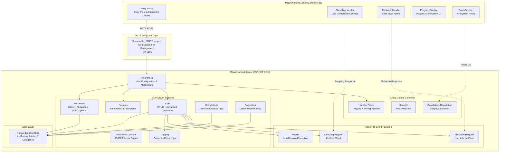

# Module 11: MCP Advanced — Knowledge Base Management System

Module expert-level yang mengajarkan semua konsep MCP (Model Context Protocol) lanjutan menggunakan domain **Knowledge Base Management System**. Module ini merupakan kelanjutan dari Module 10 (03-McpSdk) dan mencakup: Resources, Prompts, Structured Content, Logging, Completions, Pagination, Handler Filters, Streamable HTTP Transport, Progress Tracking, Cancellation, Capabilities Negotiation, Multi Round-Trip Requests (MRTR), Sampling, Roots, Elicitation, Security Patterns, dan Docker Deployment.

---

## Prerequisites

| Kebutuhan | Keterangan |
|-----------|------------|
| **Module 10 (03-McpSdk)** | Wajib diselesaikan terlebih dahulu — mencakup dasar MCP (Tools + Stdio Transport + Agent Integration) |
| **.NET SDK 9.0+** | Download di https://dotnet.microsoft.com/download |
| **NuGet Packages** | `ModelContextProtocol` v2.x, `ModelContextProtocol.AspNetCore` v2.x |
| **Docker** | Opsional — diperlukan untuk section Docker Deployment |
| **Text Editor / IDE** | Visual Studio 2022, VS Code, atau JetBrains Rider |

### NuGet Packages yang Digunakan

**McpAdvanced.Server:**
- `ModelContextProtocol` — Core MCP library untuk .NET
- `ModelContextProtocol.AspNetCore` — HTTP Transport integration untuk ASP.NET Core
- `Microsoft.Extensions.Hosting` — Host builder dan dependency injection

**McpAdvanced.Client:**
- `ModelContextProtocol` — Core MCP library (client-side) dengan HTTP transport support

---

## Arsitektur Module

### Diagram Arsitektur



### Struktur Project

```
04-Expert/04-McpAdvanced/
├── README.md                          ← Dokumen ini
├── THEORY.md                          ← Konten teori komprehensif
├── Dockerfile                         ← Multi-stage build untuk deployment
├── McpAdvanced.Server/
│   ├── McpAdvanced.Server.csproj      ← ASP.NET Core web application
│   ├── Program.cs                     ← Entry point, HTTP transport, filters
│   ├── appsettings.json               ← Konfigurasi (AllowedHosts, dll.)
│   ├── Models/
│   │   ├── Article.cs                 ← Record type artikel knowledge base
│   │   ├── Category.cs               ← Record type kategori
│   │   ├── ArticleCreationResult.cs   ← Schema output untuk Structured Content
│   │   └── KnowledgeBaseStore.cs      ← In-memory store (ConcurrentDictionary)
│   ├── Resources/
│   │   └── KnowledgeBaseResources.cs  ← Direct resources & templates
│   ├── Prompts/
│   │   └── KnowledgeBasePrompts.cs    ← Prompt templates (search, summarize, compare)
│   ├── Tools/
│   │   ├── ArticleTools.cs            ← CRUD + Structured Content + Progress
│   │   ├── SearchTools.cs             ← Pencarian knowledge base
│   │   └── AdminTools.cs             ← MRTR, Sampling, Elicitation
│   ├── Filters/
│   │   └── McpFilters.cs             ← Logging & Timing filter pipeline
│   ├── Completions/
│   │   └── KnowledgeBaseCompletions.cs ← Auto-complete handler
│   └── Pagination/
│       └── ResourcePaginationHandler.cs ← Cursor-based pagination
└── McpAdvanced.Client/
    ├── McpAdvanced.Client.csproj      ← Console application
    ├── Program.cs                     ← Entry point, interactive menu
    ├── .env.example                   ← Template environment variables
    └── Handlers/
        ├── SamplingHandler.cs         ← LLM completion callback
        ├── ElicitationHandler.cs      ← User input forms handler
        └── ProgressDisplay.cs         ← Progress notification UI
```

---

## Fitur yang Didemonstrasikan

| Fitur MCP | File Implementasi | Referensi THEORY.md |
|-----------|-------------------|---------------------|
| **Resources (Direct)** | `Server/Resources/KnowledgeBaseResources.cs` | Section 1: Resources |
| **Resource Templates (RFC 6570)** | `Server/Resources/KnowledgeBaseResources.cs` | Section 1: Resources |
| **Resource Subscriptions** | `Server/Resources/KnowledgeBaseResources.cs` | Section 1: Resources |
| **Prompts (Parameterized)** | `Server/Prompts/KnowledgeBasePrompts.cs` | Section 2: Prompts |
| **Structured Content** | `Server/Tools/ArticleTools.cs` | Section 3: Structured Content |
| **Server-side Logging** | `Server/Tools/ArticleTools.cs`, `Server/Tools/SearchTools.cs` | Section 4: Logging |
| **Completions (Auto-complete)** | `Server/Completions/KnowledgeBaseCompletions.cs` | Section 5: Completions |
| **Pagination (Cursor-based)** | `Server/Pagination/ResourcePaginationHandler.cs` | Section 6: Pagination |
| **Handler Filters** | `Server/Filters/McpFilters.cs` | Section 7: Handler Filters |
| **Streamable HTTP Transport** | `Server/Program.cs` | Section 8: HTTP Transport |
| **Progress Tracking** | `Server/Tools/ArticleTools.cs` | Section 9: Progress Tracking |
| **Cancellation** | `Server/Tools/ArticleTools.cs` | Section 10: Cancellation |
| **Capabilities Negotiation** | `Server/Program.cs`, `Client/Program.cs` | Section 11: Capabilities |
| **MRTR (Multi Round-Trip)** | `Server/Tools/AdminTools.cs` | Section 12: MRTR |
| **Sampling** | `Server/Tools/AdminTools.cs`, `Client/Handlers/SamplingHandler.cs` | Section 13: Sampling |
| **Roots** | `Client/Program.cs` | Section 14: Roots |
| **Elicitation** | `Server/Tools/AdminTools.cs`, `Client/Handlers/ElicitationHandler.cs` | Section 15: Elicitation |
| **Security (Host Validation)** | `Server/Program.cs`, `Server/appsettings.json` | Section 16: Security |
| **Docker Deployment** | `Dockerfile` | Section 17: Docker |

---

## Cara Menjalankan

### Langkah 1: Jalankan Server

Buka terminal pertama dan jalankan MCP server:

```bash
cd 04-Expert/04-McpAdvanced/McpAdvanced.Server
dotnet run
```

Output yang diharapkan:

```
info: Microsoft.Hosting.Lifetime[14]
      Now listening on: http://localhost:5100
info: Microsoft.Hosting.Lifetime[0]
      Application started. Press Ctrl+C to shut down.
```

Server akan berjalan di `http://localhost:5100` dengan MCP endpoint di `/mcp`.

### Langkah 2: Jalankan Client

Buka terminal kedua dan jalankan MCP client:

```bash
cd 04-Expert/04-McpAdvanced/McpAdvanced.Client
dotnet run
```

Client akan terhubung ke server via HTTP transport dan menampilkan menu interaktif.

### Langkah 3 (Opsional): Jalankan via Docker

```bash
cd 04-Expert/04-McpAdvanced

# Build Docker image
docker build -t mcpadvanced-server .

# Jalankan container
docker run -p 5100:5100 mcpadvanced-server

# Di terminal lain, jalankan client yang terhubung ke container
cd McpAdvanced.Client
dotnet run
```

---

## Expected Output

Berikut contoh output dari skenario end-to-end ketika client terhubung ke server:

```
╔══════════════════════════════════════════════════════════════╗
║           MCP ADVANCED CLIENT — Knowledge Base              ║
║      Demonstrating Advanced MCP Features via HTTP           ║
╚══════════════════════════════════════════════════════════════╝

🔌 Menghubungkan ke server di http://localhost:5100/mcp ...

════════════════════════════════════════════════════════════════
  📡 TERHUBUNG KE SERVER
════════════════════════════════════════════════════════════════
  Server     : McpAdvanced.Server v1.0.0
  Protocol   : 2025-03-26

  🤝 CAPABILITIES NEGOTIATION
  ─────────────────────────────────────────────────────────────
  Server Capabilities:
    • Tools        : ✓
    • Resources    : ✓
    • Prompts      : ✓
    • Logging      : ✓
    • Completions  : ✓

  Client Capabilities (declared):
    • Sampling     : ✓
    • Roots        : ✓ (ListChanged)
    • Elicitation  : ✓
════════════════════════════════════════════════════════════════

┌──────────────────────────────────────────────────────────────┐
│  MENU UTAMA                                                  │
├──────────────────────────────────────────────────────────────┤
│  1. Browse Resources (list & read)                           │
│  2. Use Prompts (list & call with params)                    │
│  3. Call Tools (list & invoke)                               │
│  4. Test Cancellation (BulkProcess + cancel)                 │
│  5. Test Sampling (AutoCategorizeArticle)                    │
│  6. Test Elicitation (ExportArticles)                        │
│  7. Test MRTR (DeleteArticleWithConfirmation)                │
│  0. Exit                                                     │
└──────────────────────────────────────────────────────────────┘
  Pilihan Anda: 1

  ┌─── 📚 BROWSE RESOURCES ───

  Direct Resources (5):
    [1] Introduction Article — kb://articles/introduction
    [2] Getting Started — kb://articles/getting-started
    [3] All Categories — kb://categories
    [4] Article by ID — kb://articles/{articleId}
    [5] Articles by Category — kb://categories/{categoryName}/articles

  Resource Templates (2):
    • Article by ID — kb://articles/{articleId}
    • Articles by Category — kb://categories/{categoryName}/articles

  Masukkan nomor resource untuk dibaca (atau Enter untuk skip): 1

  📖 Membaca: kb://articles/introduction
  ─── Content (MimeType: text/markdown) ───
  # Pengantar Knowledge Base
  Selamat datang di Knowledge Base Management System...

  Pilihan Anda: 4

  ┌─── 🚫 TEST CANCELLATION ───

  Memulai BulkProcessArticles dan membatalkan setelah 2 detik...
  ⏳ [14:32:01.123] Processing article 1/5: art-1
  ⏳ [14:32:01.623] Processing article 2/5: art-2
  ⏳ [14:32:02.124] Processing article 3/5: art-3
  🚫 Operasi berhasil dibatalkan!
  Server menghentikan processing secara graceful.

✅ Client selesai. Terima kasih!
```

---

## Docker Deployment

### Build Image

Dockerfile menggunakan multi-stage build untuk menghasilkan image yang optimal:

```bash
cd 04-Expert/04-McpAdvanced
docker build -t mcpadvanced-server .
```

### Jalankan Container

```bash
# Jalankan dengan port mapping
docker run -d \
  --name mcp-server \
  -p 5100:5100 \
  mcpadvanced-server

# Verifikasi server berjalan
curl http://localhost:5100/
# Output: "McpAdvanced.Server is running"
```

### Hubungkan Client ke Container

Setelah container berjalan, client dapat terhubung menggunakan alamat yang sama:

```bash
cd McpAdvanced.Client
dotnet run
```

Client akan terhubung ke `http://localhost:5100/mcp` — yang di-forward ke container.

### Konfigurasi Environment Variables

Jika perlu mengatur environment variables di container:

```bash
docker run -d \
  --name mcp-server \
  -p 5100:5100 \
  -e ASPNETCORE_ENVIRONMENT=Production \
  -e AllowedHosts="localhost" \
  mcpadvanced-server
```

### Health Check

Gunakan endpoint root untuk health check:

```bash
# Dari host
curl http://localhost:5100/

# Atau di docker-compose
healthcheck:
  test: ["CMD", "curl", "-f", "http://localhost:5100/"]
  interval: 30s
  timeout: 10s
  retries: 3
```

---

## Troubleshooting

### 1. Port Already In Use

**Error:**
```
System.IO.IOException: Failed to bind to address http://localhost:5100: address already in use.
```

**Solusi:**
```bash
# Cari proses yang menggunakan port 5100
netstat -ano | findstr :5100

# Hentikan proses tersebut (ganti PID)
taskkill /PID <PID> /F

# Atau ubah port di Program.cs:
# app.Run("http://localhost:5200");  // Ganti port
```

---

### 2. Connection Refused

**Error:**
```
System.Net.Http.HttpRequestException: Connection refused (localhost:5100)
```

**Solusi:**
1. Pastikan server sudah berjalan terlebih dahulu sebelum client:
   ```bash
   cd McpAdvanced.Server
   dotnet run
   ```
2. Verifikasi server merespons:
   ```bash
   curl http://localhost:5100/
   ```
3. Periksa firewall Windows — pastikan port 5100 diizinkan untuk koneksi lokal.

---

### 3. Request Timeout

**Error:**
```
System.TimeoutException: The request was canceled due to the configured HttpClient.Timeout of 100 seconds elapsing.
```

**Solusi:**
1. Server mungkin sedang cold-starting — tunggu beberapa detik dan coba lagi.
2. Periksa apakah server masih aktif (`Ctrl+C` di terminal server membuat server berhenti).
3. Jika menggunakan Docker, pastikan container berjalan:
   ```bash
   docker ps
   docker logs mcp-server
   ```

---

### 4. Capabilities Mismatch

**Error:**
```
Server does not support requested capability: Sampling
```
atau tool mengembalikan fallback response yang tidak diharapkan.

**Solusi:**
1. Pastikan server berjalan dalam mode **stateful** (`Stateless = false` di Program.cs). Mode stateless tidak mendukung server-to-client requests.
2. Verifikasi bahwa client mendeklarasikan capabilities yang diperlukan dalam `McpClientOptions.Capabilities`.
3. Periksa console output "CAPABILITIES NEGOTIATION" untuk melihat fitur yang aktif.

---

### 5. Docker Build Failure

**Error:**
```
ERROR [build] COPY ["McpAdvanced.Server/McpAdvanced.Server.csproj", ...]
COPY failed: file not found in build context
```

**Solusi:**
1. Pastikan Anda menjalankan `docker build` dari folder `04-McpAdvanced/` (bukan dari subfolder):
   ```bash
   cd 04-Expert/04-McpAdvanced
   docker build -t mcpadvanced-server .
   ```
2. Periksa file `.dockerignore` — pastikan file `.csproj` tidak dikecualikan.
3. Verifikasi struktur folder sesuai dengan `COPY` paths di Dockerfile.

---

### 6. NuGet Restore Failure

**Error:**
```
error NU1101: Unable to find package ModelContextProtocol
```

**Solusi:**
1. Pastikan NuGet feed terkoneksi ke internet:
   ```bash
   dotnet nuget list source
   ```
2. Clear NuGet cache dan restore ulang:
   ```bash
   dotnet nuget locals all --clear
   dotnet restore
   ```
3. Pastikan versi .NET SDK minimal 9.0:
   ```bash
   dotnet --version
   ```

---

### 7. JSON Deserialization Error

**Error:**
```
System.Text.Json.JsonException: The JSON value could not be converted to ...
```

**Solusi:**
1. Ini biasanya terjadi jika versi `ModelContextProtocol` di server dan client tidak kompatibel.
2. Pastikan kedua project menggunakan versi package yang sama:
   ```bash
   dotnet list McpAdvanced.Server package
   dotnet list McpAdvanced.Client package
   ```
3. Update ke versi yang sama:
   ```bash
   dotnet add package ModelContextProtocol --version 2.x.x
   ```

---

## Referensi

- [MCP Specification](https://spec.modelcontextprotocol.io/)
- [ModelContextProtocol NuGet](https://www.nuget.org/packages/ModelContextProtocol)
- [ASP.NET Core Documentation](https://learn.microsoft.com/aspnet/core/)
- [THEORY.md](./THEORY.md) — Konten teori lengkap semua konsep MCP Advanced
- [Module 10: MCP SDK (Prerequisite)](../03-McpSdk/README.md)
