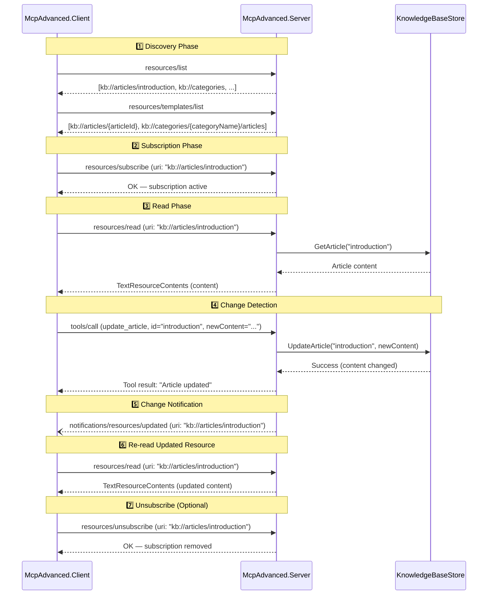
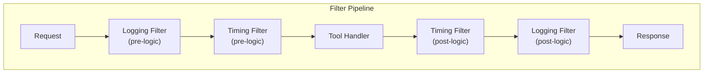
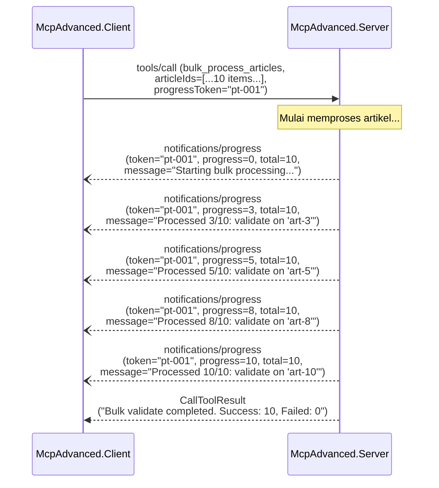
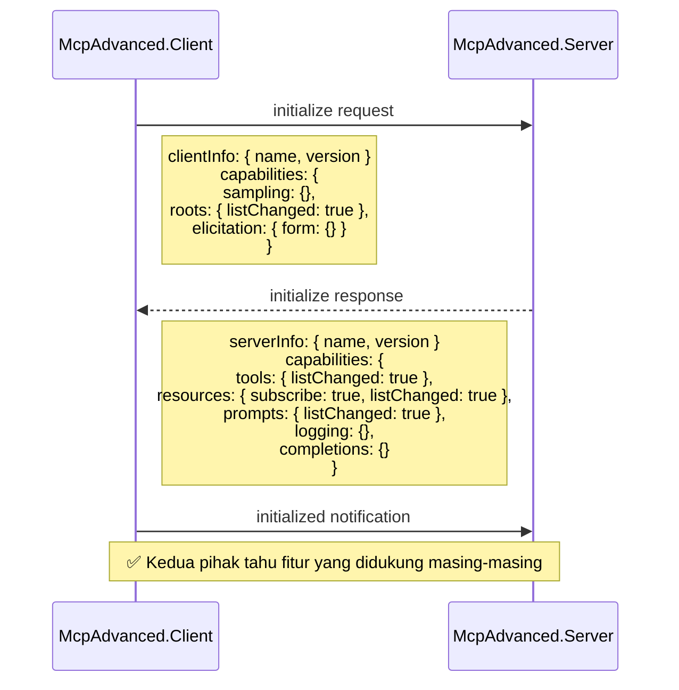
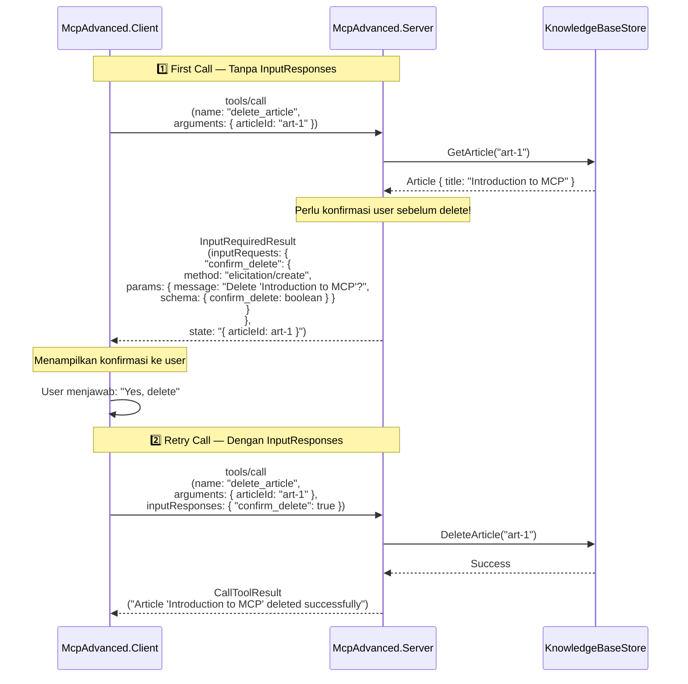
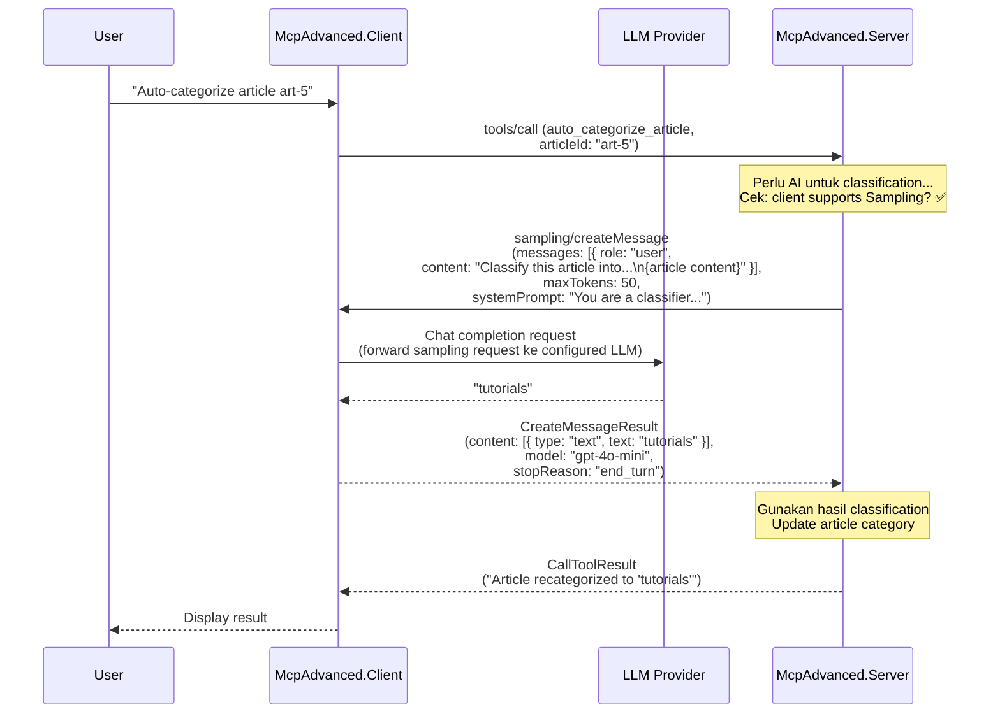
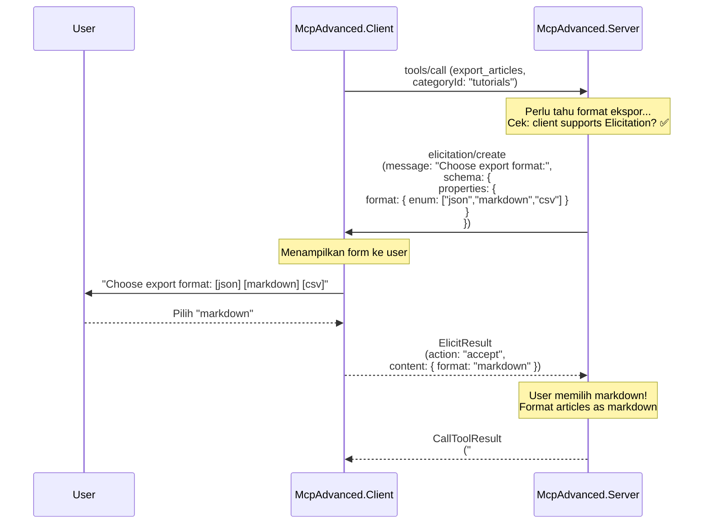
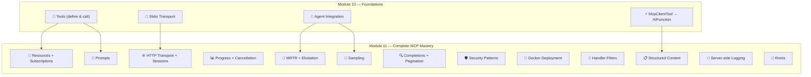

# MCP Advanced Concepts — Konten Teori Komprehensif

> **Module 11 (04-McpAdvanced)** — Expert Level  
> Prerequisite: Module 10 (03-McpSdk) — MCP Fundamentals (Tools + Stdio Transport + Agent Integration)

## Daftar Isi

1. [Resources](#1-resources)
2. [Prompts](#2-prompts)
3. [Structured Content](#3-structured-content)
4. [Server-Side Logging](#4-server-side-logging)
5. [Completions (Auto-Completion)](#5-completions-auto-completion)
6. [Pagination](#6-pagination)
7. [Handler Filters](#7-handler-filters)
8. [Streamable HTTP Transport](#8-streamable-http-transport)
9. [Progress Tracking](#9-progress-tracking)
10. [Cancellation](#10-cancellation)
11. [Capabilities Negotiation](#11-capabilities-negotiation)
12. [Multi Round-Trip Requests (MRTR)](#12-multi-round-trip-requests-mrtr)
13. [Sampling](#13-sampling)
14. [Roots](#14-roots)
15. [Elicitation](#15-elicitation)
16. [Security Patterns](#16-security-patterns)
17. [Docker Deployment](#17-docker-deployment)
18. [Hubungan dengan Module 10](#18-hubungan-dengan-module-10)

---

## 1. Resources

### Konsep Dasar

Resources dalam MCP adalah **data read-only** yang diekspos oleh server melalui URI. Berbeda dengan tools yang melakukan operasi (side-effect), resources menyediakan akses ke data yang sudah ada — dokumen, konfigurasi, database records, atau konten lainnya. Client dapat membaca (read) resources, subscribe ke perubahan, dan menemukan resources melalui discovery mechanism.

Analogi sederhana: jika MCP tools adalah "verb" (aksi yang dilakukan), maka resources adalah "noun" (data yang bisa dibaca). Resources memungkinkan server menyediakan konteks yang kaya kepada AI model tanpa harus melalui tool invocation.

### Jenis Resources

MCP mendefinisikan dua jenis resources:

| Jenis | Deskripsi | URI | Discovery |
|-------|-----------|-----|-----------|
| **Direct Resources** | Resource dengan URI tetap/fixed yang langsung muncul saat listing | `kb://articles/introduction` | `resources/list` |
| **Template Resources** | Resource dengan URI template (RFC 6570) yang memiliki variabel placeholder | `kb://articles/{articleId}` | `resources/templates/list` |

### Direct Resources

Direct resources memiliki URI statis yang tidak berubah. Cocok untuk data yang selalu tersedia dan diketahui sebelumnya (konfigurasi, daftar kategori, dokumen utama).

```csharp
[McpServerResourceType]
public class KnowledgeBaseResources
{
    // Direct resource — URI tetap, langsung muncul di resources/list
    [McpServerResource(Uri = "kb://articles/introduction", Name = "Introduction Article",
        MimeType = "text/markdown")]
    [Description("The main introduction article for the knowledge base")]
    public static TextResourceContents GetIntroduction(KnowledgeBaseStore store)
    {
        var article = store.GetArticle("introduction");
        return new TextResourceContents
        {
            Uri = "kb://articles/introduction",
            MimeType = "text/markdown",
            Text = article?.Content ?? "Article not found"
        };
    }
}
```

### Template Resources (RFC 6570)

Template resources menggunakan URI Templates sesuai [RFC 6570](https://tools.ietf.org/html/rfc6570) — standar yang mendefinisikan bagaimana variabel di-embed dalam URI. Client mengisi variabel untuk mengakses resource tertentu secara dinamis.

```csharp
// Template resource — URI dengan parameter {articleId}
[McpServerResource(UriTemplate = "kb://articles/{articleId}", Name = "Article by ID",
    MimeType = "text/markdown")]
[Description("Retrieves a specific article by its ID")]
public static TextResourceContents GetArticleById(
    string articleId,  // Parameter otomatis di-map dari URI template variable
    KnowledgeBaseStore store)
{
    var article = store.GetArticle(articleId);
    return new TextResourceContents
    {
        Uri = $"kb://articles/{articleId}",
        MimeType = article?.MimeType ?? "text/plain",
        Text = article?.Content ?? $"Article '{articleId}' not found"
    };
}
```

Variabel dalam URI template (`{articleId}`, `{categoryName}`) secara otomatis di-map ke parameter method oleh SDK. Client melihat template dan mengisi variabel saat melakukan `resources/read`.

### Resource Subscriptions dan Change Notifications

Salah satu fitur paling powerful dari MCP resources adalah **subscription mechanism** — client dapat mendaftar untuk menerima notifikasi setiap kali resource berubah. Ini memungkinkan reactive pattern di mana client selalu memiliki data terbaru tanpa polling.

#### Subscription Lifecycle — Sequence Diagram



**Catatan penting:**
- Resource subscriptions memerlukan **stateful mode** (session) karena server harus menyimpan daftar client yang subscribe ke setiap resource.
- Notification dikirim sebagai JSON-RPC notification (one-way, tanpa response) dari server ke client.
- Client yang disconnect otomatis di-unsubscribe — server membersihkan subscription saat session berakhir.
- Lihat implementasi di `KnowledgeBaseResources.cs` untuk detail bagaimana subscription dikelola.

### Content Types untuk Resources

Resources dapat mengembalikan konten dalam berbagai format:

| MIME Type | Penggunaan | Contoh |
|-----------|------------|--------|
| `text/plain` | Teks sederhana | Konfigurasi, log entries |
| `text/markdown` | Dokumen formatted | Artikel, dokumentasi |
| `application/json` | Data terstruktur | Daftar kategori, metadata |
| `image/png`, `image/jpeg` | Gambar | Diagram, charts |
| `application/octet-stream` | Binary data | Files, archives |

> 📁 **Referensi implementasi:** Lihat `McpAdvanced.Server/Resources/KnowledgeBaseResources.cs` untuk implementasi lengkap direct resources dan template resources.

---

## 2. Prompts

### Konsep Dasar

Prompts dalam MCP adalah **reusable prompt templates** yang diekspos oleh server — template interaksi terstruktur yang membantu client (dan AI model) menggunakan server capabilities secara optimal. Prompts bukan hanya teks statis; mereka adalah template yang menerima parameter dan menghasilkan konten yang di-customisasi.

Bayangkan prompts sebagai "resep interaksi" yang server sediakan:
- Server mengetahui domain-nya lebih baik dari client
- Server dapat menyediakan prompt yang sudah dioptimalkan untuk use case tertentu
- Client tinggal mengisi parameter dan mendapatkan prompt yang siap digunakan

### Prompt Template Architecture

Setiap prompt template memiliki:
- **Nama** — identifier unik (contoh: `search-knowledge-base`)
- **Deskripsi** — penjelasan singkat fungsi prompt
- **Parameter** — input yang diperlukan, masing-masing dengan nama, deskripsi, dan required/optional status
- **Content generator** — logic yang menghasilkan prompt content berdasarkan parameter

### Implementasi Prompts

```csharp
[McpServerPromptType]
public class KnowledgeBasePrompts
{
    // Prompt untuk pencarian knowledge base — membantu AI merangkum hasil
    [McpServerPrompt(Name = "search-knowledge-base")]
    [Description("Searches the knowledge base and provides a prompt for summarizing results")]
    public static ChatMessage[] SearchKnowledgeBase(
        [Description("The search query to find relevant articles")] string query,
        KnowledgeBaseStore store)
    {
        // Cari artikel yang relevan
        var results = store.SearchArticles(query);
        var summary = string.Join("\n", results.Select(a => 
            $"- **{a.Title}** (ID: {a.Id}): {a.Content[..Math.Min(100, a.Content.Length)]}..."));

        // Kembalikan prompt messages yang terstruktur
        return
        [
            new ChatMessage(ChatRole.User, $"""
                Based on the following search results from our knowledge base for query "{query}":

                {summary}

                Please provide a comprehensive answer to the user's question, citing the relevant
                articles by their titles.
                """)
        ];
    }

    // Prompt untuk meringkas artikel — mendukung multi-language
    [McpServerPrompt(Name = "summarize-article")]
    [Description("Generates a prompt for summarizing a specific article")]
    public static ChatMessage[] SummarizeArticle(
        [Description("The article ID to summarize")] string articleId,
        [Description("Target language for the summary (e.g., 'id', 'en')")] string language,
        KnowledgeBaseStore store)
    {
        var article = store.GetArticle(articleId);
        // ... generate prompt content
    }
}
```

### Rich Content Types dalam Prompts

Prompts tidak terbatas pada teks saja. MCP mendukung rich content dalam prompt responses:

1. **Text content** — teks biasa atau formatted (markdown)
2. **Embedded resources** — referensi ke MCP resources yang di-embed langsung dalam prompt
3. **Images** — gambar yang relevan untuk konteks prompt

Embedded resources sangat powerful karena memungkinkan prompt mereferensikan data dari resource lain tanpa duplikasi:

```csharp
// Prompt yang meng-embed resource sebagai konteks tambahan
return
[
    new ChatMessage(ChatRole.User, 
        $"Compare these two articles:\n\nArticle 1: [resource:{articleId1}]\nArticle 2: [resource:{articleId2}]")
];
```

### Client-Side Prompt Usage

Dari sisi client, penggunaan prompts mengikuti pattern discovery → select → invoke:

```csharp
// 1. Discover available prompts
var prompts = await client.ListPromptsAsync();

// 2. Pilih prompt berdasarkan kebutuhan
var searchPrompt = prompts.First(p => p.Name == "search-knowledge-base");

// 3. Invoke prompt dengan parameter
var result = await client.GetPromptAsync("search-knowledge-base", 
    new Dictionary<string, string> { ["query"] = "MCP security best practices" });

// 4. Gunakan hasil prompt sebagai input ke LLM
var messages = result.Messages;
```

> 📁 **Referensi implementasi:** Lihat `McpAdvanced.Server/Prompts/KnowledgeBasePrompts.cs` untuk implementasi lengkap prompt templates.

---

## 3. Structured Content

### Konsep Dasar

Structured Content adalah fitur MCP di mana output dari tool mengikuti **JSON Schema 2020-12** yang telah didefinisikan sebelumnya. Dengan `UseStructuredContent = true` pada atribut `[McpServerTool]`, SDK akan menghasilkan schema dari return type dan memastikan output yang dikembalikan sesuai dengan struktur tersebut.

### Mengapa Structured Content Diperlukan?

Tanpa structured content, tool output adalah free-form text yang harus di-parse oleh consumer (AI model atau tooling). Masalah yang muncul:

| Aspek | Plain Text Response | Structured Content |
|-------|--------------------|--------------------|
| **Validasi** | Tidak ada — consumer harus "menebak" format | Otomatis tervalidasi terhadap schema |
| **Tooling** | Manual parsing, rawan error | IDE support, code generation |
| **Consistency** | Bisa berubah format antar call | Dijamin konsisten sesuai schema |
| **Documentation** | Implisit dalam teks | Eksplisit dari JSON Schema |
| **Type safety** | Tidak ada | Consumer tahu exact types |

### JSON Schema 2020-12

MCP menggunakan [JSON Schema 2020-12](https://json-schema.org/draft/2020-12/json-schema-core.html) — versi terbaru dari JSON Schema standard. Schema mendefinisikan:

- **Properties** — nama dan tipe setiap field dalam output
- **Required fields** — field yang wajib ada dalam output
- **Descriptions** — penjelasan setiap field
- **Constraints** — validasi tambahan (enum values, min/max, pattern)

### Implementasi dalam .NET SDK

```csharp
// Model yang mendefinisikan schema output
public record ArticleCreationResult
{
    public required string ArticleId { get; init; }
    public required string Title { get; init; }
    public required string CategoryId { get; init; }
    public required DateTime CreatedAt { get; init; }
    public required string Status { get; init; }  // "created" | "error"
    public string? ErrorMessage { get; init; }
}

// Tool dengan UseStructuredContent = true
[McpServerTool(UseStructuredContent = true), Description("Creates a new article")]
public static ArticleCreationResult CreateArticle(
    [Description("The title of the article")] string title,
    [Description("The content in markdown")] string content,
    [Description("Category ID")] string categoryId,
    KnowledgeBaseStore store, McpServer server)
{
    // ... validation dan logic ...
    return new ArticleCreationResult
    {
        ArticleId = article.Id,
        Title = article.Title,
        CategoryId = article.CategoryId,
        CreatedAt = article.CreatedAt,
        Status = "created"
    };
}
```

SDK secara otomatis:
1. Generate JSON Schema dari `ArticleCreationResult` record
2. Menyertakan schema dalam tool metadata saat discovery
3. Serialize return value sebagai structured JSON (bukan wrapped dalam TextContentBlock)
4. Client dan AI model dapat memvalidasi output terhadap schema

### Perbedaan Response Format

**Tanpa Structured Content** (default):
```json
{
  "content": [{ "type": "text", "text": "Article created: ID=art-123, Title=..." }],
  "isError": false
}
```

**Dengan Structured Content** (`UseStructuredContent = true`):
```json
{
  "content": [{ "type": "text", "text": "{\"articleId\":\"art-123\",\"title\":\"...\",...}" }],
  "structuredContent": {
    "articleId": "art-123",
    "title": "New Article",
    "categoryId": "tutorials",
    "createdAt": "2025-01-15T10:30:00Z",
    "status": "created"
  },
  "isError": false
}
```

> 📁 **Referensi implementasi:** Lihat `McpAdvanced.Server/Tools/ArticleTools.cs` (method `CreateArticle`) dan `McpAdvanced.Server/Models/ArticleCreationResult.cs` untuk schema model.

---

## 4. Server-Side Logging

### Konsep Dasar

MCP Logging adalah mekanisme di mana server mengirimkan **structured log messages** ke connected client melalui protocol MCP. Ini berbeda dari logging tradisional (ke file/console) — log dikirim secara real-time ke client sehingga client mendapat visibility penuh atas aktivitas internal server.

### Mengapa Server-to-Client Logging?

Dalam arsitektur distributed (server terpisah dari client), developer dan user sering kehilangan visibility terhadap apa yang terjadi di server. MCP logging memecahkan masalah ini:

1. **Observability** — Client bisa melihat apa yang server lakukan secara real-time
2. **Debugging** — Developer bisa trace masalah tanpa akses langsung ke server logs
3. **User feedback** — Aplikasi client bisa menampilkan status operasi ke user
4. **Audit trail** — Setiap operasi tercatat dan dikirim ke client

### Log Levels

MCP mengadopsi log levels standar yang serupa dengan .NET `ILogger`:

| Level | Penggunaan | Contoh |
|-------|------------|--------|
| `debug` | Detail teknis untuk troubleshooting | "Memulai pencarian dengan query: X" |
| `info` | Informasi operasi normal | "Artikel berhasil dibuat: ID=abc" |
| `warning` | Situasi tidak biasa tapi bukan error | "Kategori tidak ditemukan, menggunakan default" |
| `error` | Operasi gagal | "Pembuatan artikel gagal: judul kosong" |

### Implementasi dalam .NET SDK

SDK menyediakan `AsClientLoggerProvider()` pada `McpServer` yang mengembalikan `ILoggerProvider` standar .NET. Ini memungkinkan penggunaan `ILogger` yang familiar:

```csharp
[McpServerTool, Description("Creates a new article")]
public static ArticleCreationResult CreateArticle(
    string title, string content, string categoryId,
    KnowledgeBaseStore store, McpServer server)
{
    // Buat logger yang mengirim log ke connected MCP client
    var loggerProvider = server.AsClientLoggerProvider();
    var logger = loggerProvider.CreateLogger("ArticleTools.CreateArticle");

    // Log level debug — hanya terlihat jika client mengatur log level ke debug
    logger.LogDebug("Memulai pembuatan artikel: {Title}, kategori: {CategoryId}", title, categoryId);

    // Log level info — informasi operasi normal
    logger.LogInformation("Artikel berhasil dibuat: Id={ArticleId}", article.Id);

    // Log level warning — situasi tidak biasa
    logger.LogWarning("Kategori tidak ditemukan: {CategoryId}", categoryId);

    // Log level error — operasi gagal
    logger.LogError("Pembuatan artikel gagal: judul atau konten kosong");
}
```

### Client-Side Log Consumption

Client menerima log messages sebagai notifications dan dapat menampilkannya atau menyimpannya:

```csharp
// Client menerima log notifications secara otomatis
// melalui event handler atau callback yang dikonfigurasi saat setup
client.LoggingNotification += (sender, args) =>
{
    Console.WriteLine($"[{args.Level}] {args.Logger}: {args.Data}");
};
```

### Hubungan dengan Server Capabilities

Server harus mendeklarasikan `logging` capability agar client tahu bahwa log notifications akan dikirim. Dalam .NET SDK, capability ini otomatis ditambahkan ketika server menggunakan logging features.

> 📁 **Referensi implementasi:** Lihat `McpAdvanced.Server/Tools/ArticleTools.cs` untuk contoh lengkap penggunaan logging di setiap tahap operasi tool.

---

## 5. Completions (Auto-Completion)

### Konsep Dasar

Completions adalah fitur auto-completion yang membantu client mengisi argument untuk **prompt parameters** dan **resource template variables** secara dinamis. Ketika user mulai mengetik nama artikel atau kategori, server menyediakan suggestions yang relevan — mirip dengan autocomplete di IDE.

### Cara Kerja

1. Client mengirim request `completion/complete` dengan:
   - Reference (prompt name atau resource template URI)
   - Argument name yang sedang di-complete
   - Current value (prefix yang sudah diketik user)
   
2. Server memproses request dan mengembalikan daftar suggestions yang cocok dengan prefix

3. Client menampilkan suggestions sebagai dropdown/pilihan

### Implementasi dalam .NET SDK

```csharp
public static class KnowledgeBaseCompletions
{
    // Handler untuk auto-completion — dipanggil saat client meminta saran
    public static Task<CompletionResult> HandleCompleteAsync(
        RequestContext<CompleteRequestParams> context,
        CancellationToken cancellationToken)
    {
        var store = context.Services!.GetRequiredService<KnowledgeBaseStore>();
        var argument = context.Params!.Argument;
        var prefix = argument.Value ?? "";

        // Tentukan suggestions berdasarkan argument name
        var suggestions = argument.Name switch
        {
            "articleId" => store.Articles.Keys
                .Where(id => id.StartsWith(prefix, StringComparison.OrdinalIgnoreCase))
                .Take(10)
                .ToArray(),
                
            "categoryName" or "categoryId" => store.Categories.Keys
                .Where(name => name.StartsWith(prefix, StringComparison.OrdinalIgnoreCase))
                .Take(10)
                .ToArray(),
                
            _ => []
        };

        return Task.FromResult(new CompletionResult
        {
            Values = suggestions,
            HasMore = false,  // true jika ada lebih banyak suggestions yang tidak ditampilkan
            Total = suggestions.Length
        });
    }
}
```

### Registration di Server

```csharp
// Di Program.cs — register completion handler
builder.Services.AddMcpServer()
    // ... other registrations ...
    .WithCompleteHandler(KnowledgeBaseCompletions.HandleCompleteAsync);
```

### Use Cases

| Skenario | Argument | Suggestions |
|----------|----------|-------------|
| Prompt `summarize-article` | `articleId` | IDs artikel yang cocok dengan prefix |
| Prompt `search-knowledge-base` | `query` | Previous search queries atau keywords |
| Resource template `kb://categories/{categoryName}/articles` | `categoryName` | Nama kategori yang tersedia |

### Prefix Matching Property

Completions harus memenuhi **prefix matching property** — setiap suggestion yang dikembalikan HARUS dimulai dengan prefix yang diberikan oleh client. Ini adalah properti yang diverifikasi dalam property-based testing module ini.

> 📁 **Referensi implementasi:** Lihat `McpAdvanced.Server/Completions/KnowledgeBaseCompletions.cs` untuk handler completions lengkap.

---

## 6. Pagination

### Konsep Dasar

Pagination dalam MCP menggunakan **cursor-based pagination** untuk listing tools, prompts, dan resources. Ketika koleksi terlalu besar untuk dikirim dalam satu response (misalnya: ratusan resources), server memecah hasilnya menjadi halaman-halaman (pages) dengan cursor sebagai pointer ke posisi selanjutnya.

### Mengapa Cursor-Based (Bukan Offset-Based)?

| Aspek | Offset-Based (`?page=3&size=10`) | Cursor-Based (`?cursor=abc123`) |
|-------|----------------------------------|--------------------------------|
| **Consistency** | Data bisa bergeser jika ada insert/delete | Stabil — cursor menunjuk ke posisi pasti |
| **Performance** | `OFFSET N` makin lambat seiring N membesar | Konstant — langsung ke posisi cursor |
| **Statefulness** | Stateless (tapi inkonsisten) | Semi-stateless (cursor encode posisi) |
| **Use case** | UI dengan page numbers | Infinite scroll, streaming data |

MCP memilih cursor-based karena resources bisa berubah secara dinamis (tambah/hapus) — cursor memastikan client tidak melewatkan atau menduplikasi items.

### Format Cursor

Cursor adalah opaque string bagi client — server yang menentukan format internal. Implementasi umum:

```csharp
// Cursor = Base64 encode dari posisi terakhir
// Client tidak perlu tahu isi cursor — hanya perlu kirim kembali saat request halaman berikutnya
var cursor = Convert.ToBase64String(
    Encoding.UTF8.GetBytes($"offset:{lastIndex}"));
```

### Request/Response Flow

**Request halaman pertama (tanpa cursor):**
```json
{ "method": "resources/list", "params": {} }
```

**Response halaman pertama:**
```json
{
  "resources": [...10 items...],
  "nextCursor": "b2Zmc2V0OjEw"  // Base64("offset:10")
}
```

**Request halaman kedua (dengan cursor):**
```json
{ "method": "resources/list", "params": { "cursor": "b2Zmc2V0OjEw" } }
```

**Response halaman terakhir (tanpa nextCursor):**
```json
{
  "resources": [...5 items...],
  "nextCursor": null  // null = ini halaman terakhir
}
```

### Implementasi Pagination Handler

```csharp
public static class ResourcePaginationHandler
{
    private const int PageSize = 5;

    public static Task<ListResourcesResult> HandleListResourcesAsync(
        RequestContext<ListResourcesRequestParams> context,
        CancellationToken cancellationToken)
    {
        var store = context.Services!.GetRequiredService<KnowledgeBaseStore>();
        var allResources = store.GetAllResourceMetadata();
        
        // Decode cursor untuk menentukan offset
        int offset = 0;
        if (context.Params?.Cursor is { } cursor)
        {
            var decoded = Encoding.UTF8.GetString(Convert.FromBase64String(cursor));
            offset = int.Parse(decoded.Replace("offset:", ""));
        }

        // Ambil satu halaman
        var page = allResources.Skip(offset).Take(PageSize).ToList();
        var hasMore = offset + PageSize < allResources.Count;

        // Encode cursor untuk halaman berikutnya
        string? nextCursor = hasMore
            ? Convert.ToBase64String(Encoding.UTF8.GetBytes($"offset:{offset + PageSize}"))
            : null;

        return Task.FromResult(new ListResourcesResult
        {
            Resources = page,
            NextCursor = nextCursor
        });
    }
}
```

### Pagination Completeness Property

Property penting: iterasi melalui semua halaman (follow nextCursor sampai null) harus menghasilkan **semua items tepat sekali** — tidak ada yang hilang, tidak ada duplikasi. Ini diverifikasi melalui property-based testing.

> 📁 **Referensi implementasi:** Lihat `McpAdvanced.Server/Pagination/ResourcePaginationHandler.cs` untuk implementasi cursor-based pagination.

---

## 7. Handler Filters

### Konsep Dasar

Handler Filters adalah **middleware-like pattern** dalam MCP .NET SDK yang memungkinkan developer membungkus (wrap) tool/resource/prompt handlers dengan logic tambahan. Filters menjalankan code sebelum (pre-processing) dan sesudah (post-processing) handler utama, tanpa mengubah handler itu sendiri.

Pattern ini mengikuti prinsip **Aspect-Oriented Programming (AOP)** — memisahkan cross-cutting concerns dari business logic:

- **Logging** — catat setiap tool invocation tanpa menambah code ke setiap tool
- **Timing** — ukur performance tanpa mengubah tool implementation
- **Validation** — validasi input secara konsisten di semua tools
- **Caching** — cache hasil tool yang idempotent
- **Authorization** — cek akses sebelum tool dieksekusi
- **Rate limiting** — batasi frekuensi tool calls

### Filter Pipeline (Execution Order)

Filter dieksekusi dalam urutan **onion/layers** — filter pertama yang didaftarkan menjadi lapisan terluar:

```
Request masuk →
  [LoggingFilter PRE] →
    [TimingFilter PRE] →
      [Tool Handler] →
    [TimingFilter POST] →
  [LoggingFilter POST] →
Response keluar
```

Jika LoggingFilter didaftarkan pertama dan TimingFilter kedua:
- **Pre-processing**: Logging(pre) → Timing(pre) → Handler
- **Post-processing**: Handler → Timing(post) → Logging(post)



### Type Signature

Dalam .NET SDK, filter memiliki signature:

```csharp
// McpRequestFilter<TParams, TResult> adalah delegate:
// Func<next> → Func<context, ct, Task<TResult>>
public static readonly McpRequestFilter<CallToolRequestParams, CallToolResult> LoggingFilter = (next) =>
{
    return async (context, ct) =>
    {
        // PRE-PROCESSING: logic sebelum handler
        var toolName = context.Params?.Name ?? "unknown";
        Console.WriteLine($"[PRE] Calling tool: {toolName}");

        // Panggil next — ini bisa filter berikutnya ATAU handler utama
        var result = await next(context, ct);

        // POST-PROCESSING: logic setelah handler
        Console.WriteLine($"[POST] Tool completed: {toolName}");

        return result;
    };
};
```

### Registrasi Filters

```csharp
// Di Program.cs — registrasi filter chain
builder.Services.AddMcpServer()
    .WithRequestFilters(filters =>
    {
        // Urutan registrasi = urutan lapisan (first registered = outermost)
        filters.AddCallToolFilter(McpFilters.LoggingFilter);  // Lapisan luar
        filters.AddCallToolFilter(McpFilters.TimingFilter);   // Lapisan dalam
    });
```

### Filter untuk Resource dan Prompts

Filter tidak hanya untuk tools — SDK juga mendukung filter untuk resource reads dan prompt invocations:

```csharp
filters.AddReadResourceFilter(resourceLoggingFilter);   // Filter untuk resource reads
filters.AddGetPromptFilter(promptValidationFilter);     // Filter untuk prompt gets
```

### Error Handling dalam Filters

Filter dapat menangani exceptions dari handler tanpa mengubah error propagation:

```csharp
return async (context, ct) =>
{
    try
    {
        var result = await next(context, ct);
        return result;
    }
    catch (Exception ex)
    {
        // Log error tapi tetap re-throw agar error handling normal berjalan
        logger?.LogError(ex, "[Filter] Tool gagal: {Tool}", toolName);
        throw;
    }
};
```

> 📁 **Referensi implementasi:** Lihat `McpAdvanced.Server/Filters/McpFilters.cs` untuk implementasi LoggingFilter dan TimingFilter lengkap.

---

## 8. Streamable HTTP Transport

### Konsep Dasar

Streamable HTTP Transport adalah transport layer yang direkomendasikan untuk **production dan remote deployment** MCP servers. Menggunakan ASP.NET Core sebagai HTTP server, transport ini mendukung:

- Remote access (server dan client di mesin berbeda)
- Horizontal scaling (multiple server instances)
- Session management (stateful interactions)
- Standard HTTP security (TLS, authentication headers)
- Load balancing dan reverse proxying

### Perbandingan dengan Stdio Transport

| Aspek | Stdio Transport (Module 10) | Streamable HTTP Transport (Module 11) |
|-------|---------------------------|--------------------------------------|
| **Process model** | Server = child process dari client | Server = independent HTTP service |
| **Network** | Tidak perlu — komunikasi via stdin/stdout | HTTP over network (local atau remote) |
| **Scaling** | 1 client : 1 server instance | Many clients : 1 server (atau N instances) |
| **Deployment** | Embedded (client menjalankan server) | Independent (Docker, Kubernetes, cloud) |
| **Session** | Implisit (selama process hidup) | Explicit (Mcp-Session-Id header) |
| **Security** | Process isolation | HTTP security (TLS, auth, host validation) |
| **Startup** | Cold start setiap kali client connect | Always-running service |
| **Best for** | Local development, IDE extensions | Production, remote APIs, multi-tenant |

### Mode Stateless vs Stateful

#### Stateless Mode (Default di v2)

```csharp
builder.Services.AddMcpServer()
    .WithHttpTransport(options =>
    {
        options.Stateless = true;  // Default
    });
```

- Setiap HTTP request independen — tidak ada session state di server
- **Kelebihan**: Horizontal scaling tanpa session affinity, simple infrastructure
- **Kekurangan**: Tidak mendukung subscriptions, server-to-client requests, atau notifications
- **Cocok untuk**: Simple tool servers, stateless APIs, read-only operations

#### Stateful Mode

```csharp
builder.Services.AddMcpServer()
    .WithHttpTransport(options =>
    {
        options.Stateless = false;  // Enable sessions
    });
```

- Server mempertahankan session state per client menggunakan `Mcp-Session-Id` header
- **Kelebihan**: Full MCP features — subscriptions, sampling, elicitation, notifications
- **Kekurangan**: Memerlukan session affinity (sticky sessions) di load balancer
- **Cocok untuk**: Full-featured MCP servers dengan interactive capabilities

### Session Management

Dalam stateful mode:

1. Client mengirim `initialize` request tanpa session ID
2. Server membuat session baru dan mengembalikan `Mcp-Session-Id` di response header
3. Client menyimpan session ID dan menyertakan di semua subsequent requests
4. Jika client disconnect, session di-cleanup setelah timeout

```
Client → Server: POST /mcp (initialize)
Server → Client: 200 OK, Mcp-Session-Id: "sess_abc123"

Client → Server: POST /mcp (tools/call), Mcp-Session-Id: "sess_abc123"
Server → Client: 200 OK (tool result)
```

### ASP.NET Core Configuration

```csharp
var builder = WebApplication.CreateBuilder(args);

builder.Services.AddMcpServer()
    .WithHttpTransport(options => { options.Stateless = false; })
    .WithToolsFromAssembly()
    .WithResourcesFromAssembly()
    .WithPromptsFromAssembly();

var app = builder.Build();

// Host filtering — KEAMANAN (lihat section 16)
app.UseHostFiltering();

// Health check endpoint (non-MCP)
app.MapGet("/", () => "McpAdvanced.Server is running");

// MCP endpoint — semua komunikasi MCP melalui /mcp
app.MapMcp();

app.Run("http://localhost:5100");
```

### Host Name Validation

**CRITICAL SECURITY**: MCP servers berbasis HTTP HARUS mengimplementasikan host name validation untuk mencegah **DNS rebinding attacks**. Tanpa validasi, halaman web berbahaya bisa mengakses MCP server lokal melalui manipulasi DNS.

Detail lengkap di [Section 16: Security Patterns](#16-security-patterns).

> 📁 **Referensi implementasi:** Lihat `McpAdvanced.Server/Program.cs` untuk konfigurasi HTTP transport dan `appsettings.json` untuk AllowedHosts configuration.

---

## 9. Progress Tracking

### Konsep Dasar

Progress Tracking memungkinkan server melaporkan **kemajuan (progress) operasi long-running** ke client secara real-time. Ketika tool memproses banyak item atau operasi memakan waktu lama, server mengirim progress notifications agar client dapat menampilkan progress bar atau status update ke user.

### Mengapa Progress Tracking Diperlukan?

Tanpa progress tracking, user hanya melihat "loading..." tanpa informasi apapun. Untuk operasi yang memakan 10-30+ detik (bulk processing, large file operations, complex computations), progress feedback sangat penting untuk:

1. **User experience** — User tahu bahwa operasi berjalan, bukan hang
2. **Estimation** — User bisa memperkirakan waktu tersisa
3. **Decision making** — User bisa memutuskan apakah ingin membatalkan (cancel)
4. **Debugging** — Developer bisa melihat di tahap mana operasi lambat

### Progress Tracking Flow



### Implementasi Server-Side

SDK menyediakan `IProgress<ProgressNotificationValue>` sebagai parameter tool — SDK otomatis meng-inject instance yang mengirim notifications ke client:

```csharp
[McpServerTool, Description("Processes articles in bulk with progress")]
public static async Task<string> BulkProcessArticles(
    string[] articleIds,
    string operation,
    IProgress<ProgressNotificationValue> progress,  // Otomatis di-inject oleh SDK
    CancellationToken cancellationToken,
    KnowledgeBaseStore store)
{
    var total = articleIds.Length;
    
    // Kirim progress awal
    progress?.Report(new ProgressNotificationValue
    {
        Progress = 0,
        Total = total,
        Message = $"Starting {operation} on {total} articles..."
    });

    for (var i = 0; i < total; i++)
    {
        if (cancellationToken.IsCancellationRequested) break;

        // Proses artikel...
        await ProcessArticle(articleIds[i], operation);

        // Kirim progress update untuk setiap item
        progress?.Report(new ProgressNotificationValue
        {
            Progress = i + 1,
            Total = total,
            Message = $"Processed {i + 1}/{total}: {operation} on '{articleIds[i]}'"
        });
    }

    return $"Bulk {operation} completed.";
}
```

### ProgressNotificationValue Properties

| Property | Type | Deskripsi |
|----------|------|-----------|
| `Progress` | `long` | Jumlah item yang sudah diproses |
| `Total` | `long?` | Total item (null jika tidak diketahui) |
| `Message` | `string?` | Pesan deskriptif untuk ditampilkan ke user |

### Client-Side Progress Display

Client menerima progress notifications dan menampilkannya:

```csharp
// Progress handler di client — menampilkan progress bar di console
client.ProgressNotification += (sender, notification) =>
{
    var percent = notification.Total > 0 
        ? (notification.Progress * 100 / notification.Total) 
        : 0;
    Console.Write($"\r[{'█'.Repeat(percent / 5)}{'░'.Repeat(20 - percent / 5)}] {percent}% - {notification.Message}");
};
```

### progressToken Mechanism

Client harus menyertakan `progressToken` saat memanggil tool agar server tahu ke mana progress notifications dikirim. Tanpa progressToken, `IProgress<ProgressNotificationValue>` parameter akan menjadi no-op (tidak mengirim apa-apa).

> 📁 **Referensi implementasi:** Lihat `McpAdvanced.Server/Tools/ArticleTools.cs` (method `BulkProcessArticles`) untuk implementasi server-side progress, dan `McpAdvanced.Client/Handlers/ProgressDisplay.cs` untuk client-side display.

---

## 10. Cancellation

### Konsep Dasar

Cancellation memungkinkan client **membatalkan MCP request yang sedang berjalan** (in-flight). Ketika user memutuskan bahwa operasi tidak lagi diperlukan (misalnya: bulk process terlalu lama, salah parameter), client mengirim sinyal pembatalan dan server menghentikan operasi secara graceful.

### Mekanisme CancellationToken

MCP menggunakan .NET standard `CancellationToken` pattern — token dipropagasi dari client ke server melalui protocol layer:

1. Client mengirim `notifications/cancelled` dengan request ID yang ingin dibatalkan
2. Transport layer menerima notification dan triggers cancellation pada CancellationToken
3. Server code memeriksa `cancellationToken.IsCancellationRequested` secara berkala
4. Server menghentikan operasi dan mengembalikan partial result

### Implementasi Server-Side

```csharp
[McpServerTool, Description("Long-running bulk operation")]
public static async Task<string> BulkProcessArticles(
    string[] articleIds,
    string operation,
    IProgress<ProgressNotificationValue> progress,
    CancellationToken cancellationToken,  // Otomatis di-inject, linked ke client cancellation
    KnowledgeBaseStore store)
{
    var processedCount = 0;

    for (var i = 0; i < articleIds.Length; i++)
    {
        // ⚡ Periksa cancellation SEBELUM memproses item berikutnya
        // Ini adalah "cancellation checkpoint" — titik di mana operasi bisa dihentikan
        if (cancellationToken.IsCancellationRequested)
        {
            return $"Operation cancelled after processing {processedCount}/{articleIds.Length} articles.";
        }

        // Proses artikel — Task.Delay juga menerima cancellationToken
        // sehingga delay bisa di-interrupt langsung tanpa menunggu
        await Task.Delay(200, cancellationToken);
        processedCount++;
    }

    return $"All {processedCount} articles processed.";
}
```

### Best Practices untuk Graceful Cancellation

1. **Check token frequently** — Periksa `IsCancellationRequested` di setiap iterasi loop, bukan hanya di awal
2. **Pass token ke async operations** — `Task.Delay(ms, cancellationToken)`, `HttpClient.GetAsync(url, cancellationToken)`
3. **Return partial results** — Jangan throw exception; kembalikan apa yang sudah selesai
4. **Clean up resources** — Pastikan file handles, connections, dll. dibersihkan saat cancelled
5. **Log cancellation** — Catat di log bahwa operasi di-cancel untuk audit trail

### Cancellation vs Exception

| Aspek | Cancellation (graceful) | Exception (error) |
|-------|------------------------|-------------------|
| **Trigger** | User meminta pembatalan | Unexpected error di server |
| **Response** | Partial result + cancellation note | Error result (`IsError = true`) |
| **Data integrity** | Terjaga — operasi berhenti di checkpoint | Mungkin corrupt jika mid-operation |
| **Client expectation** | Normal flow — user memilih cancel | Abnormal — client perlu handle error |

### Client-Side Cancellation

```csharp
// Client membuat CancellationTokenSource
var cts = new CancellationTokenSource();

// Trigger cancellation setelah 5 detik (timeout)
cts.CancelAfter(TimeSpan.FromSeconds(5));

// Atau cancel berdasarkan user input
Console.CancelKeyPress += (s, e) => { cts.Cancel(); e.Cancel = true; };

// Panggil tool dengan cancellation token
var result = await client.CallToolAsync("bulk_process_articles", args, cts.Token);
```

### Cancellation Property

Property yang harus dipenuhi: jika cancellation terjadi setelah memproses K items (K < N total), maka operasi harus berhenti dengan at most K+1 items processed (satu item mungkin sedang in-flight saat cancellation signal diterima).

> 📁 **Referensi implementasi:** Lihat `McpAdvanced.Server/Tools/ArticleTools.cs` (method `BulkProcessArticles`) untuk cancellation handling.

---

## 11. Capabilities Negotiation

### Konsep Dasar

Capabilities Negotiation adalah proses di mana client dan server **bertukar informasi tentang fitur yang didukung** saat initialization. Ini memungkinkan kedua pihak menyesuaikan behavior secara adaptif — server tidak akan meminta sampling jika client tidak mendukungnya, dan client tidak akan mencoba subscribe jika server tidak mengiklankan resource subscriptions.

### Negotiation Flow



### Client Capabilities

Capabilities yang dideklarasikan oleh client dan digunakan oleh server:

| Capability | Deskripsi | Penggunaan oleh Server |
|-----------|-----------|----------------------|
| **Sampling** | Client dapat menangani LLM sampling requests | Server bisa meminta AI completion via `SampleAsync()` |
| **Roots** | Client menyediakan filesystem root URIs | Server tahu workspace boundaries |
| **Elicitation** | Client dapat menampilkan forms ke user | Server bisa meminta input via `ElicitAsync()` |

### Server Capabilities

Capabilities yang dideklarasikan oleh server dan digunakan oleh client:

| Capability | Sub-fields | Deskripsi |
|-----------|-----------|-----------|
| **Tools** | `listChanged` | Server menyediakan tools; listChanged = tools bisa berubah at runtime |
| **Resources** | `subscribe`, `listChanged` | Server menyediakan resources; subscribe = subscriptions didukung |
| **Prompts** | `listChanged` | Server menyediakan prompt templates |
| **Logging** | — | Server mengirim structured log messages ke client |
| **Completions** | — | Server menyediakan auto-completion suggestions |

### Adaptive Behavior Pattern

Server HARUS memeriksa client capabilities sebelum menggunakan fitur yang memerlukan client support:

```csharp
// ❌ SALAH — langsung panggil SampleAsync tanpa cek capability
var result = await server.SampleAsync(request, ct);

// ✅ BENAR — cek capability dulu, sediakan fallback
if (server.ClientCapabilities?.Sampling is not null)
{
    // Client mendukung Sampling — gunakan AI classification
    var result = await server.SampleAsync(request, ct);
    return ProcessSamplingResult(result);
}
else
{
    // Client TIDAK mendukung Sampling — gunakan fallback keyword-based
    return FallbackCategorize(article, categories);
}
```

### Client-Side Capability Declaration

```csharp
var clientOptions = new McpClientOptions
{
    Capabilities = new ClientCapabilities
    {
        // Declare bahwa client mendukung Sampling
        Sampling = new SamplingCapability(),
        
        // Declare bahwa client mendukung Roots
        Roots = new RootsCapability { ListChanged = true },
        
        // Declare bahwa client mendukung Elicitation (forms)
        Elicitation = new ElicitationCapability
        {
            Form = new FormElicitationCapability()
        }
    }
};
```

### Checking Server Capabilities dari Client

```csharp
// Setelah connection established
if (client.ServerCapabilities?.Resources is { Subscribe: true })
{
    // Server mendukung resource subscriptions
    await client.SubscribeToResourceAsync("kb://articles/introduction");
}

if (client.ServerCapabilities?.Completions is not null)
{
    // Server mendukung auto-completion
    var suggestions = await client.CompleteAsync(reference, argument);
}
```

### Capabilities sebagai Contract

Capabilities berfungsi sebagai **contract** antara client dan server:
- Server TIDAK BOLEH mengirim request (sampling, elicitation) ke client yang tidak declare capability tersebut
- Client TIDAK BOLEH mengirim request (subscribe, complete) ke server yang tidak declare capability tersebut
- Violasi contract menghasilkan error/undefined behavior

> 📁 **Referensi implementasi:** Lihat `McpAdvanced.Server/Tools/AdminTools.cs` untuk adaptive behavior pattern, dan `McpAdvanced.Client/Program.cs` untuk client capability declaration.

---

## 12. Multi Round-Trip Requests (MRTR)

### Konsep Dasar

Multi Round-Trip Requests (MRTR) adalah mekanisme di mana server **meminta input tambahan dari client** selama eksekusi tool. Alih-alih satu request → satu response, MRTR memungkinkan dialog interaktif: server menjalankan tool, menyadari perlu informasi tambahan, meminta ke client, menerima jawaban, dan melanjutkan eksekusi.

### Use Cases

MRTR sangat berguna untuk:
- **Konfirmasi operasi destruktif** — "Anda yakin ingin menghapus artikel ini?"
- **Input tambahan yang kontekstual** — Meminta parameter yang hanya diketahui setelah tool mulai berjalan
- **Multi-step workflows** — Wizard-like interaction di mana setiap langkah tergantung jawaban sebelumnya
- **Clarification** — Server menemukan ambiguitas dan meminta klarifikasi

### MRTR Flow — Sequence Diagram



### Pattern: InputRequiredException

Dalam .NET SDK (protocol revision `2026-07-28`), MRTR diimplementasikan melalui `InputRequiredException`:

```csharp
[McpServerTool, Description("Deletes article with confirmation")]
public static string DeleteArticleWithConfirmation(
    string articleId,
    McpServer server,
    RequestContext<CallToolRequestParams> context,
    KnowledgeBaseStore store)
{
    var article = store.GetArticle(articleId);
    if (article is null) return "Error: Article not found.";

    // Cek apakah ini retry call dengan InputResponses dari client
    if (context.Params?.InputResponses is { } responses
        && responses.TryGetValue("confirm_delete", out var response))
    {
        // User sudah menjawab — lakukan aksi berdasarkan jawaban
        var confirmed = response.RawValue.ValueKind == JsonValueKind.True;
        if (confirmed)
        {
            store.DeleteArticle(articleId);
            return $"Article '{article.Title}' deleted.";
        }
        return "Deletion cancelled.";
    }

    // Panggilan pertama — lempar InputRequiredException untuk meminta konfirmasi
    var inputRequests = new Dictionary<string, InputRequest>
    {
        ["confirm_delete"] = new InputRequest
        {
            Method = RequestMethods.ElicitationCreate,
            Params = /* ElicitRequestParams serialized */
        }
    };

    throw new InputRequiredException(inputRequests, state: "optional state data");
}
```

### Cara Kerja InputRequiredException

1. Tool melempar `InputRequiredException` dengan daftar `InputRequest`
2. SDK menangkap exception dan mengkonversi menjadi `InputRequiredResult` response
3. Client menerima response, melihat bahwa input diperlukan
4. Client mengumpulkan input (melalui elicitation handler, user prompt, dll.)
5. Client memanggil ulang tool yang sama dengan `InputResponses` berisi jawaban
6. Tool menerima `InputResponses` dari `context.Params` dan melanjutkan eksekusi

### Keuntungan Pattern MRTR

- **Stateless-compatible** — Bekerja di kedua mode (stateless dan stateful) karena state di-encode dalam response/request
- **Client-agnostic** — Server tidak perlu tahu bagaimana client mengumpulkan input
- **Composable** — Bisa meminta multiple inputs dalam satu round-trip
- **Secure** — Operasi destruktif memerlukan explicit user consent

> 📁 **Referensi implementasi:** Lihat `McpAdvanced.Server/Tools/AdminTools.cs` (method `DeleteArticleWithConfirmation`) untuk MRTR pattern lengkap.

---

## 13. Sampling

### Konsep Dasar

Sampling adalah fitur di mana **server meminta client untuk melakukan LLM completion**. Ini membalik arah komunikasi normal — biasanya client yang memanggil server untuk tools/resources, tapi dengan sampling, server meminta bantuan AI dari client.

### Mengapa Server Membutuhkan LLM?

Server adalah "tool provider" — biasanya tidak memiliki akses langsung ke LLM. Namun ada situasi di mana server membutuhkan kemampuan AI:

| Use Case | Contoh |
|----------|--------|
| **Classification** | Auto-kategorisasi artikel berdasarkan konten |
| **Summarization** | Membuat ringkasan dokumen secara otomatis |
| **Translation** | Menerjemahkan konten ke bahasa lain |
| **Extraction** | Mengekstrak entities dari teks (nama, tanggal, dll.) |
| **Generation** | Generate deskripsi, tags, atau metadata |

### Sampling Flow — Sequence Diagram



### Security Implications

Sampling membawa security concerns yang signifikan:

1. **Cost** — Server bisa memicu LLM calls yang mahal tanpa kontrol user
2. **Data leakage** — Server mengirim data ke LLM melalui client (data mungkin sensitif)
3. **Prompt injection** — Server bisa crafting prompts yang memanipulasi LLM behavior
4. **Rate limiting** — Server tanpa rate limit bisa membanjiri LLM dengan requests

**Mitigasi:**
- Client HARUS implement human-in-the-loop approval untuk sampling requests
- Client HARUS rate-limit sampling requests (misalnya: max 10 per menit)
- Client HARUS log semua sampling requests untuk audit
- Client BISA menolak sampling request (return error result)

### Implementasi Server-Side

```csharp
[McpServerTool, Description("Auto-categorizes article using AI")]
public static async Task<string> AutoCategorizeArticle(
    string articleId, McpServer server,
    KnowledgeBaseStore store, CancellationToken ct)
{
    var article = store.GetArticle(articleId);

    // Cek capability — WAJIB sebelum memanggil SampleAsync
    if (server.ClientCapabilities?.Sampling is not null)
    {
        var request = new CreateMessageRequestParams
        {
            Messages =
            [
                new SamplingMessage
                {
                    Role = Role.User,
                    Content = [new TextContentBlock
                    {
                        Text = $"Classify this article: {article.Title}\n{article.Content}"
                    }]
                }
            ],
            MaxTokens = 50,
            SystemPrompt = "You are a classifier. Respond with category name only."
        };

        var result = await server.SampleAsync(request, ct);
        var category = ExtractText(result.Content).Trim();
        // ... use category
    }
    else
    {
        // Fallback — keyword-based classification
        return FallbackCategorize(article);
    }
}
```

### Implementasi Client-Side (Sampling Handler)

```csharp
// Handler yang dipanggil ketika server meminta sampling
public static class SamplingHandler
{
    public static async ValueTask<CreateMessageResult> HandleAsync(
        CreateMessageRequestParams request, CancellationToken ct)
    {
        // Forward ke configured LLM (contoh: OpenAI)
        var chatClient = GetConfiguredChatClient();
        var messages = ConvertToChatMessages(request.Messages);
        
        var response = await chatClient.GetResponseAsync(messages, ct);
        
        return new CreateMessageResult
        {
            Content = [new TextContentBlock { Text = response.Text }],
            Model = "gpt-4o-mini",
            StopReason = "end_turn"
        };
    }
}
```

> 📁 **Referensi implementasi:** Lihat `McpAdvanced.Server/Tools/AdminTools.cs` (method `AutoCategorizeArticle`) dan `McpAdvanced.Client/Handlers/SamplingHandler.cs`.

---

## 14. Roots

### Konsep Dasar

Roots adalah mekanisme di mana **client menyediakan daftar filesystem root URIs ke server**. Ini memberi server konteks tentang workspace structure — server tahu di mana file-file berada yang relevan dengan interaksi, tanpa harus "menebak" atau mengakses seluruh filesystem.

### Mengapa Roots Diperlukan?

Tanpa roots, server yang perlu melakukan operasi file-based tidak memiliki informasi tentang:
- Di mana project user berada
- Filesystem boundaries yang aman
- Workspace scope yang relevan

Roots memecahkan ini dengan menyediakan explicit boundaries:

```
Client deklarasi:
  Root 1: file:///home/user/projects/my-app     (name: "Main Project")
  Root 2: file:///home/user/configs              (name: "Configs")

Server sekarang tahu:
  ✅ Boleh operasi di /home/user/projects/my-app
  ✅ Boleh operasi di /home/user/configs  
  ❌ TIDAK boleh akses /home/user/Documents (di luar roots)
```

### Root Format

Setiap root memiliki:
- **URI** — `file://` URI yang menunjuk ke directory
- **Name** — Nama human-readable (opsional)

```csharp
// Client menyediakan roots ke server
var rootsHandler = () => ValueTask.FromResult(new RootsResult
{
    Roots =
    [
        new Root { Uri = "file:///workspace/project", Name = "Project Root" },
        new Root { Uri = "file:///workspace/shared-configs", Name = "Shared Configs" }
    ]
});
```

### Use Cases

| Skenario | Bagaimana Server Menggunakan Roots |
|----------|----------------------------------|
| **File search tool** | Hanya cari file dalam root directories |
| **Code analysis** | Analisis hanya source code dalam project root |
| **Config management** | Baca/tulis config hanya dalam authorized roots |
| **Security enforcement** | Tolak request yang target-nya di luar roots |

### Server-Side Usage

```csharp
// Server memeriksa roots sebelum file operation
[McpServerTool, Description("Reads a file from workspace")]
public static async Task<string> ReadFile(string path, McpServer server)
{
    // Ambil roots dari client
    var rootsResult = await server.ListRootsAsync();
    var roots = rootsResult.Roots;

    // Validasi path berada dalam salah satu root
    var fullPath = Path.GetFullPath(path);
    var isWithinRoots = roots.Any(root =>
    {
        var rootPath = new Uri(root.Uri).LocalPath;
        return fullPath.StartsWith(rootPath, StringComparison.OrdinalIgnoreCase);
    });

    if (!isWithinRoots)
    {
        return $"Error: Path '{path}' is outside of authorized workspace roots.";
    }

    return await File.ReadAllTextAsync(fullPath);
}
```

### Roots Change Notification

Client dapat mengirim notification ketika roots berubah (misalnya user membuka project lain):

```csharp
// Client declaration dengan listChanged support
Roots = new RootsCapability { ListChanged = true }
```

Ketika roots berubah:
1. Client mengirim `notifications/roots/list_changed`
2. Server menerima notification dan memanggil `ListRootsAsync()` untuk mendapatkan roots terbaru
3. Server menyesuaikan behavior berdasarkan roots baru

### Security Principle

Roots mengimplementasikan **Principle of Least Privilege** untuk filesystem access:
- Server hanya mendapat akses ke directories yang explicitly diberikan oleh client
- User mengontrol scope akses melalui root declarations
- Server HARUS menghormati boundaries dan menolak akses di luar roots

> 📁 **Referensi implementasi:** Lihat `McpAdvanced.Client/Program.cs` untuk roots provider setup.

---

## 15. Elicitation

### Konsep Dasar

Elicitation adalah fitur di mana **server meminta informasi tambahan dari user melalui client**. Server mengirim form schema ke client, client menampilkan UI (form, dialog, atau prompt) ke user, user mengisi, dan jawaban dikirim kembali ke server.

### Perbedaan dengan Sampling

| Aspek | Sampling | Elicitation |
|-------|----------|-------------|
| **Siapa yang menjawab** | LLM (AI) | User (manusia) |
| **Tipe jawaban** | Free-form text dari AI | Structured data dari form |
| **Use case** | AI classification, summarization | Konfirmasi, pilihan format, input data |
| **Schema** | Prompt messages | JSON Schema form fields |

### Elicitation Flow — Sequence Diagram



### Form Schema Types

Elicitation menggunakan schema yang mendefinisikan tipe input yang diminta:

| Schema Type | Deskripsi | UI Representation |
|-------------|-----------|-------------------|
| `BooleanSchema` | True/false | Checkbox, toggle |
| `StringSchema` | Teks bebas | Text input |
| `NumberSchema` | Angka | Number input |
| `UntitledSingleSelectEnumSchema` | Pilihan dari opsi | Dropdown, radio buttons |

### Implementasi Server-Side

```csharp
[McpServerTool, Description("Exports articles with user-chosen format")]
public static async Task<string> ExportArticles(
    string categoryId, McpServer server,
    KnowledgeBaseStore store, CancellationToken ct)
{
    string exportFormat;

    // Cek capability sebelum elicit
    if (server.ClientCapabilities?.Elicitation is not null)
    {
        var request = new ElicitRequestParams
        {
            Message = $"Choose export format for articles in '{categoryId}':",
            RequestedSchema = new ElicitRequestParams.RequestSchema
            {
                Properties = new Dictionary<string, ElicitRequestParams.PrimitiveSchemaDefinition>
                {
                    ["format"] = new ElicitRequestParams.UntitledSingleSelectEnumSchema
                    {
                        Title = "Export Format",
                        Description = "Select format",
                        Enum = ["json", "markdown", "csv"],
                        Default = "json"
                    }
                },
                Required = ["format"]
            }
        };

        var result = await server.ElicitAsync(request, ct);

        if (result.IsAccepted && result.Content?.TryGetValue("format", out var val) == true)
        {
            exportFormat = val.GetString() ?? "json";
        }
        else
        {
            exportFormat = "json";  // User declined → use default
        }
    }
    else
    {
        exportFormat = "json";  // No elicitation support → use default
    }

    return FormatExport(articles, exportFormat);
}
```

### Implementasi Client-Side (Elicitation Handler)

```csharp
public static class ElicitationHandler
{
    public static async ValueTask<ElicitResult> HandleAsync(
        ElicitRequestParams request, CancellationToken ct)
    {
        // Tampilkan pesan ke user
        Console.WriteLine($"\n[Server asks] {request.Message}");

        // Tampilkan opsi dari schema
        if (request.RequestedSchema?.Properties is { } props)
        {
            foreach (var (key, schema) in props)
            {
                if (schema is ElicitRequestParams.UntitledSingleSelectEnumSchema enumSchema)
                {
                    Console.WriteLine($"  Options: {string.Join(", ", enumSchema.Enum)}");
                    Console.Write($"  Your choice [{enumSchema.Default}]: ");
                    var input = Console.ReadLine();
                    
                    var value = string.IsNullOrWhiteSpace(input) 
                        ? enumSchema.Default : input;
                    
                    return new ElicitResult
                    {
                        Action = "accept",
                        Content = new Dictionary<string, JsonElement>
                        {
                            [key] = JsonSerializer.SerializeToElement(value)
                        }
                    };
                }
            }
        }

        // Default: decline
        return new ElicitResult { Action = "decline" };
    }
}
```

### Elicitation Response Actions

| Action | Arti | Server Behavior |
|--------|------|-----------------|
| `accept` | User mengisi form dan submit | Gunakan content dari response |
| `decline` | User menolak mengisi | Gunakan default atau batalkan operasi |
| `cancel` | User membatalkan seluruh operasi | Return error/cancel tool execution |

> 📁 **Referensi implementasi:** Lihat `McpAdvanced.Server/Tools/AdminTools.cs` (method `ExportArticles`) dan `McpAdvanced.Client/Handlers/ElicitationHandler.cs`.

---

## 16. Security Patterns

### Konsep Dasar

Keamanan dalam MCP advanced deployment memerlukan perhatian khusus karena:
- HTTP transport membuka attack surface baru (network-based attacks)
- Server-to-client features (Sampling, Elicitation) membuat trust model lebih kompleks
- Environment variables bisa bocor ke untrusted processes
- Multiple session management menambah complexity

### Threat Model untuk MCP HTTP Servers

| Threat | Vektor Serangan | Dampak | Mitigasi |
|--------|-----------------|--------|----------|
| **DNS Rebinding** | Web page berbahaya memanipulasi DNS untuk akses server lokal | Attacker bisa memanggil MCP tools | Host name validation |
| **Env Var Leakage** | Semua env vars mengalir ke child process | Secrets (API keys, tokens) bocor | `InheritEnvironmentVariables = false` |
| **Session Hijacking** | Attacker mencuri `Mcp-Session-Id` | Impersonation, unauthorized access | TLS, secure session management |
| **Capability Abuse** | Server meminta capabilities yang tidak diperlukan | Over-privileged interactions | Principle of least privilege |
| **Prompt Injection** | Malicious content dalam tool results | AI model dimanipulasi | Output sanitization, content boundaries |

### Pattern 1: InheritEnvironmentVariables = false

Ketika client menjalankan MCP server sebagai child process (stdio transport), secara default SEMUA environment variables dari parent process mengalir ke child process. Ini termasuk secrets!

```csharp
// ❌ BERBAHAYA — secrets bocor ke server process
var transport = new StdioClientTransport(new()
{
    Command = "dotnet",
    Arguments = ["run", "--project", "../ThirdPartyMcpServer/"],
    // InheritEnvironmentVariables = true  ← DEFAULT! Semua env vars bocor
});

// ✅ AMAN — hanya variabel yang diperlukan
var transport = new StdioClientTransport(new()
{
    Command = "dotnet",
    Arguments = ["run", "--project", "../ThirdPartyMcpServer/"],
    InheritEnvironmentVariables = false,  // Block semua env vars
    EnvironmentVariables = new Dictionary<string, string>
    {
        // Hanya forward yang benar-benar diperlukan
        ["PATH"] = Environment.GetEnvironmentVariable("PATH") ?? "",
        ["DOTNET_ROOT"] = Environment.GetEnvironmentVariable("DOTNET_ROOT") ?? "",
        // JANGAN forward: OPENAI_API_KEY, AWS_SECRET_KEY, DATABASE_URL, dll.
    }
});
```

**Alternatif menggunakan helper method:**

```csharp
// GetDefaultEnvironmentVariables() mengembalikan curated safe set
// (PATH, HOME, TEMP, DOTNET_ROOT, dll. tanpa credentials)
EnvironmentVariables = StdioClientTransport.GetDefaultEnvironmentVariables()
```

### Pattern 2: Host Name Validation (DNS Rebinding Prevention)

**Apa itu DNS Rebinding Attack?**

1. User membuka halaman web `evil.com` di browser
2. Attacker mengontrol DNS server untuk `evil.com`
3. Pertama, DNS resolve `evil.com` → IP attacker (normal)
4. Browser loads page, JavaScript mulai berjalan
5. DNS TTL expire, attacker mengubah record: `evil.com` → `127.0.0.1`
6. JavaScript di page membuat request ke `evil.com:5100/mcp` (yang sekarang = localhost:5100)
7. Browser mengizinkan karena same-origin (masih `evil.com`)
8. **MCP server lokal menerima request dari "attacker"!**

**Mitigasi: Validasi Host Header**

```json
// appsettings.json
{
  "AllowedHosts": "localhost"
}
```

```csharp
// Program.cs — middleware yang memvalidasi Host header
var app = builder.Build();
app.UseHostFiltering();  // ← Reject request jika Host != "localhost"
app.MapMcp();
```

Ketika request masuk dengan `Host: evil.com` (DNS rebinding), middleware menolak dengan HTTP 400 karena `evil.com` tidak ada di AllowedHosts.

### Pattern 3: Principle of Least Privilege dalam Capabilities

```csharp
// ❌ Declare semua capabilities meskipun tidak diperlukan
Capabilities = new ClientCapabilities
{
    Sampling = new SamplingCapability(),
    Roots = new RootsCapability(),
    Elicitation = new ElicitationCapability { Form = new() }
}

// ✅ Declare hanya capabilities yang benar-benar dibutuhkan
Capabilities = new ClientCapabilities
{
    // Hanya declare Roots jika client memang ingin memberi filesystem context
    Roots = new RootsCapability { ListChanged = true }
    // TIDAK declare Sampling — tidak mau server trigger LLM calls
    // TIDAK declare Elicitation — tidak ingin server menampilkan forms
}
```

### Pattern 4: Secure Server Configuration

```csharp
var builder = WebApplication.CreateBuilder(args);

// Konfigurasi server dengan security best practices
builder.Services.AddMcpServer()
    .WithHttpTransport(options =>
    {
        options.Stateless = false;
        // Session timeout — cleanup idle sessions
        // Mencegah resource exhaustion dari abandoned sessions
    });

var app = builder.Build();

// 1. Host filtering — WAJIB untuk HTTP MCP servers
app.UseHostFiltering();

// 2. HTTPS redirect (production)
// app.UseHttpsRedirection();

// 3. Rate limiting (production)
// app.UseRateLimiter();

app.MapMcp();
app.Run();
```

### Summary: Security Checklist

- [ ] `InheritEnvironmentVariables = false` pada stdio transport
- [ ] Host name validation (`AllowedHosts` + `UseHostFiltering()`) pada HTTP transport
- [ ] TLS/HTTPS untuk production deployment
- [ ] Principle of least privilege untuk capability declarations
- [ ] Input validation pada semua tool parameters
- [ ] Rate limiting untuk production servers
- [ ] Audit logging untuk sensitive operations
- [ ] Session timeout configuration

> 📁 **Referensi implementasi:** Lihat `McpAdvanced.Server/Program.cs` (host filtering comments) dan `McpAdvanced.Client/.env.example` untuk environment variable management.

---

## 17. Docker Deployment

### Konsep Dasar

Docker deployment memungkinkan MCP server berjalan sebagai **containerized service** — isolated, portable, dan production-ready. Dengan ASP.NET Core sebagai host, MCP server dapat di-deploy ke Docker container, Kubernetes, atau cloud container services dengan best practices standar.

### Mengapa Docker untuk MCP Server?

| Manfaat | Penjelasan |
|---------|------------|
| **Isolation** | Server berjalan dalam environment terisolasi — dependency tidak konflik |
| **Portability** | "Build once, run anywhere" — lokal, staging, production |
| **Security** | Non-root user, minimal attack surface, no host filesystem access |
| **Scaling** | Easy horizontal scaling dengan container orchestrators |
| **Reproducibility** | Sama persis di development dan production |
| **Versioning** | Setiap image versi di-tag — easy rollback |

### Dockerfile Best Practices: Multi-Stage Build

Multi-stage build menghasilkan image yang kecil dan aman — build tools (SDK) tidak masuk ke final image:

```dockerfile
# ============================================================
# Stage 1: BUILD — menggunakan .NET SDK (large image, build tools)
# ============================================================
FROM mcr.microsoft.com/dotnet/sdk:9.0 AS build
WORKDIR /src

# Copy csproj dulu — leverage Docker layer caching
COPY McpAdvanced.Server/McpAdvanced.Server.csproj McpAdvanced.Server/
RUN dotnet restore McpAdvanced.Server/McpAdvanced.Server.csproj

# Copy seluruh source code dan build
COPY McpAdvanced.Server/ McpAdvanced.Server/
RUN dotnet publish McpAdvanced.Server/McpAdvanced.Server.csproj \
    -c Release -o /app/publish --no-restore

# ============================================================
# Stage 2: RUNTIME — menggunakan ASP.NET Runtime (small image)
# ============================================================
FROM mcr.microsoft.com/dotnet/aspnet:9.0 AS runtime
WORKDIR /app

# Security: jalankan sebagai non-root user
RUN adduser --disabled-password --gecos "" mcpuser
USER mcpuser

# Copy published output dari build stage
COPY --from=build /app/publish .

# Expose port yang digunakan MCP server
EXPOSE 5100

# Health check — Docker/orchestrator bisa memeriksa apakah server healthy
HEALTHCHECK --interval=30s --timeout=3s --start-period=5s --retries=3 \
    CMD wget --no-verbose --tries=1 --spider http://localhost:5100/ || exit 1

# Environment variables untuk ASP.NET Core
ENV ASPNETCORE_URLS=http://+:5100
ENV ASPNETCORE_ENVIRONMENT=Production

# Entrypoint
ENTRYPOINT ["dotnet", "McpAdvanced.Server.dll"]
```

### Build dan Run Container

```bash
# Build Docker image
docker build -t mcpadvanced-server:latest -f Dockerfile .

# Run container
docker run -d \
    --name mcp-server \
    -p 5100:5100 \
    -e AllowedHosts="*" \
    mcpadvanced-server:latest

# Verify container is healthy
docker ps
docker logs mcp-server
```

### Client Connection ke Containerized Server

```csharp
// Client terhubung ke container via published port
var transport = new HttpClientTransport(new Uri("http://localhost:5100/mcp"));
await using var client = await McpClient.CreateAsync(transport, clientOptions);
```

### Environment Variable Management

Untuk production, environment variables disediakan melalui Docker:

```bash
# Via docker run
docker run -d -p 5100:5100 \
    -e "AllowedHosts=myserver.example.com" \
    -e "Logging__LogLevel__Default=Information" \
    mcpadvanced-server:latest

# Via docker-compose
services:
  mcp-server:
    image: mcpadvanced-server:latest
    ports:
      - "5100:5100"
    environment:
      - AllowedHosts=myserver.example.com
      - ASPNETCORE_ENVIRONMENT=Production
    healthcheck:
      test: ["CMD", "wget", "--spider", "http://localhost:5100/"]
      interval: 30s
      timeout: 3s
      retries: 3
```

### Production Deployment Considerations

| Aspek | Development | Production |
|-------|-------------|------------|
| **Protocol** | HTTP (localhost) | HTTPS (TLS termination at load balancer) |
| **Host** | `localhost` | Actual domain name |
| **AllowedHosts** | `localhost` | Domain dan reverse proxy hosts |
| **Logging** | Debug/Trace | Information/Warning |
| **Health checks** | Optional | Required (liveness + readiness) |
| **User** | Developer (root ok) | Non-root container user |
| **Scaling** | Single instance | Multiple instances + load balancer |
| **Session affinity** | N/A | Required untuk stateful mode |

### Docker Compose untuk Development

```yaml
version: '3.8'
services:
  mcp-server:
    build:
      context: .
      dockerfile: Dockerfile
    ports:
      - "5100:5100"
    environment:
      - ASPNETCORE_ENVIRONMENT=Development
      - AllowedHosts=localhost
    healthcheck:
      test: ["CMD", "wget", "--spider", "http://localhost:5100/"]
      interval: 10s
      timeout: 3s
      start_period: 5s
```

> 📁 **Referensi implementasi:** Lihat `04-McpAdvanced/Dockerfile` untuk multi-stage build configuration.

---

## 18. Hubungan dengan Module 10

### Apa yang Dibahas di Module 10 (03-McpSdk)

Module 10 adalah **pengenalan pertama** ke Model Context Protocol dalam learning plan ini. Module tersebut membahas:

| Topik | Scope di Module 10 |
|-------|-------------------|
| **MCP Architecture** | Konsep Host → Client → Server, JSON-RPC 2.0 |
| **Tools** | Definisi tools (`[McpServerTool]`), parameter types, tool discovery |
| **Stdio Transport** | Client menjalankan server sebagai child process (stdin/stdout) |
| **Agent Integration** | `McpClientTool` → `AIFunction` inheritance, `ChatOptions.Tools` |
| **Content Types** | Text, Image, Audio, Mixed content returns |
| **Error Handling** | Tool errors vs protocol errors, McpException |
| **Security Basics** | Trust boundaries, input validation, `InheritEnvironmentVariables` |
| **Capabilities** | Konsep capability negotiation (overview) |
| **Function Tools vs MCP** | Perbandingan local tools vs MCP tools |

**Yang TIDAK dibahas di Module 10:**
- Resources dan Prompts (hanya disebutkan sekilas sebagai "capabilities lain")
- HTTP Transport (hanya stdio yang diimplementasikan)
- Progress tracking dan Cancellation
- Handler Filters
- Pagination dan Completions
- MRTR, Sampling, Elicitation, Roots
- Structured Content
- Server-side Logging ke client
- Docker deployment

### Mengapa Module 11 (04-McpAdvanced) Diperlukan

Module 10 memberikan **fondasi** — cukup untuk memahami arsitektur MCP dan membangun MCP server sederhana dengan tools via stdio. Namun MCP protocol jauh lebih kaya dari sekedar tool calls. Module 11 melengkapi pemahaman dengan **semua konsep lanjutan** yang diperlukan untuk:



### Progression: Dari Beginner ke Expert MCP

| Level | Module | Kemampuan |
|-------|--------|-----------|
| **Foundational** | Module 10 | Build MCP server dengan tools, connect via stdio, integrate dengan agent |
| **Intermediate** | — | (Covered dalam Module 10 akhir: capabilities concept, content types) |
| **Advanced** | Module 11 | Resources + Prompts + HTTP transport + Filters + Pagination |
| **Expert** | Module 11 | MRTR + Sampling + Elicitation + Roots + Security + Docker |

### Bagaimana Kedua Module Saling Melengkapi

**Module 10 menjawab:**
- "Apa itu MCP dan mengapa penting?"
- "Bagaimana membuat MCP server/client sederhana?"
- "Bagaimana mengintegrasikan MCP tools ke AI agent?"

**Module 11 menjawab:**
- "Bagaimana menyediakan data read-only (bukan hanya tools) melalui MCP?"
- "Bagaimana mendeploy MCP server secara production-ready?"
- "Bagaimana membangun interaksi yang lebih kaya (multi-round-trip, elicitation, sampling)?"
- "Bagaimana menangani operasi yang lama (progress, cancellation)?"
- "Bagaimana mengamankan MCP deployment di production?"

### Setelah Module 11

Setelah menyelesaikan Module 10 DAN Module 11, learner memiliki **pemahaman MCP yang lengkap** — dari concepts hingga production deployment. Kemampuan yang dimiliki:

1. ✅ Build MCP server dengan semua capability types (Tools, Resources, Prompts)
2. ✅ Deploy via stdio (local) DAN HTTP (remote/production)
3. ✅ Implement security best practices (host validation, env isolation)
4. ✅ Build interactive flows (MRTR, Elicitation)
5. ✅ Leverage AI capabilities (Sampling)
6. ✅ Handle long-running operations (Progress, Cancellation)
7. ✅ Implement UX features (Completions, Pagination)
8. ✅ Apply middleware patterns (Handler Filters)
9. ✅ Deploy ke Docker containers
10. ✅ Integrate MCP dengan Microsoft Agent Framework

---

## Ringkasan: Peta Fitur MCP dan File Implementasi

| # | Fitur MCP | File Server | File Client | Requirement |
|---|-----------|-------------|-------------|-------------|
| 1 | Resources (Direct + Templates + Subscriptions) | `Resources/KnowledgeBaseResources.cs` | `Program.cs` | 2.1 |
| 2 | Prompts (Parameterized Templates) | `Prompts/KnowledgeBasePrompts.cs` | `Program.cs` | 2.2 |
| 3 | Structured Content (JSON Schema) | `Tools/ArticleTools.cs`, `Models/ArticleCreationResult.cs` | — | 2.3 |
| 4 | Server-Side Logging | `Tools/ArticleTools.cs`, `Tools/AdminTools.cs` | — | 2.4 |
| 5 | Completions (Auto-Completion) | `Completions/KnowledgeBaseCompletions.cs` | `Program.cs` | 2.5 |
| 6 | Pagination (Cursor-Based) | `Pagination/ResourcePaginationHandler.cs` | `Program.cs` | 2.6 |
| 7 | Handler Filters (Pipeline) | `Filters/McpFilters.cs` | — | 2.7 |
| 8 | Streamable HTTP Transport | `Program.cs` | `Program.cs` | 2.8 |
| 9 | Progress Tracking | `Tools/ArticleTools.cs` | `Handlers/ProgressDisplay.cs` | 2.9 |
| 10 | Cancellation | `Tools/ArticleTools.cs` | `Program.cs` | 2.10 |
| 11 | Capabilities Negotiation | `Tools/AdminTools.cs` | `Program.cs` | 2.11 |
| 12 | MRTR (Multi Round-Trip) | `Tools/AdminTools.cs` | `Program.cs` | 2.12 |
| 13 | Sampling | `Tools/AdminTools.cs` | `Handlers/SamplingHandler.cs` | 2.13 |
| 14 | Roots | — | `Program.cs` | 2.14 |
| 15 | Elicitation | `Tools/AdminTools.cs` | `Handlers/ElicitationHandler.cs` | 2.15 |
| 16 | Security Patterns | `Program.cs`, `appsettings.json` | `.env.example` | 2.16 |
| 17 | Docker Deployment | `Dockerfile` | — | 2.17 |
| 18 | Hubungan Module 10 | — | — | 2.18 |

---

## Bacaan Lanjutan

- [.NET MCP SDK v2 — Resources](https://csharp.sdk.modelcontextprotocol.io/v2/concepts/resources/resources.html) — Dokumentasi resmi tentang resource types, templates, dan subscriptions.
- [.NET MCP SDK v2 — Prompts](https://csharp.sdk.modelcontextprotocol.io/v2/concepts/prompts/prompts.html) — Panduan implementasi prompt templates dan rich content.
- [.NET MCP SDK v2 — Transports](https://csharp.sdk.modelcontextprotocol.io/v2/concepts/transports/transports.html) — Detail tentang Streamable HTTP, session management, dan host validation.
- [.NET MCP SDK v2 — Server Features](https://csharp.sdk.modelcontextprotocol.io/v2/concepts/server/server-features.html) — Filters, completions, pagination, progress, dan logging.
- [MCP Specification — Protocol Revision 2025-03-26](https://spec.modelcontextprotocol.io/) — Spesifikasi resmi MCP protocol.
- [Announcing v2.0 of the Official MCP C# SDK](https://devblogs.microsoft.com/dotnet/announcing-v20-of-the-official-mcp-csharp-sdk/) — Blog post Microsoft tentang fitur-fitur baru v2.
- [RFC 6570 — URI Template](https://tools.ietf.org/html/rfc6570) — Standar yang digunakan MCP resource templates.
- [JSON Schema 2020-12](https://json-schema.org/draft/2020-12/json-schema-core.html) — Schema standard untuk Structured Content.
- [Docker Multi-Stage Builds](https://docs.docker.com/build/building/multi-stage/) — Best practices untuk containerizing .NET applications.
